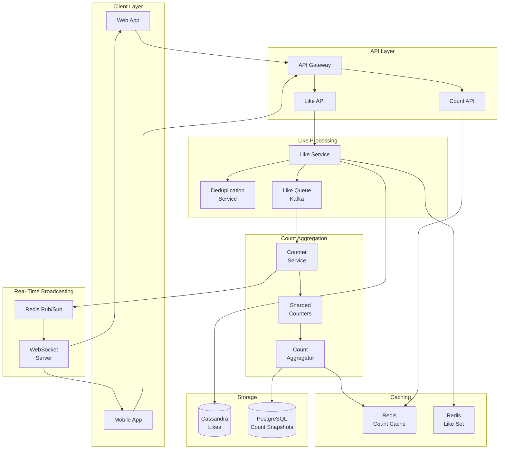
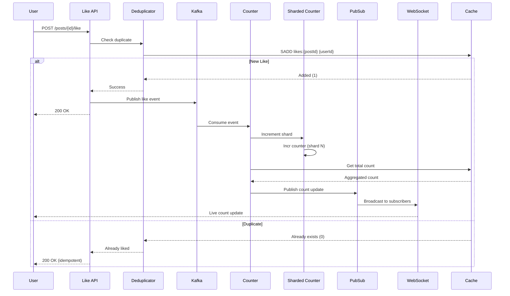

# Counting and Broadcasting Likes for Very High Traffic Users

[← Back to Topics](../topics.md#counting-and-broadcasting-likes-for-very-high-traffic-users-like-celebrity-posts)

## Problem Statement

Design a system to track and display like counts for viral content with millions of concurrent users. Handle the celebrity/hotspot problem where a single post receives millions of likes, support real-time updates via websockets, and optimize for read-heavy workload with eventual consistency.

---

## Requirements

### Functional Requirements
1. **Like/Unlike**: Users can like/unlike posts
2. **Count Display**: Show like count on posts
3. **Real-Time Updates**: Live count updates
4. **Like List**: Show users who liked
5. **Deduplication**: One like per user per post
6. **Trending**: Track trending posts

### Non-Functional Requirements
1. **Scale**: 1B posts, 100M concurrent users
2. **Throughput**: 100K likes/sec on viral posts
3. **Latency**: <100ms like action
4. **Read-heavy**: 1000:1 read/write ratio
5. **Eventual Consistency**: Acceptable
6. **Availability**: 99.99% uptime

### Scale Estimates
- **Total posts**: 1B
- **Viral post likes**: 10M likes
- **Peak likes/sec**: 100K (single post)
- **Read requests**: 100M/sec
- **Like action latency**: <100ms
- **Count update delay**: <1s acceptable

---

## High-Level Architecture



---

## Detailed Design

### 1. Like Flow



---

### 2. Like Service

```java
import java.time.*;
import java.util.*;
import redis.clients.jedis.*;

/**
 * Like service
 * Handles like/unlike operations with deduplication
 */
public class LikeService {
    
    private final JedisPool jedisPool;
    private final LikeRepository likeRepo;
    private final EventPublisher eventPublisher;
    
    private static final int LIKE_SET_TTL_DAYS = 30;
    
    public LikeService(
        JedisPool jedisPool,
        LikeRepository likeRepo,
        EventPublisher eventPublisher
    ) {
        this.jedisPool = jedisPool;
        this.likeRepo = likeRepo;
        this.eventPublisher = eventPublisher;
    }
    
    /**
     * Like a post
     */
    public LikeResult likePost(String postId, String userId) {
        
        try (Jedis jedis = jedisPool.getResource()) {
            
            String likeSetKey = "likes:" + postId;
            
            // Add to set (deduplication)
            long added = jedis.sadd(likeSetKey, userId);
            
            if (added == 0) {
                // Already liked
                return LikeResult.alreadyLiked();
            }
            
            // Set TTL
            jedis.expire(likeSetKey, LIKE_SET_TTL_DAYS * 24 * 3600);
            
            // Persist to database (async)
            Like like = new Like();
            like.setPostId(postId);
            like.setUserId(userId);
            like.setCreatedAt(Instant.now());
            
            likeRepo.saveAsync(like);
            
            // Publish event for counter update
            LikeEvent event = new LikeEvent();
            event.setPostId(postId);
            event.setUserId(userId);
            event.setAction(LikeAction.LIKE);
            event.setTimestamp(Instant.now());
            
            eventPublisher.publish(event);
            
            return LikeResult.success();
        }
    }
    
    /**
     * Unlike a post
     */
    public LikeResult unlikePost(String postId, String userId) {
        
        try (Jedis jedis = jedisPool.getResource()) {
            
            String likeSetKey = "likes:" + postId;
            
            // Remove from set
            long removed = jedis.srem(likeSetKey, userId);
            
            if (removed == 0) {
                // Not liked
                return LikeResult.notLiked();
            }
            
            // Delete from database (async)
            likeRepo.deleteAsync(postId, userId);
            
            // Publish event
            LikeEvent event = new LikeEvent();
            event.setPostId(postId);
            event.setUserId(userId);
            event.setAction(LikeAction.UNLIKE);
            event.setTimestamp(Instant.now());
            
            eventPublisher.publish(event);
            
            return LikeResult.success();
        }
    }
    
    /**
     * Check if user liked post
     */
    public boolean hasUserLiked(String postId, String userId) {
        
        try (Jedis jedis = jedisPool.getResource()) {
            
            String likeSetKey = "likes:" + postId;
            return jedis.sismember(likeSetKey, userId);
        }
    }
    
    /**
     * Get users who liked post (paginated)
     */
    public List<String> getLikedUsers(String postId, int offset, int limit) {
        
        try (Jedis jedis = jedisPool.getResource()) {
            
            String likeSetKey = "likes:" + postId;
            
            // Get random sample or all members
            Set<String> members = jedis.smembers(likeSetKey);
            
            // Paginate
            return members.stream()
                .skip(offset)
                .limit(limit)
                .toList();
        }
    }
}

/**
 * Counter service
 * Manages sharded counters for hot posts
 */
class CounterService {
    
    private final JedisPool jedisPool;
    private final RedisPubSubPublisher pubSubPublisher;
    
    private static final int NUM_SHARDS = 100;  // For hot posts
    
    public CounterService(
        JedisPool jedisPool,
        RedisPubSubPublisher pubSubPublisher
    ) {
        this.jedisPool = jedisPool;
        this.pubSubPublisher = pubSubPublisher;
    }
    
    /**
     * Process like event
     */
    public void processLikeEvent(LikeEvent event) {
        
        String postId = event.getPostId();
        int delta = event.getAction() == LikeAction.LIKE ? 1 : -1;
        
        // Increment sharded counter
        incrementShardedCounter(postId, delta);
        
        // Get total count
        long totalCount = getCount(postId);
        
        // Broadcast count update
        CountUpdate update = new CountUpdate();
        update.setPostId(postId);
        update.setCount(totalCount);
        update.setTimestamp(Instant.now());
        
        pubSubPublisher.publishCountUpdate(update);
    }
    
    /**
     * Increment sharded counter
     */
    private void incrementShardedCounter(String postId, int delta) {
        
        try (Jedis jedis = jedisPool.getResource()) {
            
            // Select random shard to distribute writes
            int shardId = ThreadLocalRandom.current().nextInt(NUM_SHARDS);
            
            String counterKey = "count:" + postId + ":shard:" + shardId;
            
            jedis.incrBy(counterKey, delta);
            
            // Set TTL
            jedis.expire(counterKey, 7 * 24 * 3600);  // 7 days
        }
    }
    
    /**
     * Get total count (aggregate shards)
     */
    public long getCount(String postId) {
        
        try (Jedis jedis = jedisPool.getResource()) {
            
            // Check aggregated cache first
            String cacheKey = "count:" + postId;
            String cached = jedis.get(cacheKey);
            
            if (cached != null) {
                return Long.parseLong(cached);
            }
            
            // Aggregate shards
            long total = 0;
            
            for (int i = 0; i < NUM_SHARDS; i++) {
                
                String shardKey = "count:" + postId + ":shard:" + i;
                String value = jedis.get(shardKey);
                
                if (value != null) {
                    total += Long.parseLong(value);
                }
            }
            
            // Cache aggregated count (short TTL for eventual consistency)
            jedis.setex(cacheKey, 5, String.valueOf(total));  // 5 seconds
            
            return total;
        }
    }
    
    /**
     * Get approximate count (single shard estimation)
     */
    public long getApproximateCount(String postId) {
        
        try (Jedis jedis = jedisPool.getResource()) {
            
            // Sample one shard and multiply
            int sampleShard = ThreadLocalRandom.current().nextInt(NUM_SHARDS);
            String shardKey = "count:" + postId + ":shard:" + sampleShard;
            
            String value = jedis.get(shardKey);
            
            if (value == null) {
                return 0;
            }
            
            long shardCount = Long.parseLong(value);
            
            // Estimate total (multiply by number of shards)
            return shardCount * NUM_SHARDS;
        }
    }
}

/**
 * WebSocket server
 * Broadcasts real-time count updates
 */
class WebSocketLikeServer {
    
    private final Map<String, Set<WebSocketSession>> postSubscriptions = 
        new ConcurrentHashMap<>();
    
    private final RedisPubSubSubscriber pubSubSubscriber;
    
    public WebSocketLikeServer(RedisPubSubSubscriber pubSubSubscriber) {
        this.pubSubSubscriber = pubSubSubscriber;
        
        // Subscribe to count updates
        pubSubSubscriber.subscribe("count_updates", this::handleCountUpdate);
    }
    
    /**
     * Handle WebSocket connection
     */
    public void onConnect(WebSocketSession session, String postId) {
        
        postSubscriptions.computeIfAbsent(postId, k -> ConcurrentHashMap.newKeySet())
            .add(session);
        
        // Send current count
        sendCurrentCount(session, postId);
    }
    
    /**
     * Handle WebSocket disconnect
     */
    public void onDisconnect(WebSocketSession session, String postId) {
        
        Set<WebSocketSession> sessions = postSubscriptions.get(postId);
        
        if (sessions != null) {
            sessions.remove(session);
            
            if (sessions.isEmpty()) {
                postSubscriptions.remove(postId);
            }
        }
    }
    
    /**
     * Handle count update from Pub/Sub
     */
    private void handleCountUpdate(CountUpdate update) {
        
        String postId = update.getPostId();
        Set<WebSocketSession> sessions = postSubscriptions.get(postId);
        
        if (sessions == null || sessions.isEmpty()) {
            return;
        }
        
        // Broadcast to all subscribers
        String message = formatCountUpdate(update);
        
        for (WebSocketSession session : sessions) {
            
            try {
                session.sendMessage(message);
            } catch (Exception e) {
                // Handle error (remove session)
                sessions.remove(session);
            }
        }
    }
    
    /**
     * Send current count to client
     */
    private void sendCurrentCount(WebSocketSession session, String postId) {
        
        // TODO: Get current count from cache
        // session.sendMessage(...);
    }
    
    /**
     * Format count update message
     */
    private String formatCountUpdate(CountUpdate update) {
        
        return String.format(
            "{\"type\":\"count_update\",\"postId\":\"%s\",\"count\":%d,\"timestamp\":\"%s\"}",
            update.getPostId(),
            update.getCount(),
            update.getTimestamp()
        );
    }
}

/**
 * Trending service
 * Tracks trending posts
 */
class TrendingService {
    
    private final JedisPool jedisPool;
    
    private static final String TRENDING_KEY = "trending_posts";
    private static final int TOP_N = 100;
    
    public TrendingService(JedisPool jedisPool) {
        this.jedisPool = jedisPool;
    }
    
    /**
     * Update trending score
     */
    public void updateTrendingScore(String postId, long likeCount, Instant createdAt) {
        
        // Calculate trending score (time-decay algorithm)
        double score = calculateTrendingScore(likeCount, createdAt);
        
        try (Jedis jedis = jedisPool.getResource()) {
            
            // Add to sorted set
            jedis.zadd(TRENDING_KEY, score, postId);
            
            // Keep only top N
            long count = jedis.zcard(TRENDING_KEY);
            
            if (count > TOP_N) {
                jedis.zremrangeByRank(TRENDING_KEY, 0, count - TOP_N - 1);
            }
        }
    }
    
    /**
     * Get trending posts
     */
    public List<String> getTrendingPosts(int limit) {
        
        try (Jedis jedis = jedisPool.getResource()) {
            
            // Get top posts (reverse order, highest score first)
            Set<String> posts = jedis.zrevrange(TRENDING_KEY, 0, limit - 1);
            
            return new ArrayList<>(posts);
        }
    }
    
    /**
     * Calculate trending score with time decay
     */
    private double calculateTrendingScore(long likeCount, Instant createdAt) {
        
        // Time decay: score = likes / (age_in_hours + 2)^1.5
        
        long ageHours = Duration.between(createdAt, Instant.now()).toHours();
        
        double denominator = Math.pow(ageHours + 2, 1.5);
        
        return likeCount / denominator;
    }
}

// Model classes
class Like {
    private String postId;
    private String userId;
    private Instant createdAt;
    
    public String getPostId() { return postId; }
    public void setPostId(String postId) { this.postId = postId; }
    
    public String getUserId() { return userId; }
    public void setUserId(String userId) { this.userId = userId; }
    
    public Instant getCreatedAt() { return createdAt; }
    public void setCreatedAt(Instant createdAt) { this.createdAt = createdAt; }
}

class LikeEvent {
    private String postId;
    private String userId;
    private LikeAction action;
    private Instant timestamp;
    
    public String getPostId() { return postId; }
    public void setPostId(String postId) { this.postId = postId; }
    
    public String getUserId() { return userId; }
    public void setUserId(String userId) { this.userId = userId; }
    
    public LikeAction getAction() { return action; }
    public void setAction(LikeAction action) { this.action = action; }
    
    public Instant getTimestamp() { return timestamp; }
    public void setTimestamp(Instant timestamp) { this.timestamp = timestamp; }
}

class CountUpdate {
    private String postId;
    private long count;
    private Instant timestamp;
    
    public String getPostId() { return postId; }
    public void setPostId(String postId) { this.postId = postId; }
    
    public long getCount() { return count; }
    public void setCount(long count) { this.count = count; }
    
    public Instant getTimestamp() { return timestamp; }
    public void setTimestamp(Instant timestamp) { this.timestamp = timestamp; }
}

class LikeResult {
    private boolean success;
    private String message;
    
    public static LikeResult success() {
        LikeResult result = new LikeResult();
        result.success = true;
        return result;
    }
    
    public static LikeResult alreadyLiked() {
        LikeResult result = new LikeResult();
        result.success = true;
        result.message = "Already liked";
        return result;
    }
    
    public static LikeResult notLiked() {
        LikeResult result = new LikeResult();
        result.success = false;
        result.message = "Not liked";
        return result;
    }
    
    public boolean isSuccess() { return success; }
}

enum LikeAction {
    LIKE, UNLIKE
}

// Service interfaces
interface LikeRepository {
    void saveAsync(Like like);
    void deleteAsync(String postId, String userId);
}

interface EventPublisher {
    void publish(LikeEvent event);
}

interface RedisPubSubPublisher {
    void publishCountUpdate(CountUpdate update);
}

interface RedisPubSubSubscriber {
    void subscribe(String channel, java.util.function.Consumer<CountUpdate> handler);
}

interface WebSocketSession {
    void sendMessage(String message);
}
```

---

## Technology Stack

| Component | Technology | Justification |
|-----------|------------|---------------|
| **Like Set** | Redis Set | Deduplication |
| **Counters** | Redis (sharded) | Hot key handling |
| **Real-Time** | Redis Pub/Sub | WebSocket updates |
| **Persistence** | Cassandra | Write-heavy |
| **Streaming** | Kafka | Event processing |
| **WebSocket** | Socket.IO | Live updates |

---

## Performance Characteristics

### Like Performance
```
Like action: <100ms
Deduplication: <10ms (Redis SET)
Count read: <50ms (cached)
Count aggregation: <100ms (100 shards)
WebSocket broadcast: <1s
```

### Scale
```
Posts: 1B
Viral post likes: 10M
Peak likes/sec: 100K (single post)
Read throughput: 100M/sec
Counter shards: 100
```

---

## Trade-offs

### 1. Exact vs Approximate Counting
- **Exact**: Accurate, slower aggregation
- **Approximate**: Fast (<50ms), ~1% error

### 2. Write Sharding
- **100 shards**: High throughput, slower aggregation
- **10 shards**: Faster aggregation, hotspot risk

### 3. Consistency
- **Strong**: Slow, complex
- **Eventual (5s)**: Fast, acceptable

---

## Summary

This design provides:
- ✅ **100K** likes/sec per post
- ✅ **<100ms** like latency
- ✅ **Real-time** updates (<1s)
- ✅ **Eventual** consistency
- ✅ **Sharded** counters (100 shards)
- ✅ **Deduplication** via Redis SET

**Key Features:**
1. Redis SET for deduplication (SADD O(1))
2. Sharded counters (100 shards) for hot keys
3. Aggregated count cache (5-second TTL)
4. Redis Pub/Sub for WebSocket broadcasting
5. Time-decay trending algorithm (score = likes / (age + 2)^1.5)
6. Kafka event streaming for async processing
7. Approximate counting (sample 1 shard × 100) for speed

[← Back to Topics](../topics.md#counting-and-broadcasting-likes-for-very-high-traffic-users-like-celebrity-posts)
