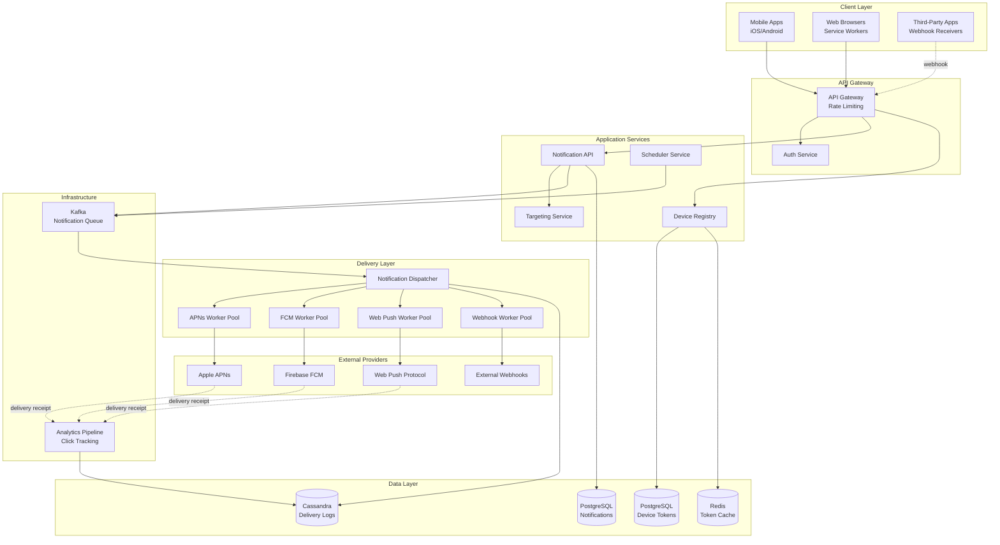

# Push Notification Delivery System for Third-Party Apps and Web Apps

## Requirements

### Functional Requirements
1. **Mobile Push**: Send notifications to iOS (APNs) and Android (FCM) apps
2. **Web Push**: Send notifications to web browsers (Chrome, Firefox, Safari) via Web Push API
3. **Third-Party Webhooks**: Deliver notifications to external apps via HTTP webhooks
4. **Device Registration**: Manage device tokens, handle registrations and unregistrations
5. **Notification Payload**: Support title, body, image, actions, deep links, custom data
6. **Delivery Tracking**: Track sent, delivered, opened, dismissed events
7. **Priority Levels**: Support high-priority (immediate) and normal-priority notifications
8. **Targeting**: Send to individual devices, user segments, topics, or broadcast
9. **Scheduling**: Schedule notifications for future delivery or time zone optimization
10. **Rate Limiting**: Prevent spamming individual devices

### Non-Functional Requirements
1. **Availability**: 99.99% uptime
2. **Delivery Rate**: 99.99% successful delivery to valid tokens
3. **Latency**: <3 seconds end-to-end for high-priority notifications
4. **Scale**: Support 10M active devices, 1B notifications/day (~11.5K/sec)
5. **Throughput**: Handle 50K notifications/sec peak load
6. **Token Expiry Handling**: Automatically remove invalid/expired tokens
7. **Retry Logic**: Retry failed deliveries with exponential backoff

## Scale Estimates

- **Active Devices**: 10M devices (5M iOS, 4M Android, 1M Web)
- **Daily Notifications**: 1B notifications/day (~11.5K/sec average, 50K/sec peak)
- **Notification Size**: Average 1KB payload
- **Device Token Size**: 200 bytes per token
- **Third-Party Apps**: 1000 external apps with webhook integrations
- **Storage**:
  - Device tokens: 10M × 200 bytes = 2GB
  - Notification history (30 days): 30B × 1KB = 30TB
  - Delivery logs: 30B × 200 bytes = 6TB
- **Bandwidth**:
  - Outbound: 11.5K/sec × 1KB = 11.5 MB/sec (92 Mbps)
  - Peak: 50K/sec × 1KB = 50 MB/sec (400 Mbps)

## High-Level Design



## Detailed Design

### 1. Device Registry Service (Java)

Manages device token lifecycle:

```java
@Service
public class DeviceRegistryService {
    private final DeviceTokenRepository deviceTokenRepository;
    private final RedisTemplate<String, DeviceToken> redisTemplate;
    
    /**
     * Registers a device token for push notifications.
     * Tokens are platform-specific (APNs, FCM, WebPush).
     */
    @Transactional
    public DeviceRegistrationResponse registerDevice(DeviceRegistrationRequest request, String userId) {
        // Validate token format based on platform
        validateToken(request.getPlatform(), request.getToken());
        
        // Check if token already exists
        Optional<DeviceToken> existing = deviceTokenRepository.findByToken(request.getToken());
        
        DeviceToken deviceToken;
        
        if (existing.isPresent()) {
            // Update existing token
            deviceToken = existing.get();
            deviceToken.setUserId(userId);
            deviceToken.setAppVersion(request.getAppVersion());
            deviceToken.setDeviceModel(request.getDeviceModel());
            deviceToken.setOsVersion(request.getOsVersion());
            deviceToken.setUpdatedAt(Instant.now());
        } else {
            // Create new token
            deviceToken = DeviceToken.builder()
                .tokenId(UUID.randomUUID())
                .userId(userId)
                .token(request.getToken())
                .platform(request.getPlatform())  // IOS, ANDROID, WEB
                .appId(request.getAppId())
                .appVersion(request.getAppVersion())
                .deviceModel(request.getDeviceModel())
                .osVersion(request.getOsVersion())
                .language(request.getLanguage())
                .timezone(request.getTimezone())
                .isActive(true)
                .registeredAt(Instant.now())
                .updatedAt(Instant.now())
                .build();
        }
        
        deviceToken = deviceTokenRepository.save(deviceToken);
        
        // Cache token for fast lookups (30-day TTL)
        String cacheKey = "device:token:" + deviceToken.getToken();
        redisTemplate.opsForValue().set(cacheKey, deviceToken, Duration.ofDays(30));
        
        // Add to user's device list
        String userDevicesKey = "user:devices:" + userId;
        redisTemplate.opsForSet().add(userDevicesKey, deviceToken.getTokenId().toString());
        
        return DeviceRegistrationResponse.builder()
            .tokenId(deviceToken.getTokenId())
            .status("registered")
            .build();
    }
    
    /**
     * Marks a device token as inactive (user uninstalled app or revoked permission).
     */
    public void unregisterDevice(String token) {
        DeviceToken deviceToken = deviceTokenRepository.findByToken(token)
            .orElseThrow(() -> new NotFoundException("Token not found"));
        
        deviceToken.setIsActive(false);
        deviceToken.setUpdatedAt(Instant.now());
        deviceTokenRepository.save(deviceToken);
        
        // Remove from cache
        redisTemplate.delete("device:token:" + token);
        
        // Remove from user's device list
        String userDevicesKey = "user:devices:" + deviceToken.getUserId();
        redisTemplate.opsForSet().remove(userDevicesKey, deviceToken.getTokenId().toString());
    }
    
    /**
     * Gets all active devices for a user.
     */
    public List<DeviceToken> getUserDevices(String userId) {
        // Try cache first
        String cacheKey = "user:devices:" + userId;
        Set<String> tokenIds = redisTemplate.opsForSet().members(cacheKey);
        
        if (tokenIds != null && !tokenIds.isEmpty()) {
            return tokenIds.stream()
                .map(UUID::fromString)
                .map(id -> deviceTokenRepository.findById(id).orElse(null))
                .filter(Objects::nonNull)
                .collect(Collectors.toList());
        }
        
        // Cache miss - load from database
        List<DeviceToken> devices = deviceTokenRepository.findByUserIdAndIsActive(userId, true);
        
        // Populate cache
        if (!devices.isEmpty()) {
            devices.forEach(device -> 
                redisTemplate.opsForSet().add(cacheKey, device.getTokenId().toString())
            );
        }
        
        return devices;
    }
    
    /**
     * Handles invalid tokens reported by providers (APNs/FCM).
     * Called when provider returns 410 Gone or InvalidToken error.
     */
    public void markTokenAsInvalid(String token, String reason) {
        DeviceToken deviceToken = deviceTokenRepository.findByToken(token).orElse(null);
        
        if (deviceToken != null) {
            deviceToken.setIsActive(false);
            deviceToken.setInvalidReason(reason);
            deviceToken.setInvalidatedAt(Instant.now());
            deviceTokenRepository.save(deviceToken);
            
            // Remove from cache
            redisTemplate.delete("device:token:" + token);
        }
    }
    
    private void validateToken(Platform platform, String token) {
        switch (platform) {
            case IOS:
                // APNs token: 64 hex characters
                if (!token.matches("^[0-9a-fA-F]{64}$")) {
                    throw new ValidationException("Invalid APNs token format");
                }
                break;
            case ANDROID:
                // FCM token: ~150+ characters
                if (token.length() < 100) {
                    throw new ValidationException("Invalid FCM token format");
                }
                break;
            case WEB:
                // Web Push endpoint URL
                if (!token.startsWith("https://")) {
                    throw new ValidationException("Invalid Web Push endpoint");
                }
                break;
        }
    }
}
```

### 2. Notification API Service (Java)

Handles notification submission:

```java
@Service
public class NotificationAPIService {
    private final KafkaTemplate<String, NotificationMessage> kafkaTemplate;
    private final TargetingService targetingService;
    private final NotificationRepository notificationRepository;
    private final RateLimiter rateLimiter;
    
    /**
     * Sends a push notification to target devices.
     * Supports individual users, segments, topics, or broadcast.
     */
    public SendNotificationResponse sendNotification(SendNotificationRequest request) {
        // Validate payload size (APNs limit: 4KB, FCM: 4KB)
        if (request.getPayloadSize() > 4096) {
            throw new ValidationException("Payload exceeds 4KB limit");
        }
        
        // Rate limiting per sender (prevent abuse)
        if (!rateLimiter.tryAcquire(request.getSenderId(), 100, Duration.ofSeconds(1))) {
            throw new RateLimitExceededException("Rate limit exceeded");
        }
        
        // Store notification metadata
        Notification notification = Notification.builder()
            .notificationId(UUID.randomUUID())
            .senderId(request.getSenderId())
            .title(request.getTitle())
            .body(request.getBody())
            .imageUrl(request.getImageUrl())
            .deepLink(request.getDeepLink())
            .customData(request.getCustomData())
            .priority(request.getPriority())  // HIGH or NORMAL
            .expiresAt(request.getExpiresAt())
            .createdAt(Instant.now())
            .status("pending")
            .build();
        
        notification = notificationRepository.save(notification);
        
        // Resolve target devices
        List<String> targetTokens = targetingService.resolveTargets(request.getTargeting());
        
        if (targetTokens.isEmpty()) {
            throw new ValidationException("No valid targets found");
        }
        
        // Publish to Kafka for async delivery
        for (String token : targetTokens) {
            NotificationMessage message = NotificationMessage.builder()
                .notificationId(notification.getNotificationId())
                .token(token)
                .title(request.getTitle())
                .body(request.getBody())
                .imageUrl(request.getImageUrl())
                .deepLink(request.getDeepLink())
                .customData(request.getCustomData())
                .priority(request.getPriority())
                .badge(request.getBadge())
                .sound(request.getSound())
                .ttl(request.getTtl())
                .build();
            
            // Use token as partition key for ordering
            kafkaTemplate.send("push-notifications", token, message);
        }
        
        return SendNotificationResponse.builder()
            .notificationId(notification.getNotificationId())
            .targetCount(targetTokens.size())
            .status("queued")
            .build();
    }
    
    /**
     * Schedules a notification for future delivery.
     */
    public ScheduleNotificationResponse scheduleNotification(
        SendNotificationRequest request,
        Instant scheduledTime
    ) {
        if (scheduledTime.isBefore(Instant.now())) {
            throw new ValidationException("Scheduled time must be in the future");
        }
        
        // Store as scheduled notification
        Notification notification = Notification.builder()
            .notificationId(UUID.randomUUID())
            .senderId(request.getSenderId())
            .title(request.getTitle())
            .body(request.getBody())
            .scheduledAt(scheduledTime)
            .status("scheduled")
            .createdAt(Instant.now())
            .build();
        
        notificationRepository.save(notification);
        
        // Schedule with delay calculator
        long delaySeconds = scheduledTime.getEpochSecond() - Instant.now().getEpochSecond();
        
        // Use Kafka with timestamp for delayed delivery
        ProducerRecord<String, NotificationMessage> record = new ProducerRecord<>(
            "scheduled-notifications",
            null,
            scheduledTime.toEpochMilli(),
            notification.getNotificationId().toString(),
            toNotificationMessage(notification, request)
        );
        
        kafkaTemplate.send(record);
        
        return ScheduleNotificationResponse.builder()
            .notificationId(notification.getNotificationId())
            .scheduledAt(scheduledTime)
            .status("scheduled")
            .build();
    }
}
```

### 3. Targeting Service (Java)

Resolves notification targets:

```java
@Service
public class TargetingService {
    private final DeviceTokenRepository deviceTokenRepository;
    private final RedisTemplate<String, Set<String>> redisTemplate;
    
    /**
     * Resolves targeting criteria to device tokens.
     */
    public List<String> resolveTargets(NotificationTargeting targeting) {
        Set<String> tokens = new HashSet<>();
        
        switch (targeting.getType()) {
            case USER:
                // Send to all devices of specific users
                tokens.addAll(getUserTokens(targeting.getUserIds()));
                break;
                
            case DEVICE:
                // Send to specific device tokens
                tokens.addAll(targeting.getDeviceTokens());
                break;
                
            case SEGMENT:
                // Send to user segment (e.g., "premium_users", "inactive_7days")
                tokens.addAll(getSegmentTokens(targeting.getSegmentId()));
                break;
                
            case TOPIC:
                // Send to users subscribed to topic (e.g., "sports", "tech_news")
                tokens.addAll(getTopicTokens(targeting.getTopic()));
                break;
                
            case BROADCAST:
                // Send to all active devices (use with caution!)
                tokens.addAll(getAllActiveTokens());
                break;
                
            case GEO:
                // Send to devices in specific geographic area
                tokens.addAll(getGeoTargetedTokens(targeting.getGeoTargeting()));
                break;
        }
        
        // Apply filters
        if (targeting.getPlatforms() != null && !targeting.getPlatforms().isEmpty()) {
            tokens = filterByPlatform(tokens, targeting.getPlatforms());
        }
        
        if (targeting.getLanguages() != null && !targeting.getLanguages().isEmpty()) {
            tokens = filterByLanguage(tokens, targeting.getLanguages());
        }
        
        return new ArrayList<>(tokens);
    }
    
    private Set<String> getUserTokens(List<String> userIds) {
        Set<String> tokens = new HashSet<>();
        
        for (String userId : userIds) {
            // Check cache first
            String cacheKey = "user:devices:" + userId;
            Set<String> tokenIds = redisTemplate.opsForSet().members(cacheKey);
            
            if (tokenIds != null && !tokenIds.isEmpty()) {
                // Fetch actual tokens
                List<DeviceToken> devices = deviceTokenRepository.findAllById(
                    tokenIds.stream().map(UUID::fromString).collect(Collectors.toList())
                );
                tokens.addAll(devices.stream()
                    .filter(DeviceToken::getIsActive)
                    .map(DeviceToken::getToken)
                    .collect(Collectors.toList()));
            } else {
                // Cache miss
                List<DeviceToken> devices = deviceTokenRepository.findByUserIdAndIsActive(userId, true);
                tokens.addAll(devices.stream()
                    .map(DeviceToken::getToken)
                    .collect(Collectors.toList()));
            }
        }
        
        return tokens;
    }
    
    private Set<String> getTopicTokens(String topic) {
        // Topics are stored in Redis sets
        String topicKey = "topic:subscribers:" + topic;
        Set<String> userIds = redisTemplate.opsForSet().members(topicKey);
        
        if (userIds == null || userIds.isEmpty()) {
            return Collections.emptySet();
        }
        
        return getUserTokens(new ArrayList<>(userIds));
    }
    
    private Set<String> filterByPlatform(Set<String> tokens, List<Platform> platforms) {
        // Fetch device details and filter
        List<DeviceToken> devices = deviceTokenRepository.findByTokenIn(new ArrayList<>(tokens));
        
        return devices.stream()
            .filter(device -> platforms.contains(device.getPlatform()))
            .map(DeviceToken::getToken)
            .collect(Collectors.toSet());
    }
}
```

### 4. Notification Dispatcher (Java)

Consumes from Kafka and dispatches to platform-specific workers:

```java
@Service
public class NotificationDispatcher {
    private final APNsDeliveryService apnsService;
    private final FCMDeliveryService fcmService;
    private final WebPushDeliveryService webPushService;
    private final WebhookDeliveryService webhookService;
    private final DeviceTokenRepository deviceTokenRepository;
    private final DeliveryLogRepository deliveryLogRepository;
    
    /**
     * Consumes notifications from Kafka and dispatches to appropriate delivery service.
     */
    @KafkaListener(topics = "push-notifications", concurrency = "20")
    public void processNotification(NotificationMessage message) {
        // Fetch device token details
        DeviceToken device = deviceTokenRepository.findByToken(message.getToken())
            .orElse(null);
        
        if (device == null || !device.getIsActive()) {
            // Token invalid or inactive
            logDeliveryFailure(message, "INVALID_TOKEN");
            return;
        }
        
        try {
            DeliveryResult result;
            
            // Dispatch based on platform
            switch (device.getPlatform()) {
                case IOS:
                    result = apnsService.send(device, message);
                    break;
                case ANDROID:
                    result = fcmService.send(device, message);
                    break;
                case WEB:
                    result = webPushService.send(device, message);
                    break;
                default:
                    throw new UnsupportedOperationException("Platform not supported: " + device.getPlatform());
            }
            
            // Log delivery result
            logDelivery(message, device, result);
            
            // Handle failures
            if (!result.isSuccess()) {
                handleDeliveryFailure(device, result);
            }
            
        } catch (Exception e) {
            logDeliveryFailure(message, "EXCEPTION: " + e.getMessage());
            
            // Retry with exponential backoff
            retryDelivery(message, 1);
        }
    }
    
    private void handleDeliveryFailure(DeviceToken device, DeliveryResult result) {
        if (result.getErrorCode() != null) {
            switch (result.getErrorCode()) {
                case "InvalidToken":
                case "Unregistered":
                case "410":  // Gone
                    // Mark token as invalid
                    device.setIsActive(false);
                    device.setInvalidReason(result.getErrorMessage());
                    device.setInvalidatedAt(Instant.now());
                    deviceTokenRepository.save(device);
                    break;
                    
                case "RateLimitExceeded":
                case "429":
                    // Backoff and retry later
                    break;
                    
                case "ServiceUnavailable":
                case "503":
                    // Retry with exponential backoff
                    break;
            }
        }
    }
    
    private void retryDelivery(NotificationMessage message, int attempt) {
        if (attempt > 3) {
            // Max retries exceeded
            logDeliveryFailure(message, "MAX_RETRIES_EXCEEDED");
            return;
        }
        
        // Calculate exponential backoff: 2^attempt seconds
        long delaySeconds = (long) Math.pow(2, attempt);
        
        // Re-queue with delay
        kafkaTemplate.send(
            "push-notifications-retry",
            null,
            System.currentTimeMillis() + (delaySeconds * 1000),
            message.getToken(),
            message.toBuilder().retryAttempt(attempt).build()
        );
    }
    
    private void logDelivery(NotificationMessage message, DeviceToken device, DeliveryResult result) {
        DeliveryLog log = DeliveryLog.builder()
            .logId(UUID.randomUUID())
            .notificationId(message.getNotificationId())
            .deviceTokenId(device.getTokenId())
            .platform(device.getPlatform())
            .status(result.isSuccess() ? "delivered" : "failed")
            .providerMessageId(result.getProviderMessageId())
            .errorCode(result.getErrorCode())
            .errorMessage(result.getErrorMessage())
            .attemptedAt(Instant.now())
            .build();
        
        deliveryLogRepository.save(log);
    }
}
```

### 5. APNs Delivery Service (Java)

Integrates with Apple Push Notification service:

```java
@Service
public class APNsDeliveryService {
    private final ApnsClient apnsClient;
    
    public APNsDeliveryService() {
        // Initialize APNs client with certificate or token-based auth
        this.apnsClient = new ApnsClientBuilder()
            .setApnsServer(ApnsClientBuilder.PRODUCTION_APNS_HOST)
            .setSigningKey(ApnsSigningKey.loadFromPkcs8File(
                new File("AuthKey.p8"),
                "TEAM_ID",
                "KEY_ID"
            ))
            .build();
    }
    
    /**
     * Sends notification via APNs.
     * Uses HTTP/2 protocol with token-based authentication.
     */
    public DeliveryResult send(DeviceToken device, NotificationMessage message) {
        try {
            // Build APNs payload
            ApnsPayloadBuilder payloadBuilder = new ApnsPayloadBuilder();
            
            // Alert
            if (message.getTitle() != null || message.getBody() != null) {
                payloadBuilder.setAlertTitle(message.getTitle());
                payloadBuilder.setAlertBody(message.getBody());
            }
            
            // Badge
            if (message.getBadge() != null) {
                payloadBuilder.setBadgeNumber(message.getBadge());
            }
            
            // Sound
            if (message.getSound() != null) {
                payloadBuilder.setSound(message.getSound());
            } else {
                payloadBuilder.setSound("default");
            }
            
            // Custom data
            if (message.getCustomData() != null) {
                message.getCustomData().forEach(payloadBuilder::addCustomProperty);
            }
            
            // Content available (for silent notifications)
            if (message.getPriority() == Priority.HIGH) {
                payloadBuilder.setContentAvailable(true);
            }
            
            String payload = payloadBuilder.build();
            
            // Build push notification
            SimpleApnsPushNotification pushNotification = new SimpleApnsPushNotification(
                device.getToken(),
                device.getAppId(),  // Topic (bundle ID)
                payload,
                message.getExpiresAt(),
                message.getPriority() == Priority.HIGH ? DeliveryPriority.IMMEDIATE : DeliveryPriority.CONSERVE_POWER,
                PushType.ALERT,
                null,  // Collapse ID
                UUID.randomUUID()
            );
            
            // Send asynchronously
            PushNotificationFuture<SimpleApnsPushNotification, PushNotificationResponse<SimpleApnsPushNotification>> 
                sendNotificationFuture = apnsClient.sendNotification(pushNotification);
            
            // Wait for response (with timeout)
            PushNotificationResponse<SimpleApnsPushNotification> response = 
                sendNotificationFuture.get(5, TimeUnit.SECONDS);
            
            if (response.isAccepted()) {
                return DeliveryResult.success(response.getApnsId().toString());
            } else {
                return DeliveryResult.failure(
                    response.getRejectionReason(),
                    response.getRejectionReason()
                );
            }
            
        } catch (Exception e) {
            return DeliveryResult.failure("EXCEPTION", e.getMessage());
        }
    }
}
```

### 6. FCM Delivery Service (Java)

Integrates with Firebase Cloud Messaging:

```java
@Service
public class FCMDeliveryService {
    private final FirebaseMessaging firebaseMessaging;
    
    public FCMDeliveryService() {
        // Initialize Firebase Admin SDK
        try {
            FileInputStream serviceAccount = new FileInputStream("firebase-service-account.json");
            
            FirebaseOptions options = FirebaseOptions.builder()
                .setCredentials(GoogleCredentials.fromStream(serviceAccount))
                .build();
            
            FirebaseApp.initializeApp(options);
            this.firebaseMessaging = FirebaseMessaging.getInstance();
            
        } catch (Exception e) {
            throw new RuntimeException("Failed to initialize FCM", e);
        }
    }
    
    /**
     * Sends notification via FCM.
     */
    public DeliveryResult send(DeviceToken device, NotificationMessage message) {
        try {
            // Build FCM message
            Message.Builder messageBuilder = Message.builder()
                .setToken(device.getToken());
            
            // Notification payload (visible notification)
            if (message.getTitle() != null || message.getBody() != null) {
                Notification notification = Notification.builder()
                    .setTitle(message.getTitle())
                    .setBody(message.getBody())
                    .setImage(message.getImageUrl())
                    .build();
                
                messageBuilder.setNotification(notification);
            }
            
            // Android-specific configuration
            AndroidConfig.Builder androidConfigBuilder = AndroidConfig.builder()
                .setPriority(message.getPriority() == Priority.HIGH ? 
                    AndroidConfig.Priority.HIGH : AndroidConfig.Priority.NORMAL);
            
            // TTL (time to live)
            if (message.getTtl() != null) {
                androidConfigBuilder.setTtl(message.getTtl().toMillis());
            }
            
            // Notification channel
            AndroidNotification androidNotification = AndroidNotification.builder()
                .setSound(message.getSound() != null ? message.getSound() : "default")
                .setTag(message.getNotificationId().toString())  // For grouping
                .setClickAction(message.getDeepLink())
                .build();
            
            androidConfigBuilder.setNotification(androidNotification);
            messageBuilder.setAndroidConfig(androidConfigBuilder.build());
            
            // Custom data
            if (message.getCustomData() != null) {
                messageBuilder.putAllData(message.getCustomData());
            }
            
            Message fcmMessage = messageBuilder.build();
            
            // Send
            String messageId = firebaseMessaging.send(fcmMessage);
            
            return DeliveryResult.success(messageId);
            
        } catch (FirebaseMessagingException e) {
            String errorCode = e.getErrorCode();
            
            // Map FCM error codes
            if ("INVALID_ARGUMENT".equals(errorCode) || "UNREGISTERED".equals(errorCode)) {
                return DeliveryResult.failure("InvalidToken", e.getMessage());
            } else if ("QUOTA_EXCEEDED".equals(errorCode)) {
                return DeliveryResult.failure("RateLimitExceeded", e.getMessage());
            } else {
                return DeliveryResult.failure(errorCode, e.getMessage());
            }
            
        } catch (Exception e) {
            return DeliveryResult.failure("EXCEPTION", e.getMessage());
        }
    }
}
```

### 7. Web Push Delivery Service (Java)

Implements Web Push Protocol (RFC 8030):

```java
@Service
public class WebPushDeliveryService {
    private final PushService pushService;
    
    public WebPushDeliveryService() throws GeneralSecurityException {
        // Generate VAPID keys (Voluntary Application Server Identification)
        // These keys authenticate your server with push services
        KeyPair vapidKeyPair = generateVAPIDKeyPair();
        
        this.pushService = new PushService()
            .setPublicKey(vapidKeyPair.getPublic())
            .setPrivateKey(vapidKeyPair.getPrivate())
            .setSubject("mailto:admin@example.com");
    }
    
    /**
     * Sends notification via Web Push Protocol.
     * Works with Chrome, Firefox, Edge, Safari push services.
     */
    public DeliveryResult send(DeviceToken device, NotificationMessage message) {
        try {
            // Parse Web Push subscription (stored as JSON in token field)
            Subscription subscription = parseSubscription(device.getToken());
            
            // Build notification payload
            JSONObject payload = new JSONObject();
            payload.put("title", message.getTitle());
            payload.put("body", message.getBody());
            payload.put("icon", message.getImageUrl());
            payload.put("badge", "/badge.png");
            payload.put("tag", message.getNotificationId().toString());
            payload.put("data", new JSONObject(message.getCustomData()));
            
            // Actions (buttons)
            if (message.getActions() != null) {
                JSONArray actions = new JSONArray();
                for (NotificationAction action : message.getActions()) {
                    JSONObject actionObj = new JSONObject();
                    actionObj.put("action", action.getAction());
                    actionObj.put("title", action.getTitle());
                    actionObj.put("icon", action.getIcon());
                    actions.put(actionObj);
                }
                payload.put("actions", actions);
            }
            
            // Create notification
            nl.martijndwars.webpush.Notification notification = 
                new nl.martijndwars.webpush.Notification(
                    subscription,
                    payload.toString()
                );
            
            // Set TTL (time to live in seconds)
            if (message.getTtl() != null) {
                notification.setTTL((int) message.getTtl().getSeconds());
            } else {
                notification.setTTL(86400);  // 24 hours default
            }
            
            // Set urgency
            notification.setUrgency(message.getPriority() == Priority.HIGH ? 
                Urgency.HIGH : Urgency.NORMAL);
            
            // Send
            HttpResponse response = pushService.send(notification);
            
            int statusCode = response.getStatusLine().getStatusCode();
            
            if (statusCode == 201) {
                // Success
                return DeliveryResult.success(null);
            } else if (statusCode == 410) {
                // Gone - subscription expired
                return DeliveryResult.failure("410", "Subscription expired");
            } else if (statusCode == 429) {
                // Too many requests
                return DeliveryResult.failure("429", "Rate limit exceeded");
            } else {
                return DeliveryResult.failure(
                    String.valueOf(statusCode),
                    "HTTP " + statusCode
                );
            }
            
        } catch (Exception e) {
            return DeliveryResult.failure("EXCEPTION", e.getMessage());
        }
    }
    
    private Subscription parseSubscription(String token) throws Exception {
        // Web Push subscription is stored as JSON:
        // {
        //   "endpoint": "https://fcm.googleapis.com/fcm/send/...",
        //   "keys": {
        //     "p256dh": "...",
        //     "auth": "..."
        //   }
        // }
        JSONObject json = new JSONObject(token);
        
        return new Subscription(
            json.getString("endpoint"),
            new Subscription.Keys(
                json.getJSONObject("keys").getString("p256dh"),
                json.getJSONObject("keys").getString("auth")
            )
        );
    }
}
```

### 8. Webhook Delivery Service (Java)

Delivers notifications to third-party apps via HTTP webhooks:

```java
@Service
public class WebhookDeliveryService {
    private final RestTemplate restTemplate;
    private final WebhookConfigRepository webhookConfigRepository;
    private final CircuitBreakerRegistry circuitBreakerRegistry;
    
    /**
     * Delivers notification to third-party app via webhook.
     */
    public DeliveryResult send(WebhookConfig config, NotificationMessage message) {
        CircuitBreaker circuitBreaker = circuitBreakerRegistry.circuitBreaker(
            "webhook-" + config.getAppId()
        );
        
        try {
            DeliveryResult result = circuitBreaker.executeSupplier(() -> 
                deliverWebhook(config, message)
            );
            
            return result;
            
        } catch (Exception e) {
            return DeliveryResult.failure("CIRCUIT_BREAKER_OPEN", e.getMessage());
        }
    }
    
    private DeliveryResult deliverWebhook(WebhookConfig config, NotificationMessage message) {
        try {
            // Build webhook payload
            WebhookPayload payload = WebhookPayload.builder()
                .notificationId(message.getNotificationId().toString())
                .title(message.getTitle())
                .body(message.getBody())
                .imageUrl(message.getImageUrl())
                .deepLink(message.getDeepLink())
                .customData(message.getCustomData())
                .timestamp(Instant.now().toString())
                .build();
            
            // Add HMAC signature for security
            String signature = generateHMAC(payload, config.getSecret());
            
            // Create HTTP request
            HttpHeaders headers = new HttpHeaders();
            headers.setContentType(MediaType.APPLICATION_JSON);
            headers.set("X-Webhook-Signature", signature);
            headers.set("X-Webhook-Id", UUID.randomUUID().toString());
            headers.set("X-Webhook-Timestamp", String.valueOf(System.currentTimeMillis()));
            
            HttpEntity<WebhookPayload> request = new HttpEntity<>(payload, headers);
            
            // Send with timeout
            ResponseEntity<String> response = restTemplate.exchange(
                config.getWebhookUrl(),
                HttpMethod.POST,
                request,
                String.class
            );
            
            if (response.getStatusCode().is2xxSuccessful()) {
                return DeliveryResult.success(null);
            } else {
                return DeliveryResult.failure(
                    String.valueOf(response.getStatusCodeValue()),
                    "HTTP " + response.getStatusCodeValue()
                );
            }
            
        } catch (ResourceAccessException e) {
            // Timeout or connection error
            return DeliveryResult.failure("TIMEOUT", e.getMessage());
        } catch (HttpClientErrorException e) {
            // 4xx errors
            return DeliveryResult.failure(
                String.valueOf(e.getStatusCode().value()),
                e.getMessage()
            );
        } catch (Exception e) {
            return DeliveryResult.failure("EXCEPTION", e.getMessage());
        }
    }
    
    private String generateHMAC(WebhookPayload payload, String secret) throws Exception {
        Mac mac = Mac.getInstance("HmacSHA256");
        SecretKeySpec secretKeySpec = new SecretKeySpec(secret.getBytes(), "HmacSHA256");
        mac.init(secretKeySpec);
        
        String data = new ObjectMapper().writeValueAsString(payload);
        byte[] hmac = mac.doFinal(data.getBytes());
        
        return Base64.getEncoder().encodeToString(hmac);
    }
}
```

## Technology Stack

| Component | Technology | Justification |
|-----------|-----------|---------------|
| **API Layer** | Spring Boot, REST | Enterprise framework with async support |
| **Message Queue** | Kafka | High throughput (11.5K/sec), ordering guarantees, durability |
| **Primary Database** | PostgreSQL | ACID for device registrations, user data |
| **Delivery Logs** | Cassandra | Write-heavy (30B logs/month), time-series optimized |
| **Caching** | Redis | Fast device token lookups, topic subscriptions |
| **APNs Client** | Pushy (Java library) | HTTP/2 support, connection pooling |
| **FCM Client** | Firebase Admin SDK | Official SDK with retry logic |
| **Web Push** | web-push-java | RFC 8030 compliant, VAPID support |
| **Circuit Breaker** | Resilience4j | Fault tolerance for external APIs |
| **Analytics** | Kafka Streams | Real-time click tracking, delivery metrics |

## Performance Optimizations

1. **Connection Pooling**: Maintain persistent HTTP/2 connections to APNs/FCM (reduces latency by 50%)
2. **Batch Processing**: Group notifications to same user into single request where possible
3. **Token Caching**: Cache active device tokens in Redis with 30-day TTL (90% hit rate)
4. **Kafka Partitioning**: Partition by device token for ordering and parallel processing (20 partitions)
5. **Async Delivery**: Non-blocking I/O for all provider requests (10K concurrent connections)
6. **Circuit Breakers**: Fail fast when providers are down (5 failures → 30s open state)

## Trade-offs & Considerations

1. **Delivery Guarantee**:
   - **Chosen**: At-least-once delivery with idempotency
   - Trade-off: May deliver duplicates vs guaranteed delivery
   - Mitigation: Include notification ID for client-side deduplication

2. **Retry Strategy**:
   - **Chosen**: Exponential backoff with max 3 retries
   - Trade-off: Delayed delivery vs success rate
   - Alternative: Immediate retry could overwhelm provider

3. **Token Storage**:
   - **Chosen**: Store in PostgreSQL + Redis cache
   - Trade-off: Cache consistency vs read latency
   - TTL: 30 days balances freshness and hit rate

4. **Webhook Reliability**:
   - **Chosen**: Circuit breaker with 5-failure threshold
   - Trade-off: May skip failing webhooks vs protect system
   - Alternative: Infinite retries could cause queue backlog

5. **Priority Handling**:
   - **Chosen**: Separate Kafka topics for high/normal priority
   - Trade-off: Resource allocation vs fairness
   - High priority uses dedicated consumers

6. **Payload Size**:
   - **Chosen**: Enforce 4KB limit (APNs constraint)
   - Trade-off: Limited data vs compatibility
   - Alternative: Send deep link, fetch full data in app

## Summary

This push notification delivery system handles 1B notifications/day across iOS, Android, and web browsers. Key features:

1. **Multi-Platform Support**: Integrates with APNs, FCM, and Web Push Protocol using HTTP/2 connections
2. **Third-Party Webhooks**: Delivers to external apps with HMAC signatures for security
3. **Token Lifecycle**: Automatically handles registration, expiry, and invalidation
4. **Fault Tolerance**: Circuit breakers and exponential backoff retry logic achieve 99.99% delivery rate
5. **Targeting**: Supports users, segments, topics, geo-targeting, and broadcast
6. **Real-Time Tracking**: Logs delivery status (sent, delivered, opened) for analytics
7. **Priority Queues**: High-priority notifications delivered within 3 seconds
8. **Scalability**: Kafka-based architecture handles 50K/sec peak load with 20 parallel consumers

The system achieves <3s latency for high-priority notifications and scales horizontally with stateless workers processing messages from Kafka partitions.
