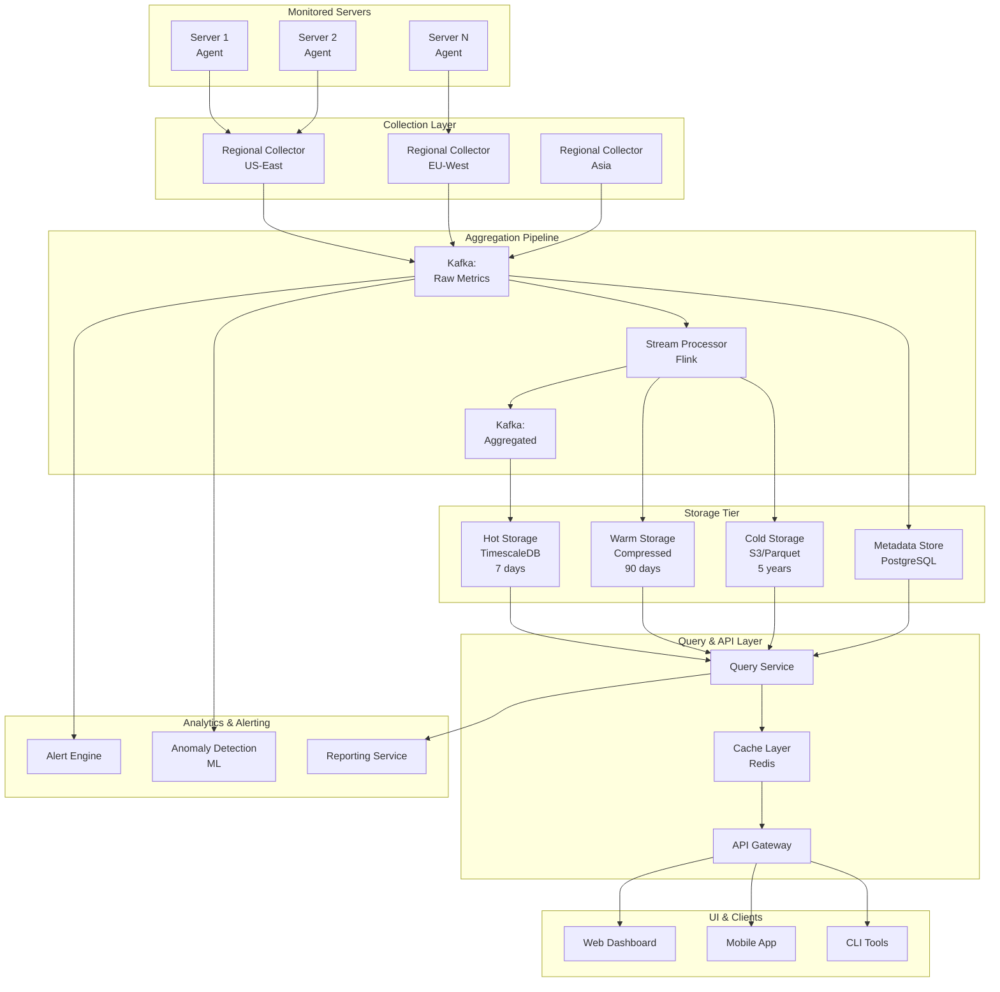
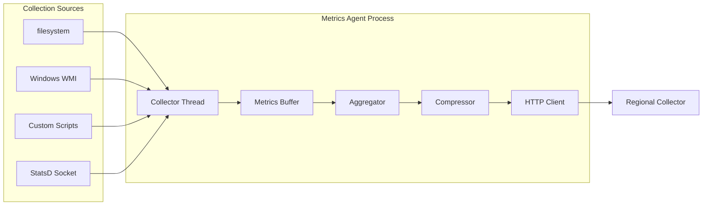
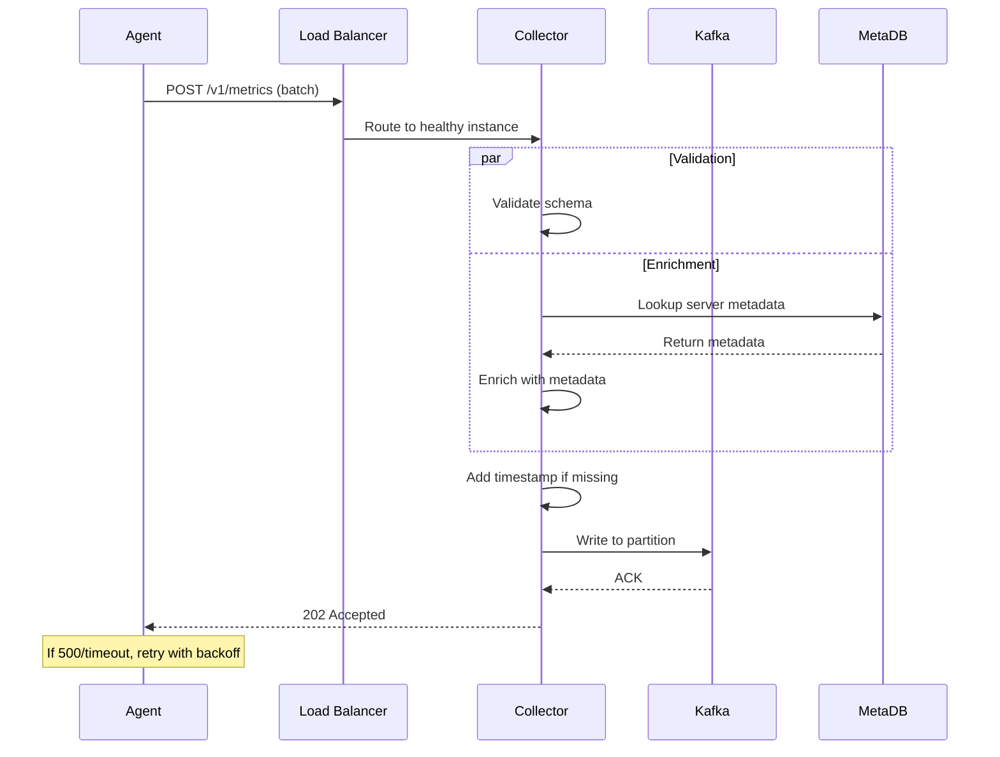
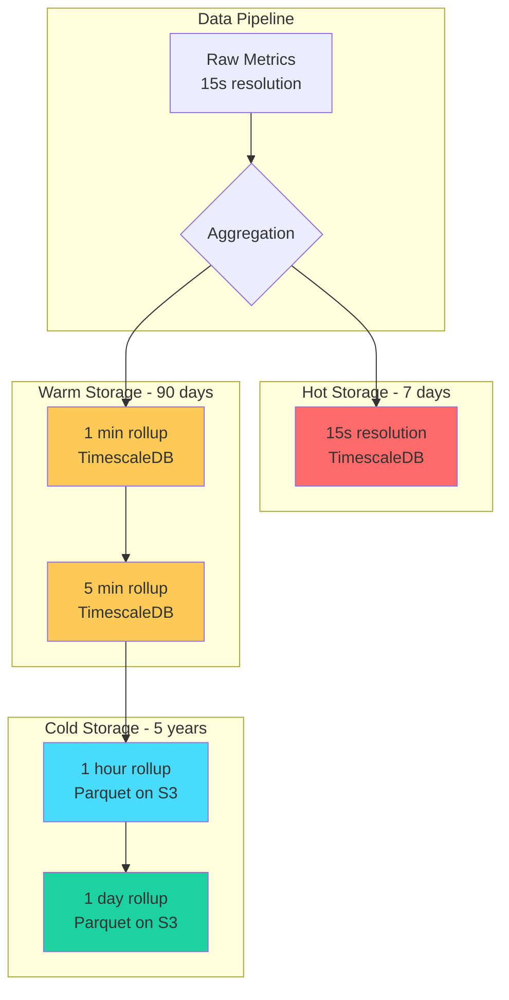
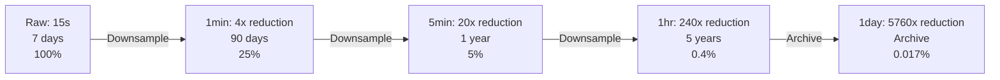
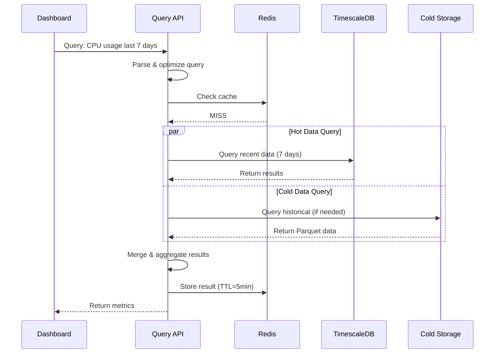
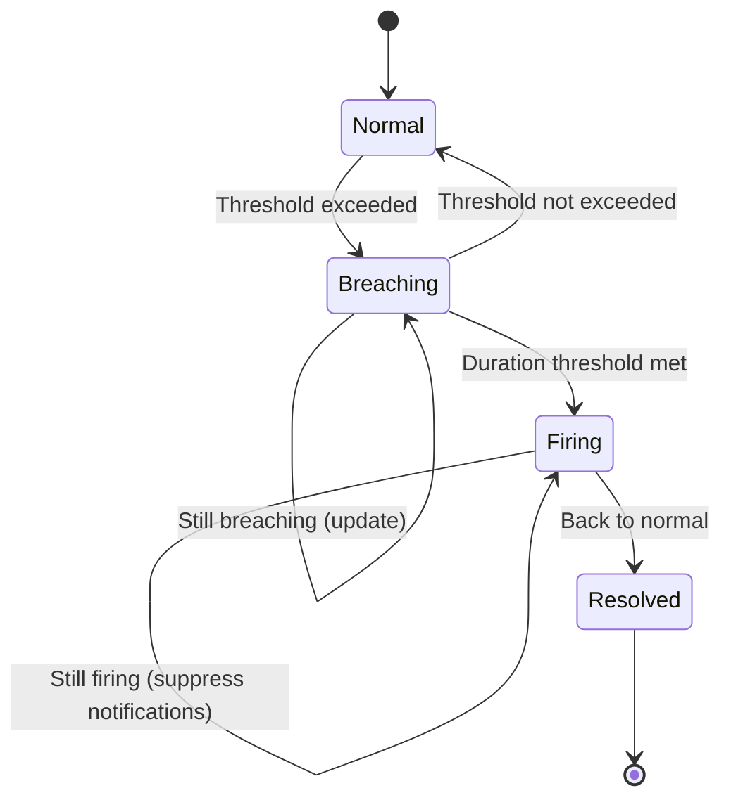

# Collecting Performance Metrics from Thousands of Servers

[← Back to Topics](../topics.md#collecting-performance-metrics-from-thousands-of-servers)

## Problem Statement

Design an APM (Application Performance Monitoring) system that collects CPU, memory, disk, and network metrics from 100K+ servers with sub-minute latency and 5-year retention.

---

## Requirements

### Functional Requirements
1. **Metric Collection**: CPU, memory, disk I/O, network I/O, process-level metrics
2. **Agent Deployment**: Lightweight agents on all monitored servers
3. **Historical Data**: Store metrics with 5-year retention
4. **Alerting**: Real-time threshold-based alerts
5. **Dashboards**: Real-time and historical visualization
6. **Custom Metrics**: Support for application-specific metrics
7. **Tagging**: Server metadata (environment, region, role, version)

### Non-Functional Requirements
1. **Scalability**: Support 100K+ servers
2. **Low Overhead**: <1% CPU, <100MB memory on monitored hosts
3. **Latency**: Sub-minute from collection to visibility
4. **Availability**: 99.9% uptime
5. **Retention**: 5 years with configurable granularity
6. **Cost-Effective**: Optimize storage costs for long-term retention

### Scale Estimates
- **Servers**: 100,000 servers
- **Metrics per server**: 50 metrics (system + custom)
- **Collection frequency**: 15 seconds (full resolution)
- **Write throughput**: 100K * 50 / 15 = **333K data points/second**
- **Daily volume**: 333K * 86,400 = **28.8 billion points/day**
- **5-year storage** (with downsampling): ~50TB

---

## High-Level Architecture



---

## Detailed Design

### 1. Agent Architecture



#### Agent Implementation (Go)

```go
package agent

import (
    "time"
    "github.com/shirou/gopsutil/cpu"
    "github.com/shirou/gopsutil/mem"
    "github.com/shirou/gopsutil/disk"
    "github.com/shirou/gopsutil/net"
)

type MetricsAgent struct {
    serverID     string
    tags         map[string]string
    buffer       *MetricsBuffer
    collectorURL string
    interval     time.Duration
}

type Metric struct {
    Name      string            `json:"name"`
    Value     float64           `json:"value"`
    Timestamp int64             `json:"timestamp"`
    Type      string            `json:"type"` // gauge, counter, histogram
    Tags      map[string]string `json:"tags"`
}

func (a *MetricsAgent) Start() {
    ticker := time.NewTicker(a.interval)
    defer ticker.Stop()
    
    for {
        select {
        case <-ticker.C:
            metrics := a.collectMetrics()
            a.buffer.Add(metrics)
            
            // Send when buffer reaches threshold or timeout
            if a.buffer.ShouldFlush() {
                a.sendMetrics()
            }
        }
    }
}

func (a *MetricsAgent) collectMetrics() []Metric {
    var metrics []Metric
    now := time.Now().Unix()
    
    // CPU Metrics
    cpuPercent, _ := cpu.Percent(0, false)
    metrics = append(metrics, Metric{
        Name:      "system.cpu.usage",
        Value:     cpuPercent[0],
        Timestamp: now,
        Type:      "gauge",
        Tags:      a.tags,
    })
    
    // Memory Metrics
    vmStat, _ := mem.VirtualMemory()
    metrics = append(metrics, Metric{
        Name:      "system.memory.usage",
        Value:     vmStat.UsedPercent,
        Timestamp: now,
        Type:      "gauge",
        Tags:      a.tags,
    })
    
    metrics = append(metrics, Metric{
        Name:      "system.memory.total",
        Value:     float64(vmStat.Total),
        Timestamp: now,
        Type:      "gauge",
        Tags:      a.tags,
    })
    
    // Disk Metrics
    diskStat, _ := disk.Usage("/")
    metrics = append(metrics, Metric{
        Name:      "system.disk.usage",
        Value:     diskStat.UsedPercent,
        Timestamp: now,
        Type:      "gauge",
        Tags:      a.tags,
    })
    
    // Network Metrics
    netIO, _ := net.IOCounters(false)
    if len(netIO) > 0 {
        metrics = append(metrics, Metric{
            Name:      "system.network.bytes.sent",
            Value:     float64(netIO[0].BytesSent),
            Timestamp: now,
            Type:      "counter",
            Tags:      a.tags,
        })
        
        metrics = append(metrics, Metric{
            Name:      "system.network.bytes.recv",
            Value:     float64(netIO[0].BytesRecv),
            Timestamp: now,
            Type:      "counter",
            Tags:      a.tags,
        })
    }
    
    // Process Metrics
    processMetrics := a.collectProcessMetrics()
    metrics = append(metrics, processMetrics...)
    
    return metrics
}

func (a *MetricsAgent) collectProcessMetrics() []Metric {
    // Collect top CPU/memory consuming processes
    // Implementation details...
    return []Metric{}
}

func (a *MetricsAgent) sendMetrics() error {
    batch := a.buffer.Flush()
    
    // Compress payload
    compressed := compress(batch)
    
    // Send with retry logic
    return a.sendWithRetry(compressed, 3)
}

func (a *MetricsAgent) sendWithRetry(data []byte, maxRetries int) error {
    for i := 0; i < maxRetries; i++ {
        resp, err := http.Post(
            a.collectorURL,
            "application/json",
            bytes.NewBuffer(data),
        )
        
        if err == nil && resp.StatusCode == 200 {
            return nil
        }
        
        // Exponential backoff
        time.Sleep(time.Duration(1<<i) * time.Second)
    }
    
    // If all retries fail, log locally
    a.logToLocalFile(data)
    return fmt.Errorf("failed to send metrics after %d retries", maxRetries)
}
```

#### Agent Configuration

```yaml
agent:
  server_id: "web-server-123"
  collection_interval: 15s
  batch_size: 100
  batch_timeout: 30s
  
  # Regional collector endpoints with failover
  collectors:
    - url: "https://collector-us-east-1a.example.com/v1/metrics"
      priority: 1
    - url: "https://collector-us-east-1b.example.com/v1/metrics"
      priority: 2
  
  # Resource limits
  max_cpu_percent: 1.0
  max_memory_mb: 100
  
  # Tags
  tags:
    environment: "production"
    datacenter: "us-east-1"
    role: "web-server"
    team: "platform"
  
  # What to collect
  collectors:
    system:
      enabled: true
      interval: 15s
    process:
      enabled: true
      interval: 30s
      top_n: 10
    custom:
      enabled: true
      statsd_port: 8125
```

---

### 2. Regional Collectors



#### Collector Implementation

```python
from fastapi import FastAPI, HTTPException
from typing import List
import asyncio
from kafka import KafkaProducer
import json
import time

app = FastAPI()

class MetricsCollector:
    def __init__(self):
        self.kafka_producer = KafkaProducer(
            bootstrap_servers=['kafka1:9092', 'kafka2:9092'],
            value_serializer=lambda v: json.dumps(v).encode('utf-8'),
            compression_type='snappy',
            batch_size=16384,
            linger_ms=10
        )
        self.metadata_cache = {}
    
    async def process_batch(self, server_id: str, metrics: List[dict]):
        # Enrich with server metadata
        metadata = await self.get_server_metadata(server_id)
        
        enriched_metrics = []
        for metric in metrics:
            # Add server metadata
            metric['tags'].update(metadata)
            
            # Add collection timestamp if missing
            if 'timestamp' not in metric:
                metric['timestamp'] = int(time.time())
            
            # Validate
            if not self.validate_metric(metric):
                continue
            
            enriched_metrics.append(metric)
        
        # Send to Kafka
        partition = self.get_partition(server_id)
        self.kafka_producer.send(
            'raw-metrics',
            value=enriched_metrics,
            partition=partition
        )
        
        return len(enriched_metrics)
    
    async def get_server_metadata(self, server_id: str):
        # Check cache first
        if server_id in self.metadata_cache:
            return self.metadata_cache[server_id]
        
        # Fetch from metadata DB
        metadata = await self.fetch_metadata_from_db(server_id)
        
        # Cache for 5 minutes
        self.metadata_cache[server_id] = metadata
        asyncio.create_task(self.expire_cache(server_id, 300))
        
        return metadata
    
    def get_partition(self, server_id: str):
        # Consistent hashing for even distribution
        return hash(server_id) % 32
    
    def validate_metric(self, metric: dict) -> bool:
        required_fields = ['name', 'value', 'timestamp', 'type']
        return all(field in metric for field in required_fields)

collector = MetricsCollector()

@app.post("/v1/metrics")
async def ingest_metrics(payload: dict):
    try:
        server_id = payload.get('server_id')
        metrics = payload.get('metrics', [])
        
        if not server_id or not metrics:
            raise HTTPException(status_code=400, detail="Invalid payload")
        
        processed = await collector.process_batch(server_id, metrics)
        
        return {
            "status": "accepted",
            "processed": processed,
            "timestamp": int(time.time())
        }
    
    except Exception as e:
        raise HTTPException(status_code=500, detail=str(e))

@app.get("/health")
async def health_check():
    return {"status": "healthy"}
```

---

### 3. Storage Architecture



#### TimescaleDB Schema

```sql
-- Main metrics table
CREATE TABLE metrics (
    time        TIMESTAMPTZ NOT NULL,
    server_id   TEXT NOT NULL,
    metric_name TEXT NOT NULL,
    value       DOUBLE PRECISION NOT NULL,
    tags        JSONB,
    PRIMARY KEY (time, server_id, metric_name)
);

-- Convert to hypertable (automatic time-based partitioning)
SELECT create_hypertable('metrics', 'time', chunk_time_interval => INTERVAL '1 day');

-- Create indexes for common queries
CREATE INDEX idx_server_metric ON metrics (server_id, metric_name, time DESC);
CREATE INDEX idx_metric_name ON metrics (metric_name, time DESC);
CREATE INDEX idx_tags ON metrics USING GIN (tags);

-- Enable compression after 7 days
ALTER TABLE metrics SET (
    timescaledb.compress,
    timescaledb.compress_segmentby = 'server_id,metric_name',
    timescaledb.compress_orderby = 'time DESC'
);

SELECT add_compression_policy('metrics', INTERVAL '7 days');

-- Continuous aggregates for 1-minute rollups
CREATE MATERIALIZED VIEW metrics_1min
WITH (timescaledb.continuous) AS
SELECT
    time_bucket('1 minute', time) AS bucket,
    server_id,
    metric_name,
    tags,
    AVG(value) as avg_value,
    MAX(value) as max_value,
    MIN(value) as min_value,
    PERCENTILE_CONT(0.5) WITHIN GROUP (ORDER BY value) as p50,
    PERCENTILE_CONT(0.95) WITHIN GROUP (ORDER BY value) as p95,
    PERCENTILE_CONT(0.99) WITHIN GROUP (ORDER BY value) as p99,
    COUNT(*) as count
FROM metrics
GROUP BY bucket, server_id, metric_name, tags;

-- Refresh policy (keep up to date)
SELECT add_continuous_aggregate_policy('metrics_1min',
    start_offset => INTERVAL '1 hour',
    end_offset => INTERVAL '1 minute',
    schedule_interval => INTERVAL '1 minute');

-- 5-minute rollups
CREATE MATERIALIZED VIEW metrics_5min
WITH (timescaledb.continuous) AS
SELECT
    time_bucket('5 minutes', bucket) AS bucket,
    server_id,
    metric_name,
    tags,
    AVG(avg_value) as avg_value,
    MAX(max_value) as max_value,
    MIN(min_value) as min_value,
    COUNT(*) as count
FROM metrics_1min
GROUP BY bucket, server_id, metric_name, tags;

-- Retention policies
SELECT add_retention_policy('metrics', INTERVAL '7 days');
SELECT add_retention_policy('metrics_1min', INTERVAL '90 days');
SELECT add_retention_policy('metrics_5min', INTERVAL '1 year');

-- Export to S3 for long-term storage
CREATE OR REPLACE FUNCTION export_to_s3()
RETURNS void AS $$
BEGIN
    -- Export 1-hour aggregates to S3 in Parquet format
    -- This would be handled by a separate ETL job
END;
$$ LANGUAGE plpgsql;
```

---

### 4. Data Downsampling Strategy



#### Storage Calculation

```
Raw data (7 days):
- 333K points/sec * 86,400 sec * 7 days * 16 bytes = 26 TB
- Compressed: 4 TB

1-min rollups (90 days):
- 333K / 4 * 86,400 * 90 * 16 bytes = 100 TB
- Compressed: 15 TB

5-min rollups (1 year):
- 333K / 20 * 86,400 * 365 * 16 bytes = 156 TB
- Compressed: 20 TB

1-hour rollups (5 years):
- 333K / 240 * 86,400 * 365 * 5 * 16 bytes = 65 TB
- Parquet compressed: 8 TB

Total: ~50 TB
```

---

### 5. Query Optimization



#### Query Service Implementation

```python
from fastapi import FastAPI
from datetime import datetime, timedelta
import asyncpg
import redis
import hashlib
import json

class QueryService:
    def __init__(self):
        self.db_pool = None
        self.redis_client = redis.Redis(host='cache', port=6379)
        self.cache_ttl = {
            'recent': 60,      # 1 minute for recent data
            'hourly': 300,     # 5 minutes for hourly data
            'daily': 3600      # 1 hour for daily data
        }
    
    async def query_metrics(
        self,
        server_ids: List[str],
        metric_name: str,
        start_time: datetime,
        end_time: datetime,
        aggregation: str = 'avg',
        resolution: str = 'auto'
    ):
        # Generate cache key
        cache_key = self.generate_cache_key(
            server_ids, metric_name, start_time, end_time, aggregation
        )
        
        # Check cache
        cached = self.redis_client.get(cache_key)
        if cached:
            return json.loads(cached)
        
        # Determine optimal resolution
        time_range = end_time - start_time
        if resolution == 'auto':
            resolution = self.determine_resolution(time_range)
        
        # Query appropriate table
        if resolution == '15s':
            results = await self.query_raw_data(
                server_ids, metric_name, start_time, end_time, aggregation
            )
        elif resolution == '1min':
            results = await self.query_1min_rollup(
                server_ids, metric_name, start_time, end_time, aggregation
            )
        elif resolution == '5min':
            results = await self.query_5min_rollup(
                server_ids, metric_name, start_time, end_time, aggregation
            )
        else:  # hourly or daily
            results = await self.query_cold_storage(
                server_ids, metric_name, start_time, end_time, aggregation
            )
        
        # Cache result
        ttl = self.cache_ttl.get(resolution, 300)
        self.redis_client.setex(cache_key, ttl, json.dumps(results))
        
        return results
    
    def determine_resolution(self, time_range: timedelta) -> str:
        if time_range <= timedelta(hours=1):
            return '15s'
        elif time_range <= timedelta(days=1):
            return '1min'
        elif time_range <= timedelta(days=7):
            return '5min'
        elif time_range <= timedelta(days=90):
            return '1hour'
        else:
            return '1day'
    
    async def query_raw_data(self, server_ids, metric_name, start, end, agg):
        query = f"""
            SELECT
                time_bucket('1 minute', time) as bucket,
                server_id,
                {agg}(value) as value
            FROM metrics
            WHERE
                server_id = ANY($1)
                AND metric_name = $2
                AND time >= $3
                AND time <= $4
            GROUP BY bucket, server_id
            ORDER BY bucket ASC
        """
        
        async with self.db_pool.acquire() as conn:
            rows = await conn.fetch(query, server_ids, metric_name, start, end)
            return [dict(row) for row in rows]
    
    async def query_1min_rollup(self, server_ids, metric_name, start, end, agg):
        # Query from pre-aggregated 1-minute table
        query = f"""
            SELECT
                bucket as time,
                server_id,
                {agg}_value as value
            FROM metrics_1min
            WHERE
                server_id = ANY($1)
                AND metric_name = $2
                AND bucket >= $3
                AND bucket <= $4
            ORDER BY bucket ASC
        """
        
        async with self.db_pool.acquire() as conn:
            rows = await conn.fetch(query, server_ids, metric_name, start, end)
            return [dict(row) for row in rows]
```

---

### 6. Alerting System



#### Alert Rules Configuration

```yaml
alerts:
  - name: high_cpu_usage
    metric: system.cpu.usage
    condition: avg(5m) > 80
    for: 5m
    severity: warning
    filters:
      environment: production
    annotations:
      summary: "High CPU on {{ server_id }}"
      description: "CPU usage is {{ value }}% on {{ server_id }}"
    notifications:
      - type: email
        to: ["oncall@example.com"]
      - type: slack
        channel: "#alerts"
  
  - name: critical_cpu_usage
    metric: system.cpu.usage
    condition: avg(5m) > 95
    for: 2m
    severity: critical
    filters:
      environment: production
    notifications:
      - type: pagerduty
        service: "production-infrastructure"
  
  - name: high_memory_usage
    metric: system.memory.usage
    condition: avg(10m) > 90
    for: 10m
    severity: warning
    
  - name: disk_space_low
    metric: system.disk.usage
    condition: current() > 85
    for: 5m
    severity: warning
```

---

### 7. Cost Optimization Strategies

#### 1. Intelligent Sampling

```python
class AdaptiveSampler:
    def __init__(self):
        self.sample_rates = {}
    
    def should_sample(self, server_id: str, metric_name: str) -> bool:
        # Sample more frequently for critical servers
        if self.is_critical_server(server_id):
            return True
        
        # Sample based on metric variability
        variability = self.get_metric_variability(server_id, metric_name)
        
        if variability > 0.2:  # High variance
            return True
        elif variability < 0.05:  # Low variance
            # Sample every 5th data point
            return hash(f"{server_id}{time.time()}") % 5 == 0
        else:
            # Sample every other data point
            return hash(f"{server_id}{time.time()}") % 2 == 0
```

#### 2. Storage Tiering

| Tier | Duration | Resolution | Storage | Cost/TB/month |
|------|----------|------------|---------|---------------|
| Hot | 7 days | 15s | SSD | $100 |
| Warm | 90 days | 1min | SSD | $100 |
| Cool | 1 year | 5min | HDD | $25 |
| Cold | 5 years | 1hour | S3 Standard | $23 |
| Archive | Forever | 1day | S3 Glacier | $4 |

#### 3. Compression Strategies

```python
# Delta encoding for counters
def delta_encode(values: List[float]) -> bytes:
    deltas = [values[0]]
    for i in range(1, len(values)):
        deltas.append(values[i] - values[i-1])
    return compress(deltas)  # Use zstd or snappy

# Compression ratios achieved:
# - Raw: 16 bytes/point
# - Delta + Snappy: 2-4 bytes/point
# - Compression ratio: 4-8x
```

---

## Technology Stack

| Component | Technology | Justification |
|-----------|------------|---------------|
| **Agent** | Go | Low memory, efficient concurrency |
| **Collectors** | Python/FastAPI | Fast development, async I/O |
| **Message Queue** | Kafka | High throughput, replay capability |
| **Stream Processing** | Flink | Complex windowing, exactly-once |
| **Hot Storage** | TimescaleDB | SQL, automatic partitioning |
| **Cold Storage** | S3 + Parquet | Cost-effective, columnar format |
| **Cache** | Redis | Fast lookups, TTL support |
| **API** | FastAPI | High performance, async |

---

## Monitoring the Monitoring System

```yaml
Meta-Metrics:
  Collection:
    - agent.metrics.collected (counter)
    - agent.send.errors (counter)
    - agent.cpu.usage (gauge)
    - agent.memory.usage (gauge)
  
  Ingestion:
    - collector.requests.rate (counter)
    - collector.latency.p99 (histogram)
    - collector.errors.rate (counter)
    - kafka.lag (gauge)
  
  Storage:
    - tsdb.write.latency (histogram)
    - tsdb.disk.usage (gauge)
    - tsdb.query.latency (histogram)
    - compression.ratio (gauge)
  
  Query:
    - query.cache.hit.ratio (gauge)
    - query.latency.p95 (histogram)
    - query.errors.rate (counter)
```

---

## Failure Scenarios

### 1. Agent Failure
**Symptoms**: No metrics from server
**Detection**: Missing heartbeat
**Mitigation**: 
- Auto-restart via systemd/supervisor
- Alert after 5 minutes of silence

### 2. Collector Overload
**Symptoms**: High latency, dropped connections
**Detection**: Collector latency > 500ms
**Mitigation**:
- Auto-scale collectors
- Rate limit per agent
- Backpressure to agents

### 3. Kafka Lag
**Symptoms**: Delayed metrics visibility
**Detection**: Consumer lag > 100K messages
**Mitigation**:
- Add consumer instances
- Increase partitions
- Scale TSDB write capacity

### 4. Storage Full
**Symptoms**: Write failures
**Detection**: Disk usage > 85%
**Mitigation**:
- Auto-scale storage
- Aggressive compression
- Early archival to S3

---

## Trade-offs

### 1. Collection Frequency
- **15s**: Better granularity, higher cost
- **60s**: Lower cost, miss short spikes
- **Decision**: 15s for production, 60s for dev/test

### 2. Retention vs Cost
- **5 years full resolution**: $500K/year
- **Tiered with downsampling**: $50K/year
- **Decision**: Tiered approach (10x savings)

### 3. Push vs Pull
- **Push**: Agent controls rate, firewall-friendly
- **Pull**: Centralized control, service discovery
- **Decision**: Push (better for large scale)

---

## Summary

This design provides:
- ✅ **100K+ servers** monitoring
- ✅ **<1% overhead** on monitored hosts
- ✅ **Sub-minute latency** for visibility
- ✅ **5-year retention** with tiered storage
- ✅ **Cost-optimized** with 10x savings through compression and downsampling
- ✅ **Highly available** with regional redundancy

**Key Innovations:**
1. Lightweight Go agents with minimal overhead
2. Regional collectors for low latency
3. Multi-tier storage for cost optimization
4. Adaptive sampling based on variance
5. Continuous aggregates for fast queries
6. Compression achieving 4-8x space savings

[← Back to Topics](../topics.md#collecting-performance-metrics-from-thousands-of-servers)
