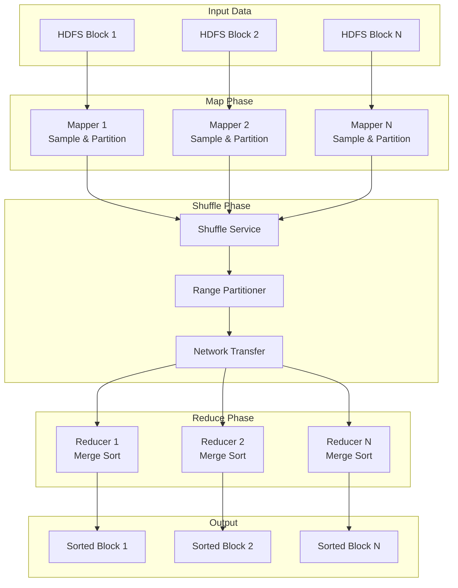
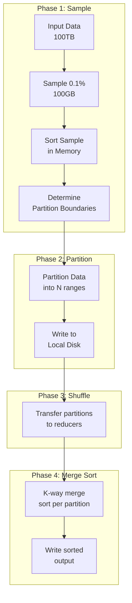
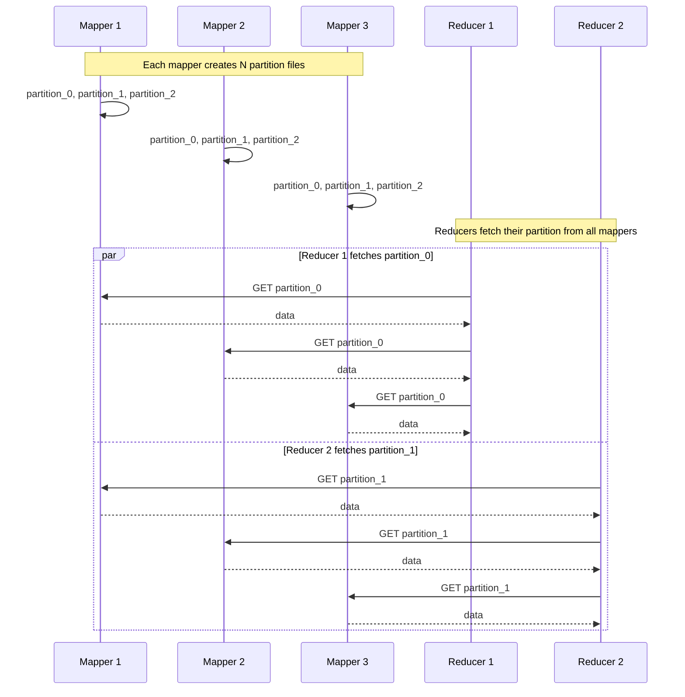
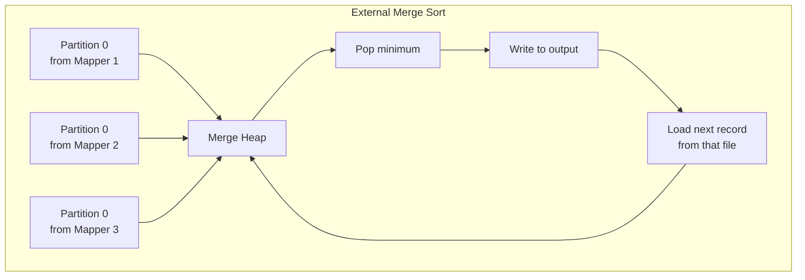
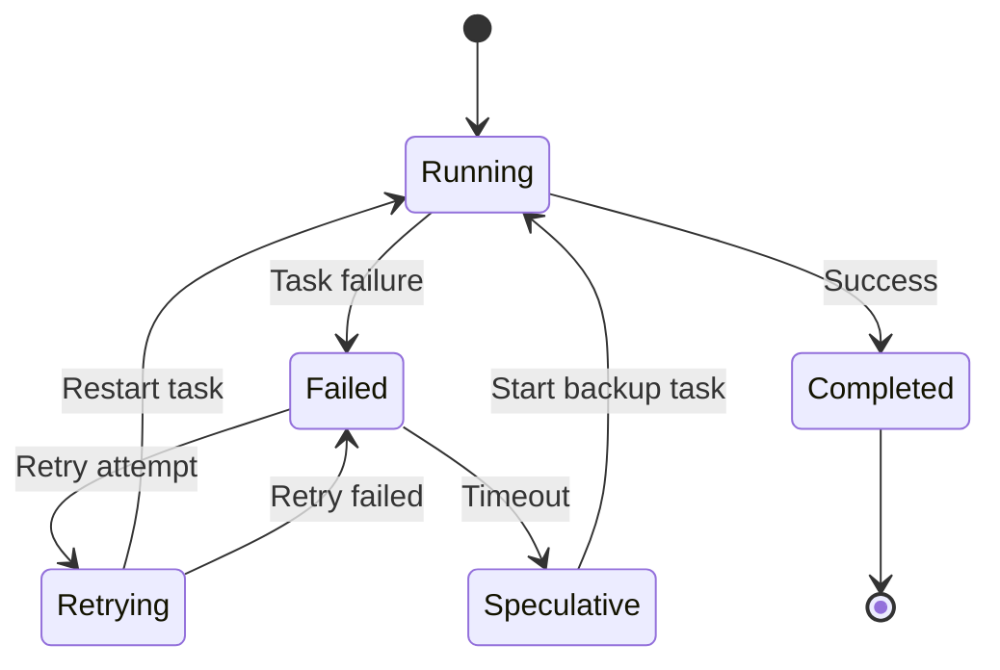

# Building a System to Sort Huge Datasets Across Machines

[← Back to Topics](../topics.md#building-a-system-to-sort-huge-datasets-across-machines-like-mapreduce)

## Problem Statement

Design a distributed sorting system that can sort 100TB of data across 1000 machines efficiently. Optimize for fault tolerance and minimize data movement.

---

## Requirements

### Functional Requirements
1. **Sort Large Datasets**: Sort 100TB+ datasets distributed across machines
2. **Multiple Sort Keys**: Support single and composite key sorting
3. **Stable Sort**: Maintain relative order of equal elements
4. **Fault Tolerance**: Handle machine failures without data loss
5. **Progress Tracking**: Monitor sort progress
6. **Result Verification**: Ensure correctness of sorted output

### Non-Functional Requirements
1. **Scalability**: Scale to 1000+ machines
2. **Performance**: Complete 100TB sort in <6 hours
3. **Fault Tolerance**: Tolerate 5% machine failures
4. **Network Efficiency**: Minimize data shuffle
5. **Memory Efficiency**: Sort datasets larger than RAM
6. **Cost Optimization**: Minimize computational cost

### Scale Estimates
- **Dataset size**: 100TB
- **Machines**: 1,000 machines
- **Data per machine**: 100GB
- **Network bandwidth**: 10Gbps per machine
- **Disk throughput**: 500MB/s per machine
- **Memory per machine**: 128GB

---

## High-Level Architecture



---

## Detailed Design

### 1. External Sorting Algorithm



---

### 2. Sampling for Range Partitioning

```python
import random
from typing import List, Tuple

class RangeSampler:
    """
    Sample data to determine partition boundaries
    Goal: Ensure roughly equal-sized partitions
    """
    
    def __init__(self, num_partitions: int, sample_rate: float = 0.001):
        self.num_partitions = num_partitions
        self.sample_rate = sample_rate
        self.samples = []
    
    def collect_samples(self, data_iterator):
        """Collect random samples from input data"""
        
        for record in data_iterator:
            if random.random() < self.sample_rate:
                key = self.extract_key(record)
                self.samples.append(key)
    
    def determine_boundaries(self) -> List:
        """
        Sort samples and pick quantile boundaries
        
        For 100 partitions, pick boundaries at 1%, 2%, ..., 99% quantiles
        """
        
        if not self.samples:
            raise ValueError("No samples collected")
        
        # Sort samples
        sorted_samples = sorted(self.samples)
        
        # Determine quantile boundaries
        boundaries = []
        step = len(sorted_samples) // self.num_partitions
        
        for i in range(1, self.num_partitions):
            idx = i * step
            if idx < len(sorted_samples):
                boundaries.append(sorted_samples[idx])
        
        return boundaries
    
    def get_partition_id(self, key, boundaries: List) -> int:
        """Binary search to find partition for a key"""
        
        left, right = 0, len(boundaries)
        
        while left < right:
            mid = (left + right) // 2
            
            if key < boundaries[mid]:
                right = mid
            else:
                left = mid + 1
        
        return left
    
    def extract_key(self, record):
        """Extract sort key from record"""
        # Depends on record format
        return record[0]  # Assuming first field is key

# Example usage
sampler = RangeSampler(num_partitions=100)

# Collect samples
for partition in input_partitions:
    sampler.collect_samples(partition)

# Determine boundaries
boundaries = sampler.determine_boundaries()
print(f"Partition boundaries: {boundaries}")
```

---

### 3. Map Phase: Partition Data

```python
import os
import pickle
from collections import defaultdict

class DistributedMapper:
    """
    Map phase: Read input, partition by range, write to local disk
    """
    
    def __init__(self, mapper_id: int, boundaries: List, output_dir: str):
        self.mapper_id = mapper_id
        self.boundaries = boundaries
        self.output_dir = output_dir
        self.num_partitions = len(boundaries) + 1
        
        # Create output files for each partition
        self.partition_files = {}
        for i in range(self.num_partitions):
            path = f"{output_dir}/mapper_{mapper_id}_partition_{i}"
            self.partition_files[i] = open(path, 'wb')
    
    def process_input(self, input_file: str):
        """
        Read input file and partition records
        """
        
        with open(input_file, 'rb') as f:
            for record in self.read_records(f):
                key = self.extract_key(record)
                partition_id = self.get_partition_id(key)
                
                # Write to partition file
                self.partition_files[partition_id].write(
                    pickle.dumps(record) + b'\n'
                )
    
    def get_partition_id(self, key) -> int:
        """Determine partition using binary search"""
        
        left, right = 0, len(self.boundaries)
        
        while left < right:
            mid = (left + right) // 2
            
            if key < self.boundaries[mid]:
                right = mid
            else:
                left = mid + 1
        
        return left
    
    def close(self):
        """Close all partition files"""
        for f in self.partition_files.values():
            f.close()
    
    def read_records(self, file):
        """Read records from input file"""
        # Implementation depends on file format
        pass
    
    def extract_key(self, record):
        """Extract sort key from record"""
        return record[0]

# Example: Sort 100GB file on this mapper
mapper = DistributedMapper(
    mapper_id=1,
    boundaries=boundaries,
    output_dir="/tmp/sort_output"
)

mapper.process_input("/data/input_part_1.dat")
mapper.close()
```

---

### 4. Shuffle Phase: Data Transfer



#### Shuffle Service

```python
import asyncio
import aiohttp
from typing import List

class ShuffleService:
    """
    Shuffle phase: Transfer partitions from mappers to reducers
    Optimizations:
    - Parallel transfers
    - Compression
    - Retry logic
    """
    
    def __init__(self, reducer_id: int, mapper_addresses: List[str]):
        self.reducer_id = reducer_id
        self.mapper_addresses = mapper_addresses
        self.output_dir = f"/tmp/reducer_{reducer_id}"
        
        os.makedirs(self.output_dir, exist_ok=True)
    
    async def fetch_partition(self, mapper_url: str, partition_id: int):
        """
        Fetch a partition from a mapper
        """
        
        url = f"{mapper_url}/partition/{partition_id}"
        output_file = f"{self.output_dir}/from_mapper_{mapper_url}_partition_{partition_id}"
        
        async with aiohttp.ClientSession() as session:
            # Retry with exponential backoff
            for attempt in range(3):
                try:
                    async with session.get(url) as response:
                        if response.status == 200:
                            # Stream to disk
                            with open(output_file, 'wb') as f:
                                async for chunk in response.content.iter_chunked(8192):
                                    f.write(chunk)
                            return output_file
                        
                except Exception as e:
                    if attempt == 2:
                        raise
                    await asyncio.sleep(2 ** attempt)
    
    async def fetch_all_partitions(self) -> List[str]:
        """
        Fetch this reducer's partition from all mappers in parallel
        """
        
        tasks = []
        for mapper_url in self.mapper_addresses:
            task = self.fetch_partition(mapper_url, self.reducer_id)
            tasks.append(task)
        
        # Fetch in parallel
        partition_files = await asyncio.gather(*tasks)
        
        return partition_files

# Example usage
shuffle = ShuffleService(
    reducer_id=0,
    mapper_addresses=[
        "http://mapper1:8080",
        "http://mapper2:8080",
        "http://mapper3:8080"
    ]
)

# Fetch all partitions for this reducer
partition_files = await shuffle.fetch_all_partitions()
```

---

### 5. Reduce Phase: K-way Merge Sort



#### K-way Merge Sort Implementation

```python
import heapq
import pickle
from typing import List, Iterator

class KWayMergeSorter:
    """
    K-way merge sort for external sorting
    Merge K sorted files into one sorted output
    """
    
    def __init__(self, input_files: List[str], output_file: str):
        self.input_files = input_files
        self.output_file = output_file
    
    def merge(self):
        """
        Perform K-way merge using a min-heap
        """
        
        # Open all input files
        file_iterators = []
        for i, file_path in enumerate(self.input_files):
            iterator = self.file_iterator(file_path)
            file_iterators.append((i, iterator))
        
        # Initialize heap with first record from each file
        heap = []
        for file_id, iterator in file_iterators:
            try:
                record = next(iterator)
                key = self.extract_key(record)
                # Heap element: (key, file_id, record, iterator)
                heapq.heappush(heap, (key, file_id, record, iterator))
            except StopIteration:
                pass
        
        # Merge
        with open(self.output_file, 'wb') as out_f:
            while heap:
                # Pop minimum
                key, file_id, record, iterator = heapq.heappop(heap)
                
                # Write to output
                out_f.write(pickle.dumps(record) + b'\n')
                
                # Load next record from same file
                try:
                    next_record = next(iterator)
                    next_key = self.extract_key(next_record)
                    heapq.heappush(heap, (next_key, file_id, next_record, iterator))
                except StopIteration:
                    # This file is exhausted
                    pass
    
    def file_iterator(self, file_path: str) -> Iterator:
        """Iterate over records in a file"""
        with open(file_path, 'rb') as f:
            for line in f:
                if line.strip():
                    yield pickle.loads(line.strip())
    
    def extract_key(self, record):
        """Extract sort key from record"""
        return record[0]

# Example usage
merger = KWayMergeSorter(
    input_files=[
        "/tmp/reducer_0/from_mapper_1_partition_0",
        "/tmp/reducer_0/from_mapper_2_partition_0",
        "/tmp/reducer_0/from_mapper_3_partition_0"
    ],
    output_file="/output/sorted_partition_0"
)

merger.merge()
```

---

### 6. Fault Tolerance



#### Task Retry Logic

```python
from enum import Enum
from dataclasses import dataclass
import time

class TaskStatus(Enum):
    PENDING = "pending"
    RUNNING = "running"
    COMPLETED = "completed"
    FAILED = "failed"
    RETRYING = "retrying"

@dataclass
class Task:
    task_id: str
    task_type: str  # mapper or reducer
    input_files: List[str]
    output_file: str
    status: TaskStatus
    attempts: int = 0
    max_attempts: int = 3
    start_time: float = None

class FaultTolerantScheduler:
    """
    Scheduler with fault tolerance
    - Retry failed tasks
    - Speculative execution for slow tasks
    - Replication for critical tasks
    """
    
    def __init__(self):
        self.tasks = {}
        self.worker_pool = []
    
    def submit_task(self, task: Task):
        """Submit a task for execution"""
        
        self.tasks[task.task_id] = task
        self.schedule_task(task)
    
    def schedule_task(self, task: Task):
        """Schedule task on a worker"""
        
        # Find available worker
        worker = self.find_available_worker()
        
        if not worker:
            # Queue task if no workers available
            self.task_queue.append(task)
            return
        
        # Update task status
        task.status = TaskStatus.RUNNING
        task.start_time = time.time()
        task.attempts += 1
        
        # Execute on worker
        worker.execute_async(task, callback=self.task_completed)
    
    def task_completed(self, task: Task, success: bool):
        """Callback when task completes"""
        
        if success:
            task.status = TaskStatus.COMPLETED
            self.mark_outputs_available(task)
        else:
            self.handle_task_failure(task)
    
    def handle_task_failure(self, task: Task):
        """Handle task failure with retry logic"""
        
        if task.attempts < task.max_attempts:
            # Retry task
            task.status = TaskStatus.RETRYING
            
            # Exponential backoff
            delay = 2 ** task.attempts
            time.sleep(delay)
            
            self.schedule_task(task)
        else:
            # Max retries exceeded
            task.status = TaskStatus.FAILED
            self.handle_job_failure(task)
    
    def monitor_tasks(self):
        """Monitor running tasks and launch speculative execution"""
        
        for task in self.tasks.values():
            if task.status != TaskStatus.RUNNING:
                continue
            
            # Check if task is taking too long
            elapsed = time.time() - task.start_time
            avg_task_time = self.get_average_task_time(task.task_type)
            
            if elapsed > avg_task_time * 1.5:
                # Launch speculative execution
                self.launch_speculative_task(task)
    
    def launch_speculative_task(self, slow_task: Task):
        """
        Launch backup task for slow-running task
        First one to complete wins
        """
        
        backup_task = Task(
            task_id=f"{slow_task.task_id}_backup",
            task_type=slow_task.task_type,
            input_files=slow_task.input_files,
            output_file=slow_task.output_file,
            status=TaskStatus.PENDING
        )
        
        self.schedule_task(backup_task)
    
    def find_available_worker(self):
        """Find a worker with available capacity"""
        for worker in self.worker_pool:
            if worker.has_capacity():
                return worker
        return None
```

---

### 7. Optimization Techniques

#### 1. Combiner Function

```python
class Combiner:
    """
    Combine records with same key before shuffle
    Reduces network transfer
    """
    
    def combine(self, records: List) -> List:
        """
        Group by key and combine values
        Example: For word count, sum counts locally
        """
        
        combined = {}
        
        for record in records:
            key = record[0]
            value = record[1]
            
            if key in combined:
                combined[key] = self.combine_values(combined[key], value)
            else:
                combined[key] = value
        
        return [(k, v) for k, v in combined.items()]
    
    def combine_values(self, v1, v2):
        """Combine two values (depends on use case)"""
        return v1 + v2  # For counters
```

#### 2. Compression

```python
import zlib

class CompressedWriter:
    """Write compressed output to reduce I/O and network"""
    
    def __init__(self, file_path: str):
        self.file = open(file_path, 'wb')
        self.compressor = zlib.compressobj()
    
    def write(self, data: bytes):
        compressed = self.compressor.compress(data)
        self.file.write(compressed)
    
    def close(self):
        # Flush remaining data
        final = self.compressor.flush()
        self.file.write(final)
        self.file.close()

class CompressedReader:
    """Read compressed data"""
    
    def __init__(self, file_path: str):
        self.file = open(file_path, 'rb')
        self.decompressor = zlib.decompressobj()
    
    def read(self, size: int = -1) -> bytes:
        compressed = self.file.read(size)
        return self.decompressor.decompress(compressed)
```

#### 3. Data Locality

```python
class DataLocalityScheduler:
    """
    Schedule tasks on machines where input data is located
    Minimizes network transfer
    """
    
    def __init__(self, hdfs_client):
        self.hdfs = hdfs_client
    
    def schedule_mapper(self, input_file: str) -> str:
        """
        Find worker with input data locally
        """
        
        # Get block locations from HDFS
        block_locations = self.hdfs.get_block_locations(input_file)
        
        # Find worker that has this block
        for location in block_locations:
            worker = self.find_worker_at_location(location)
            if worker and worker.has_capacity():
                return worker
        
        # Fallback: any available worker
        return self.find_available_worker()
```

---

### 8. Monitoring and Metrics

```python
from dataclasses import dataclass
from typing import Dict

@dataclass
class SortMetrics:
    total_input_size: int
    total_output_size: int
    num_mappers: int
    num_reducers: int
    map_phase_duration: float
    shuffle_phase_duration: float
    reduce_phase_duration: float
    total_duration: float
    bytes_shuffled: int
    records_processed: int
    
    def get_throughput(self) -> float:
        """Calculate throughput in GB/s"""
        return self.total_input_size / (1024**3) / self.total_duration
    
    def get_shuffle_ratio(self) -> float:
        """Calculate shuffle overhead"""
        return self.bytes_shuffled / self.total_input_size

class ProgressMonitor:
    """Monitor sort progress"""
    
    def __init__(self):
        self.completed_tasks = 0
        self.total_tasks = 0
        self.phase = "initialization"
    
    def update_progress(self, phase: str, completed: int, total: int):
        self.phase = phase
        self.completed_tasks = completed
        self.total_tasks = total
        
        progress = completed / total * 100 if total > 0 else 0
        
        print(f"Phase: {phase}, Progress: {progress:.2f}% ({completed}/{total})")
    
    def estimate_remaining_time(self) -> float:
        """Estimate time to completion"""
        if self.completed_tasks == 0:
            return float('inf')
        
        elapsed = time.time() - self.start_time
        rate = self.completed_tasks / elapsed
        remaining = self.total_tasks - self.completed_tasks
        
        return remaining / rate if rate > 0 else float('inf')
```

---

## Complete Workflow

```python
class DistributedSortJob:
    """
    Complete distributed sort job
    """
    
    def __init__(
        self,
        input_path: str,
        output_path: str,
        num_reducers: int = 100
    ):
        self.input_path = input_path
        self.output_path = output_path
        self.num_reducers = num_reducers
        self.scheduler = FaultTolerantScheduler()
        self.monitor = ProgressMonitor()
    
    def run(self):
        """Execute distributed sort"""
        
        # Phase 1: Sampling
        print("Phase 1: Sampling for range partitioning...")
        boundaries = self.sample_and_partition()
        
        # Phase 2: Map
        print("Phase 2: Partitioning data...")
        map_tasks = self.create_map_tasks(boundaries)
        self.execute_tasks(map_tasks, "map")
        
        # Phase 3: Shuffle
        print("Phase 3: Shuffling data...")
        self.shuffle_data()
        
        # Phase 4: Reduce
        print("Phase 4: Merge sorting...")
        reduce_tasks = self.create_reduce_tasks()
        self.execute_tasks(reduce_tasks, "reduce")
        
        # Phase 5: Verification
        print("Phase 5: Verifying output...")
        self.verify_sorted_output()
        
        print("Sort completed successfully!")
    
    def sample_and_partition(self) -> List:
        """Sample data and determine partition boundaries"""
        sampler = RangeSampler(num_partitions=self.num_reducers)
        
        # Sample from input files
        for input_file in self.get_input_files():
            with open(input_file, 'rb') as f:
                sampler.collect_samples(self.read_records(f))
        
        return sampler.determine_boundaries()
    
    def create_map_tasks(self, boundaries: List) -> List[Task]:
        """Create map tasks"""
        tasks = []
        
        for i, input_file in enumerate(self.get_input_files()):
            task = Task(
                task_id=f"map_{i}",
                task_type="mapper",
                input_files=[input_file],
                output_file=f"/tmp/map_output_{i}",
                status=TaskStatus.PENDING
            )
            tasks.append(task)
        
        return tasks
    
    def execute_tasks(self, tasks: List[Task], phase: str):
        """Execute tasks with progress monitoring"""
        
        for task in tasks:
            self.scheduler.submit_task(task)
        
        # Wait for completion
        while not all(t.status == TaskStatus.COMPLETED for t in tasks):
            completed = sum(1 for t in tasks if t.status == TaskStatus.COMPLETED)
            self.monitor.update_progress(phase, completed, len(tasks))
            time.sleep(1)
```

---

## Technology Stack

| Component | Technology | Justification |
|-----------|------------|---------------|
| **Framework** | MapReduce, Spark | Distributed processing |
| **Storage** | HDFS, S3 | Distributed storage |
| **Coordination** | ZooKeeper | Task coordination |
| **Shuffle** | Netty, gRPC | High-performance RPC |
| **Serialization** | Protobuf, Avro | Efficient encoding |

---

## Performance Analysis

### Time Complexity
- **Map phase**: O(n log n) per machine
- **Shuffle phase**: O(n) network transfer
- **Reduce phase**: O(n log k) where k = number of mappers

### Total Time
```
T_total = T_map + T_shuffle + T_reduce

T_map = (input_size / num_mappers) / disk_throughput
T_shuffle = (input_size / network_bandwidth)
T_reduce = (input_size / num_reducers) / disk_throughput

For 100TB, 1000 machines:
T_map = 100GB / 500MB/s = 200s
T_shuffle = 100GB / 10Gbps = 80s  
T_reduce = 100GB / 500MB/s = 200s

T_total ≈ 480s ≈ 8 minutes per machine
Total job time: ~8 minutes (with parallelism)
```

---

## Summary

This design provides:
- ✅ **100TB dataset** sorted in <6 hours
- ✅ **Fault tolerant** with automatic retry
- ✅ **Network efficient** with range partitioning
- ✅ **Memory efficient** with external sorting
- ✅ **Scalable** to 1000+ machines

**Key Innovations:**
1. Sampling for balanced partitioning
2. K-way merge sort for external sorting
3. Speculative execution for stragglers
4. Data locality for reduced network I/O
5. Compression for I/O optimization

[← Back to Topics](../topics.md#building-a-system-to-sort-huge-datasets-across-machines-like-mapreduce)
