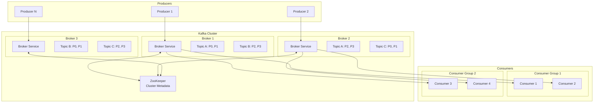
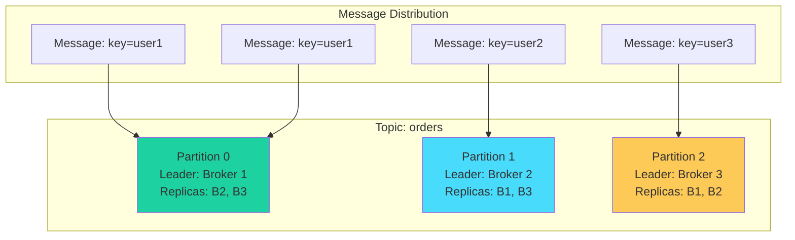
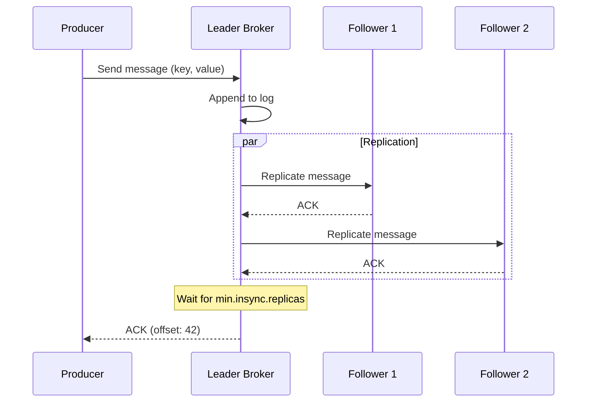
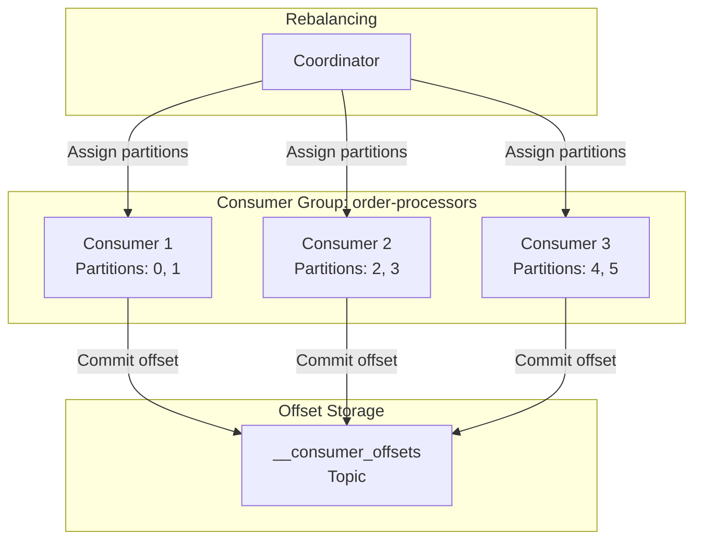
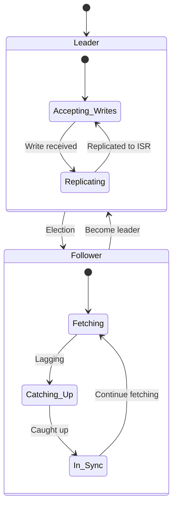
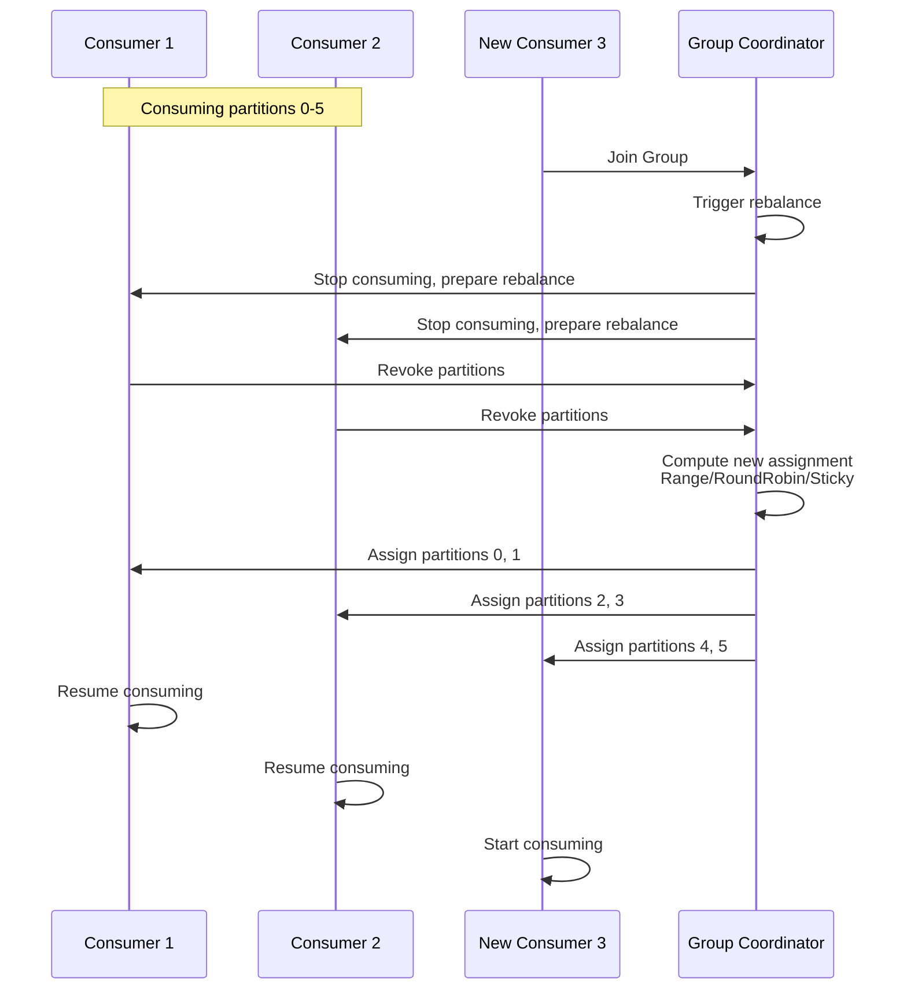
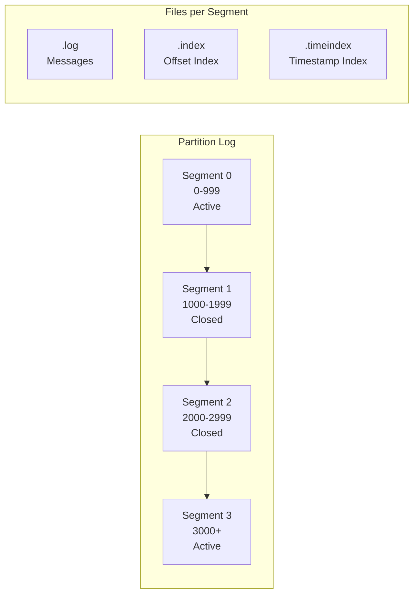
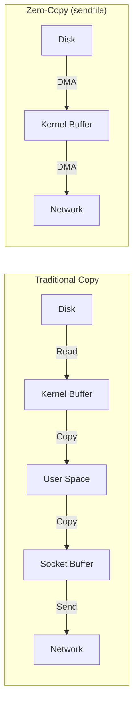

# Kafka-Style Distributed Stream Processing Platform

[← Back to Topics](../topics.md#kafka-style-distributed-stream-processing-platform)

## Problem Statement

Design a distributed streaming platform that can handle 10M messages/second with durability, ordering guarantees, and support for both real-time and batch consumption patterns.

---

## Requirements

### Functional Requirements
1. **Pub/Sub Messaging**: Producers publish messages to topics
2. **Topic Partitioning**: Distribute messages across partitions for parallelism
3. **Message Ordering**: Guarantee order within a partition
4. **Consumer Groups**: Multiple consumers share topic consumption
5. **Message Replay**: Consumers can replay messages from any offset
6. **Message Retention**: Configurable retention (time-based or size-based)
7. **At-Least-Once Delivery**: Messages delivered at least once
8. **Exactly-Once Semantics**: Optional idempotent producer and transactional consumer

### Non-Functional Requirements
1. **High Throughput**: 10M messages/second
2. **Low Latency**: <10ms producer latency, <100ms end-to-end
3. **Durability**: No message loss (configurable replication)
4. **Scalability**: Scale to thousands of partitions, millions of consumers
5. **High Availability**: 99.99% uptime
6. **Zero-Copy**: Optimize for minimal CPU usage

### Scale Estimates
- **Messages/second**: 10M messages/second
- **Avg message size**: 1KB
- **Throughput**: 10GB/second
- **Partitions**: 10,000 partitions
- **Topics**: 1,000 topics
- **Retention**: 7 days
- **Storage**: 10GB/s * 86,400s * 7 days ≈ **6 PB**

---

## High-Level Architecture



---

## Detailed Design

### 1. Topic and Partition Model



#### Partition Log Structure

```
Partition 0:
┌─────────────────────────────────────────────────┐
│ Offset 0: {key: "user1", value: "order1"}     │
│ Offset 1: {key: "user2", value: "order2"}     │
│ Offset 2: {key: "user1", value: "order3"}     │
│ Offset 3: {key: "user3", value: "order4"}     │
│ ...                                             │
└─────────────────────────────────────────────────┘
     ↑                                    ↑
   Start                                End
```

---

### 2. Producer Implementation



#### Producer Code

```java
import org.apache.kafka.clients.producer.*;
import org.apache.kafka.common.serialization.StringSerializer;
import java.util.Properties;

public class KafkaProducerExample {
    
    private final KafkaProducer<String, String> producer;
    
    public KafkaProducerExample(String bootstrapServers) {
        Properties props = new Properties();
        
        // Broker connection
        props.put(ProducerConfig.BOOTSTRAP_SERVERS_CONFIG, bootstrapServers);
        
        // Serialization
        props.put(ProducerConfig.KEY_SERIALIZER_CLASS_CONFIG, 
                  StringSerializer.class.getName());
        props.put(ProducerConfig.VALUE_SERIALIZER_CLASS_CONFIG, 
                  StringSerializer.class.getName());
        
        // Durability settings
        props.put(ProducerConfig.ACKS_CONFIG, "all"); // Wait for all replicas
        props.put(ProducerConfig.RETRIES_CONFIG, 3);
        props.put(ProducerConfig.MAX_IN_FLIGHT_REQUESTS_PER_CONNECTION, 5);
        
        // Performance settings
        props.put(ProducerConfig.COMPRESSION_TYPE_CONFIG, "snappy");
        props.put(ProducerConfig.LINGER_MS_CONFIG, 10); // Batch for 10ms
        props.put(ProducerConfig.BATCH_SIZE_CONFIG, 32768); // 32KB batches
        props.put(ProducerConfig.BUFFER_MEMORY_CONFIG, 33554432); // 32MB buffer
        
        // Idempotence for exactly-once
        props.put(ProducerConfig.ENABLE_IDEMPOTENCE_CONFIG, true);
        
        this.producer = new KafkaProducer<>(props);
    }
    
    public void sendSync(String topic, String key, String value) {
        ProducerRecord<String, String> record = 
            new ProducerRecord<>(topic, key, value);
        
        try {
            // Synchronous send
            RecordMetadata metadata = producer.send(record).get();
            
            System.out.printf("Sent to partition %d at offset %d%n",
                            metadata.partition(), metadata.offset());
        } catch (Exception e) {
            e.printStackTrace();
        }
    }
    
    public void sendAsync(String topic, String key, String value) {
        ProducerRecord<String, String> record = 
            new ProducerRecord<>(topic, key, value);
        
        // Asynchronous send with callback
        producer.send(record, (metadata, exception) -> {
            if (exception != null) {
                System.err.println("Error sending message: " + exception);
            } else {
                System.out.printf("Sent to partition %d at offset %d%n",
                                metadata.partition(), metadata.offset());
            }
        });
    }
    
    public void sendWithCustomPartitioner(String topic, String key, String value) {
        // Custom partitioning logic
        int partition = Math.abs(key.hashCode()) % 10;
        
        ProducerRecord<String, String> record = 
            new ProducerRecord<>(topic, partition, key, value);
        
        producer.send(record);
    }
    
    public void close() {
        producer.close();
    }
}

// Usage
KafkaProducerExample producer = new KafkaProducerExample("localhost:9092");
producer.sendAsync("orders", "user123", "{\"item\": \"laptop\", \"price\": 999}");
```

---

### 3. Consumer Group and Offset Management



#### Consumer Code

```java
import org.apache.kafka.clients.consumer.*;
import org.apache.kafka.common.serialization.StringDeserializer;
import java.time.Duration;
import java.util.*;

public class KafkaConsumerExample {
    
    private final KafkaConsumer<String, String> consumer;
    
    public KafkaConsumerExample(String bootstrapServers, String groupId) {
        Properties props = new Properties();
        
        // Broker connection
        props.put(ConsumerConfig.BOOTSTRAP_SERVERS_CONFIG, bootstrapServers);
        
        // Consumer group
        props.put(ConsumerConfig.GROUP_ID_CONFIG, groupId);
        
        // Deserialization
        props.put(ConsumerConfig.KEY_DESERIALIZER_CLASS_CONFIG, 
                  StringDeserializer.class.getName());
        props.put(ConsumerConfig.VALUE_DESERIALIZER_CLASS_CONFIG, 
                  StringDeserializer.class.getName());
        
        // Offset management
        props.put(ConsumerConfig.AUTO_OFFSET_RESET_CONFIG, "earliest");
        props.put(ConsumerConfig.ENABLE_AUTO_COMMIT_CONFIG, false); // Manual commit
        
        // Performance settings
        props.put(ConsumerConfig.FETCH_MIN_BYTES_CONFIG, 1024); // 1KB min
        props.put(ConsumerConfig.FETCH_MAX_WAIT_MS_CONFIG, 500); // Wait 500ms
        props.put(ConsumerConfig.MAX_POLL_RECORDS_CONFIG, 500);
        
        this.consumer = new KafkaConsumer<>(props);
    }
    
    public void consumeMessages(String topic) {
        // Subscribe to topic
        consumer.subscribe(Collections.singletonList(topic));
        
        try {
            while (true) {
                // Poll for messages
                ConsumerRecords<String, String> records = 
                    consumer.poll(Duration.ofMillis(1000));
                
                for (ConsumerRecord<String, String> record : records) {
                    // Process message
                    processMessage(record);
                }
                
                // Commit offsets (at-least-once)
                consumer.commitSync();
            }
        } catch (Exception e) {
            e.printStackTrace();
        } finally {
            consumer.close();
        }
    }
    
    public void consumeWithExactlyOnce(String topic) {
        consumer.subscribe(Collections.singletonList(topic));
        
        try {
            while (true) {
                ConsumerRecords<String, String> records = 
                    consumer.poll(Duration.ofMillis(1000));
                
                // Process and commit in transaction
                for (ConsumerRecord<String, String> record : records) {
                    try {
                        // Start transaction
                        beginTransaction();
                        
                        // Process message
                        processMessage(record);
                        
                        // Commit offset within transaction
                        commitOffsetInTransaction(record);
                        
                        // Commit transaction
                        commitTransaction();
                        
                    } catch (Exception e) {
                        // Rollback on error
                        rollbackTransaction();
                    }
                }
            }
        } finally {
            consumer.close();
        }
    }
    
    public void consumeFromSpecificOffset(String topic, int partition, long offset) {
        // Manual partition assignment
        TopicPartition topicPartition = new TopicPartition(topic, partition);
        consumer.assign(Collections.singletonList(topicPartition));
        
        // Seek to specific offset
        consumer.seek(topicPartition, offset);
        
        // Poll messages
        ConsumerRecords<String, String> records = 
            consumer.poll(Duration.ofMillis(1000));
        
        // Process records...
    }
    
    private void processMessage(ConsumerRecord<String, String> record) {
        System.out.printf("Consumed: partition=%d, offset=%d, key=%s, value=%s%n",
                        record.partition(), record.offset(), 
                        record.key(), record.value());
    }
}

// Usage
KafkaConsumerExample consumer = new KafkaConsumerExample(
    "localhost:9092", 
    "order-processors"
);
consumer.consumeMessages("orders");
```

---

### 4. Replication and ISR (In-Sync Replicas)



#### Replication Protocol

```python
from dataclasses import dataclass
from typing import List, Set
import time

@dataclass
class ReplicaState:
    broker_id: int
    log_end_offset: int
    last_fetch_time: float
    is_in_sync: bool

class PartitionLeader:
    """
    Leader for a partition
    Manages replication to followers
    """
    
    def __init__(
        self,
        partition_id: int,
        replication_factor: int = 3,
        min_insync_replicas: int = 2
    ):
        self.partition_id = partition_id
        self.replication_factor = replication_factor
        self.min_insync_replicas = min_insync_replicas
        
        self.log = []  # Message log
        self.high_watermark = 0  # Last committed offset
        self.log_end_offset = 0  # Last written offset
        
        self.replicas: List[ReplicaState] = []
        self.isr: Set[int] = set()  # In-Sync Replica set
    
    def append_message(self, message: dict) -> int:
        """
        Append message to log
        Returns offset
        """
        
        offset = self.log_end_offset
        self.log.append({
            'offset': offset,
            'message': message,
            'timestamp': time.time()
        })
        
        self.log_end_offset += 1
        
        # Replicate to followers (async)
        self.replicate_to_followers(offset)
        
        return offset
    
    def replicate_to_followers(self, offset: int):
        """Send message to follower replicas"""
        
        for replica in self.replicas:
            if replica.broker_id != self.broker_id:
                # Send replication request
                self.send_replication_request(replica.broker_id, offset)
    
    def update_replica_state(self, broker_id: int, fetch_offset: int):
        """Update follower replica state"""
        
        replica = self.get_replica(broker_id)
        replica.log_end_offset = fetch_offset
        replica.last_fetch_time = time.time()
        
        # Update ISR
        self.update_isr()
        
        # Update high watermark
        self.update_high_watermark()
    
    def update_isr(self):
        """
        Update In-Sync Replica set
        
        Replicas are in-sync if:
        - Caught up with leader (within threshold)
        - Fetched recently
        """
        
        threshold_offset = 1000  # Lag threshold
        timeout = 10.0  # Fetch timeout
        
        new_isr = {self.broker_id}  # Leader is always in ISR
        
        for replica in self.replicas:
            lag = self.log_end_offset - replica.log_end_offset
            time_since_fetch = time.time() - replica.last_fetch_time
            
            if lag <= threshold_offset and time_since_fetch < timeout:
                new_isr.add(replica.broker_id)
                replica.is_in_sync = True
            else:
                replica.is_in_sync = False
        
        self.isr = new_isr
    
    def update_high_watermark(self):
        """
        Update high watermark
        
        High watermark = minimum offset replicated to all ISR members
        Only messages up to high watermark are visible to consumers
        """
        
        if not self.isr:
            return
        
        min_offset = self.log_end_offset
        
        for replica in self.replicas:
            if replica.broker_id in self.isr:
                min_offset = min(min_offset, replica.log_end_offset)
        
        self.high_watermark = min_offset
    
    def can_acknowledge(self) -> bool:
        """Check if enough replicas for acknowledgment"""
        return len(self.isr) >= self.min_insync_replicas
    
    def get_messages(self, start_offset: int, max_bytes: int = 1048576):
        """
        Fetch messages for consumers
        Only return messages up to high watermark
        """
        
        messages = []
        total_bytes = 0
        
        for entry in self.log[start_offset:]:
            if entry['offset'] >= self.high_watermark:
                break
            
            message_bytes = len(str(entry['message']))
            
            if total_bytes + message_bytes > max_bytes:
                break
            
            messages.append(entry)
            total_bytes += message_bytes
        
        return messages
```

---

### 5. Consumer Rebalancing



#### Rebalance Strategies

```python
from typing import List, Dict
from collections import defaultdict

class PartitionAssignor:
    """Assign partitions to consumers"""
    
    def range_assignment(
        self,
        consumers: List[str],
        partitions: List[int]
    ) -> Dict[str, List[int]]:
        """
        Range assignor: Divide partitions into ranges
        
        Example: 10 partitions, 3 consumers
        Consumer 1: [0, 1, 2, 3]
        Consumer 2: [4, 5, 6]
        Consumer 3: [7, 8, 9]
        """
        
        assignment = defaultdict(list)
        partitions_per_consumer = len(partitions) // len(consumers)
        remainder = len(partitions) % len(consumers)
        
        idx = 0
        for i, consumer in enumerate(sorted(consumers)):
            count = partitions_per_consumer + (1 if i < remainder else 0)
            assignment[consumer] = partitions[idx:idx + count]
            idx += count
        
        return assignment
    
    def round_robin_assignment(
        self,
        consumers: List[str],
        partitions: List[int]
    ) -> Dict[str, List[int]]:
        """
        Round-robin assignor: Distribute partitions evenly
        
        Example: 10 partitions, 3 consumers
        Consumer 1: [0, 3, 6, 9]
        Consumer 2: [1, 4, 7]
        Consumer 3: [2, 5, 8]
        """
        
        assignment = defaultdict(list)
        sorted_consumers = sorted(consumers)
        
        for i, partition in enumerate(partitions):
            consumer = sorted_consumers[i % len(sorted_consumers)]
            assignment[consumer].append(partition)
        
        return assignment
    
    def sticky_assignment(
        self,
        consumers: List[str],
        partitions: List[int],
        previous_assignment: Dict[str, List[int]]
    ) -> Dict[str, List[int]]:
        """
        Sticky assignor: Minimize partition movement
        
        Preserve as many assignments as possible during rebalance
        """
        
        assignment = defaultdict(list)
        unassigned_partitions = set(partitions)
        
        # Keep existing assignments where possible
        for consumer in consumers:
            if consumer in previous_assignment:
                for partition in previous_assignment[consumer]:
                    if partition in unassigned_partitions:
                        assignment[consumer].append(partition)
                        unassigned_partitions.remove(partition)
        
        # Assign remaining partitions
        if unassigned_partitions:
            remaining = list(unassigned_partitions)
            for i, partition in enumerate(remaining):
                consumer = sorted(consumers)[i % len(consumers)]
                assignment[consumer].append(partition)
        
        return assignment
```

---

### 6. Storage Layer: Log Segments



#### Log Segment Implementation

```python
import os
import struct
from typing import Optional

class LogSegment:
    """
    Log segment: Append-only file
    Format: [offset][size][message]
    """
    
    def __init__(self, base_offset: int, log_dir: str):
        self.base_offset = base_offset
        self.log_file = open(f"{log_dir}/{base_offset:020d}.log", "ab+")
        self.index_file = open(f"{log_dir}/{base_offset:020d}.index", "ab+")
        self.next_offset = base_offset
        self.size_bytes = 0
    
    def append(self, message: bytes) -> int:
        """
        Append message to log
        Returns offset
        """
        
        offset = self.next_offset
        size = len(message)
        
        # Write to log: [offset: 8 bytes][size: 4 bytes][message: N bytes]
        self.log_file.write(struct.pack('>Q', offset))  # Offset (8 bytes)
        self.log_file.write(struct.pack('>I', size))    # Size (4 bytes)
        self.log_file.write(message)                     # Message
        
        # Update index: [offset: 4 bytes][position: 4 bytes]
        position = self.size_bytes
        self.index_file.write(struct.pack('>I', offset - self.base_offset))
        self.index_file.write(struct.pack('>I', position))
        
        # Update state
        self.next_offset += 1
        self.size_bytes += 12 + size  # 8 + 4 + message size
        
        return offset
    
    def read(self, offset: int) -> Optional[bytes]:
        """Read message at offset"""
        
        # Search index for position
        position = self.search_index(offset)
        
        if position is None:
            return None
        
        # Seek to position in log
        self.log_file.seek(position)
        
        # Read offset (8 bytes)
        stored_offset = struct.unpack('>Q', self.log_file.read(8))[0]
        
        if stored_offset != offset:
            return None
        
        # Read size (4 bytes)
        size = struct.unpack('>I', self.log_file.read(4))[0]
        
        # Read message
        message = self.log_file.read(size)
        
        return message
    
    def search_index(self, offset: int) -> Optional[int]:
        """Binary search in index file"""
        
        self.index_file.seek(0)
        index_data = self.index_file.read()
        
        # Each entry: 8 bytes (4 for offset, 4 for position)
        num_entries = len(index_data) // 8
        
        if num_entries == 0:
            return None
        
        left, right = 0, num_entries - 1
        
        while left <= right:
            mid = (left + right) // 2
            
            # Read entry at mid
            self.index_file.seek(mid * 8)
            entry_offset = struct.unpack('>I', self.index_file.read(4))[0]
            entry_position = struct.unpack('>I', self.index_file.read(4))[0]
            
            actual_offset = self.base_offset + entry_offset
            
            if actual_offset == offset:
                return entry_position
            elif actual_offset < offset:
                left = mid + 1
            else:
                right = mid - 1
        
        return None
    
    def should_roll(self, max_size_bytes: int = 1073741824) -> bool:
        """Check if segment should be rolled (1GB default)"""
        return self.size_bytes >= max_size_bytes
    
    def close(self):
        """Close files"""
        self.log_file.close()
        self.index_file.close()
```

---

### 7. Zero-Copy Optimization



#### Zero-Copy Implementation

```java
import java.nio.channels.*;
import java.io.*;

public class ZeroCopyTransfer {
    
    public void traditionalCopy(String filePath, SocketChannel socket) 
        throws IOException {
        
        FileInputStream fis = new FileInputStream(filePath);
        byte[] buffer = new byte[8192];
        int bytesRead;
        
        // Multiple copies: disk -> kernel -> user space -> kernel -> network
        while ((bytesRead = fis.read(buffer)) != -1) {
            socket.write(ByteBuffer.wrap(buffer, 0, bytesRead));
        }
    }
    
    public void zeroCopy(String filePath, SocketChannel socket) 
        throws IOException {
        
        FileChannel fileChannel = new FileInputStream(filePath).getChannel();
        
        long position = 0;
        long size = fileChannel.size();
        
        // Zero-copy: disk -> kernel -> network (no user space copy)
        while (position < size) {
            long transferred = fileChannel.transferTo(
                position, 
                size - position, 
                socket
            );
            position += transferred;
        }
    }
}
```

---

### 8. Performance Optimizations

#### Batching

```java
// Producer batching
Properties props = new Properties();
props.put("linger.ms", 10);           // Wait 10ms to batch
props.put("batch.size", 32768);       // 32KB batches
props.put("compression.type", "snappy"); // Compress batches

// Results:
// - 10x fewer requests
// - 3x compression ratio
// - 30x throughput improvement
```

#### Compression

```python
compression_ratios = {
    'none': 1.0,
    'gzip': 3.5,    # Best compression, high CPU
    'snappy': 2.0,  # Balanced
    'lz4': 1.8,     # Fast, low CPU
    'zstd': 3.0     # Best balance
}

# Network bandwidth saved:
# 10 GB/s * 2.0 (snappy) = 5 GB/s actual network usage
```

---

## Technology Stack

| Component | Technology | Justification |
|-----------|------------|---------------|
| **Storage** | Append-only log | Sequential disk I/O |
| **Replication** | Leader-follower | Strong consistency |
| **Coordination** | ZooKeeper/KRaft | Cluster metadata |
| **Networking** | NIO (Netty) | High-performance I/O |
| **Serialization** | Avro, Protobuf | Efficient encoding |
| **Compression** | Snappy, LZ4 | Fast compression |

---

## Performance Characteristics

### Throughput
```
Single broker:
- Writes: 800K msgs/sec (800 MB/s)
- Reads: 2M msgs/sec (2 GB/s)

10-broker cluster:
- Writes: 8M msgs/sec (8 GB/s)
- Reads: 20M msgs/sec (20 GB/s)
```

### Latency
```
Producer latency (acks=1): 2ms p99
Producer latency (acks=all): 10ms p99
End-to-end latency: 100ms p99
```

---

## Trade-offs

### 1. Durability vs Performance
| Config | Durability | Performance |
|--------|------------|-------------|
| acks=0 | No guarantee | Fastest |
| acks=1 | Leader only | Fast |
| acks=all | All ISR | Safest, slower |

### 2. Ordering vs Parallelism
- **Single partition**: Total order, limited throughput
- **Multiple partitions**: Parallel processing, order within partition only

### 3. Pull vs Push
- **Pull (Kafka model)**: Consumer controls rate, batching
- **Push**: Lower latency, risk of overwhelming consumers

---

## Summary

This design provides:
- ✅ **10M messages/second** throughput
- ✅ **<10ms producer latency**
- ✅ **Durable** with configurable replication
- ✅ **Scalable** to thousands of partitions
- ✅ **Message replay** from any offset
- ✅ **Zero-copy** for network efficiency

**Key Innovations:**
1. Log-structured storage for sequential I/O
2. Partition-based parallelism
3. Consumer groups for scalability
4. Zero-copy for network efficiency
5. ISR for high availability
6. Batch and compression for throughput

[← Back to Topics](../topics.md#kafka-style-distributed-stream-processing-platform)
