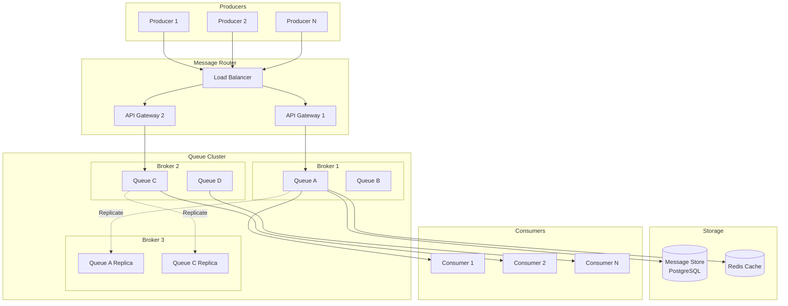
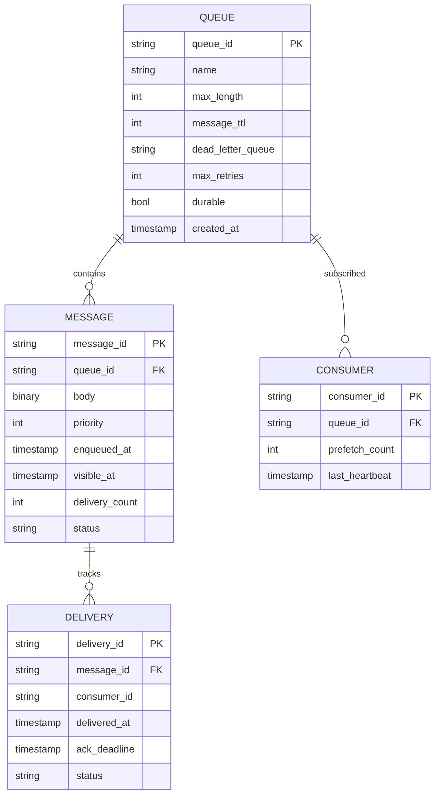
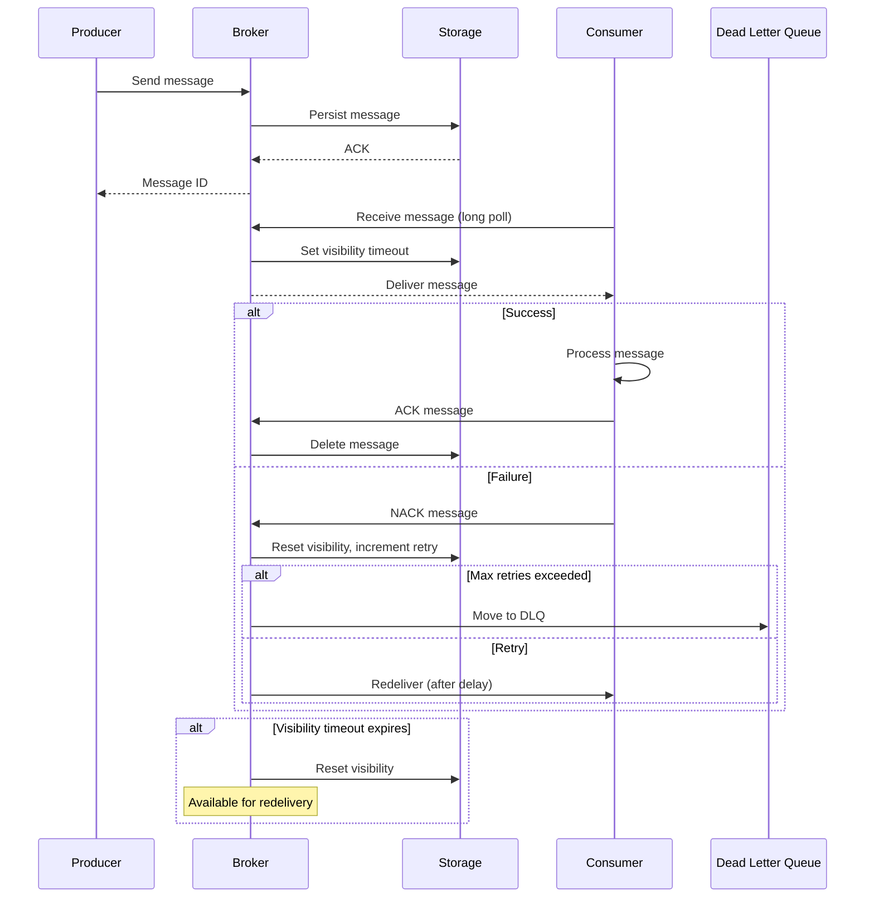
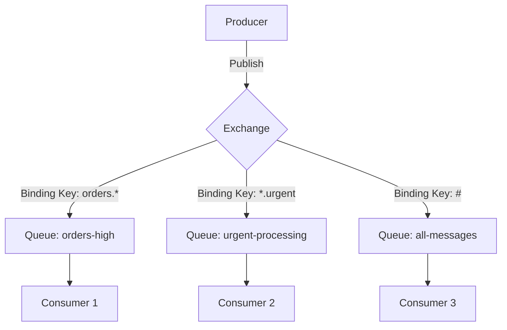

# Distributed Queue Service (RabbitMQ/SQS Style)

[← Back to Topics](../topics.md#distributed-queue-service-like-rabbitmqsqs)

## Problem Statement

Design a distributed message queue service that supports at-least-once delivery, message prioritization, dead-letter queues, and handles 1M messages/second with high availability.

---

## Requirements

### Functional Requirements
1. **Message Queueing**: FIFO message delivery
2. **Multiple Queues**: Support 100K+ queues
3. **Message Acknowledgment**: Explicit ACK/NACK mechanism
4. **Visibility Timeout**: Hide messages being processed
5. **Dead-Letter Queue (DLQ)**: Handle failed messages
6. **Priority Queues**: Support message prioritization
7. **Delayed Messages**: Schedule future delivery
8. **Queue Binding**: Route messages to queues via exchanges
9. **Message TTL**: Time-to-live for messages
10. **Consumer Groups**: Multiple consumers per queue

### Non-Functional Requirements
1. **Throughput**: 1M messages/second
2. **Latency**: <50ms enqueue, <10ms dequeue
3. **Durability**: Persist messages to disk
4. **High Availability**: 99.99% uptime
5. **Scalability**: Horizontal scaling
6. **Ordering**: Best-effort FIFO per queue

### Scale Estimates
- **Messages/second**: 1M
- **Queues**: 100,000
- **Avg message size**: 10KB
- **Throughput**: 10GB/second
- **Retention**: 14 days
- **Storage**: 10GB/s * 86,400s * 14 days ≈ **12 PB**

---

## High-Level Architecture



---

## Detailed Design

### 1. Queue Data Model



---

### 2. Message Flow



---

### 3. Queue Broker Implementation

```python
import time
import uuid
from dataclasses import dataclass
from typing import Optional, List
from enum import Enum
import heapq
from threading import Lock

class MessageStatus(Enum):
    PENDING = "pending"
    IN_FLIGHT = "in_flight"
    COMPLETED = "completed"
    FAILED = "failed"

@dataclass
class Message:
    message_id: str
    queue_id: str
    body: bytes
    priority: int = 0
    enqueued_at: float = 0
    visible_at: float = 0
    delivery_count: int = 0
    status: MessageStatus = MessageStatus.PENDING
    
    def __lt__(self, other):
        # For priority queue: higher priority first, then FIFO
        if self.priority != other.priority:
            return self.priority > other.priority
        return self.enqueued_at < other.enqueued_at

@dataclass
class QueueConfig:
    queue_id: str
    name: str
    visibility_timeout: int = 30  # seconds
    max_retries: int = 3
    message_retention: int = 86400 * 14  # 14 days
    dead_letter_queue: Optional[str] = None
    max_length: Optional[int] = None

class QueueBroker:
    """
    Message queue broker
    Handles message storage, delivery, acknowledgment
    """
    
    def __init__(self):
        self.queues: dict[str, QueueConfig] = {}
        self.messages: dict[str, Message] = {}
        
        # Priority queue per queue
        self.pending_messages: dict[str, List[Message]] = {}
        
        # In-flight messages
        self.in_flight: dict[str, Message] = {}
        
        self.lock = Lock()
    
    def create_queue(self, config: QueueConfig):
        """Create a new queue"""
        
        with self.lock:
            self.queues[config.queue_id] = config
            self.pending_messages[config.queue_id] = []
    
    def send_message(
        self,
        queue_id: str,
        body: bytes,
        priority: int = 0,
        delay_seconds: int = 0
    ) -> str:
        """
        Send message to queue
        Returns message ID
        """
        
        if queue_id not in self.queues:
            raise ValueError(f"Queue {queue_id} not found")
        
        config = self.queues[queue_id]
        
        # Check max length
        if config.max_length and len(self.pending_messages[queue_id]) >= config.max_length:
            raise ValueError(f"Queue {queue_id} is full")
        
        # Create message
        message_id = str(uuid.uuid4())
        now = time.time()
        
        message = Message(
            message_id=message_id,
            queue_id=queue_id,
            body=body,
            priority=priority,
            enqueued_at=now,
            visible_at=now + delay_seconds,  # Delayed delivery
            status=MessageStatus.PENDING
        )
        
        with self.lock:
            self.messages[message_id] = message
            
            # Add to priority queue
            heapq.heappush(self.pending_messages[queue_id], message)
        
        return message_id
    
    def receive_message(
        self,
        queue_id: str,
        max_messages: int = 1,
        wait_time_seconds: int = 0
    ) -> List[Message]:
        """
        Receive messages from queue
        Long polling supported via wait_time_seconds
        """
        
        if queue_id not in self.queues:
            raise ValueError(f"Queue {queue_id} not found")
        
        config = self.queues[queue_id]
        messages = []
        
        start_time = time.time()
        
        while len(messages) < max_messages:
            with self.lock:
                queue = self.pending_messages[queue_id]
                
                # Find visible messages
                while queue and len(messages) < max_messages:
                    if queue[0].visible_at <= time.time():
                        message = heapq.heappop(queue)
                        
                        # Make in-flight
                        message.status = MessageStatus.IN_FLIGHT
                        message.visible_at = time.time() + config.visibility_timeout
                        message.delivery_count += 1
                        
                        self.in_flight[message.message_id] = message
                        messages.append(message)
                    else:
                        break
            
            # Long polling: wait if no messages
            if not messages and time.time() - start_time < wait_time_seconds:
                time.sleep(0.1)
            else:
                break
        
        return messages
    
    def acknowledge_message(self, message_id: str):
        """
        Acknowledge message (delete from queue)
        """
        
        with self.lock:
            if message_id not in self.in_flight:
                raise ValueError(f"Message {message_id} not in-flight")
            
            message = self.in_flight.pop(message_id)
            message.status = MessageStatus.COMPLETED
            
            # Delete from storage
            del self.messages[message_id]
    
    def nack_message(self, message_id: str, requeue: bool = True):
        """
        Negative acknowledge (requeue or send to DLQ)
        """
        
        with self.lock:
            if message_id not in self.in_flight:
                raise ValueError(f"Message {message_id} not in-flight")
            
            message = self.in_flight.pop(message_id)
            config = self.queues[message.queue_id]
            
            # Check retry limit
            if message.delivery_count >= config.max_retries:
                # Move to dead letter queue
                if config.dead_letter_queue:
                    self.send_message(
                        config.dead_letter_queue,
                        message.body,
                        priority=message.priority
                    )
                
                message.status = MessageStatus.FAILED
                del self.messages[message_id]
            
            elif requeue:
                # Requeue with exponential backoff
                backoff = min(2 ** message.delivery_count, 900)  # Max 15 min
                message.visible_at = time.time() + backoff
                message.status = MessageStatus.PENDING
                
                heapq.heappush(self.pending_messages[message.queue_id], message)
    
    def handle_visibility_timeout(self):
        """
        Background task: Reset visibility for timed-out messages
        """
        
        now = time.time()
        
        with self.lock:
            timed_out = []
            
            for message_id, message in list(self.in_flight.items()):
                if message.visible_at <= now:
                    timed_out.append(message_id)
            
            for message_id in timed_out:
                message = self.in_flight.pop(message_id)
                
                # Requeue
                message.status = MessageStatus.PENDING
                message.visible_at = now
                
                heapq.heappush(
                    self.pending_messages[message.queue_id],
                    message
                )
    
    def cleanup_expired_messages(self):
        """
        Background task: Remove expired messages
        """
        
        now = time.time()
        
        with self.lock:
            for queue_id, config in self.queues.items():
                queue = self.pending_messages[queue_id]
                
                # Remove expired messages
                expired = [
                    msg for msg in queue
                    if now - msg.enqueued_at > config.message_retention
                ]
                
                for message in expired:
                    queue.remove(message)
                    del self.messages[message.message_id]
                
                # Re-heapify
                heapq.heapify(queue)


# Usage example
broker = QueueBroker()

# Create queue
broker.create_queue(QueueConfig(
    queue_id="orders",
    name="Order Processing Queue",
    visibility_timeout=30,
    max_retries=3,
    dead_letter_queue="orders-dlq"
))

# Send message
message_id = broker.send_message(
    queue_id="orders",
    body=b'{"order_id": 123, "amount": 99.99}',
    priority=5
)

# Receive message
messages = broker.receive_message(
    queue_id="orders",
    max_messages=10,
    wait_time_seconds=20  # Long polling
)

for message in messages:
    try:
        # Process message
        process_order(message.body)
        
        # Acknowledge
        broker.acknowledge_message(message.message_id)
    except Exception as e:
        # Negative acknowledge (will retry)
        broker.nack_message(message.message_id, requeue=True)
```

---

### 4. Exchange and Routing (RabbitMQ-style)



#### Exchange Implementation

```python
from enum import Enum
import re

class ExchangeType(Enum):
    DIRECT = "direct"    # Exact routing key match
    FANOUT = "fanout"    # Broadcast to all queues
    TOPIC = "topic"      # Pattern matching
    HEADERS = "headers"  # Header matching

class Exchange:
    """
    Message exchange with routing
    """
    
    def __init__(
        self,
        name: str,
        exchange_type: ExchangeType,
        durable: bool = True
    ):
        self.name = name
        self.exchange_type = exchange_type
        self.durable = durable
        
        # Bindings: routing_key -> [queue_ids]
        self.bindings: dict[str, List[str]] = {}
    
    def bind_queue(self, routing_key: str, queue_id: str):
        """Bind queue to exchange with routing key"""
        
        if routing_key not in self.bindings:
            self.bindings[routing_key] = []
        
        self.bindings[routing_key].append(queue_id)
    
    def route_message(
        self,
        routing_key: str,
        message: Message
    ) -> List[str]:
        """
        Route message to queues
        Returns list of queue IDs
        """
        
        if self.exchange_type == ExchangeType.DIRECT:
            return self._route_direct(routing_key)
        
        elif self.exchange_type == ExchangeType.FANOUT:
            return self._route_fanout()
        
        elif self.exchange_type == ExchangeType.TOPIC:
            return self._route_topic(routing_key)
        
        return []
    
    def _route_direct(self, routing_key: str) -> List[str]:
        """Direct exchange: exact match"""
        return self.bindings.get(routing_key, [])
    
    def _route_fanout(self) -> List[str]:
        """Fanout exchange: all queues"""
        all_queues = []
        for queues in self.bindings.values():
            all_queues.extend(queues)
        return list(set(all_queues))
    
    def _route_topic(self, routing_key: str) -> List[str]:
        """
        Topic exchange: pattern matching
        
        Patterns:
        - * matches one word
        - # matches zero or more words
        
        Examples:
        - orders.* matches orders.new, orders.cancelled
        - orders.# matches orders.new, orders.new.urgent
        """
        
        matched_queues = []
        
        for pattern, queues in self.bindings.items():
            if self._match_topic_pattern(pattern, routing_key):
                matched_queues.extend(queues)
        
        return list(set(matched_queues))
    
    def _match_topic_pattern(self, pattern: str, routing_key: str) -> bool:
        """Match topic pattern"""
        
        # Convert pattern to regex
        regex_pattern = pattern.replace('.', r'\.')
        regex_pattern = regex_pattern.replace('*', r'[^.]+')
        regex_pattern = regex_pattern.replace('#', r'.*')
        regex_pattern = f"^{regex_pattern}$"
        
        return bool(re.match(regex_pattern, routing_key))


# Usage
exchange = Exchange("orders_exchange", ExchangeType.TOPIC)

# Bind queues
exchange.bind_queue("orders.*", "all-orders")
exchange.bind_queue("orders.new", "new-orders")
exchange.bind_queue("*.urgent", "urgent-processing")
exchange.bind_queue("#", "audit-log")

# Route message
queues = exchange.route_message("orders.new", message)
# Returns: ["all-orders", "new-orders", "audit-log"]

queues = exchange.route_message("orders.urgent", message)
# Returns: ["all-orders", "urgent-processing", "audit-log"]
```

---

### 5. Persistence Layer

```python
import sqlite3
from typing import Optional

class MessageStore:
    """
    Persistent message storage
    Using SQLite for simplicity (use PostgreSQL in production)
    """
    
    def __init__(self, db_path: str):
        self.conn = sqlite3.connect(db_path, check_same_thread=False)
        self._create_tables()
    
    def _create_tables(self):
        """Create database tables"""
        
        self.conn.execute("""
            CREATE TABLE IF NOT EXISTS messages (
                message_id TEXT PRIMARY KEY,
                queue_id TEXT NOT NULL,
                body BLOB NOT NULL,
                priority INTEGER DEFAULT 0,
                enqueued_at REAL NOT NULL,
                visible_at REAL NOT NULL,
                delivery_count INTEGER DEFAULT 0,
                status TEXT NOT NULL,
                INDEX idx_queue_visible (queue_id, visible_at),
                INDEX idx_status (status)
            )
        """)
        
        self.conn.execute("""
            CREATE TABLE IF NOT EXISTS queues (
                queue_id TEXT PRIMARY KEY,
                name TEXT NOT NULL,
                visibility_timeout INTEGER DEFAULT 30,
                max_retries INTEGER DEFAULT 3,
                message_retention INTEGER DEFAULT 1209600,
                dead_letter_queue TEXT,
                max_length INTEGER,
                created_at REAL NOT NULL
            )
        """)
        
        self.conn.commit()
    
    def save_message(self, message: Message):
        """Persist message"""
        
        self.conn.execute("""
            INSERT OR REPLACE INTO messages
            (message_id, queue_id, body, priority, enqueued_at, 
             visible_at, delivery_count, status)
            VALUES (?, ?, ?, ?, ?, ?, ?, ?)
        """, (
            message.message_id,
            message.queue_id,
            message.body,
            message.priority,
            message.enqueued_at,
            message.visible_at,
            message.delivery_count,
            message.status.value
        ))
        
        self.conn.commit()
    
    def load_messages(
        self,
        queue_id: str,
        limit: int = 100
    ) -> List[Message]:
        """Load visible messages"""
        
        cursor = self.conn.execute("""
            SELECT message_id, queue_id, body, priority, enqueued_at,
                   visible_at, delivery_count, status
            FROM messages
            WHERE queue_id = ? 
              AND visible_at <= ?
              AND status = 'pending'
            ORDER BY priority DESC, enqueued_at ASC
            LIMIT ?
        """, (queue_id, time.time(), limit))
        
        messages = []
        for row in cursor:
            messages.append(Message(
                message_id=row[0],
                queue_id=row[1],
                body=row[2],
                priority=row[3],
                enqueued_at=row[4],
                visible_at=row[5],
                delivery_count=row[6],
                status=MessageStatus(row[7])
            ))
        
        return messages
    
    def delete_message(self, message_id: str):
        """Delete message"""
        
        self.conn.execute("""
            DELETE FROM messages WHERE message_id = ?
        """, (message_id,))
        
        self.conn.commit()
```

---

### 6. Consumer Implementation

```go
package main

import (
    "context"
    "fmt"
    "log"
    "time"
)

type QueueConsumer struct {
    queueURL       string
    client         *QueueClient
    prefetchCount  int
    visibilityTimeout int
    handler        MessageHandler
}

type MessageHandler func(message *Message) error

func NewConsumer(
    queueURL string,
    client *QueueClient,
    handler MessageHandler,
) *QueueConsumer {
    return &QueueConsumer{
        queueURL:          queueURL,
        client:            client,
        prefetchCount:     10,
        visibilityTimeout: 30,
        handler:           handler,
    }
}

func (c *QueueConsumer) Start(ctx context.Context) error {
    for {
        select {
        case <-ctx.Done():
            return ctx.Err()
        default:
            c.pollAndProcess(ctx)
        }
    }
}

func (c *QueueConsumer) pollAndProcess(ctx context.Context) {
    // Long poll for messages
    messages, err := c.client.ReceiveMessages(ctx, &ReceiveRequest{
        QueueURL:          c.queueURL,
        MaxMessages:       c.prefetchCount,
        WaitTimeSeconds:   20, // Long polling
        VisibilityTimeout: c.visibilityTimeout,
    })
    
    if err != nil {
        log.Printf("Error receiving messages: %v", err)
        time.Sleep(time.Second)
        return
    }
    
    // Process messages concurrently
    for _, msg := range messages {
        go c.processMessage(ctx, msg)
    }
}

func (c *QueueConsumer) processMessage(ctx context.Context, msg *Message) {
    defer func() {
        if r := recover(); r != nil {
            log.Printf("Panic processing message %s: %v", msg.ID, r)
            c.nackMessage(ctx, msg)
        }
    }()
    
    // Process message
    err := c.handler(msg)
    
    if err != nil {
        log.Printf("Error processing message %s: %v", msg.ID, err)
        c.nackMessage(ctx, msg)
        return
    }
    
    // Acknowledge successful processing
    err = c.client.AckMessage(ctx, &AckRequest{
        QueueURL:  c.queueURL,
        MessageID: msg.ID,
    })
    
    if err != nil {
        log.Printf("Error acknowledging message %s: %v", msg.ID, err)
    }
}

func (c *QueueConsumer) nackMessage(ctx context.Context, msg *Message) {
    err := c.client.NackMessage(ctx, &NackRequest{
        QueueURL:  c.queueURL,
        MessageID: msg.ID,
        Requeue:   true,
    })
    
    if err != nil {
        log.Printf("Error nacking message %s: %v", msg.ID, err)
    }
}

// Usage
func main() {
    client := NewQueueClient("http://queue-service:8080")
    
    consumer := NewConsumer(
        "orders-queue",
        client,
        func(msg *Message) error {
            fmt.Printf("Processing: %s\n", string(msg.Body))
            // Process order...
            return nil
        },
    )
    
    ctx := context.Background()
    consumer.Start(ctx)
}
```

---

## Technology Stack

| Component | Technology | Justification |
|-----------|------------|---------------|
| **Storage** | PostgreSQL | ACID, reliability |
| **Cache** | Redis | Fast in-memory operations |
| **Message Format** | Protocol Buffers | Efficient serialization |
| **Replication** | Primary-Replica | High availability |
| **Coordination** | etcd | Queue metadata |

---

## Trade-offs

### 1. At-Least-Once vs Exactly-Once
- **At-Least-Once**: Simple, fast, duplicates possible
- **Exactly-Once**: Complex, requires deduplication, transactional overhead

### 2. Push vs Pull
- **Push (RabbitMQ)**: Lower latency, can overwhelm consumers
- **Pull (SQS)**: Consumer controls rate, higher latency

### 3. Disk vs Memory
- **Memory**: Fast, risk of data loss
- **Disk**: Durable, slower

---

## Summary

This design provides:
- ✅ **1M messages/second** throughput
- ✅ **<50ms enqueue, <10ms dequeue** latency
- ✅ **Durable** with disk persistence
- ✅ **Dead-letter queues** for failed messages
- ✅ **Priority queues** and delayed messages
- ✅ **Flexible routing** with exchanges

**Key Features:**
1. Message acknowledgment and visibility timeout
2. Priority queues with heap data structure
3. Exchange-based routing (direct, fanout, topic)
4. Dead-letter queues for failure handling
5. Long polling for efficient consumption
6. Persistent storage with PostgreSQL

[← Back to Topics](../topics.md#distributed-queue-service-like-rabbitmqsqs)
