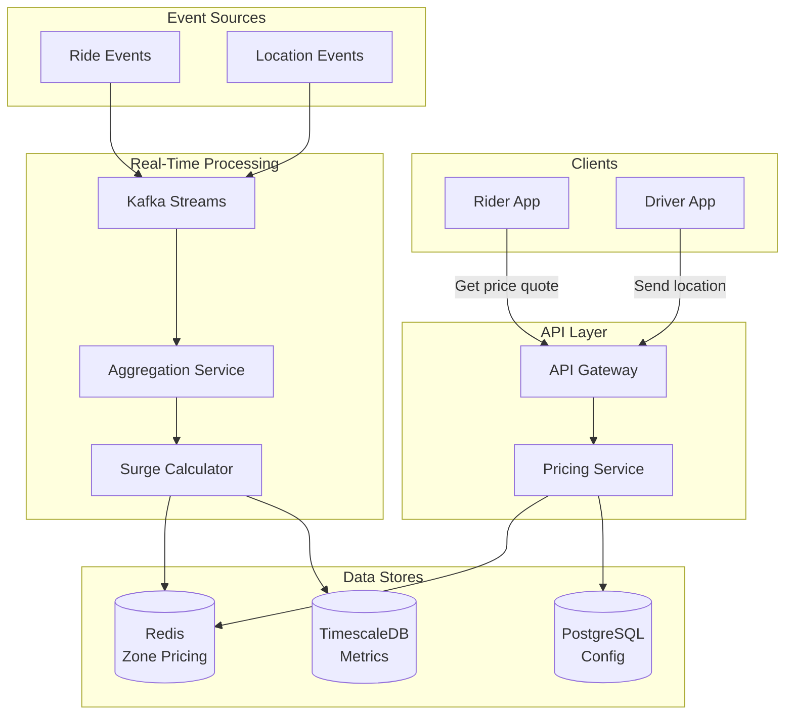
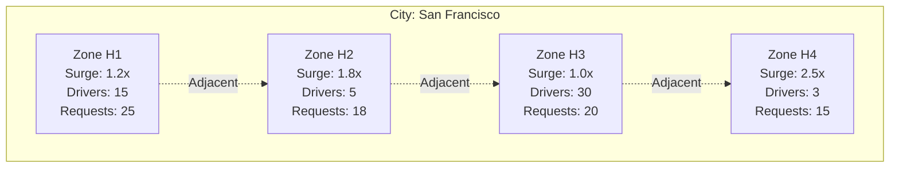
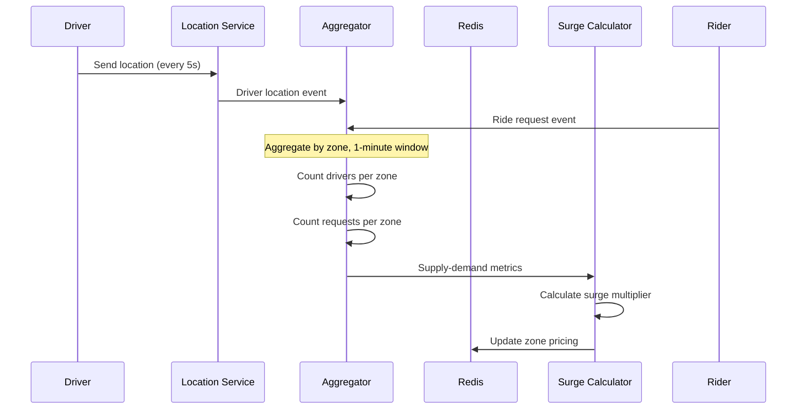
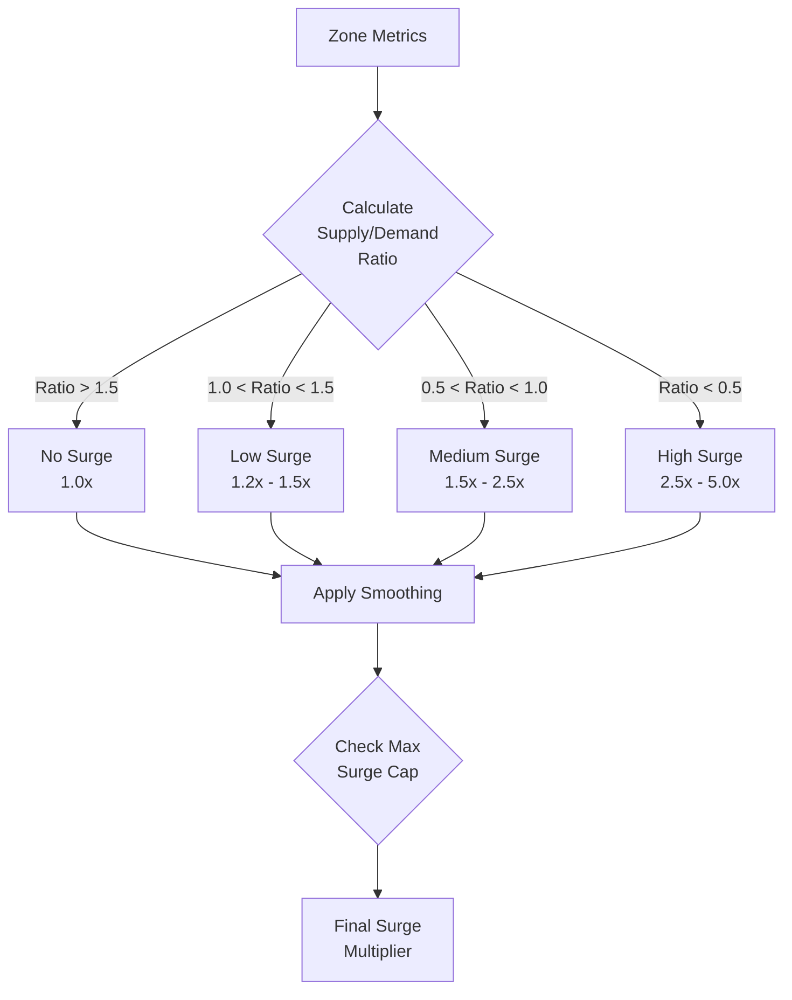
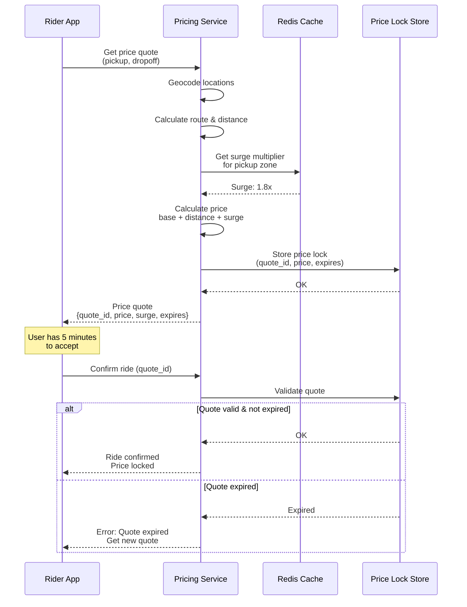

# Surge Pricing Engine for Ride Sharing

[← Back to Topics](../topics.md#surge-pricing-engine-for-ride-sharing-uber-lyft)

## Problem Statement

Design a dynamic surge pricing engine for a ride-sharing platform that adjusts prices in real-time based on supply-demand imbalance, processes 100K pricing requests/second, and ensures fairness.

---

## Requirements

### Functional Requirements
1. **Real-Time Pricing**: Calculate surge multiplier in <100ms
2. **Supply-Demand Tracking**: Monitor available drivers and ride requests
3. **Geographic Zones**: Divide city into pricing zones (hexagons)
4. **Dynamic Multiplier**: 1.0x to 5.0x surge multiplier
5. **Price Transparency**: Show surge pricing to riders before booking
6. **Driver Incentives**: Notify drivers of surge zones
7. **Price Lock**: Lock price for 5 minutes after quote
8. **Historical Analytics**: Track pricing trends
9. **Manual Override**: Allow ops team to adjust pricing

### Non-Functional Requirements
1. **Throughput**: 100K pricing requests/second
2. **Latency**: <100ms p99
3. **Consistency**: Eventually consistent pricing across zones
4. **Availability**: 99.99% uptime
5. **Scalability**: Handle peak demand (5x normal)
6. **Fairness**: Prevent price gouging

### Scale Estimates
- **Cities**: 100 cities
- **Zones per city**: 500 hexagons (250m radius)
- **Total zones**: 50,000
- **Active drivers**: 1M drivers
- **Active riders**: 5M riders
- **Pricing requests**: 100K/second
- **Price updates**: 1/second per zone = 50K updates/second

---

## High-Level Architecture



---

## Detailed Design

### 1. Geospatial Zone Model



#### H3 Hexagonal Grid

```python
import h3
from typing import List, Tuple

class ZoneManager:
    """
    Manage geographic zones using H3 hexagonal grid
    """
    
    def __init__(self, resolution: int = 8):
        """
        H3 resolution:
        - 7: ~1km edge length
        - 8: ~461m edge length (recommended)
        - 9: ~174m edge length
        """
        self.resolution = resolution
    
    def get_zone(self, lat: float, lon: float) -> str:
        """Get zone ID for coordinates"""
        return h3.geo_to_h3(lat, lon, self.resolution)
    
    def get_neighbors(self, zone_id: str) -> List[str]:
        """Get adjacent zones"""
        return list(h3.k_ring(zone_id, 1))
    
    def get_zone_center(self, zone_id: str) -> Tuple[float, float]:
        """Get zone center coordinates"""
        lat, lon = h3.h3_to_geo(zone_id)
        return lat, lon
    
    def get_zone_boundary(self, zone_id: str) -> List[Tuple[float, float]]:
        """Get zone polygon boundary"""
        return h3.h3_to_geo_boundary(zone_id)
    
    def get_zones_in_region(
        self,
        center_lat: float,
        center_lon: float,
        radius_km: float
    ) -> List[str]:
        """Get all zones within radius"""
        
        center_zone = self.get_zone(center_lat, center_lon)
        
        # Calculate ring size based on radius
        # Each ring adds ~461m at resolution 8
        rings = int(radius_km * 1000 / 461) + 1
        
        zones = list(h3.k_ring(center_zone, rings))
        return zones


# Usage
zone_mgr = ZoneManager(resolution=8)

# Get zone for location
zone_id = zone_mgr.get_zone(37.7749, -122.4194)  # San Francisco
print(f"Zone: {zone_id}")

# Get neighboring zones
neighbors = zone_mgr.get_neighbors(zone_id)
print(f"Neighbors: {neighbors}")
```

---

### 2. Supply-Demand Tracking



#### Real-Time Aggregation

```python
from collections import defaultdict
from dataclasses import dataclass
from typing import Dict
import time
from threading import Lock

@dataclass
class ZoneMetrics:
    zone_id: str
    available_drivers: int = 0
    active_requests: int = 0
    completed_rides_1h: int = 0
    avg_wait_time_s: float = 0.0
    timestamp: float = 0.0

class SupplyDemandAggregator:
    """
    Aggregate supply and demand metrics per zone
    """
    
    def __init__(self, window_seconds: int = 60):
        self.window_seconds = window_seconds
        
        # Current window metrics
        self.driver_locations: Dict[str, set] = defaultdict(set)  # zone -> driver_ids
        self.ride_requests: Dict[str, int] = defaultdict(int)     # zone -> count
        self.completed_rides: Dict[str, int] = defaultdict(int)   # zone -> count
        self.wait_times: Dict[str, list] = defaultdict(list)      # zone -> [wait_times]
        
        self.lock = Lock()
        self.last_flush = time.time()
    
    def track_driver_location(self, driver_id: str, zone_id: str):
        """Track driver entering a zone"""
        
        with self.lock:
            self.driver_locations[zone_id].add(driver_id)
    
    def track_ride_request(self, zone_id: str):
        """Track new ride request"""
        
        with self.lock:
            self.ride_requests[zone_id] += 1
    
    def track_completed_ride(
        self,
        zone_id: str,
        wait_time_seconds: float
    ):
        """Track completed ride"""
        
        with self.lock:
            self.completed_rides[zone_id] += 1
            self.wait_times[zone_id].append(wait_time_seconds)
    
    def get_zone_metrics(self, zone_id: str) -> ZoneMetrics:
        """Get current metrics for zone"""
        
        with self.lock:
            available_drivers = len(self.driver_locations.get(zone_id, set()))
            active_requests = self.ride_requests.get(zone_id, 0)
            completed_rides = self.completed_rides.get(zone_id, 0)
            
            wait_times = self.wait_times.get(zone_id, [])
            avg_wait_time = sum(wait_times) / len(wait_times) if wait_times else 0.0
            
            return ZoneMetrics(
                zone_id=zone_id,
                available_drivers=available_drivers,
                active_requests=active_requests,
                completed_rides_1h=completed_rides,
                avg_wait_time_s=avg_wait_time,
                timestamp=time.time()
            )
    
    def flush_window(self) -> Dict[str, ZoneMetrics]:
        """
        Flush current window, return metrics for all zones
        Called every window_seconds
        """
        
        with self.lock:
            now = time.time()
            
            if now - self.last_flush < self.window_seconds:
                return {}
            
            # Collect metrics for all zones
            all_zones = set(
                list(self.driver_locations.keys()) +
                list(self.ride_requests.keys())
            )
            
            metrics = {}
            for zone_id in all_zones:
                metrics[zone_id] = self.get_zone_metrics(zone_id)
            
            # Reset counters (keep driver locations)
            self.ride_requests.clear()
            self.completed_rides.clear()
            self.wait_times.clear()
            
            self.last_flush = now
            
            return metrics


# Usage
aggregator = SupplyDemandAggregator(window_seconds=60)

# Track driver location
aggregator.track_driver_location("driver_123", "zone_abc")

# Track ride request
aggregator.track_ride_request("zone_abc")

# Get metrics
metrics = aggregator.get_zone_metrics("zone_abc")
print(f"Zone: {metrics.zone_id}")
print(f"Available drivers: {metrics.available_drivers}")
print(f"Active requests: {metrics.active_requests}")
print(f"Supply/Demand ratio: {metrics.available_drivers / max(metrics.active_requests, 1)}")
```

---

### 3. Surge Pricing Algorithm



#### Surge Calculator

```python
import math
from typing import Optional

class SurgePricingCalculator:
    """
    Calculate surge pricing multiplier
    """
    
    def __init__(
        self,
        min_multiplier: float = 1.0,
        max_multiplier: float = 5.0,
        smoothing_factor: float = 0.3
    ):
        self.min_multiplier = min_multiplier
        self.max_multiplier = max_multiplier
        self.smoothing_factor = smoothing_factor  # For temporal smoothing
        
        # Previous multipliers for smoothing
        self.previous_multipliers: Dict[str, float] = {}
    
    def calculate_surge(
        self,
        metrics: ZoneMetrics,
        config: Optional[dict] = None
    ) -> float:
        """
        Calculate surge multiplier for zone
        
        Algorithm:
        1. Calculate supply/demand ratio
        2. Apply sigmoid function for smooth curve
        3. Consider wait time
        4. Apply temporal smoothing
        5. Clamp to min/max
        """
        
        # Avoid division by zero
        available_drivers = max(metrics.available_drivers, 1)
        active_requests = max(metrics.active_requests, 1)
        
        # 1. Supply/demand ratio
        ratio = available_drivers / active_requests
        
        # 2. Base multiplier using sigmoid
        # When ratio = 1, multiplier = 1.5x
        # When ratio < 1, multiplier increases
        # When ratio > 1, multiplier decreases toward 1.0x
        base_multiplier = self._sigmoid_multiplier(ratio)
        
        # 3. Adjust based on wait time
        wait_time_factor = self._wait_time_adjustment(
            metrics.avg_wait_time_s
        )
        
        multiplier = base_multiplier * wait_time_factor
        
        # 4. Temporal smoothing (avoid price whiplash)
        previous = self.previous_multipliers.get(metrics.zone_id, 1.0)
        multiplier = (
            self.smoothing_factor * previous +
            (1 - self.smoothing_factor) * multiplier
        )
        
        # 5. Apply config overrides (e.g., event-based surge)
        if config:
            manual_multiplier = config.get('manual_multiplier')
            if manual_multiplier:
                multiplier = max(multiplier, manual_multiplier)
        
        # 6. Clamp to bounds
        multiplier = max(self.min_multiplier, min(self.max_multiplier, multiplier))
        
        # Store for next iteration
        self.previous_multipliers[metrics.zone_id] = multiplier
        
        return round(multiplier, 1)  # Round to 1 decimal place
    
    def _sigmoid_multiplier(self, ratio: float) -> float:
        """
        Sigmoid function for smooth surge curve
        
        ratio=0.2 -> 4.0x
        ratio=0.5 -> 2.0x
        ratio=1.0 -> 1.0x
        ratio=2.0 -> 1.0x
        """
        
        # Shifted and scaled sigmoid
        x = 2.0 - ratio  # Shift so ratio=1 -> x=1
        sigmoid = 1.0 / (1.0 + math.exp(-2 * x))
        
        # Scale to [1.0, 5.0] range
        multiplier = 1.0 + sigmoid * 4.0
        
        return multiplier
    
    def _wait_time_adjustment(self, wait_time_s: float) -> float:
        """
        Adjust multiplier based on wait time
        
        Long wait times indicate supply shortage
        """
        
        if wait_time_s < 300:  # < 5 minutes
            return 1.0
        elif wait_time_s < 600:  # 5-10 minutes
            return 1.2
        elif wait_time_s < 900:  # 10-15 minutes
            return 1.5
        else:  # > 15 minutes
            return 2.0
    
    def explain_surge(
        self,
        metrics: ZoneMetrics,
        multiplier: float
    ) -> str:
        """Generate human-readable explanation"""
        
        ratio = metrics.available_drivers / max(metrics.active_requests, 1)
        
        if multiplier <= 1.2:
            return "Normal pricing - plenty of drivers available"
        elif multiplier <= 1.8:
            return "Slight increase in demand"
        elif multiplier <= 2.5:
            return "High demand in your area"
        else:
            return "Very high demand - limited drivers available"


# Usage
calculator = SurgePricingCalculator(
    min_multiplier=1.0,
    max_multiplier=5.0,
    smoothing_factor=0.3
)

metrics = ZoneMetrics(
    zone_id="zone_abc",
    available_drivers=5,
    active_requests=20,
    avg_wait_time_s=420  # 7 minutes
)

surge = calculator.calculate_surge(metrics)
print(f"Surge multiplier: {surge}x")
print(calculator.explain_surge(metrics, surge))
```

---

### 4. Price Quote Service



#### Pricing Service Implementation

```go
package pricing

import (
    "context"
    "fmt"
    "math"
    "time"
    
    "github.com/go-redis/redis/v8"
    "github.com/google/uuid"
)

type PricingService struct {
    redis          *redis.Client
    surgeCache     *SurgeCache
    baseRatePerKm  float64
    baseRatePerMin float64
    minimumFare    float64
}

type PriceQuote struct {
    QuoteID        string    `json:"quote_id"`
    EstimatedPrice float64   `json:"estimated_price"`
    SurgeMultiplier float64  `json:"surge_multiplier"`
    BasePrice      float64   `json:"base_price"`
    DistanceKm     float64   `json:"distance_km"`
    DurationMin    float64   `json:"duration_min"`
    ExpiresAt      time.Time `json:"expires_at"`
}

func NewPricingService(redisClient *redis.Client) *PricingService {
    return &PricingService{
        redis:          redisClient,
        surgeCache:     NewSurgeCache(redisClient),
        baseRatePerKm:  1.50,
        baseRatePerMin: 0.30,
        minimumFare:    5.00,
    }
}

func (s *PricingService) GetPriceQuote(
    ctx context.Context,
    pickupLat, pickupLon float64,
    dropoffLat, dropoffLon float64,
) (*PriceQuote, error) {
    
    // 1. Get zone for pickup location
    zoneID := GetZoneID(pickupLat, pickupLon)
    
    // 2. Get surge multiplier from cache
    surge, err := s.surgeCache.GetSurge(ctx, zoneID)
    if err != nil {
        surge = 1.0 // Default to no surge on error
    }
    
    // 3. Calculate route distance and duration
    distance, duration := s.calculateRoute(
        pickupLat, pickupLon,
        dropoffLat, dropoffLon,
    )
    
    // 4. Calculate base price
    basePrice := s.calculateBasePrice(distance, duration)
    
    // 5. Apply surge multiplier
    finalPrice := basePrice * surge
    
    // Enforce minimum fare
    if finalPrice < s.minimumFare {
        finalPrice = s.minimumFare
    }
    
    // 6. Create price quote with expiry
    quoteID := uuid.New().String()
    expiresAt := time.Now().Add(5 * time.Minute)
    
    quote := &PriceQuote{
        QuoteID:         quoteID,
        EstimatedPrice:  math.Round(finalPrice*100) / 100, // Round to 2 decimals
        SurgeMultiplier: surge,
        BasePrice:       basePrice,
        DistanceKm:      distance,
        DurationMin:     duration,
        ExpiresAt:       expiresAt,
    }
    
    // 7. Store price lock in Redis
    err = s.storePriceLock(ctx, quote)
    if err != nil {
        return nil, fmt.Errorf("failed to store price lock: %w", err)
    }
    
    return quote, nil
}

func (s *PricingService) calculateBasePrice(
    distanceKm float64,
    durationMin float64,
) float64 {
    return (distanceKm * s.baseRatePerKm) + (durationMin * s.baseRatePerMin)
}

func (s *PricingService) calculateRoute(
    lat1, lon1, lat2, lon2 float64,
) (distance float64, duration float64) {
    // Haversine distance formula
    distance = haversineDistance(lat1, lon1, lat2, lon2)
    
    // Estimate duration (assume 40 km/h average speed)
    duration = (distance / 40.0) * 60.0 // minutes
    
    return distance, duration
}

func (s *PricingService) storePriceLock(
    ctx context.Context,
    quote *PriceQuote,
) error {
    key := fmt.Sprintf("price_lock:%s", quote.QuoteID)
    ttl := time.Until(quote.ExpiresAt)
    
    // Store as JSON
    data := map[string]interface{}{
        "price":            quote.EstimatedPrice,
        "surge_multiplier": quote.SurgeMultiplier,
        "expires_at":       quote.ExpiresAt.Unix(),
    }
    
    return s.redis.HSet(ctx, key, data).Err()
}

func (s *PricingService) ValidatePriceLock(
    ctx context.Context,
    quoteID string,
) (*PriceQuote, error) {
    key := fmt.Sprintf("price_lock:%s", quoteID)
    
    // Check if exists
    exists, err := s.redis.Exists(ctx, key).Result()
    if err != nil {
        return nil, err
    }
    
    if exists == 0 {
        return nil, fmt.Errorf("quote not found or expired")
    }
    
    // Retrieve quote
    data, err := s.redis.HGetAll(ctx, key).Result()
    if err != nil {
        return nil, err
    }
    
    // Parse and return
    // ... (parsing code)
    
    return quote, nil
}

func haversineDistance(lat1, lon1, lat2, lon2 float64) float64 {
    const earthRadius = 6371.0 // km
    
    dLat := (lat2 - lat1) * math.Pi / 180.0
    dLon := (lon2 - lon1) * math.Pi / 180.0
    
    a := math.Sin(dLat/2)*math.Sin(dLat/2) +
        math.Cos(lat1*math.Pi/180.0)*math.Cos(lat2*math.Pi/180.0)*
            math.Sin(dLon/2)*math.Sin(dLon/2)
    
    c := 2 * math.Atan2(math.Sqrt(a), math.Sqrt(1-a))
    
    return earthRadius * c
}
```

---

### 5. Kafka Streaming Pipeline

```python
from kafka import KafkaProducer, KafkaConsumer
import json

class SurgePricingPipeline:
    """
    Kafka streaming pipeline for surge pricing
    """
    
    def __init__(self, bootstrap_servers: List[str]):
        self.producer = KafkaProducer(
            bootstrap_servers=bootstrap_servers,
            value_serializer=lambda v: json.dumps(v).encode('utf-8')
        )
        
        self.aggregator = SupplyDemandAggregator()
        self.calculator = SurgePricingCalculator()
        self.zone_manager = ZoneManager()
    
    def process_driver_location(self, event: dict):
        """Process driver location update"""
        
        driver_id = event['driver_id']
        lat = event['latitude']
        lon = event['longitude']
        
        # Get zone
        zone_id = self.zone_manager.get_zone(lat, lon)
        
        # Track in aggregator
        self.aggregator.track_driver_location(driver_id, zone_id)
    
    def process_ride_request(self, event: dict):
        """Process ride request"""
        
        lat = event['pickup_latitude']
        lon = event['pickup_longitude']
        
        # Get zone
        zone_id = self.zone_manager.get_zone(lat, lon)
        
        # Track in aggregator
        self.aggregator.track_ride_request(zone_id)
    
    def calculate_and_publish_surge(self):
        """
        Calculate surge for all zones and publish
        Called every minute
        """
        
        # Flush aggregator window
        all_metrics = self.aggregator.flush_window()
        
        # Calculate surge for each zone
        for zone_id, metrics in all_metrics.items():
            surge = self.calculator.calculate_surge(metrics)
            
            # Publish surge update
            self.producer.send('surge-updates', {
                'zone_id': zone_id,
                'surge_multiplier': surge,
                'available_drivers': metrics.available_drivers,
                'active_requests': metrics.active_requests,
                'timestamp': metrics.timestamp
            })
        
        self.producer.flush()
```

---

## Technology Stack

| Component | Technology | Justification |
|-----------|------------|---------------|
| **Geospatial** | H3 (Uber) | Efficient hexagonal grid |
| **Streaming** | Kafka | Real-time event processing |
| **Cache** | Redis | Fast zone pricing lookup |
| **Time-Series** | TimescaleDB | Historical metrics |
| **Routing** | OSRM | Fast route calculation |

---

## Trade-offs

### 1. Real-Time vs Batched
- **Real-Time**: Immediate pricing, high complexity
- **Batched (1-min window)**: Simpler, slight delay

### 2. Zone Size
- **Small zones (200m)**: More granular, more complexity
- **Large zones (1km)**: Less granular, simpler

### 3. Price Smoothing
- **High smoothing**: Stable prices, slow reaction
- **Low smoothing**: Responsive, price volatility

---

## Summary

This design provides:
- ✅ **100K requests/second** throughput
- ✅ **<100ms p99** pricing latency
- ✅ **Real-time surge pricing** based on supply/demand
- ✅ **Geographic zones** using H3 hexagons
- ✅ **Price locks** for 5 minutes
- ✅ **Fair pricing** with caps and smoothing

**Key Features:**
1. H3 hexagonal grid for zones
2. Real-time supply-demand aggregation
3. Sigmoid-based surge algorithm
4. Temporal smoothing for price stability
5. Price lock mechanism
6. Driver incentive notifications

[← Back to Topics](../topics.md#surge-pricing-engine-for-ride-sharing-uber-lyft)
