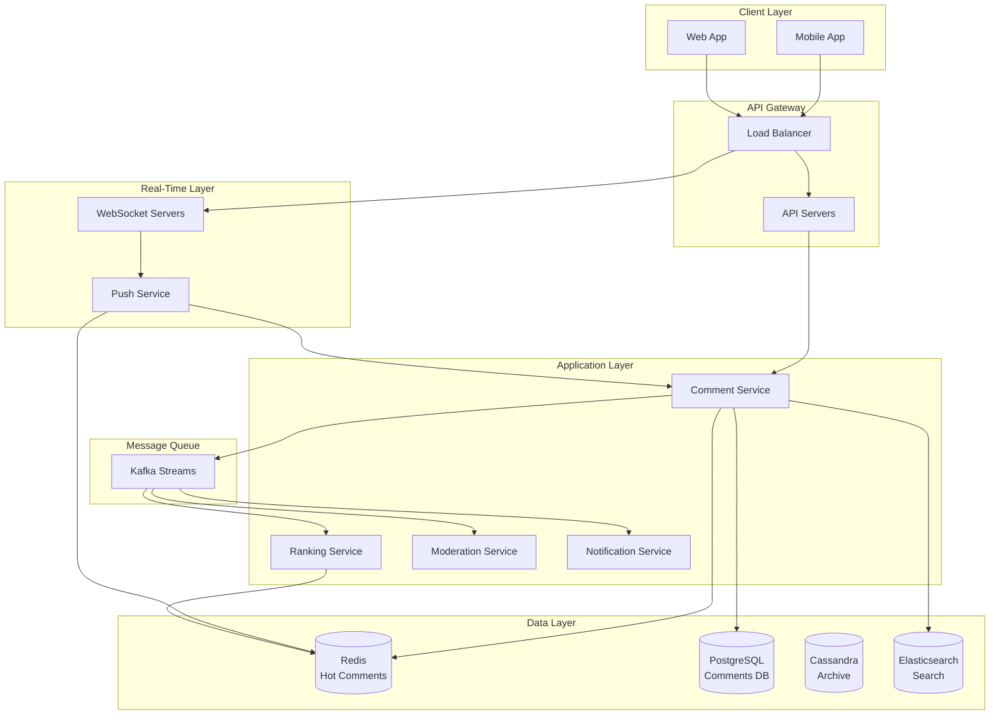
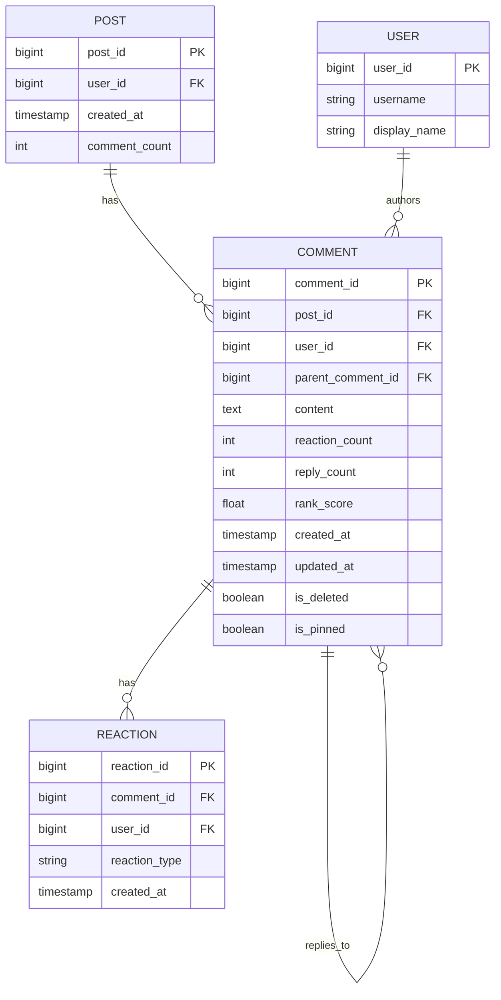
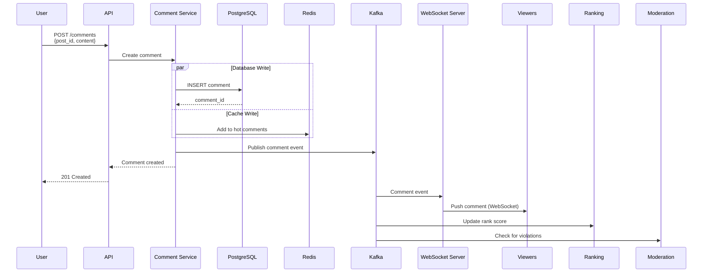
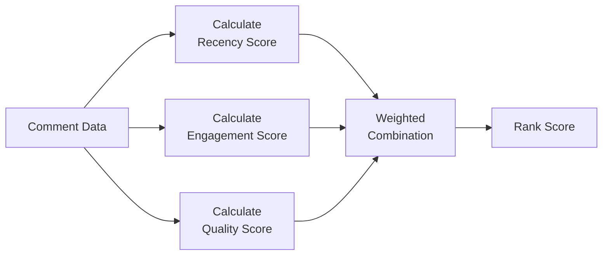

# Live Comments System for a Social App

[← Back to Topics](../topics.md#live-comments-system-for-a-social-app)

## Problem Statement

Design a live commenting system for a social media platform that supports real-time comment delivery, handles 100K concurrent users per post, provides comment ranking, and ensures low latency (<200ms).

---

## Requirements

### Functional Requirements
1. **Post Comments**: Users can post text comments (up to 500 chars)
2. **Real-Time Delivery**: Comments appear instantly for all viewers
3. **Comment Threading**: Support nested replies (2 levels)
4. **Reactions**: Like/upvote comments
5. **Comment Ranking**: Sort by time, popularity, or relevance
6. **Moderation**: Filter spam, profanity, hate speech
7. **Edit/Delete**: Authors can edit/delete within 5 minutes
8. **Pagination**: Load comments in batches
9. **User Mentions**: @username notifications
10. **Pinned Comments**: Creators can pin top comments

### Non-Functional Requirements
1. **Throughput**: 10K comments/second across platform
2. **Latency**: <200ms for comment delivery
3. **Concurrent Users**: 100K users per popular post
4. **Read-Heavy**: 1000:1 read-to-write ratio
5. **Availability**: 99.9% uptime
6. **Scalability**: Handle viral posts (1M+ comments)

### Scale Estimates
- **Daily active users**: 500M
- **Posts with comments**: 100M/day
- **Comments per post**: Avg 50, max 1M
- **Total comments/day**: 5 billion
- **Comments/second**: 5B / 86400 ≈ **58K/second**
- **Storage**: 5B × 200 bytes = **1 TB/day**

---

## High-Level Architecture



---

## Detailed Design

### 1. Comment Data Model



#### Database Schema

```sql
-- Comments table (PostgreSQL)
CREATE TABLE comments (
    comment_id BIGSERIAL PRIMARY KEY,
    post_id BIGINT NOT NULL,
    user_id BIGINT NOT NULL,
    parent_comment_id BIGINT,  -- NULL for top-level comments
    content TEXT NOT NULL,
    reaction_count INT DEFAULT 0,
    reply_count INT DEFAULT 0,
    rank_score FLOAT DEFAULT 0.0,
    created_at TIMESTAMP DEFAULT NOW(),
    updated_at TIMESTAMP DEFAULT NOW(),
    is_deleted BOOLEAN DEFAULT FALSE,
    is_pinned BOOLEAN DEFAULT FALSE,
    
    FOREIGN KEY (parent_comment_id) REFERENCES comments(comment_id),
    INDEX idx_post_created (post_id, created_at DESC),
    INDEX idx_post_rank (post_id, rank_score DESC),
    INDEX idx_parent (parent_comment_id)
);

-- Reactions table
CREATE TABLE comment_reactions (
    reaction_id BIGSERIAL PRIMARY KEY,
    comment_id BIGINT NOT NULL,
    user_id BIGINT NOT NULL,
    reaction_type VARCHAR(20) NOT NULL,  -- 'like', 'love', 'laugh', etc.
    created_at TIMESTAMP DEFAULT NOW(),
    
    UNIQUE (comment_id, user_id, reaction_type),
    FOREIGN KEY (comment_id) REFERENCES comments(comment_id),
    INDEX idx_comment_reactions (comment_id)
);

-- Sharding strategy: Shard by post_id
-- post_id % num_shards = shard_id
```

---

### 2. Real-Time Comment Flow



---

### 3. Comment Service Implementation

```python
from dataclasses import dataclass
from typing import List, Optional
import time
import hashlib
from datetime import datetime

@dataclass
class Comment:
    comment_id: Optional[int] = None
    post_id: int = 0
    user_id: int = 0
    parent_comment_id: Optional[int] = None
    content: str = ""
    reaction_count: int = 0
    reply_count: int = 0
    rank_score: float = 0.0
    created_at: Optional[datetime] = None
    is_deleted: bool = False
    is_pinned: bool = False

class CommentService:
    """
    Core comment service
    """
    
    def __init__(self, db_client, redis_client, kafka_producer):
        self.db = db_client
        self.redis = redis_client
        self.kafka = kafka_producer
        self.max_content_length = 500
    
    def create_comment(
        self,
        post_id: int,
        user_id: int,
        content: str,
        parent_comment_id: Optional[int] = None
    ) -> Comment:
        """
        Create a new comment
        """
        
        # Validate content
        if not content or len(content) > self.max_content_length:
            raise ValueError("Invalid content length")
        
        # Check rate limit
        if not self._check_rate_limit(user_id):
            raise ValueError("Rate limit exceeded")
        
        # Create comment object
        comment = Comment(
            post_id=post_id,
            user_id=user_id,
            parent_comment_id=parent_comment_id,
            content=content,
            created_at=datetime.utcnow()
        )
        
        # 1. Insert into database
        comment_id = self._insert_to_db(comment)
        comment.comment_id = comment_id
        
        # 2. Add to Redis cache (hot comments)
        self._cache_comment(comment)
        
        # 3. Update counters
        self._increment_counters(post_id, parent_comment_id)
        
        # 4. Publish to Kafka for async processing
        self._publish_comment_event(comment)
        
        return comment
    
    def _insert_to_db(self, comment: Comment) -> int:
        """Insert comment to PostgreSQL"""
        
        query = """
            INSERT INTO comments 
            (post_id, user_id, parent_comment_id, content, created_at)
            VALUES (%s, %s, %s, %s, %s)
            RETURNING comment_id
        """
        
        result = self.db.execute(
            query,
            (comment.post_id, comment.user_id, comment.parent_comment_id,
             comment.content, comment.created_at)
        )
        
        return result[0]['comment_id']
    
    def _cache_comment(self, comment: Comment):
        """Cache comment in Redis"""
        
        # Add to sorted set (sorted by timestamp)
        cache_key = f"post:{comment.post_id}:comments"
        
        self.redis.zadd(
            cache_key,
            {comment.comment_id: comment.created_at.timestamp()}
        )
        
        # Store comment data
        comment_key = f"comment:{comment.comment_id}"
        self.redis.hset(comment_key, mapping={
            'post_id': comment.post_id,
            'user_id': comment.user_id,
            'parent_comment_id': comment.parent_comment_id or '',
            'content': comment.content,
            'created_at': comment.created_at.isoformat(),
            'reaction_count': 0,
            'reply_count': 0
        })
        
        # TTL: 24 hours for hot comments
        self.redis.expire(comment_key, 86400)
    
    def _increment_counters(self, post_id: int, parent_comment_id: Optional[int]):
        """Update comment counts"""
        
        # Increment post comment count
        self.redis.hincrby(f"post:{post_id}", 'comment_count', 1)
        
        # Increment parent comment reply count
        if parent_comment_id:
            self.redis.hincrby(
                f"comment:{parent_comment_id}",
                'reply_count',
                1
            )
    
    def _publish_comment_event(self, comment: Comment):
        """Publish to Kafka for real-time delivery"""
        
        event = {
            'event_type': 'comment_created',
            'comment_id': comment.comment_id,
            'post_id': comment.post_id,
            'user_id': comment.user_id,
            'parent_comment_id': comment.parent_comment_id,
            'content': comment.content,
            'created_at': comment.created_at.isoformat()
        }
        
        self.kafka.produce(
            topic='comments',
            key=str(comment.post_id),
            value=event
        )
    
    def _check_rate_limit(self, user_id: int) -> bool:
        """Rate limit: 10 comments per minute"""
        
        key = f"rate_limit:user:{user_id}:comments"
        count = self.redis.incr(key)
        
        if count == 1:
            self.redis.expire(key, 60)  # 1 minute TTL
        
        return count <= 10
    
    def get_comments(
        self,
        post_id: int,
        sort_by: str = 'time',  # 'time', 'rank', 'reactions'
        limit: int = 50,
        offset: int = 0
    ) -> List[Comment]:
        """
        Fetch comments for a post
        """
        
        # Try Redis cache first (for recent comments)
        if offset == 0 and sort_by == 'time':
            cached_comments = self._get_from_cache(post_id, limit)
            if cached_comments:
                return cached_comments
        
        # Fetch from database
        return self._get_from_db(post_id, sort_by, limit, offset)
    
    def _get_from_cache(self, post_id: int, limit: int) -> List[Comment]:
        """Get recent comments from Redis"""
        
        cache_key = f"post:{post_id}:comments"
        
        # Get top N comment IDs (sorted by timestamp, newest first)
        comment_ids = self.redis.zrevrange(cache_key, 0, limit - 1)
        
        if not comment_ids:
            return []
        
        # Fetch comment data
        comments = []
        for comment_id in comment_ids:
            comment_key = f"comment:{comment_id}"
            data = self.redis.hgetall(comment_key)
            
            if data:
                comments.append(Comment(
                    comment_id=int(comment_id),
                    post_id=int(data[b'post_id']),
                    user_id=int(data[b'user_id']),
                    content=data[b'content'].decode('utf-8'),
                    reaction_count=int(data[b'reaction_count']),
                    reply_count=int(data[b'reply_count']),
                    created_at=datetime.fromisoformat(data[b'created_at'].decode('utf-8'))
                ))
        
        return comments
    
    def _get_from_db(
        self,
        post_id: int,
        sort_by: str,
        limit: int,
        offset: int
    ) -> List[Comment]:
        """Get comments from PostgreSQL"""
        
        # Build query based on sort order
        if sort_by == 'time':
            order_clause = "ORDER BY created_at DESC"
        elif sort_by == 'rank':
            order_clause = "ORDER BY rank_score DESC, created_at DESC"
        elif sort_by == 'reactions':
            order_clause = "ORDER BY reaction_count DESC, created_at DESC"
        else:
            order_clause = "ORDER BY created_at DESC"
        
        query = f"""
            SELECT * FROM comments
            WHERE post_id = %s 
              AND parent_comment_id IS NULL
              AND is_deleted = FALSE
            {order_clause}
            LIMIT %s OFFSET %s
        """
        
        results = self.db.execute(query, (post_id, limit, offset))
        
        comments = []
        for row in results:
            comments.append(Comment(**row))
        
        return comments
    
    def add_reaction(self, comment_id: int, user_id: int, reaction_type: str):
        """Add reaction to comment"""
        
        # Insert reaction
        query = """
            INSERT INTO comment_reactions (comment_id, user_id, reaction_type)
            VALUES (%s, %s, %s)
            ON CONFLICT DO NOTHING
        """
        
        self.db.execute(query, (comment_id, user_id, reaction_type))
        
        # Increment reaction count
        self.db.execute("""
            UPDATE comments 
            SET reaction_count = reaction_count + 1
            WHERE comment_id = %s
        """, (comment_id,))
        
        # Update cache
        self.redis.hincrby(f"comment:{comment_id}", 'reaction_count', 1)
        
        # Publish event for ranking update
        self._publish_reaction_event(comment_id, user_id, reaction_type)
```

---

### 4. Comment Ranking Algorithm



#### Ranking Service

```python
import math
from datetime import datetime

class CommentRankingService:
    """
    Rank comments using multiple signals
    Similar to Reddit's "Best" algorithm
    """
    
    def calculate_rank_score(
        self,
        comment: Comment,
        post_created_at: datetime
    ) -> float:
        """
        Calculate rank score combining:
        - Recency (time since post)
        - Engagement (reactions, replies)
        - Quality (user reputation, length)
        """
        
        # 1. Recency score (decay over time)
        recency_score = self._calculate_recency(
            comment.created_at,
            post_created_at
        )
        
        # 2. Engagement score
        engagement_score = self._calculate_engagement(
            comment.reaction_count,
            comment.reply_count
        )
        
        # 3. Quality score
        quality_score = self._calculate_quality(comment)
        
        # Weighted combination
        rank_score = (
            0.4 * recency_score +
            0.4 * engagement_score +
            0.2 * quality_score
        )
        
        return rank_score
    
    def _calculate_recency(
        self,
        comment_time: datetime,
        post_time: datetime
    ) -> float:
        """
        Recency score with exponential decay
        
        Comments within first hour get boost
        """
        
        age_seconds = (comment_time - post_time).total_seconds()
        age_hours = age_seconds / 3600.0
        
        # Exponential decay: e^(-age/12)
        # Half-life of 12 hours
        decay_factor = math.exp(-age_hours / 12.0)
        
        return decay_factor
    
    def _calculate_engagement(
        self,
        reaction_count: int,
        reply_count: int
    ) -> float:
        """
        Engagement score based on reactions and replies
        """
        
        # Wilson score for reactions (handles small sample sizes)
        wilson_score = self._wilson_score(reaction_count, reaction_count)
        
        # Reply bonus
        reply_bonus = math.log(reply_count + 1) / 10.0
        
        return min(wilson_score + reply_bonus, 1.0)
    
    def _wilson_score(self, positive: int, total: int) -> float:
        """
        Wilson score confidence interval
        
        More statistically robust than simple ratio
        """
        
        if total == 0:
            return 0.0
        
        p = positive / total
        z = 1.96  # 95% confidence
        
        denominator = 1 + z * z / total
        numerator = (
            p + z * z / (2 * total) -
            z * math.sqrt((p * (1 - p) + z * z / (4 * total)) / total)
        )
        
        return numerator / denominator
    
    def _calculate_quality(self, comment: Comment) -> float:
        """
        Quality heuristics:
        - Comment length (not too short, not too long)
        - User reputation
        """
        
        length_score = self._length_score(len(comment.content))
        
        # In production, factor in user reputation
        # user_reputation_score = get_user_reputation(comment.user_id)
        
        return length_score
    
    def _length_score(self, length: int) -> float:
        """
        Prefer moderate length comments
        """
        
        if length < 10:
            return 0.3  # Too short
        elif length < 100:
            return 1.0  # Good length
        elif length < 300:
            return 0.8  # Still good
        else:
            return 0.5  # Too long
```

---

### 5. WebSocket Broadcasting

```javascript
// WebSocket server (Node.js)
const WebSocket = require('ws');
const kafka = require('kafka-node');

class CommentBroadcaster {
    constructor() {
        this.wss = new WebSocket.Server({ port: 8080 });
        this.connections = new Map();  // post_id -> Set<WebSocket>
        
        this.initKafkaConsumer();
        this.initWebSocketServer();
    }
    
    initWebSocketServer() {
        this.wss.on('connection', (ws, req) => {
            // Parse post_id from URL: /ws/comments/:post_id
            const postId = req.url.split('/')[3];
            
            // Register connection
            if (!this.connections.has(postId)) {
                this.connections.set(postId, new Set());
            }
            this.connections.get(postId).add(ws);
            
            console.log(`Client connected to post ${postId}`);
            
            // Send initial batch of comments
            this.sendInitialComments(ws, postId);
            
            // Handle disconnection
            ws.on('close', () => {
                this.connections.get(postId).delete(ws);
                console.log(`Client disconnected from post ${postId}`);
            });
            
            // Heartbeat
            ws.on('pong', () => {
                ws.isAlive = true;
            });
        });
        
        // Heartbeat interval
        setInterval(() => {
            this.wss.clients.forEach((ws) => {
                if (ws.isAlive === false) {
                    return ws.terminate();
                }
                
                ws.isAlive = false;
                ws.ping();
            });
        }, 30000);  // 30 seconds
    }
    
    initKafkaConsumer() {
        const consumer = new kafka.Consumer(
            new kafka.KafkaClient({ kafkaHost: 'localhost:9092' }),
            [{ topic: 'comments', partition: 0 }],
            { autoCommit: true }
        );
        
        consumer.on('message', (message) => {
            const event = JSON.parse(message.value);
            
            if (event.event_type === 'comment_created') {
                this.broadcastComment(event);
            }
        });
    }
    
    broadcastComment(commentEvent) {
        const postId = commentEvent.post_id.toString();
        const connections = this.connections.get(postId);
        
        if (!connections || connections.size === 0) {
            return;
        }
        
        const message = JSON.stringify({
            type: 'new_comment',
            comment: {
                comment_id: commentEvent.comment_id,
                user_id: commentEvent.user_id,
                content: commentEvent.content,
                created_at: commentEvent.created_at,
                reaction_count: 0,
                reply_count: 0
            }
        });
        
        // Broadcast to all connected clients
        connections.forEach((ws) => {
            if (ws.readyState === WebSocket.OPEN) {
                ws.send(message);
            }
        });
        
        console.log(`Broadcasted comment to ${connections.size} clients`);
    }
    
    async sendInitialComments(ws, postId) {
        // Fetch recent comments from API
        const comments = await fetchComments(postId, limit=20);
        
        ws.send(JSON.stringify({
            type: 'initial_comments',
            comments: comments
        }));
    }
}

// Start server
new CommentBroadcaster();
```

---

### 6. Content Moderation

```python
import re
from typing import Tuple

class ContentModerationService:
    """
    Filter spam, profanity, and inappropriate content
    """
    
    def __init__(self):
        # Load profanity filter
        self.profanity_list = self._load_profanity_list()
        
        # Spam patterns
        self.spam_patterns = [
            r'(http|https)://[^\s]+',  # URLs
            r'(.)\1{4,}',  # Repeated characters
            r'[A-Z]{10,}',  # All caps spam
        ]
    
    def check_comment(self, content: str) -> Tuple[bool, str]:
        """
        Check if comment violates policies
        
        Returns: (is_valid, reason)
        """
        
        # Check profanity
        if self._contains_profanity(content):
            return False, "profanity"
        
        # Check spam patterns
        if self._is_spam(content):
            return False, "spam"
        
        # In production, use ML model for hate speech detection
        # if self._is_hate_speech(content):
        #     return False, "hate_speech"
        
        return True, ""
    
    def _contains_profanity(self, content: str) -> bool:
        """Check for profanity"""
        content_lower = content.lower()
        
        for word in self.profanity_list:
            if word in content_lower:
                return True
        
        return False
    
    def _is_spam(self, content: str) -> bool:
        """Check for spam patterns"""
        
        for pattern in self.spam_patterns:
            if re.search(pattern, content):
                return True
        
        return False
    
    def _load_profanity_list(self) -> list:
        """Load profanity word list"""
        # In production, load from file/database
        return ['badword1', 'badword2']
```

---

## Technology Stack

| Component | Technology | Justification |
|-----------|------------|---------------|
| **Database** | PostgreSQL (sharded) | ACID, complex queries |
| **Cache** | Redis | Fast reads, sorted sets |
| **Archive** | Cassandra | High-write throughput |
| **Search** | Elasticsearch | Full-text search |
| **Streaming** | Kafka | Event-driven architecture |
| **WebSocket** | Node.js + ws | Scalable real-time |

---

## Trade-offs

### 1. WebSocket vs Server-Sent Events
- **WebSocket**: Bidirectional, more overhead
- **SSE**: Unidirectional (sufficient for comments), simpler

### 2. Ranking Algorithm
- **Simple (time-based)**: Fast, predictable
- **Complex (ML-based)**: Better engagement, computational cost

### 3. Storage
- **Hot comments in Redis**: Fast, limited size
- **All comments in DB**: Durable, slower

---

## Summary

This design provides:
- ✅ **10K comments/second** throughput
- ✅ **<200ms delivery** latency
- ✅ **100K concurrent users** per post
- ✅ **Real-time broadcasting** via WebSocket
- ✅ **Smart ranking** with engagement signals
- ✅ **Content moderation** for safety

**Key Features:**
1. WebSocket for real-time delivery
2. Redis for hot comment caching
3. PostgreSQL sharding by post_id
4. Kafka for event streaming
5. Wilson score for ranking
6. Content moderation pipeline

[← Back to Topics](../topics.md#live-comments-system-for-a-social-app)
