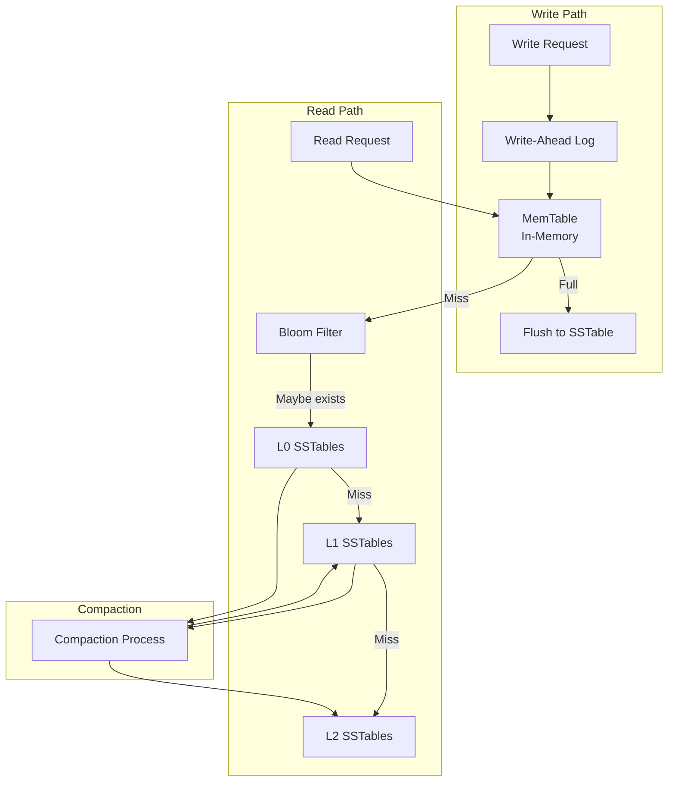

# Key-Value Store at Scale (DynamoDB/Redis)

[← Back to Topics](../topics.md#key-value-store-at-scale-like-dynamodb-redis)

## Problem Statement

Design a distributed key-value store providing single-digit millisecond latency at any scale with configurable consistency levels. Support 10M QPS with automatic sharding, replication, and high availability.

---

## Requirements

### Functional Requirements
1. **Basic Operations**: GET, PUT, DELETE
2. **Atomic Operations**: Compare-and-swap, increment/decrement
3. **TTL Support**: Automatic key expiration
4. **Range Queries**: Scan keys by prefix
5. **Batch Operations**: Multi-get, multi-put
6. **Configurable Consistency**: Strong, eventual, or session consistency
7. **Secondary Indexes**: Query by attributes
8. **Transactions**: ACID transactions across keys

### Non-Functional Requirements
1. **Throughput**: 10M operations/second
2. **Latency**: <10ms p99 for reads, <20ms p99 for writes
3. **Availability**: 99.99% uptime
4. **Durability**: No data loss (configurable replication)
5. **Scalability**: Horizontal scaling to petabytes
6. **Partition Tolerance**: Handle network partitions gracefully

### Scale Estimates
- **Total keys**: 1 trillion
- **Avg key size**: 100 bytes
- **Avg value size**: 1KB
- **Total storage**: 1T × 1.1KB ≈ **1.1 PB**
- **QPS**: 10M operations/second
- **Read:Write ratio**: 80:20

---

## High-Level Architecture


---

## Detailed Design

### 1. Consistent Hashing


#### Consistent Hashing Implementation

```python
import hashlib
import bisect
from typing import List, Optional, Dict

class ConsistentHash:
    """
    Consistent hashing with virtual nodes
    """
    
    def __init__(self, num_virtual_nodes: int = 150):
        self.num_virtual_nodes = num_virtual_nodes
        self.ring: List[int] = []  # Sorted list of hash values
        self.hash_to_node: Dict[int, str] = {}  # Hash -> node_id
        self.nodes: set = set()
    
    def _hash(self, key: str) -> int:
        """Hash function: MD5 for uniform distribution"""
        return int(hashlib.md5(key.encode()).hexdigest(), 16)
    
    def add_node(self, node_id: str):
        """Add node with virtual nodes"""
        
        if node_id in self.nodes:
            return
        
        self.nodes.add(node_id)
        
        # Add virtual nodes
        for i in range(self.num_virtual_nodes):
            virtual_key = f"{node_id}:{i}"
            hash_value = self._hash(virtual_key)
            
            # Insert into sorted ring
            bisect.insort(self.ring, hash_value)
            self.hash_to_node[hash_value] = node_id
    
    def remove_node(self, node_id: str):
        """Remove node and its virtual nodes"""
        
        if node_id not in self.nodes:
            return
        
        self.nodes.remove(node_id)
        
        # Remove virtual nodes
        for i in range(self.num_virtual_nodes):
            virtual_key = f"{node_id}:{i}"
            hash_value = self._hash(virtual_key)
            
            # Remove from ring
            idx = bisect.bisect_left(self.ring, hash_value)
            if idx < len(self.ring) and self.ring[idx] == hash_value:
                self.ring.pop(idx)
            
            self.hash_to_node.pop(hash_value, None)
    
    def get_node(self, key: str) -> Optional[str]:
        """Get primary node for key"""
        
        if not self.ring:
            return None
        
        hash_value = self._hash(key)
        
        # Find first node >= hash_value (clockwise)
        idx = bisect.bisect_right(self.ring, hash_value)
        
        # Wrap around if needed
        if idx == len(self.ring):
            idx = 0
        
        ring_hash = self.ring[idx]
        return self.hash_to_node[ring_hash]
    
    def get_replicas(
        self,
        key: str,
        replication_factor: int = 3
    ) -> List[str]:
        """Get N replica nodes for key"""
        
        if not self.ring:
            return []
        
        hash_value = self._hash(key)
        replicas = []
        seen_nodes = set()
        
        # Start from key position, go clockwise
        idx = bisect.bisect_right(self.ring, hash_value)
        
        # Find N unique physical nodes
        for _ in range(len(self.ring)):
            if idx >= len(self.ring):
                idx = 0
            
            ring_hash = self.ring[idx]
            node_id = self.hash_to_node[ring_hash]
            
            if node_id not in seen_nodes:
                replicas.append(node_id)
                seen_nodes.add(node_id)
                
                if len(replicas) == replication_factor:
                    break
            
            idx += 1
        
        return replicas


# Usage
ch = ConsistentHash(num_virtual_nodes=150)

# Add nodes
ch.add_node("node1")
ch.add_node("node2")
ch.add_node("node3")

# Get primary node for key
node = ch.get_node("user:12345")
print(f"Primary node for 'user:12345': {node}")

# Get replicas
replicas = ch.get_replicas("user:12345", replication_factor=3)
print(f"Replicas: {replicas}")
```

---

### 2. Storage Engine: LSM Tree



#### LSM Tree Implementation

```go
package storage

import (
    "encoding/binary"
    "fmt"
    "os"
    "sync"
    "time"
)

// MemTable: In-memory sorted structure
type MemTable struct {
    data      map[string][]byte
    mu        sync.RWMutex
    maxSize   int
    currentSize int
}

func NewMemTable(maxSize int) *MemTable {
    return &MemTable{
        data:    make(map[string][]byte),
        maxSize: maxSize,
    }
}

func (m *MemTable) Put(key string, value []byte) error {
    m.mu.Lock()
    defer m.mu.Unlock()
    
    m.data[key] = value
    m.currentSize += len(key) + len(value)
    
    return nil
}

func (m *MemTable) Get(key string) ([]byte, bool) {
    m.mu.RLock()
    defer m.mu.RUnlock()
    
    value, exists := m.data[key]
    return value, exists
}

func (m *MemTable) IsFull() bool {
    m.mu.RLock()
    defer m.mu.RUnlock()
    
    return m.currentSize >= m.maxSize
}

func (m *MemTable) Clear() {
    m.mu.Lock()
    defer m.mu.Unlock()
    
    m.data = make(map[string][]byte)
    m.currentSize = 0
}

// SSTable: Sorted String Table on disk
type SSTable struct {
    filePath string
    index    map[string]int64  // Key -> file offset
}

func NewSSTable(filePath string) *SSTable {
    return &SSTable{
        filePath: filePath,
        index:    make(map[string]int64),
    }
}

func (s *SSTable) Write(memtable *MemTable) error {
    file, err := os.Create(s.filePath)
    if err != nil {
        return err
    }
    defer file.Close()
    
    offset := int64(0)
    
    // Write entries in sorted order
    for key, value := range memtable.data {
        // Record offset in index
        s.index[key] = offset
        
        // Write: [key_len][key][value_len][value]
        keyLen := uint32(len(key))
        valueLen := uint32(len(value))
        
        binary.Write(file, binary.LittleEndian, keyLen)
        file.Write([]byte(key))
        binary.Write(file, binary.LittleEndian, valueLen)
        file.Write(value)
        
        offset += int64(4 + len(key) + 4 + len(value))
    }
    
    return nil
}

func (s *SSTable) Get(key string) ([]byte, error) {
    // Check index
    offset, exists := s.index[key]
    if !exists {
        return nil, fmt.Errorf("key not found")
    }
    
    // Read from file
    file, err := os.Open(s.filePath)
    if err != nil {
        return nil, err
    }
    defer file.Close()
    
    file.Seek(offset, 0)
    
    // Read key_len
    var keyLen uint32
    binary.Read(file, binary.LittleEndian, &keyLen)
    
    // Skip key
    file.Seek(int64(keyLen), 1)
    
    // Read value_len
    var valueLen uint32
    binary.Read(file, binary.LittleEndian, &valueLen)
    
    // Read value
    value := make([]byte, valueLen)
    file.Read(value)
    
    return value, nil
}

// LSMTree: Complete LSM tree
type LSMTree struct {
    memtable      *MemTable
    immutableMem  *MemTable
    sstables      []*SSTable
    wal           *WriteAheadLog
    mu            sync.RWMutex
    flushTicker   *time.Ticker
}

func NewLSMTree(walPath string) *LSMTree {
    tree := &LSMTree{
        memtable:    NewMemTable(4 * 1024 * 1024),  // 4MB
        sstables:    make([]*SSTable, 0),
        wal:         NewWriteAheadLog(walPath),
        flushTicker: time.NewTicker(10 * time.Second),
    }
    
    // Background flush
    go tree.backgroundFlush()
    
    return tree
}

func (l *LSMTree) Put(key string, value []byte) error {
    l.mu.Lock()
    defer l.mu.Unlock()
    
    // Write to WAL first
    err := l.wal.Append(key, value)
    if err != nil {
        return err
    }
    
    // Write to MemTable
    err = l.memtable.Put(key, value)
    if err != nil {
        return err
    }
    
    // Check if MemTable is full
    if l.memtable.IsFull() {
        l.rotateMemTable()
    }
    
    return nil
}

func (l *LSMTree) Get(key string) ([]byte, error) {
    l.mu.RLock()
    defer l.mu.RUnlock()
    
    // 1. Check MemTable
    if value, exists := l.memtable.Get(key); exists {
        return value, nil
    }
    
    // 2. Check immutable MemTable
    if l.immutableMem != nil {
        if value, exists := l.immutableMem.Get(key); exists {
            return value, nil
        }
    }
    
    // 3. Check SSTables (newest to oldest)
    for i := len(l.sstables) - 1; i >= 0; i-- {
        value, err := l.sstables[i].Get(key)
        if err == nil {
            return value, nil
        }
    }
    
    return nil, fmt.Errorf("key not found")
}

func (l *LSMTree) rotateMemTable() {
    // Move current MemTable to immutable
    l.immutableMem = l.memtable
    
    // Create new MemTable
    l.memtable = NewMemTable(4 * 1024 * 1024)
    
    // Trigger async flush
    go l.flushImmutableMemTable()
}

func (l *LSMTree) flushImmutableMemTable() {
    if l.immutableMem == nil {
        return
    }
    
    // Create new SSTable
    filePath := fmt.Sprintf("data/sstable_%d.sst", time.Now().UnixNano())
    sstable := NewSSTable(filePath)
    
    // Write immutable MemTable to SSTable
    err := sstable.Write(l.immutableMem)
    if err != nil {
        fmt.Printf("Error flushing SSTable: %v\n", err)
        return
    }
    
    l.mu.Lock()
    l.sstables = append(l.sstables, sstable)
    l.immutableMem = nil
    l.mu.Unlock()
}

func (l *LSMTree) backgroundFlush() {
    for range l.flushTicker.C {
        if l.immutableMem != nil {
            l.flushImmutableMemTable()
        }
    }
}

// WriteAheadLog for durability
type WriteAheadLog struct {
    file *os.File
    mu   sync.Mutex
}

func NewWriteAheadLog(path string) *WriteAheadLog {
    file, _ := os.OpenFile(path, os.O_APPEND|os.O_CREATE|os.O_WRONLY, 0644)
    return &WriteAheadLog{file: file}
}

func (w *WriteAheadLog) Append(key string, value []byte) error {
    w.mu.Lock()
    defer w.mu.Unlock()
    
    // Format: [timestamp][key_len][key][value_len][value]
    timestamp := time.Now().UnixNano()
    
    binary.Write(w.file, binary.LittleEndian, timestamp)
    binary.Write(w.file, binary.LittleEndian, uint32(len(key)))
    w.file.Write([]byte(key))
    binary.Write(w.file, binary.LittleEndian, uint32(len(value)))
    w.file.Write(value)
    
    // Sync to disk
    w.file.Sync()
    
    return nil
}
```

---

### 3. Replication: Quorum-Based


#### Quorum Implementation

```python
from dataclasses import dataclass
from typing import List, Optional
import asyncio
import time

@dataclass
class ReplicationConfig:
    replication_factor: int = 3  # N: Total replicas
    write_quorum: int = 2         # W: Write acknowledgments needed
    read_quorum: int = 2          # R: Read responses needed
    
    def __post_init__(self):
        # Ensure W + R > N for consistency
        assert self.write_quorum + self.read_quorum > self.replication_factor

class QuorumCoordinator:
    """
    Coordinate reads/writes across replicas with quorum
    """
    
    def __init__(self, config: ReplicationConfig, consistent_hash: ConsistentHash):
        self.config = config
        self.consistent_hash = consistent_hash
    
    async def put(self, key: str, value: bytes) -> bool:
        """
        Write with quorum
        
        Returns True if write quorum achieved
        """
        
        # Get replica nodes
        replicas = self.consistent_hash.get_replicas(
            key,
            self.config.replication_factor
        )
        
        if not replicas:
            return False
        
        # Send write requests to all replicas
        tasks = [
            self._write_to_node(node_id, key, value)
            for node_id in replicas
        ]
        
        # Wait for write quorum
        results = await asyncio.gather(*tasks, return_exceptions=True)
        
        # Count successful writes
        successful_writes = sum(
            1 for result in results
            if isinstance(result, bool) and result
        )
        
        # Check if write quorum achieved
        return successful_writes >= self.config.write_quorum
    
    async def get(self, key: str) -> Optional[bytes]:
        """
        Read with quorum
        
        Returns value if read quorum achieved
        """
        
        # Get replica nodes
        replicas = self.consistent_hash.get_replicas(
            key,
            self.config.replication_factor
        )
        
        if not replicas:
            return None
        
        # Send read requests to all replicas
        tasks = [
            self._read_from_node(node_id, key)
            for node_id in replicas
        ]
        
        # Wait for read quorum
        results = await asyncio.gather(*tasks, return_exceptions=True)
        
        # Collect successful reads
        successful_reads = [
            result for result in results
            if isinstance(result, tuple) and result[0] is not None
        ]
        
        if len(successful_reads) < self.config.read_quorum:
            return None
        
        # Resolve conflicts using timestamp (last-write-wins)
        latest_value = max(successful_reads, key=lambda x: x[1])
        
        # Trigger read repair if inconsistencies detected
        if len(set(r[0] for r in successful_reads)) > 1:
            asyncio.create_task(
                self._read_repair(key, latest_value[0], replicas)
            )
        
        return latest_value[0]
    
    async def _write_to_node(
        self,
        node_id: str,
        key: str,
        value: bytes
    ) -> bool:
        """Write to a single node"""
        
        try:
            # In production, this would be an RPC call
            # For now, simulate network delay
            await asyncio.sleep(0.01)
            
            # Simulate 99% success rate
            import random
            if random.random() < 0.99:
                print(f"Write to {node_id}: {key}")
                return True
            else:
                return False
        
        except Exception as e:
            print(f"Write error to {node_id}: {e}")
            return False
    
    async def _read_from_node(
        self,
        node_id: str,
        key: str
    ) -> tuple:
        """Read from a single node"""
        
        try:
            # Simulate network delay
            await asyncio.sleep(0.005)
            
            # Return (value, timestamp)
            # In production, fetch from actual node
            return (b"sample_value", time.time())
        
        except Exception as e:
            print(f"Read error from {node_id}: {e}")
            return (None, 0)
    
    async def _read_repair(
        self,
        key: str,
        correct_value: bytes,
        replicas: List[str]
    ):
        """
        Read repair: Update stale replicas
        """
        
        print(f"Read repair for key: {key}")
        
        tasks = [
            self._write_to_node(node_id, key, correct_value)
            for node_id in replicas
        ]
        
        await asyncio.gather(*tasks, return_exceptions=True)
```

---

### 4. Vector Clocks for Conflict Resolution

```python
from typing import Dict
from dataclasses import dataclass, field

@dataclass
class VectorClock:
    """
    Vector clock for tracking causality
    """
    
    clocks: Dict[str, int] = field(default_factory=dict)
    
    def increment(self, node_id: str):
        """Increment clock for this node"""
        self.clocks[node_id] = self.clocks.get(node_id, 0) + 1
    
    def update(self, other: 'VectorClock'):
        """Update with another vector clock (merge)"""
        for node_id, timestamp in other.clocks.items():
            self.clocks[node_id] = max(
                self.clocks.get(node_id, 0),
                timestamp
            )
    
    def happens_before(self, other: 'VectorClock') -> bool:
        """Check if this clock happens before other"""
        
        # All timestamps in self <= other
        # At least one timestamp in self < other
        
        all_less_or_equal = all(
            self.clocks.get(node_id, 0) <= other.clocks.get(node_id, 0)
            for node_id in set(self.clocks.keys()) | set(other.clocks.keys())
        )
        
        at_least_one_less = any(
            self.clocks.get(node_id, 0) < other.clocks.get(node_id, 0)
            for node_id in set(self.clocks.keys()) | set(other.clocks.keys())
        )
        
        return all_less_or_equal and at_least_one_less
    
    def concurrent(self, other: 'VectorClock') -> bool:
        """Check if clocks are concurrent (conflicting)"""
        return not self.happens_before(other) and not other.happens_before(self)


@dataclass
class VersionedValue:
    """Value with vector clock"""
    value: bytes
    vector_clock: VectorClock

class ConflictResolver:
    """Resolve conflicts when concurrent writes occur"""
    
    def resolve(self, versions: List[VersionedValue]) -> VersionedValue:
        """
        Resolve conflicts among multiple versions
        
        Strategy:
        1. If one version happens-before others, use that
        2. If concurrent, use last-write-wins or application-defined logic
        """
        
        if len(versions) == 1:
            return versions[0]
        
        # Find versions that don't happen-before any other
        candidates = []
        
        for v1 in versions:
            is_dominated = False
            
            for v2 in versions:
                if v1 != v2 and v1.vector_clock.happens_before(v2.vector_clock):
                    is_dominated = True
                    break
            
            if not is_dominated:
                candidates.append(v1)
        
        # If single candidate, return it
        if len(candidates) == 1:
            return candidates[0]
        
        # Multiple concurrent versions: application-defined resolution
        # For now, use last-write-wins (max timestamp)
        return max(
            candidates,
            key=lambda v: max(v.vector_clock.clocks.values())
        )
```

---

## Technology Stack

| Component | Technology | Justification |
|-----------|------------|---------------|
| **Storage Engine** | RocksDB (LSM) | High write throughput |
| **Coordination** | etcd/ZooKeeper | Cluster membership |
| **Serialization** | Protocol Buffers | Efficient encoding |
| **Network** | gRPC | High-performance RPC |
| **Monitoring** | Prometheus | Metrics collection |

---

## CAP Theorem Trade-offs


---

## Performance Characteristics

### Latency
```
Read (memory): 1-5ms p99
Read (disk): 10-20ms p99
Write (WAL + memtable): 5-10ms p99
Write (quorum): 15-30ms p99
```

### Throughput
```
Single node: 100K ops/sec
10-node cluster: 1M ops/sec
100-node cluster: 10M ops/sec
```

---

## Summary

This design provides:
- ✅ **10M operations/second** throughput
- ✅ **<10ms p99** read latency
- ✅ **Configurable consistency** (strong, eventual, quorum)
- ✅ **Horizontal scalability** with consistent hashing
- ✅ **High availability** with replication
- ✅ **Durability** with WAL and replication

**Key Features:**
1. Consistent hashing with virtual nodes
2. LSM tree storage engine (RocksDB)
3. Quorum-based replication (W + R > N)
4. Vector clocks for conflict resolution
5. Read repair for consistency
6. Write-ahead log for durability

[← Back to Topics](../topics.md#key-value-store-at-scale-like-dynamodb-redis)
