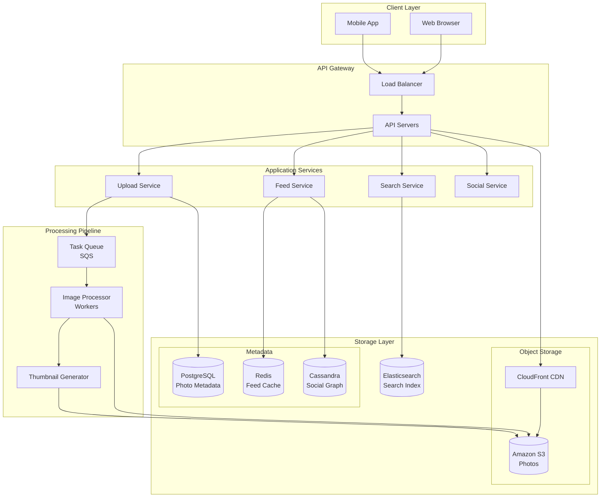
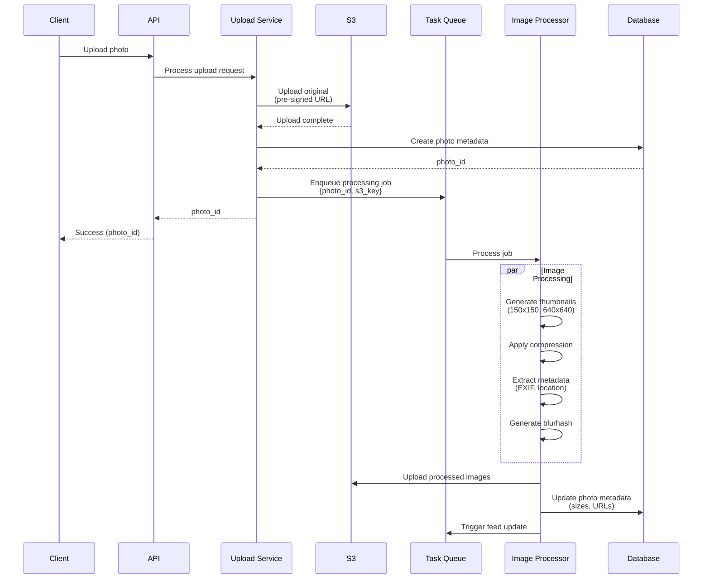
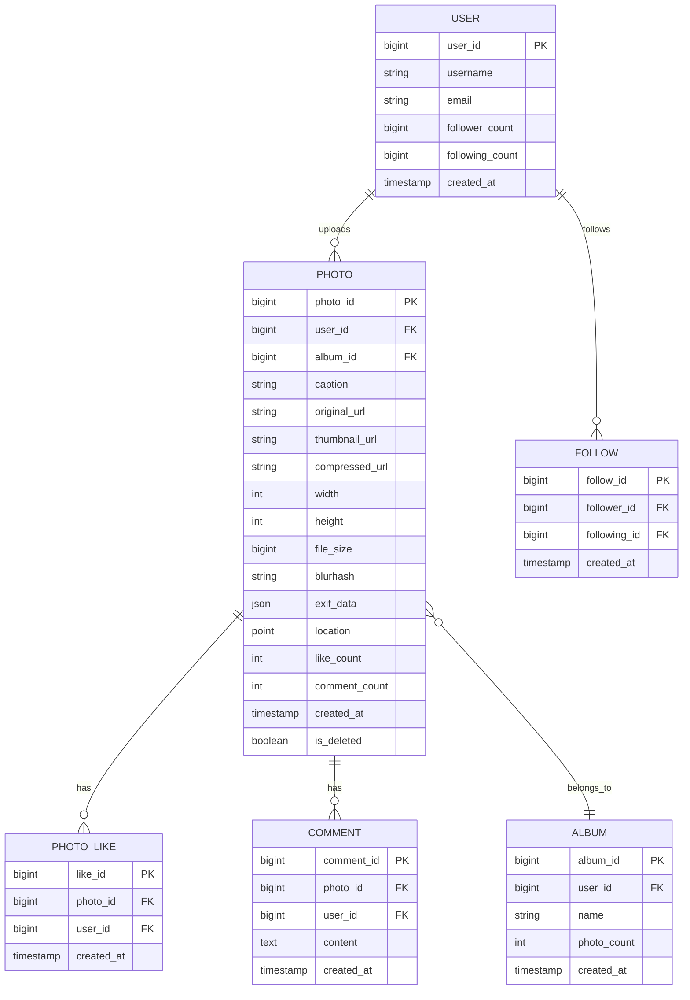
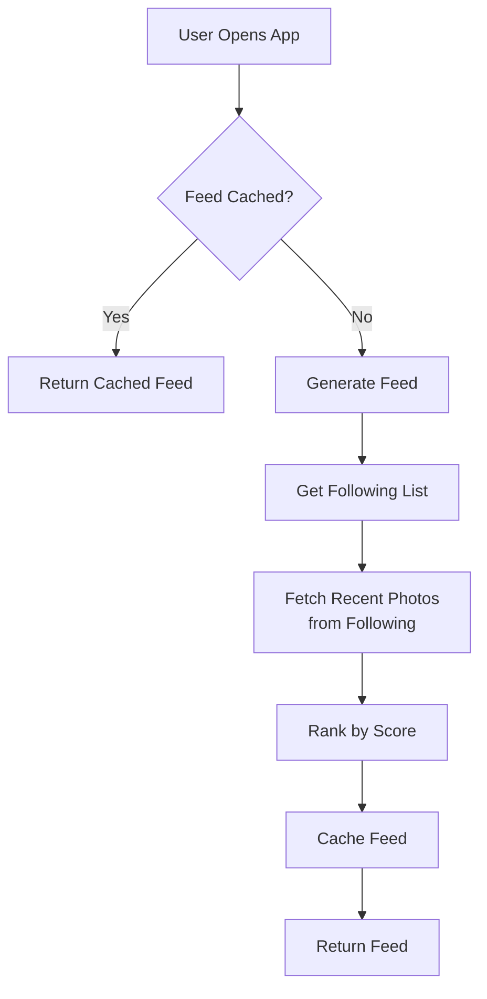

# Photo Sharing Platform (Instagram/Imgur)

[← Back to Topics](../topics.md#photo-sharing-platform-like-instagramimgur)

## Problem Statement

Design a photo sharing platform supporting 1B users, handling photo uploads, image processing, feed generation, and serving billions of images per day with low latency.

---

## Requirements

### Functional Requirements
1. **Photo Upload**: Support up to 50MB images
2. **Image Processing**: Resize, crop, filters, thumbnails
3. **Photo Feed**: Personalized timeline of photos
4. **Photo Discovery**: Explore, search, trending
5. **Likes & Comments**: Social interactions
6. **Photo Sharing**: Share via URL
7. **Albums/Collections**: Organize photos
8. **Privacy Controls**: Public, private, friends-only

### Non-Functional Requirements
1. **Scale**: 1B users, 500M daily active
2. **Upload Rate**: 50K photos/second
3. **View Rate**: 5M photos/second
4. **Storage**: 10 PB of photos
5. **Latency**: <200ms for photo load
6. **Availability**: 99.99% uptime
7. **CDN**: Global distribution

### Scale Estimates
- **Users**: 1B
- **Daily active users**: 500M
- **Photos per user**: Avg 500
- **Total photos**: 500 billion
- **Avg photo size**: 2MB (original), 200KB (compressed)
- **Storage**: 500B × 200KB ≈ **100 PB**
- **Daily uploads**: 100M photos
- **Daily views**: 50B photo views

---

## High-Level Architecture



---

## Detailed Design

### 1. Photo Upload Flow



---

### 2. Photo Metadata Model



---

### 3. Image Processing Pipeline

```python
from PIL import Image
import io
import hashlib
import blurhash
from typing import List, Tuple

class ImageProcessor:
    """
    Process uploaded images: resize, compress, generate thumbnails
    """
    
    def __init__(self):
        self.thumbnail_sizes = [
            (150, 150),   # Small thumbnail
            (640, 640),   # Medium
            (1080, 1080)  # Large
        ]
        self.quality = 85  # JPEG quality
    
    def process_image(
        self,
        image_bytes: bytes,
        photo_id: int
    ) -> dict:
        """
        Process image: generate multiple sizes
        
        Returns dict with URLs and metadata
        """
        
        # Load image
        image = Image.open(io.BytesIO(image_bytes))
        
        # Extract metadata
        metadata = self._extract_metadata(image)
        
        # Generate blurhash for placeholder
        blurhash_str = self._generate_blurhash(image)
        
        # Generate thumbnails
        thumbnails = self._generate_thumbnails(image)
        
        # Compress original
        compressed = self._compress_image(image)
        
        return {
            'original': {
                'width': image.width,
                'height': image.height,
                'format': image.format,
                'size': len(image_bytes)
            },
            'thumbnails': thumbnails,
            'compressed': compressed,
            'blurhash': blurhash_str,
            'metadata': metadata
        }
    
    def _generate_thumbnails(self, image: Image) -> List[dict]:
        """Generate multiple thumbnail sizes"""
        
        thumbnails = []
        
        for size in self.thumbnail_sizes:
            # Resize maintaining aspect ratio
            thumbnail = image.copy()
            thumbnail.thumbnail(size, Image.LANCZOS)
            
            # Convert to JPEG
            output = io.BytesIO()
            thumbnail.save(output, format='JPEG', quality=self.quality)
            thumbnail_bytes = output.getvalue()
            
            thumbnails.append({
                'width': thumbnail.width,
                'height': thumbnail.height,
                'size': len(thumbnail_bytes),
                'data': thumbnail_bytes
            })
        
        return thumbnails
    
    def _compress_image(self, image: Image) -> dict:
        """Compress image for web delivery"""
        
        # Max dimensions for web
        max_size = (2048, 2048)
        
        compressed = image.copy()
        
        # Resize if too large
        if image.width > max_size[0] or image.height > max_size[1]:
            compressed.thumbnail(max_size, Image.LANCZOS)
        
        # Convert to RGB if needed
        if compressed.mode in ('RGBA', 'P'):
            compressed = compressed.convert('RGB')
        
        # Compress
        output = io.BytesIO()
        compressed.save(output, format='JPEG', quality=self.quality, optimize=True)
        compressed_bytes = output.getvalue()
        
        return {
            'width': compressed.width,
            'height': compressed.height,
            'size': len(compressed_bytes),
            'data': compressed_bytes
        }
    
    def _generate_blurhash(self, image: Image) -> str:
        """
        Generate blurhash for placeholder
        
        Blurhash: compact representation for blurred placeholder
        """
        
        # Resize to small size for blurhash
        small = image.copy()
        small.thumbnail((100, 100), Image.LANCZOS)
        
        # Convert to RGB
        if small.mode != 'RGB':
            small = small.convert('RGB')
        
        # Generate blurhash
        hash_str = blurhash.encode(small, x_components=4, y_components=3)
        
        return hash_str
    
    def _extract_metadata(self, image: Image) -> dict:
        """Extract EXIF metadata"""
        
        metadata = {
            'format': image.format,
            'mode': image.mode,
            'width': image.width,
            'height': image.height
        }
        
        # Extract EXIF data
        try:
            exif = image._getexif()
            
            if exif:
                # Extract interesting fields
                metadata['camera'] = exif.get(272, None)  # Camera model
                metadata['date_taken'] = exif.get(36867, None)  # DateTime
                
                # GPS coordinates
                gps_info = exif.get(34853, None)
                if gps_info:
                    metadata['location'] = self._parse_gps(gps_info)
        
        except Exception as e:
            print(f"Error extracting EXIF: {e}")
        
        return metadata
    
    def _parse_gps(self, gps_info: dict) -> dict:
        """Parse GPS coordinates from EXIF"""
        
        # Simplified GPS parsing
        return {
            'latitude': 0.0,
            'longitude': 0.0
        }


class ImageUploadService:
    """Handle photo uploads"""
    
    def __init__(self, s3_client, db_client, queue_client):
        self.s3 = s3_client
        self.db = db_client
        self.queue = queue_client
    
    def upload_photo(
        self,
        user_id: int,
        image_bytes: bytes,
        caption: str = ""
    ) -> int:
        """
        Upload photo
        
        Returns photo_id
        """
        
        # Generate photo ID
        photo_id = self._generate_photo_id()
        
        # Calculate checksum
        checksum = hashlib.sha256(image_bytes).hexdigest()
        
        # Check for duplicate
        if self._is_duplicate(checksum):
            return self._get_photo_id_by_checksum(checksum)
        
        # Upload original to S3
        s3_key = f"photos/original/{user_id}/{photo_id}.jpg"
        self.s3.put_object(
            Bucket='photos-bucket',
            Key=s3_key,
            Body=image_bytes,
            ContentType='image/jpeg'
        )
        
        # Create photo metadata
        self.db.execute("""
            INSERT INTO photos 
            (photo_id, user_id, caption, original_url, checksum, created_at)
            VALUES (%s, %s, %s, %s, %s, NOW())
        """, (photo_id, user_id, caption, s3_key, checksum))
        
        # Enqueue processing job
        self.queue.send_message({
            'job_type': 'process_photo',
            'photo_id': photo_id,
            's3_key': s3_key
        })
        
        return photo_id
    
    def _generate_photo_id(self) -> int:
        """Generate unique photo ID (Snowflake-like)"""
        import time
        
        # Simplified ID generation
        timestamp = int(time.time() * 1000)
        return timestamp
    
    def _is_duplicate(self, checksum: str) -> bool:
        """Check if photo already exists"""
        
        result = self.db.query(
            "SELECT photo_id FROM photos WHERE checksum = %s",
            (checksum,)
        )
        
        return len(result) > 0
```

---

### 4. Feed Generation



#### Feed Service

```python
from typing import List
import time

class FeedService:
    """
    Generate personalized photo feed
    """
    
    def __init__(self, db_client, cache_client):
        self.db = db_client
        self.cache = cache_client
        self.feed_size = 50
        self.cache_ttl = 300  # 5 minutes
    
    def get_feed(self, user_id: int, page: int = 1) -> List[dict]:
        """
        Get personalized feed for user
        
        Strategy:
        1. Check cache
        2. If miss, generate feed
        3. Rank by engagement score
        """
        
        # Check cache
        cache_key = f"feed:{user_id}:{page}"
        cached_feed = self.cache.get(cache_key)
        
        if cached_feed:
            return cached_feed
        
        # Generate feed
        feed = self._generate_feed(user_id, page)
        
        # Cache feed
        self.cache.setex(cache_key, self.cache_ttl, feed)
        
        return feed
    
    def _generate_feed(self, user_id: int, page: int) -> List[dict]:
        """Generate feed from scratch"""
        
        # 1. Get users that user follows
        following = self._get_following(user_id)
        
        if not following:
            # New user: return explore/trending content
            return self._get_trending_photos()
        
        # 2. Fetch recent photos from following
        photos = self._get_photos_from_following(following)
        
        # 3. Rank photos by engagement score
        ranked_photos = self._rank_photos(photos, user_id)
        
        # 4. Paginate
        offset = (page - 1) * self.feed_size
        return ranked_photos[offset:offset + self.feed_size]
    
    def _get_following(self, user_id: int) -> List[int]:
        """Get list of users that user follows"""
        
        result = self.db.query("""
            SELECT following_id
            FROM follows
            WHERE follower_id = %s
        """, (user_id,))
        
        return [row['following_id'] for row in result]
    
    def _get_photos_from_following(
        self,
        following: List[int]
    ) -> List[dict]:
        """Fetch recent photos from followed users"""
        
        # Fetch photos from last 7 days
        result = self.db.query("""
            SELECT 
                p.photo_id,
                p.user_id,
                p.caption,
                p.thumbnail_url,
                p.like_count,
                p.comment_count,
                p.created_at,
                u.username
            FROM photos p
            JOIN users u ON p.user_id = u.user_id
            WHERE p.user_id IN %s
              AND p.created_at > NOW() - INTERVAL '7 days'
              AND p.is_deleted = FALSE
            ORDER BY p.created_at DESC
            LIMIT 500
        """, (tuple(following),))
        
        return result
    
    def _rank_photos(self, photos: List[dict], user_id: int) -> List[dict]:
        """
        Rank photos by engagement score
        
        Score = f(likes, comments, recency, relationship)
        """
        
        scored_photos = []
        
        for photo in photos:
            score = self._calculate_engagement_score(photo, user_id)
            photo['score'] = score
            scored_photos.append(photo)
        
        # Sort by score descending
        scored_photos.sort(key=lambda p: p['score'], reverse=True)
        
        return scored_photos
    
    def _calculate_engagement_score(
        self,
        photo: dict,
        viewer_id: int
    ) -> float:
        """
        Calculate engagement score
        
        Factors:
        - Likes (weight: 1.0)
        - Comments (weight: 2.0)
        - Recency decay
        - Relationship strength
        """
        
        # Base engagement
        likes = photo['like_count']
        comments = photo['comment_count']
        engagement = likes + (comments * 2)
        
        # Recency decay (exponential)
        age_hours = (time.time() - photo['created_at'].timestamp()) / 3600
        recency_factor = 2 ** (-age_hours / 24)  # Half-life of 24 hours
        
        # Relationship strength (simplified)
        # In practice, track interaction frequency
        relationship_strength = 1.0
        
        score = engagement * recency_factor * relationship_strength
        
        return score
    
    def _get_trending_photos(self) -> List[dict]:
        """Get trending photos for explore feed"""
        
        result = self.db.query("""
            SELECT 
                p.photo_id,
                p.user_id,
                p.caption,
                p.thumbnail_url,
                p.like_count,
                p.comment_count,
                p.created_at,
                u.username
            FROM photos p
            JOIN users u ON p.user_id = u.user_id
            WHERE p.created_at > NOW() - INTERVAL '24 hours'
              AND p.is_deleted = FALSE
            ORDER BY (p.like_count + p.comment_count * 2) DESC
            LIMIT 50
        """)
        
        return result
    
    def invalidate_feed(self, user_id: int):
        """Invalidate feed cache when new photo is uploaded"""
        
        # Invalidate user's followers' feeds
        followers = self._get_followers(user_id)
        
        for follower_id in followers:
            # Delete all pages
            for page in range(1, 10):  # Assume max 10 pages cached
                cache_key = f"feed:{follower_id}:{page}"
                self.cache.delete(cache_key)
```

---

### 5. CDN and Image Serving

```python
class ImageServingService:
    """
    Serve images via CDN with multiple sizes
    """
    
    def __init__(self, cdn_base_url: str):
        self.cdn_base_url = cdn_base_url
    
    def get_photo_urls(self, photo_id: int) -> dict:
        """
        Get CDN URLs for all image sizes
        """
        
        return {
            'original': f"{self.cdn_base_url}/photos/original/{photo_id}.jpg",
            'large': f"{self.cdn_base_url}/photos/large/{photo_id}.jpg",
            'medium': f"{self.cdn_base_url}/photos/medium/{photo_id}.jpg",
            'thumbnail': f"{self.cdn_base_url}/photos/thumb/{photo_id}.jpg",
        }
    
    def get_responsive_srcset(self, photo_id: int) -> str:
        """
        Generate srcset for responsive images
        
        Example:
        
        """
        
        return (
            f"{self.cdn_base_url}/photos/thumb/{photo_id}.jpg 150w, "
            f"{self.cdn_base_url}/photos/medium/{photo_id}.jpg 640w, "
            f"{self.cdn_base_url}/photos/large/{photo_id}.jpg 1080w"
        )
```

---

## Technology Stack

| Component | Technology | Justification |
|-----------|------------|---------------|
| **Object Storage** | Amazon S3 | Durability, scalability |
| **CDN** | CloudFront/Cloudflare | Global edge delivery |
| **Database** | PostgreSQL (sharded) | ACID for metadata |
| **Social Graph** | Cassandra | High write throughput |
| **Cache** | Redis | Feed caching |
| **Search** | Elasticsearch | Photo discovery |
| **Image Processing** | Pillow (Python) | Resize, compress |
| **Queue** | SQS/Kafka | Async processing |

---

## Performance Characteristics

### Upload Performance
```
Upload throughput: 50K photos/second
Processing time: 2-5 seconds per photo
Storage cost: $0.023/GB/month (S3)
```

### Serving Performance
```
CDN cache hit ratio: 95%
P99 latency: <100ms (CDN), <500ms (origin)
Bandwidth: 10 PB/month
Cost: $0.085/GB (CloudFront)
```

---

## Trade-offs

### 1. Image Quality vs Storage
- **High quality**: Better UX, 5x storage cost
- **Compressed**: Lower quality, cost-effective

### 2. Feed Generation
- **Pre-computed**: Fast, storage overhead
- **On-demand**: Slower, fresh content

### 3. CDN Strategy
- **Push**: Immediate availability, push overhead
- **Pull**: Lazy loading, cold start latency

---

## Summary

This design provides:
- ✅ **50K uploads/second** throughput
- ✅ **5M photo views/second**
- ✅ **<200ms p99** photo load latency
- ✅ **100 PB** storage capacity
- ✅ **Global CDN** distribution
- ✅ **Real-time feed** generation

**Key Features:**
1. Multi-size image generation
2. Blurhash placeholders
3. Engagement-based feed ranking
4. CDN for global delivery
5. Async image processing
6. Duplicate detection

[← Back to Topics](../topics.md#photo-sharing-platform-like-instagramimgur)
