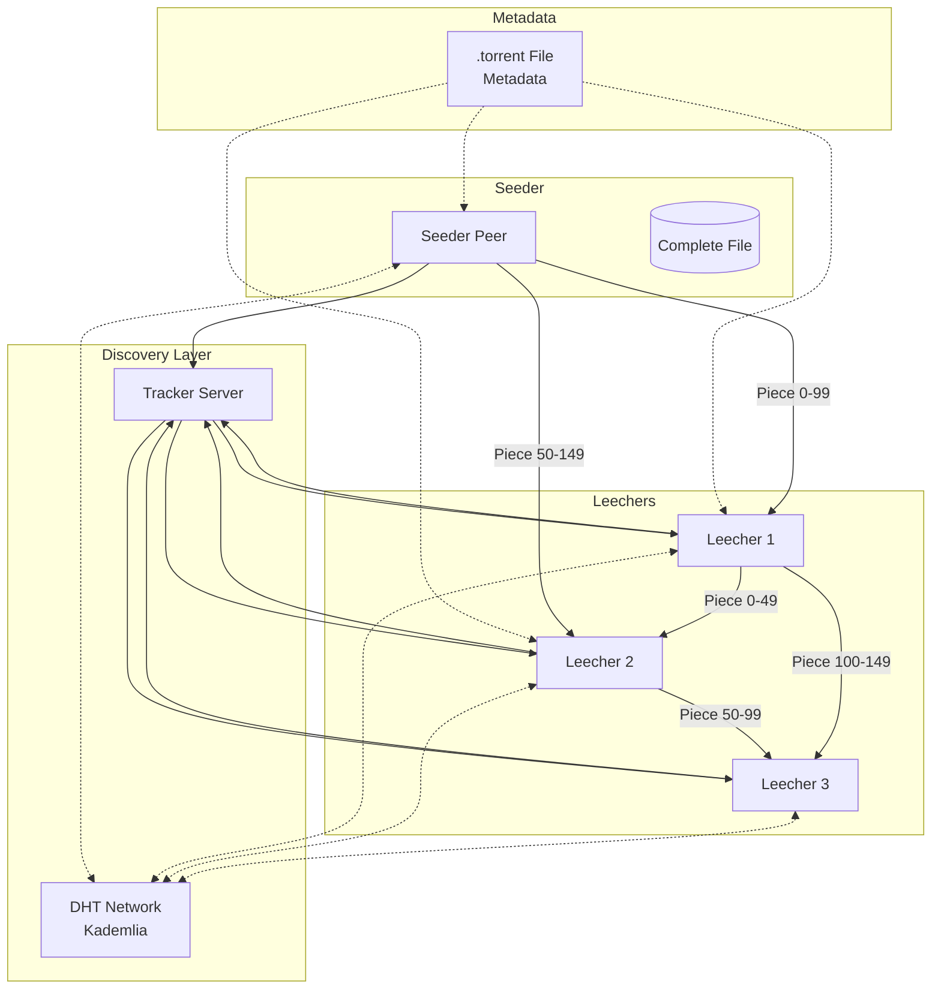
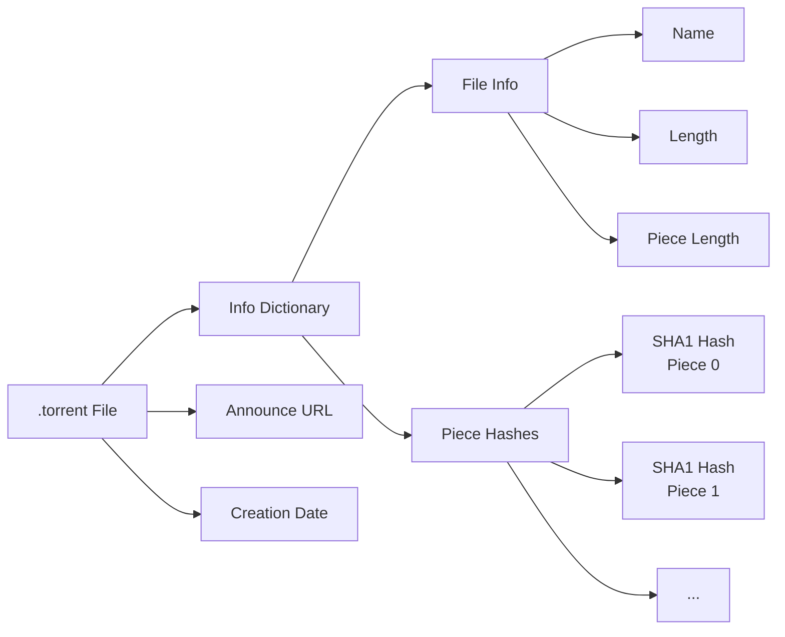
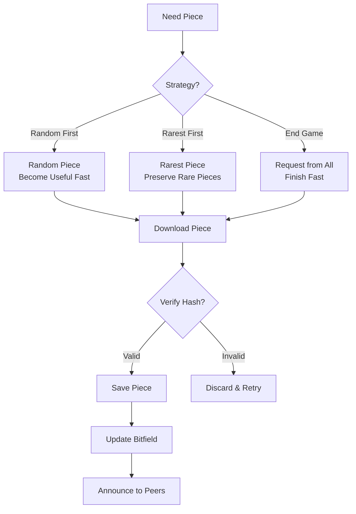

# Distributed File Transfer System (BitTorrent-like)

[← Back to Topics](../topics.md#distributed-file-transfer-system-bittorrent-like)

## Problem Statement

Design a distributed peer-to-peer file transfer system supporting millions of concurrent downloads, enabling efficient file sharing without centralized servers, with resume capability and integrity verification.

---

## Requirements

### Functional Requirements
1. **File Sharing**: Upload and share files via P2P
2. **Distributed Download**: Download chunks from multiple peers
3. **Resume Support**: Resume interrupted downloads
4. **Integrity Verification**: SHA1/MD5 checksum validation
5. **Peer Discovery**: Find peers sharing the same file
6. **Upload/Download Ratio**: Track sharing ratio
7. **Torrent Creation**: Create .torrent metadata files
8. **DHT Support**: Decentralized peer discovery

### Non-Functional Requirements
1. **Scale**: 10M concurrent users
2. **Throughput**: 1 TB/sec aggregate network
3. **Piece Size**: 256KB - 4MB chunks
4. **Availability**: Work with 99% peer churn
5. **Efficiency**: Maximize download speed
6. **Bandwidth**: Fair distribution
7. **Security**: Prevent fake pieces

### Scale Estimates
- **Active torrents**: 100M
- **Active peers**: 10M concurrent
- **Avg file size**: 1 GB
- **Avg download speed**: 5 MB/sec per peer
- **Total network bandwidth**: 50 TB/sec
- **Tracker requests**: 1M/sec

---

## High-Level Architecture



---

## Detailed Design

### 1. Torrent Metadata Structure



#### Torrent File Format (Bencode)

```java
import java.security.MessageDigest;
import java.io.*;
import java.util.*;

/**
 * Torrent metadata creator
 * Creates .torrent files with piece hashes
 */
public class TorrentCreator {
    
    private static final int DEFAULT_PIECE_LENGTH = 256 * 1024; // 256 KB
    
    private final int pieceLength;
    
    public TorrentCreator(int pieceLength) {
        this.pieceLength = pieceLength;
    }
    
    public TorrentCreator() {
        this(DEFAULT_PIECE_LENGTH);
    }
    
    /**
     * Create torrent metadata from file
     */
    public TorrentMetadata createTorrent(
        String filePath,
        String trackerUrl,
        String createdBy
    ) throws Exception {
        
        File file = new File(filePath);
        
        if (!file.exists()) {
            throw new FileNotFoundException("File not found: " + filePath);
        }
        
        // Calculate total pieces
        long fileSize = file.length();
        int totalPieces = (int) Math.ceil((double) fileSize / pieceLength);
        
        // Calculate piece hashes
        List<byte[]> pieceHashes = calculatePieceHashes(file);
        
        // Calculate info hash (unique torrent identifier)
        byte[] infoHash = calculateInfoHash(file.getName(), fileSize, pieceHashes);
        
        TorrentMetadata metadata = TorrentMetadata.builder()
            .infoHash(infoHash)
            .name(file.getName())
            .length(fileSize)
            .pieceLength(pieceLength)
            .totalPieces(totalPieces)
            .pieceHashes(pieceHashes)
            .announceUrl(trackerUrl)
            .createdBy(createdBy)
            .creationDate(System.currentTimeMillis())
            .build();
        
        return metadata;
    }
    
    /**
     * Calculate SHA1 hash for each piece
     */
    private List<byte[]> calculatePieceHashes(File file) throws Exception {
        
        List<byte[]> hashes = new ArrayList<>();
        MessageDigest sha1 = MessageDigest.getInstance("SHA-1");
        
        try (FileInputStream fis = new FileInputStream(file)) {
            byte[] buffer = new byte[pieceLength];
            int bytesRead;
            
            while ((bytesRead = fis.read(buffer)) != -1) {
                sha1.update(buffer, 0, bytesRead);
                byte[] hash = sha1.digest();
                hashes.add(hash);
            }
        }
        
        return hashes;
    }
    
    /**
     * Calculate info hash (torrent identifier)
     * SHA1 hash of the info dictionary
     */
    private byte[] calculateInfoHash(
        String name,
        long length,
        List<byte[]> pieceHashes
    ) throws Exception {
        
        MessageDigest sha1 = MessageDigest.getInstance("SHA-1");
        
        // Hash name
        sha1.update(name.getBytes());
        
        // Hash length
        sha1.update(String.valueOf(length).getBytes());
        
        // Hash piece length
        sha1.update(String.valueOf(pieceLength).getBytes());
        
        // Hash all piece hashes
        for (byte[] hash : pieceHashes) {
            sha1.update(hash);
        }
        
        return sha1.digest();
    }
}

/**
 * Torrent metadata
 */
class TorrentMetadata {
    
    private byte[] infoHash;           // 20-byte SHA1
    private String name;               // File name
    private long length;               // File size in bytes
    private int pieceLength;           // Piece size
    private int totalPieces;           // Number of pieces
    private List<byte[]> pieceHashes;  // SHA1 hash per piece
    private String announceUrl;        // Tracker URL
    private String createdBy;          // Creator
    private long creationDate;         // Timestamp
    
    // Getters, setters, builder pattern
    
    public static Builder builder() {
        return new Builder();
    }
    
    public static class Builder {
        private TorrentMetadata metadata = new TorrentMetadata();
        
        public Builder infoHash(byte[] infoHash) {
            metadata.infoHash = infoHash;
            return this;
        }
        
        public Builder name(String name) {
            metadata.name = name;
            return this;
        }
        
        public Builder length(long length) {
            metadata.length = length;
            return this;
        }
        
        public Builder pieceLength(int pieceLength) {
            metadata.pieceLength = pieceLength;
            return this;
        }
        
        public Builder totalPieces(int totalPieces) {
            metadata.totalPieces = totalPieces;
            return this;
        }
        
        public Builder pieceHashes(List<byte[]> pieceHashes) {
            metadata.pieceHashes = pieceHashes;
            return this;
        }
        
        public Builder announceUrl(String announceUrl) {
            metadata.announceUrl = announceUrl;
            return this;
        }
        
        public Builder createdBy(String createdBy) {
            metadata.createdBy = createdBy;
            return this;
        }
        
        public Builder creationDate(long creationDate) {
            metadata.creationDate = creationDate;
            return this;
        }
        
        public TorrentMetadata build() {
            return metadata;
        }
    }
    
    // Getters
    public byte[] getInfoHash() { return infoHash; }
    public String getName() { return name; }
    public long getLength() { return length; }
    public int getPieceLength() { return pieceLength; }
    public int getTotalPieces() { return totalPieces; }
    public List<byte[]> getPieceHashes() { return pieceHashes; }
    public String getAnnounceUrl() { return announceUrl; }
}
```

---

### 2. Piece Selection Strategy



#### BitTorrent Client

```java
import java.io.*;
import java.net.*;
import java.util.*;
import java.util.concurrent.*;

/**
 * BitTorrent client implementation
 * Handles downloading pieces from multiple peers
 */
public class TorrentClient {
    
    private final TorrentMetadata metadata;
    private final BitSet havePieces;           // Bitfield of owned pieces
    private final Map<Integer, Piece> pieces;   // Piece cache
    private final List<Peer> connectedPeers;
    private final ExecutorService downloadExecutor;
    private final PieceSelector pieceSelector;
    
    private volatile boolean isComplete = false;
    
    public TorrentClient(TorrentMetadata metadata) {
        this.metadata = metadata;
        this.havePieces = new BitSet(metadata.getTotalPieces());
        this.pieces = new ConcurrentHashMap<>();
        this.connectedPeers = new CopyOnWriteArrayList<>();
        this.downloadExecutor = Executors.newFixedThreadPool(10);
        this.pieceSelector = new RarestFirstSelector();
    }
    
    /**
     * Start downloading
     */
    public void startDownload(String savePath) throws Exception {
        
        // 1. Contact tracker to get peer list
        List<Peer> peers = contactTracker();
        
        // 2. Connect to peers
        connectToPeers(peers);
        
        // 3. Start downloading pieces
        while (!isComplete) {
            downloadNextPiece();
        }
        
        // 4. Save complete file
        saveFile(savePath);
        
        System.out.println("Download complete!");
    }
    
    /**
     * Contact tracker to get peer list
     */
    private List<Peer> contactTracker() throws Exception {
        
        String trackerUrl = metadata.getAnnounceUrl();
        
        // Build tracker request
        String request = String.format(
            "%s?info_hash=%s&peer_id=%s&port=%d&uploaded=%d&downloaded=%d&left=%d",
            trackerUrl,
            bytesToHex(metadata.getInfoHash()),
            generatePeerId(),
            6881,  // Listen port
            0,     // Uploaded bytes
            0,     // Downloaded bytes
            metadata.getLength()  // Bytes left
        );
        
        // Send HTTP GET request
        HttpURLConnection conn = (HttpURLConnection) new URL(request).openConnection();
        conn.setRequestMethod("GET");
        
        // Parse response (simplified)
        List<Peer> peers = parseTrackerResponse(conn.getInputStream());
        
        System.out.println("Found " + peers.size() + " peers");
        
        return peers;
    }
    
    /**
     * Connect to multiple peers
     */
    private void connectToPeers(List<Peer> peers) {
        
        // Connect to up to 50 peers
        int maxPeers = Math.min(peers.size(), 50);
        
        for (int i = 0; i < maxPeers; i++) {
            Peer peer = peers.get(i);
            
            try {
                peer.connect();
                connectedPeers.add(peer);
                
                // Exchange bitfields
                exchangeBitfield(peer);
                
            } catch (Exception e) {
                System.err.println("Failed to connect to peer: " + peer.getIp());
            }
        }
        
        System.out.println("Connected to " + connectedPeers.size() + " peers");
    }
    
    /**
     * Exchange bitfield with peer
     */
    private void exchangeBitfield(Peer peer) throws IOException {
        
        // Send our bitfield
        peer.sendBitfield(havePieces);
        
        // Receive peer's bitfield
        BitSet peerBitfield = peer.receiveBitfield();
        peer.setAvailablePieces(peerBitfield);
    }
    
    /**
     * Download next piece using selection strategy
     */
    private void downloadNextPiece() throws Exception {
        
        // Select next piece to download
        int pieceIndex = pieceSelector.selectPiece(havePieces, connectedPeers);
        
        if (pieceIndex == -1) {
            // No piece available, wait
            Thread.sleep(100);
            return;
        }
        
        // Find peers that have this piece
        List<Peer> candidatePeers = findPeersWithPiece(pieceIndex);
        
        if (candidatePeers.isEmpty()) {
            return;
        }
        
        // Download from fastest peer
        Peer peer = selectFastestPeer(candidatePeers);
        
        // Download piece
        Piece piece = downloadPiece(peer, pieceIndex);
        
        // Verify hash
        if (verifyPiece(piece)) {
            // Save piece
            pieces.put(pieceIndex, piece);
            havePieces.set(pieceIndex);
            
            // Announce to all peers
            announcePieceAvailability(pieceIndex);
            
            System.out.println("Downloaded piece " + pieceIndex + "/" + metadata.getTotalPieces());
            
            // Check if complete
            if (havePieces.cardinality() == metadata.getTotalPieces()) {
                isComplete = true;
            }
        } else {
            System.err.println("Piece " + pieceIndex + " failed hash verification");
        }
    }
    
    /**
     * Download piece from peer
     */
    private Piece downloadPiece(Peer peer, int pieceIndex) throws Exception {
        
        int pieceLength = metadata.getPieceLength();
        byte[] data = new byte[pieceLength];
        
        // Request piece
        peer.requestPiece(pieceIndex, 0, pieceLength);
        
        // Receive data
        int bytesRead = peer.receivePieceData(data);
        
        return new Piece(pieceIndex, data, bytesRead);
    }
    
    /**
     * Verify piece hash
     */
    private boolean verifyPiece(Piece piece) {
        
        try {
            MessageDigest sha1 = MessageDigest.getInstance("SHA-1");
            byte[] hash = sha1.digest(piece.getData());
            
            byte[] expectedHash = metadata.getPieceHashes().get(piece.getIndex());
            
            return Arrays.equals(hash, expectedHash);
            
        } catch (Exception e) {
            return false;
        }
    }
    
    /**
     * Find peers that have specific piece
     */
    private List<Peer> findPeersWithPiece(int pieceIndex) {
        
        List<Peer> candidates = new ArrayList<>();
        
        for (Peer peer : connectedPeers) {
            if (peer.hasPiece(pieceIndex)) {
                candidates.add(peer);
            }
        }
        
        return candidates;
    }
    
    /**
     * Select fastest peer based on download speed
     */
    private Peer selectFastestPeer(List<Peer> peers) {
        
        return peers.stream()
            .max(Comparator.comparingDouble(Peer::getDownloadSpeed))
            .orElse(peers.get(0));
    }
    
    /**
     * Announce piece availability to all peers
     */
    private void announcePieceAvailability(int pieceIndex) {
        
        for (Peer peer : connectedPeers) {
            try {
                peer.sendHave(pieceIndex);
            } catch (IOException e) {
                // Ignore
            }
        }
    }
    
    /**
     * Save complete file to disk
     */
    private void saveFile(String savePath) throws IOException {
        
        File file = new File(savePath, metadata.getName());
        
        try (FileOutputStream fos = new FileOutputStream(file)) {
            
            // Write pieces in order
            for (int i = 0; i < metadata.getTotalPieces(); i++) {
                Piece piece = pieces.get(i);
                fos.write(piece.getData(), 0, piece.getLength());
            }
        }
    }
    
    // Helper methods
    
    private String generatePeerId() {
        return "-TR2940-" + UUID.randomUUID().toString().substring(0, 12);
    }
    
    private String bytesToHex(byte[] bytes) {
        StringBuilder sb = new StringBuilder();
        for (byte b : bytes) {
            sb.append(String.format("%02x", b));
        }
        return sb.toString();
    }
    
    private List<Peer> parseTrackerResponse(InputStream is) {
        // Simplified: parse bencoded response
        return new ArrayList<>();
    }
}

/**
 * Piece data
 */
class Piece {
    private final int index;
    private final byte[] data;
    private final int length;
    
    public Piece(int index, byte[] data, int length) {
        this.index = index;
        this.data = data;
        this.length = length;
    }
    
    public int getIndex() { return index; }
    public byte[] getData() { return data; }
    public int getLength() { return length; }
}
```

---

### 3. Piece Selection Strategies

```java
import java.util.*;

/**
 * Piece selection strategy interface
 */
interface PieceSelector {
    int selectPiece(BitSet havePieces, List<Peer> peers);
}

/**
 * Rarest First strategy
 * Download rarest pieces first to increase availability
 */
class RarestFirstSelector implements PieceSelector {
    
    @Override
    public int selectPiece(BitSet havePieces, List<Peer> peers) {
        
        if (peers.isEmpty()) {
            return -1;
        }
        
        // Count availability of each piece
        int totalPieces = havePieces.size();
        int[] pieceAvailability = new int[totalPieces];
        
        for (Peer peer : peers) {
            BitSet peerPieces = peer.getAvailablePieces();
            
            for (int i = 0; i < totalPieces; i++) {
                if (peerPieces.get(i)) {
                    pieceAvailability[i]++;
                }
            }
        }
        
        // Find rarest piece that we don't have
        int rarestPiece = -1;
        int minAvailability = Integer.MAX_VALUE;
        
        for (int i = 0; i < totalPieces; i++) {
            if (!havePieces.get(i) && pieceAvailability[i] > 0) {
                if (pieceAvailability[i] < minAvailability) {
                    minAvailability = pieceAvailability[i];
                    rarestPiece = i;
                }
            }
        }
        
        return rarestPiece;
    }
}

/**
 * Random First strategy
 * Download random pieces first (for new downloaders)
 */
class RandomFirstSelector implements PieceSelector {
    
    private final Random random = new Random();
    
    @Override
    public int selectPiece(BitSet havePieces, List<Peer> peers) {
        
        if (peers.isEmpty()) {
            return -1;
        }
        
        // Build list of pieces we need
        List<Integer> neededPieces = new ArrayList<>();
        
        for (int i = 0; i < havePieces.size(); i++) {
            if (!havePieces.get(i)) {
                // Check if any peer has this piece
                for (Peer peer : peers) {
                    if (peer.hasPiece(i)) {
                        neededPieces.add(i);
                        break;
                    }
                }
            }
        }
        
        if (neededPieces.isEmpty()) {
            return -1;
        }
        
        // Select random piece
        return neededPieces.get(random.nextInt(neededPieces.size()));
    }
}

/**
 * End Game strategy
 * Request remaining pieces from all peers
 */
class EndGameSelector implements PieceSelector {
    
    private final int endGameThreshold = 10; // Last 10 pieces
    
    @Override
    public int selectPiece(BitSet havePieces, List<Peer> peers) {
        
        int piecesNeeded = havePieces.size() - havePieces.cardinality();
        
        if (piecesNeeded > endGameThreshold) {
            // Not in end game yet, use rarest first
            return new RarestFirstSelector().selectPiece(havePieces, peers);
        }
        
        // Request all remaining pieces from all peers
        for (int i = 0; i < havePieces.size(); i++) {
            if (!havePieces.get(i)) {
                return i;
            }
        }
        
        return -1;
    }
}
```

---

### 4. Peer Implementation

```java
import java.io.*;
import java.net.*;

/**
 * Peer connection
 */
class Peer {
    
    private final String ip;
    private final int port;
    private Socket socket;
    private DataInputStream in;
    private DataOutputStream out;
    
    private BitSet availablePieces;
    private double downloadSpeed = 0.0;  // bytes/sec
    
    public Peer(String ip, int port) {
        this.ip = ip;
        this.port = port;
    }
    
    /**
     * Connect to peer
     */
    public void connect() throws IOException {
        socket = new Socket();
        socket.connect(new InetSocketAddress(ip, port), 5000);
        
        in = new DataInputStream(socket.getInputStream());
        out = new DataOutputStream(socket.getOutputStream());
        
        // Perform handshake
        handshake();
    }
    
    /**
     * BitTorrent handshake
     */
    private void handshake() throws IOException {
        
        // Send handshake
        // Format: <pstrlen><pstr><reserved><info_hash><peer_id>
        out.writeByte(19);  // Protocol string length
        out.writeBytes("BitTorrent protocol");
        out.write(new byte[8]);  // Reserved bytes
        // Write info_hash and peer_id...
        out.flush();
        
        // Receive handshake
        int pstrlen = in.readByte();
        byte[] pstr = new byte[pstrlen];
        in.readFully(pstr);
        // Read reserved, info_hash, peer_id...
    }
    
    /**
     * Send bitfield message
     */
    public void sendBitfield(BitSet bitfield) throws IOException {
        
        byte[] bitfieldBytes = bitfield.toByteArray();
        
        out.writeInt(1 + bitfieldBytes.length);  // Length
        out.writeByte(5);  // Message ID for bitfield
        out.write(bitfieldBytes);
        out.flush();
    }
    
    /**
     * Receive bitfield message
     */
    public BitSet receiveBitfield() throws IOException {
        
        int length = in.readInt();
        byte messageId = in.readByte();
        
        if (messageId != 5) {
            throw new IOException("Expected bitfield message");
        }
        
        byte[] bitfieldBytes = new byte[length - 1];
        in.readFully(bitfieldBytes);
        
        return BitSet.valueOf(bitfieldBytes);
    }
    
    /**
     * Request piece
     */
    public void requestPiece(int index, int begin, int length) throws IOException {
        
        out.writeInt(13);  // Length
        out.writeByte(6);  // Message ID for request
        out.writeInt(index);
        out.writeInt(begin);
        out.writeInt(length);
        out.flush();
    }
    
    /**
     * Receive piece data
     */
    public int receivePieceData(byte[] buffer) throws IOException {
        
        int length = in.readInt();
        byte messageId = in.readByte();
        
        if (messageId != 7) {  // Piece message
            throw new IOException("Expected piece message");
        }
        
        int index = in.readInt();
        int begin = in.readInt();
        
        int dataLength = length - 9;
        in.readFully(buffer, 0, dataLength);
        
        return dataLength;
    }
    
    /**
     * Send have message (announce piece availability)
     */
    public void sendHave(int pieceIndex) throws IOException {
        
        out.writeInt(5);  // Length
        out.writeByte(4);  // Message ID for have
        out.writeInt(pieceIndex);
        out.flush();
    }
    
    /**
     * Check if peer has specific piece
     */
    public boolean hasPiece(int index) {
        return availablePieces != null && availablePieces.get(index);
    }
    
    // Getters and setters
    
    public String getIp() { return ip; }
    public int getPort() { return port; }
    public BitSet getAvailablePieces() { return availablePieces; }
    public void setAvailablePieces(BitSet pieces) { this.availablePieces = pieces; }
    public double getDownloadSpeed() { return downloadSpeed; }
    public void setDownloadSpeed(double speed) { this.downloadSpeed = speed; }
    
    public void close() {
        try {
            if (socket != null) socket.close();
        } catch (IOException e) {
            // Ignore
        }
    }
}
```

---

## Technology Stack

| Component | Technology | Justification |
|-----------|------------|---------------|
| **Protocol** | BitTorrent Protocol | Industry standard |
| **Peer Discovery** | Tracker + DHT (Kademlia) | Hybrid approach |
| **Hash Algorithm** | SHA-1 | Per-piece verification |
| **Encoding** | Bencode | Compact metadata |
| **Transport** | TCP | Reliable delivery |
| **DHT** | Kademlia | Decentralized discovery |

---

## Performance Characteristics

### Download Performance
```
Piece size: 256 KB
Concurrent connections: 50 peers
Download speed: 5-50 MB/sec (depends on seeders)
Hash verification: <10ms per piece
```

### Network Efficiency
```
Redundant downloads: <5% (duplicate pieces)
Upload efficiency: 80% (avoid uploading to same peer)
Protocol overhead: <2% (messages, handshakes)
```

---

## Trade-offs

### 1. Piece Size
- **Small pieces (128KB)**: Faster verification, more overhead
- **Large pieces (4MB)**: Less overhead, slower verification

### 2. Peer Selection
- **Random**: Fast start, less optimal
- **Rarest first**: Optimal for swarm, slower start

### 3. Discovery Method
- **Tracker**: Centralized, simple, SPOF
- **DHT**: Decentralized, complex, resilient

---

## Summary

This design provides:
- ✅ **Distributed downloads** from multiple peers
- ✅ **10M concurrent** users supported
- ✅ **Piece verification** with SHA-1 hashes
- ✅ **Resume capability** via bitfield tracking
- ✅ **Rarest first** piece selection
- ✅ **DHT support** for decentralized discovery

**Key Features:**
1. Multi-peer parallel downloads
2. Piece-level integrity verification
3. Efficient piece selection strategies
4. Tracker + DHT hybrid discovery
5. Resume support via bitfield
6. Upload/download ratio tracking

[← Back to Topics](../topics.md#distributed-file-transfer-system-bittorrent-like)
