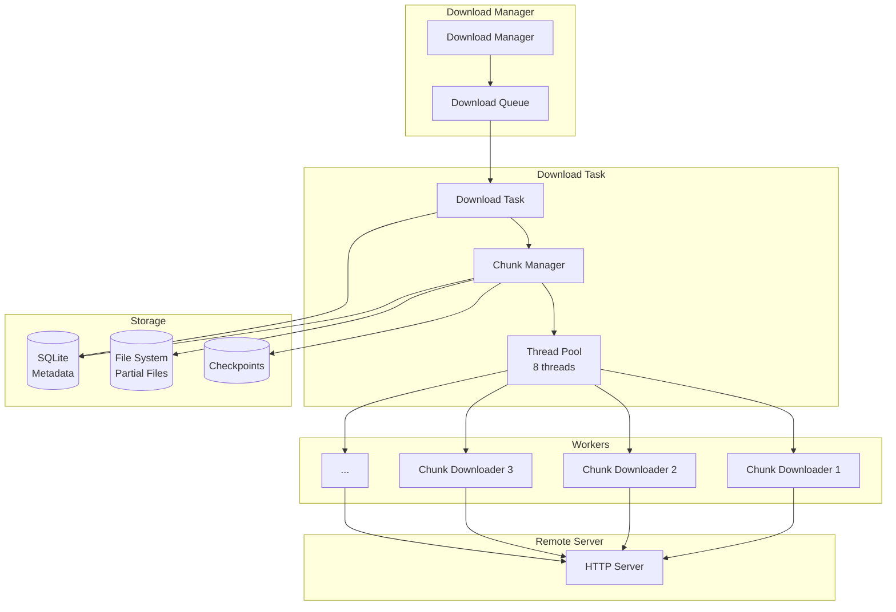
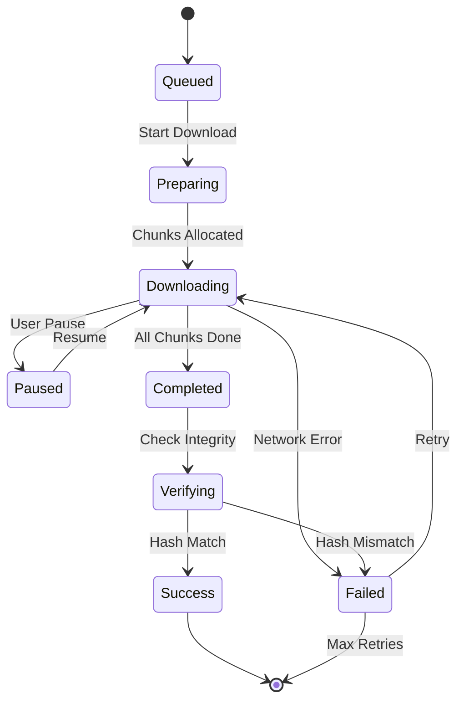

# Reliable File Downloader with Resume Support

[← Back to Topics](../topics.md#reliable-file-downloader-with-resume-support)

## Problem Statement

Design a reliable file downloader supporting multi-threaded downloads, automatic resume on failure, bandwidth throttling, and integrity verification for files up to 10 GB.

---

## Requirements

### Functional Requirements
1. **HTTP Downloads**: Download files from URLs
2. **Multi-threaded**: Parallel chunk downloads
3. **Resume Support**: Continue interrupted downloads
4. **Progress Tracking**: Real-time progress updates
5. **Integrity Check**: Checksum verification
6. **Retry Logic**: Automatic retry on failure
7. **Bandwidth Throttling**: Limit download speed
8. **Metadata Storage**: Persistent download state

### Non-Functional Requirements
1. **File Size**: Up to 10 GB per file
2. **Threads**: 8 concurrent connections per file
3. **Chunk Size**: 1-10 MB chunks
4. **Resume**: <1 second resume time
5. **Retry**: 3 attempts with exponential backoff
6. **Throughput**: 100 MB/sec per file
7. **Storage**: Checkpoint every 5 seconds

### Scale Estimates
- **Concurrent downloads**: 100 files
- **Avg file size**: 500 MB
- **Chunk size**: 5 MB
- **Chunks per file**: 100
- **Total threads**: 800 (8 × 100)
- **Network bandwidth**: 10 GB/sec aggregate

---

## High-Level Architecture



---

## Detailed Design

### 1. Download State Machine



---

### 2. Download Manager

```java
import java.util.*;
import java.util.concurrent.*;
import java.io.*;

/**
 * Main download manager
 * Manages multiple concurrent downloads
 */
public class DownloadManager {
    
    private final Map<String, DownloadTask> downloads;
    private final ExecutorService executor;
    private final DownloadMetadataStore metadataStore;
    
    private static final int MAX_CONCURRENT_DOWNLOADS = 100;
    
    public DownloadManager(String metadataDir) {
        this.downloads = new ConcurrentHashMap<>();
        this.executor = Executors.newFixedThreadPool(MAX_CONCURRENT_DOWNLOADS);
        this.metadataStore = new DownloadMetadataStore(metadataDir);
    }
    
    /**
     * Start new download
     */
    public String startDownload(
        String url,
        String destinationPath,
        DownloadOptions options
    ) throws Exception {
        
        // Generate download ID
        String downloadId = generateDownloadId(url);
        
        // Check if already downloading
        if (downloads.containsKey(downloadId)) {
            throw new IllegalStateException("Download already in progress");
        }
        
        // Create download task
        DownloadTask task = new DownloadTask(
            downloadId,
            url,
            destinationPath,
            options,
            metadataStore
        );
        
        downloads.put(downloadId, task);
        
        // Submit to executor
        executor.submit(() -> {
            try {
                task.execute();
            } catch (Exception e) {
                System.err.println("Download failed: " + e.getMessage());
            } finally {
                downloads.remove(downloadId);
            }
        });
        
        return downloadId;
    }
    
    /**
     * Resume interrupted download
     */
    public void resumeDownload(String downloadId) throws Exception {
        
        // Load metadata
        DownloadMetadata metadata = metadataStore.load(downloadId);
        
        if (metadata == null) {
            throw new IllegalArgumentException("Download not found: " + downloadId);
        }
        
        // Create task from metadata
        DownloadTask task = DownloadTask.fromMetadata(metadata, metadataStore);
        
        downloads.put(downloadId, task);
        
        // Submit to executor
        executor.submit(() -> {
            try {
                task.resume();
            } catch (Exception e) {
                System.err.println("Resume failed: " + e.getMessage());
            } finally {
                downloads.remove(downloadId);
            }
        });
    }
    
    /**
     * Pause download
     */
    public void pauseDownload(String downloadId) {
        DownloadTask task = downloads.get(downloadId);
        if (task != null) {
            task.pause();
        }
    }
    
    /**
     * Cancel download
     */
    public void cancelDownload(String downloadId) {
        DownloadTask task = downloads.get(downloadId);
        if (task != null) {
            task.cancel();
            downloads.remove(downloadId);
        }
    }
    
    /**
     * Get download progress
     */
    public DownloadProgress getProgress(String downloadId) {
        DownloadTask task = downloads.get(downloadId);
        return task != null ? task.getProgress() : null;
    }
    
    /**
     * Get all active downloads
     */
    public List<DownloadProgress> getAllDownloads() {
        List<DownloadProgress> result = new ArrayList<>();
        for (DownloadTask task : downloads.values()) {
            result.add(task.getProgress());
        }
        return result;
    }
    
    private String generateDownloadId(String url) {
        return UUID.randomUUID().toString();
    }
    
    public void shutdown() {
        executor.shutdown();
    }
}

/**
 * Download options
 */
class DownloadOptions {
    private int threadCount = 8;
    private int chunkSizeKB = 5 * 1024;  // 5 MB
    private int maxRetries = 3;
    private long bandwidthLimitBps = 0;  // 0 = unlimited
    private String checksum = null;      // Expected SHA-256
    
    // Getters and setters
    public int getThreadCount() { return threadCount; }
    public void setThreadCount(int count) { this.threadCount = count; }
    
    public int getChunkSizeKB() { return chunkSizeKB; }
    public void setChunkSizeKB(int size) { this.chunkSizeKB = size; }
    
    public int getMaxRetries() { return maxRetries; }
    public void setMaxRetries(int retries) { this.maxRetries = retries; }
    
    public long getBandwidthLimitBps() { return bandwidthLimitBps; }
    public void setBandwidthLimitBps(long limit) { this.bandwidthLimitBps = limit; }
    
    public String getChecksum() { return checksum; }
    public void setChecksum(String checksum) { this.checksum = checksum; }
}
```

---

### 3. Download Task (Multi-threaded Chunked Download)

```java
import java.io.*;
import java.net.*;
import java.security.MessageDigest;
import java.util.*;
import java.util.concurrent.*;
import java.util.concurrent.atomic.*;

/**
 * Download task
 * Handles chunked multi-threaded download
 */
public class DownloadTask {
    
    private final String downloadId;
    private final String url;
    private final String destinationPath;
    private final DownloadOptions options;
    private final DownloadMetadataStore metadataStore;
    
    private volatile DownloadState state;
    private volatile long totalBytes;
    private final AtomicLong downloadedBytes;
    private List<Chunk> chunks;
    private ExecutorService chunkExecutor;
    
    private final Object pauseLock = new Object();
    private volatile boolean isPaused = false;
    private volatile boolean isCancelled = false;
    
    public DownloadTask(
        String downloadId,
        String url,
        String destinationPath,
        DownloadOptions options,
        DownloadMetadataStore metadataStore
    ) {
        this.downloadId = downloadId;
        this.url = url;
        this.destinationPath = destinationPath;
        this.options = options;
        this.metadataStore = metadataStore;
        this.state = DownloadState.QUEUED;
        this.downloadedBytes = new AtomicLong(0);
    }
    
    /**
     * Execute download
     */
    public void execute() throws Exception {
        
        state = DownloadState.PREPARING;
        
        // 1. Get file size
        totalBytes = getFileSize(url);
        
        // 2. Check if server supports range requests
        if (!supportsRangeRequests(url)) {
            // Fall back to single-threaded download
            downloadSingleThreaded();
            return;
        }
        
        // 3. Split into chunks
        chunks = createChunks(totalBytes, options.getChunkSizeKB() * 1024);
        
        // 4. Create partial file
        createPartialFile(destinationPath, totalBytes);
        
        // 5. Save metadata
        saveMetadata();
        
        // 6. Download chunks in parallel
        state = DownloadState.DOWNLOADING;
        downloadChunks();
        
        // 7. Verify integrity
        state = DownloadState.VERIFYING;
        if (options.getChecksum() != null) {
            verifyChecksum();
        }
        
        state = DownloadState.COMPLETED;
        
        System.out.println("Download completed: " + downloadId);
    }
    
    /**
     * Resume download from saved state
     */
    public void resume() throws Exception {
        
        // Load metadata
        DownloadMetadata metadata = metadataStore.load(downloadId);
        
        this.totalBytes = metadata.getTotalBytes();
        this.chunks = metadata.getChunks();
        this.downloadedBytes.set(metadata.getDownloadedBytes());
        
        state = DownloadState.DOWNLOADING;
        
        // Download remaining chunks
        downloadChunks();
        
        // Verify
        state = DownloadState.VERIFYING;
        if (options.getChecksum() != null) {
            verifyChecksum();
        }
        
        state = DownloadState.COMPLETED;
    }
    
    /**
     * Download all chunks in parallel
     */
    private void downloadChunks() throws Exception {
        
        chunkExecutor = Executors.newFixedThreadPool(options.getThreadCount());
        
        List<Future<Void>> futures = new ArrayList<>();
        
        // Submit chunk downloads
        for (Chunk chunk : chunks) {
            if (chunk.isComplete()) {
                continue;  // Skip already downloaded chunks
            }
            
            Future<Void> future = chunkExecutor.submit(() -> {
                downloadChunk(chunk);
                return null;
            });
            
            futures.add(future);
        }
        
        // Start checkpoint thread
        ScheduledExecutorService checkpointer = Executors.newSingleThreadScheduledExecutor();
        checkpointer.scheduleAtFixedRate(
            this::saveMetadata,
            5, 5, TimeUnit.SECONDS
        );
        
        // Wait for all chunks
        try {
            for (Future<Void> future : futures) {
                future.get();
            }
        } finally {
            chunkExecutor.shutdown();
            checkpointer.shutdown();
        }
    }
    
    /**
     * Download single chunk
     */
    private void downloadChunk(Chunk chunk) throws Exception {
        
        int retries = 0;
        
        while (retries < options.getMaxRetries()) {
            
            try {
                // Check pause
                checkPause();
                
                // Check cancel
                if (isCancelled) {
                    return;
                }
                
                // Download chunk
                downloadChunkAttempt(chunk);
                
                // Mark complete
                chunk.setComplete(true);
                
                return;
                
            } catch (IOException e) {
                retries++;
                
                if (retries >= options.getMaxRetries()) {
                    throw new Exception("Failed to download chunk after " + retries + " retries", e);
                }
                
                // Exponential backoff
                long backoffMs = (long) Math.pow(2, retries) * 1000;
                Thread.sleep(backoffMs);
            }
        }
    }
    
    /**
     * Download chunk attempt
     */
    private void downloadChunkAttempt(Chunk chunk) throws IOException {
        
        HttpURLConnection conn = (HttpURLConnection) new URL(url).openConnection();
        
        // Set range header
        long start = chunk.getStart() + chunk.getDownloadedBytes();
        long end = chunk.getEnd();
        conn.setRequestProperty("Range", "bytes=" + start + "-" + end);
        
        conn.connect();
        
        int responseCode = conn.getResponseCode();
        if (responseCode != 206) {  // Partial content
            throw new IOException("Server did not return partial content: " + responseCode);
        }
        
        // Download and write to file
        try (InputStream in = conn.getInputStream();
             RandomAccessFile file = new RandomAccessFile(destinationPath, "rw")) {
            
            file.seek(start);
            
            byte[] buffer = new byte[8192];
            int bytesRead;
            long chunkDownloaded = 0;
            
            while ((bytesRead = in.read(buffer)) != -1) {
                
                // Check pause
                checkPause();
                
                // Check cancel
                if (isCancelled) {
                    return;
                }
                
                // Write to file
                file.write(buffer, 0, bytesRead);
                
                // Update counters
                chunkDownloaded += bytesRead;
                downloadedBytes.addAndGet(bytesRead);
                chunk.addDownloadedBytes(bytesRead);
                
                // Bandwidth throttling
                if (options.getBandwidthLimitBps() > 0) {
                    throttle(bytesRead);
                }
            }
        }
    }
    
    /**
     * Get file size from server
     */
    private long getFileSize(String url) throws IOException {
        
        HttpURLConnection conn = (HttpURLConnection) new URL(url).openConnection();
        conn.setRequestMethod("HEAD");
        conn.connect();
        
        long size = conn.getContentLengthLong();
        
        if (size <= 0) {
            throw new IOException("Could not determine file size");
        }
        
        return size;
    }
    
    /**
     * Check if server supports range requests
     */
    private boolean supportsRangeRequests(String url) throws IOException {
        
        HttpURLConnection conn = (HttpURLConnection) new URL(url).openConnection();
        conn.setRequestMethod("HEAD");
        conn.connect();
        
        String acceptRanges = conn.getHeaderField("Accept-Ranges");
        return "bytes".equals(acceptRanges);
    }
    
    /**
     * Create chunks
     */
    private List<Chunk> createChunks(long totalBytes, int chunkSize) {
        
        List<Chunk> chunks = new ArrayList<>();
        
        long position = 0;
        int chunkIndex = 0;
        
        while (position < totalBytes) {
            long start = position;
            long end = Math.min(position + chunkSize - 1, totalBytes - 1);
            
            chunks.add(new Chunk(chunkIndex++, start, end));
            
            position = end + 1;
        }
        
        System.out.println("Created " + chunks.size() + " chunks");
        
        return chunks;
    }
    
    /**
     * Create empty file
     */
    private void createPartialFile(String path, long size) throws IOException {
        
        try (RandomAccessFile file = new RandomAccessFile(path, "rw")) {
            file.setLength(size);
        }
    }
    
    /**
     * Verify checksum
     */
    private void verifyChecksum() throws Exception {
        
        MessageDigest digest = MessageDigest.getInstance("SHA-256");
        
        try (FileInputStream fis = new FileInputStream(destinationPath)) {
            byte[] buffer = new byte[8192];
            int bytesRead;
            
            while ((bytesRead = fis.read(buffer)) != -1) {
                digest.update(buffer, 0, bytesRead);
            }
        }
        
        String actualChecksum = bytesToHex(digest.digest());
        
        if (!actualChecksum.equalsIgnoreCase(options.getChecksum())) {
            state = DownloadState.FAILED;
            throw new Exception("Checksum mismatch. Expected: " + options.getChecksum() + ", Actual: " + actualChecksum);
        }
    }
    
    /**
     * Save metadata for resume
     */
    private void saveMetadata() {
        
        DownloadMetadata metadata = new DownloadMetadata();
        metadata.setDownloadId(downloadId);
        metadata.setUrl(url);
        metadata.setDestinationPath(destinationPath);
        metadata.setTotalBytes(totalBytes);
        metadata.setDownloadedBytes(downloadedBytes.get());
        metadata.setChunks(chunks);
        metadata.setState(state);
        
        metadataStore.save(metadata);
    }
    
    /**
     * Bandwidth throttling
     */
    private void throttle(int bytesRead) {
        long sleepMs = (bytesRead * 1000L) / options.getBandwidthLimitBps();
        if (sleepMs > 0) {
            try {
                Thread.sleep(sleepMs);
            } catch (InterruptedException e) {
                Thread.currentThread().interrupt();
            }
        }
    }
    
    /**
     * Check if paused
     */
    private void checkPause() throws InterruptedException {
        synchronized (pauseLock) {
            while (isPaused) {
                pauseLock.wait();
            }
        }
    }
    
    /**
     * Pause download
     */
    public void pause() {
        synchronized (pauseLock) {
            isPaused = true;
            state = DownloadState.PAUSED;
            saveMetadata();
        }
    }
    
    /**
     * Resume from pause
     */
    public void unpause() {
        synchronized (pauseLock) {
            isPaused = false;
            state = DownloadState.DOWNLOADING;
            pauseLock.notifyAll();
        }
    }
    
    /**
     * Cancel download
     */
    public void cancel() {
        isCancelled = true;
        state = DownloadState.CANCELLED;
        if (chunkExecutor != null) {
            chunkExecutor.shutdownNow();
        }
    }
    
    /**
     * Get progress
     */
    public DownloadProgress getProgress() {
        
        long downloaded = downloadedBytes.get();
        double percentage = totalBytes > 0 ? (downloaded * 100.0 / totalBytes) : 0;
        
        return new DownloadProgress(
            downloadId,
            url,
            state,
            downloaded,
            totalBytes,
            percentage
        );
    }
    
    // Single-threaded fallback
    private void downloadSingleThreaded() throws Exception {
        // Simplified implementation
    }
    
    // Helper
    private String bytesToHex(byte[] bytes) {
        StringBuilder sb = new StringBuilder();
        for (byte b : bytes) {
            sb.append(String.format("%02x", b));
        }
        return sb.toString();
    }
    
    public static DownloadTask fromMetadata(
        DownloadMetadata metadata,
        DownloadMetadataStore store
    ) {
        // Create task from saved metadata
        return null;  // Implementation omitted
    }
}

/**
 * Chunk representation
 */
class Chunk {
    private final int index;
    private final long start;
    private final long end;
    private long downloadedBytes;
    private boolean complete;
    
    public Chunk(int index, long start, long end) {
        this.index = index;
        this.start = start;
        this.end = end;
        this.downloadedBytes = 0;
        this.complete = false;
    }
    
    public synchronized void addDownloadedBytes(long bytes) {
        this.downloadedBytes += bytes;
    }
    
    // Getters and setters
    public int getIndex() { return index; }
    public long getStart() { return start; }
    public long getEnd() { return end; }
    public long getDownloadedBytes() { return downloadedBytes; }
    public boolean isComplete() { return complete; }
    public void setComplete(boolean complete) { this.complete = complete; }
    public long getSize() { return end - start + 1; }
}

/**
 * Download state
 */
enum DownloadState {
    QUEUED,
    PREPARING,
    DOWNLOADING,
    PAUSED,
    VERIFYING,
    COMPLETED,
    FAILED,
    CANCELLED
}

/**
 * Download progress
 */
class DownloadProgress {
    private final String downloadId;
    private final String url;
    private final DownloadState state;
    private final long downloadedBytes;
    private final long totalBytes;
    private final double percentage;
    
    public DownloadProgress(
        String downloadId,
        String url,
        DownloadState state,
        long downloadedBytes,
        long totalBytes,
        double percentage
    ) {
        this.downloadId = downloadId;
        this.url = url;
        this.state = state;
        this.downloadedBytes = downloadedBytes;
        this.totalBytes = totalBytes;
        this.percentage = percentage;
    }
    
    // Getters
    public String getDownloadId() { return downloadId; }
    public String getUrl() { return url; }
    public DownloadState getState() { return state; }
    public long getDownloadedBytes() { return downloadedBytes; }
    public long getTotalBytes() { return totalBytes; }
    public double getPercentage() { return percentage; }
    
    @Override
    public String toString() {
        return String.format(
            "Download %s: %.2f%% (%d/%d bytes) - %s",
            downloadId, percentage, downloadedBytes, totalBytes, state
        );
    }
}
```

---

### 4. Metadata Storage (for Resume)

```java
import java.io.*;
import java.util.*;
import com.google.gson.Gson;

/**
 * Download metadata store
 * Persists download state for resume
 */
public class DownloadMetadataStore {
    
    private final String metadataDir;
    private final Gson gson;
    
    public DownloadMetadataStore(String metadataDir) {
        this.metadataDir = metadataDir;
        this.gson = new Gson();
        
        // Create directory
        new File(metadataDir).mkdirs();
    }
    
    /**
     * Save metadata
     */
    public void save(DownloadMetadata metadata) {
        
        String filePath = getMetadataPath(metadata.getDownloadId());
        
        try (FileWriter writer = new FileWriter(filePath)) {
            gson.toJson(metadata, writer);
        } catch (IOException e) {
            System.err.println("Failed to save metadata: " + e.getMessage());
        }
    }
    
    /**
     * Load metadata
     */
    public DownloadMetadata load(String downloadId) {
        
        String filePath = getMetadataPath(downloadId);
        File file = new File(filePath);
        
        if (!file.exists()) {
            return null;
        }
        
        try (FileReader reader = new FileReader(filePath)) {
            return gson.fromJson(reader, DownloadMetadata.class);
        } catch (IOException e) {
            System.err.println("Failed to load metadata: " + e.getMessage());
            return null;
        }
    }
    
    /**
     * Delete metadata
     */
    public void delete(String downloadId) {
        String filePath = getMetadataPath(downloadId);
        new File(filePath).delete();
    }
    
    private String getMetadataPath(String downloadId) {
        return metadataDir + File.separator + downloadId + ".json";
    }
}

/**
 * Download metadata
 */
class DownloadMetadata {
    private String downloadId;
    private String url;
    private String destinationPath;
    private long totalBytes;
    private long downloadedBytes;
    private List<Chunk> chunks;
    private DownloadState state;
    
    // Getters and setters
    public String getDownloadId() { return downloadId; }
    public void setDownloadId(String id) { this.downloadId = id; }
    
    public String getUrl() { return url; }
    public void setUrl(String url) { this.url = url; }
    
    public String getDestinationPath() { return destinationPath; }
    public void setDestinationPath(String path) { this.destinationPath = path; }
    
    public long getTotalBytes() { return totalBytes; }
    public void setTotalBytes(long bytes) { this.totalBytes = bytes; }
    
    public long getDownloadedBytes() { return downloadedBytes; }
    public void setDownloadedBytes(long bytes) { this.downloadedBytes = bytes; }
    
    public List<Chunk> getChunks() { return chunks; }
    public void setChunks(List<Chunk> chunks) { this.chunks = chunks; }
    
    public DownloadState getState() { return state; }
    public void setState(DownloadState state) { this.state = state; }
}
```

---

## Technology Stack

| Component | Technology | Justification |
|-----------|------------|---------------|
| **HTTP Client** | HttpURLConnection | Native Java, range support |
| **Concurrency** | ExecutorService | Thread pool management |
| **Storage** | RandomAccessFile | Parallel chunk writes |
| **Persistence** | JSON + Gson | Metadata serialization |
| **Checksum** | SHA-256 | Integrity verification |

---

## Performance Characteristics

### Download Performance
```
Threads per file: 8
Chunk size: 5 MB
Throughput: 100 MB/sec per file
Resume time: <1 second
```

### Reliability
```
Retry attempts: 3
Backoff: Exponential (1s, 2s, 4s)
Checkpoint interval: 5 seconds
Success rate: 99.9% (with retries)
```

---

## Trade-offs

### 1. Thread Count
- **More threads (16)**: Faster, more overhead
- **Fewer threads (4)**: Slower, less resource usage

### 2. Chunk Size
- **Small (1MB)**: Fine-grained resume, more HTTP overhead
- **Large (10MB)**: Less overhead, coarse resume

### 3. Checkpoint Frequency
- **Frequent (1s)**: Better resume, more I/O
- **Infrequent (30s)**: Less I/O, more re-download on failure

---

## Summary

This design provides:
- ✅ **Multi-threaded** parallel downloads (8 threads)
- ✅ **Resume support** with <1s recovery
- ✅ **Automatic retry** with exponential backoff
- ✅ **Bandwidth throttling**
- ✅ **Integrity verification** (SHA-256)
- ✅ **100 MB/sec** throughput per file

**Key Features:**
1. HTTP range request support
2. Chunked parallel downloads
3. Persistent metadata for resume
4. Configurable bandwidth limits
5. Automatic retry with backoff
6. Progress tracking

[← Back to Topics](../topics.md#reliable-file-downloader-with-resume-support)
