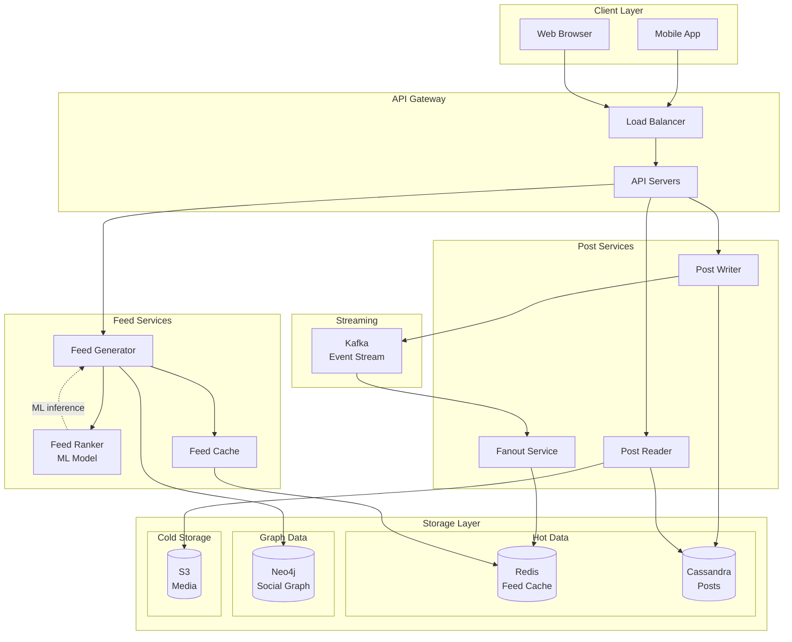
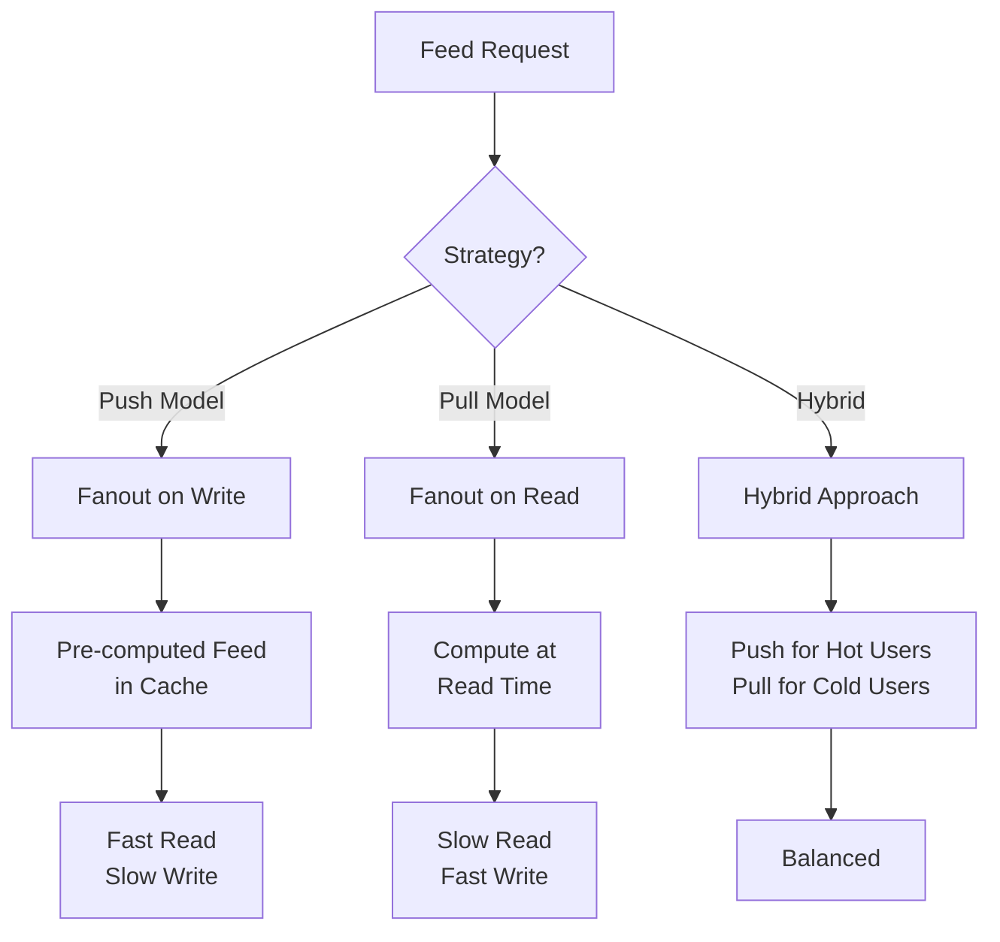

# News Feed System (Facebook/Twitter-like)

[← Back to Topics](../topics.md#news-feed-system-facebooktwitter-like)

## Problem Statement

Design a news feed system supporting 2B users, generating personalized timelines with posts from friends and pages, ranking by relevance, and supporting real-time updates.

---

## Requirements

### Functional Requirements
1. **Post Creation**: Users can create text, photo, video posts
2. **Feed Generation**: Personalized timeline for each user
3. **Ranking**: Sort by relevance (engagement, recency)
4. **Interactions**: Like, comment, share
5. **Real-time Updates**: New posts appear in feed
6. **Following**: Users follow other users/pages
7. **Privacy**: Public, friends-only, private posts
8. **Notifications**: Notify on interactions

### Non-Functional Requirements
1. **Scale**: 2B users, 1B daily active
2. **Feed Load**: <500ms p99
3. **Post Write**: <100ms
4. **Feed Updates**: <5s for new posts
5. **Storage**: 100 PB of posts/media
6. **Availability**: 99.99% uptime
7. **Ranking**: ML-based personalization

### Scale Estimates
- **Users**: 2 billion
- **Daily active users**: 1 billion
- **Avg friends**: 200
- **Posts per day**: 100 million
- **Feed requests**: 10 billion/day
- **Feed size**: 50 posts
- **Avg post size**: 1 KB (text + metadata)

---

## High-Level Architecture



---

## Detailed Design

### 1. Feed Generation Approaches



---

### 2. Post Write Service

```java
import java.util.*;
import java.time.Instant;

/**
 * Post write service
 * Handles creating new posts
 */
public class PostWriteService {
    
    private final PostRepository postRepository;
    private final SocialGraphService socialGraphService;
    private final FanoutService fanoutService;
    private final EventPublisher eventPublisher;
    
    public PostWriteService(
        PostRepository postRepository,
        SocialGraphService socialGraphService,
        FanoutService fanoutService,
        EventPublisher eventPublisher
    ) {
        this.postRepository = postRepository;
        this.socialGraphService = socialGraphService;
        this.fanoutService = fanoutService;
        this.eventPublisher = eventPublisher;
    }
    
    /**
     * Create new post
     */
    public Post createPost(CreatePostRequest request) {
        
        // 1. Validate post
        validatePost(request);
        
        // 2. Create post entity
        Post post = Post.builder()
            .postId(generatePostId())
            .userId(request.getUserId())
            .content(request.getContent())
            .mediaUrls(request.getMediaUrls())
            .privacy(request.getPrivacy())
            .createdAt(Instant.now())
            .likeCount(0)
            .commentCount(0)
            .shareCount(0)
            .build();
        
        // 3. Save to database
        postRepository.save(post);
        
        // 4. Publish event for fanout
        PostCreatedEvent event = new PostCreatedEvent(post);
        eventPublisher.publish(event);
        
        // 5. For celebrity users, use fanout-on-read
        // For normal users, use fanout-on-write
        if (isCelebrity(request.getUserId())) {
            // Skip fanout, will be pulled on read
            post.setFanoutType(FanoutType.ON_READ);
        } else {
            // Trigger fanout to followers
            fanoutService.fanoutAsync(post);
            post.setFanoutType(FanoutType.ON_WRITE);
        }
        
        return post;
    }
    
    /**
     * Check if user is celebrity (>1M followers)
     */
    private boolean isCelebrity(long userId) {
        long followerCount = socialGraphService.getFollowerCount(userId);
        return followerCount > 1_000_000;
    }
    
    /**
     * Validate post content
     */
    private void validatePost(CreatePostRequest request) {
        if (request.getContent() == null || request.getContent().trim().isEmpty()) {
            if (request.getMediaUrls() == null || request.getMediaUrls().isEmpty()) {
                throw new IllegalArgumentException("Post must have content or media");
            }
        }
        
        if (request.getContent() != null && request.getContent().length() > 5000) {
            throw new IllegalArgumentException("Post content too long");
        }
    }
    
    /**
     * Generate unique post ID (Snowflake-like)
     */
    private long generatePostId() {
        // Simplified Snowflake ID generation
        long timestamp = System.currentTimeMillis();
        long machineId = 1;  // In practice, get from config
        long sequence = 0;   // In practice, use atomic counter
        
        return (timestamp << 22) | (machineId << 12) | sequence;
    }
}

/**
 * Post entity
 */
class Post {
    private long postId;
    private long userId;
    private String content;
    private List<String> mediaUrls;
    private PrivacyLevel privacy;
    private Instant createdAt;
    private int likeCount;
    private int commentCount;
    private int shareCount;
    private FanoutType fanoutType;
    
    // Builder pattern
    public static Builder builder() {
        return new Builder();
    }
    
    public static class Builder {
        private Post post = new Post();
        
        public Builder postId(long postId) {
            post.postId = postId;
            return this;
        }
        
        public Builder userId(long userId) {
            post.userId = userId;
            return this;
        }
        
        public Builder content(String content) {
            post.content = content;
            return this;
        }
        
        public Builder mediaUrls(List<String> urls) {
            post.mediaUrls = urls;
            return this;
        }
        
        public Builder privacy(PrivacyLevel privacy) {
            post.privacy = privacy;
            return this;
        }
        
        public Builder createdAt(Instant createdAt) {
            post.createdAt = createdAt;
            return this;
        }
        
        public Builder likeCount(int count) {
            post.likeCount = count;
            return this;
        }
        
        public Builder commentCount(int count) {
            post.commentCount = count;
            return this;
        }
        
        public Builder shareCount(int count) {
            post.shareCount = count;
            return this;
        }
        
        public Post build() {
            return post;
        }
    }
    
    // Getters and setters
    public long getPostId() { return postId; }
    public long getUserId() { return userId; }
    public String getContent() { return content; }
    public List<String> getMediaUrls() { return mediaUrls; }
    public PrivacyLevel getPrivacy() { return privacy; }
    public Instant getCreatedAt() { return createdAt; }
    public int getLikeCount() { return likeCount; }
    public int getCommentCount() { return commentCount; }
    public int getShareCount() { return shareCount; }
    public FanoutType getFanoutType() { return fanoutType; }
    public void setFanoutType(FanoutType type) { this.fanoutType = type; }
}

/**
 * Privacy level
 */
enum PrivacyLevel {
    PUBLIC,
    FRIENDS_ONLY,
    PRIVATE
}

/**
 * Fanout type
 */
enum FanoutType {
    ON_WRITE,   // Pre-computed (push)
    ON_READ     // Computed on demand (pull)
}

/**
 * Create post request
 */
class CreatePostRequest {
    private long userId;
    private String content;
    private List<String> mediaUrls;
    private PrivacyLevel privacy;
    
    // Getters and setters
    public long getUserId() { return userId; }
    public void setUserId(long userId) { this.userId = userId; }
    
    public String getContent() { return content; }
    public void setContent(String content) { this.content = content; }
    
    public List<String> getMediaUrls() { return mediaUrls; }
    public void setMediaUrls(List<String> urls) { this.mediaUrls = urls; }
    
    public PrivacyLevel getPrivacy() { return privacy; }
    public void setPrivacy(PrivacyLevel privacy) { this.privacy = privacy; }
}

/**
 * Post created event
 */
class PostCreatedEvent {
    private final Post post;
    private final Instant timestamp;
    
    public PostCreatedEvent(Post post) {
        this.post = post;
        this.timestamp = Instant.now();
    }
    
    public Post getPost() { return post; }
    public Instant getTimestamp() { return timestamp; }
}
```

---

### 3. Fanout Service (Push Model)

```java
import java.util.*;
import java.util.concurrent.*;

/**
 * Fanout service
 * Distributes posts to followers' feeds (fanout-on-write)
 */
public class FanoutService {
    
    private final SocialGraphService socialGraphService;
    private final FeedCacheService feedCacheService;
    private final ExecutorService executorService;
    
    private static final int MAX_FEED_SIZE = 1000;
    private static final int FANOUT_BATCH_SIZE = 1000;
    
    public FanoutService(
        SocialGraphService socialGraphService,
        FeedCacheService feedCacheService
    ) {
        this.socialGraphService = socialGraphService;
        this.feedCacheService = feedCacheService;
        this.executorService = Executors.newFixedThreadPool(100);
    }
    
    /**
     * Fanout post to all followers (async)
     */
    public void fanoutAsync(Post post) {
        
        executorService.submit(() -> {
            try {
                fanout(post);
            } catch (Exception e) {
                System.err.println("Fanout failed for post " + post.getPostId() + ": " + e.getMessage());
            }
        });
    }
    
    /**
     * Fanout post to all followers
     */
    private void fanout(Post post) {
        
        long userId = post.getUserId();
        
        // Get all followers
        List<Long> followers = socialGraphService.getFollowers(userId);
        
        System.out.println("Fanning out post " + post.getPostId() + " to " + followers.size() + " followers");
        
        // Process in batches
        for (int i = 0; i < followers.size(); i += FANOUT_BATCH_SIZE) {
            
            int end = Math.min(i + FANOUT_BATCH_SIZE, followers.size());
            List<Long> batch = followers.subList(i, end);
            
            // Insert post into each follower's feed
            for (long followerId : batch) {
                insertIntoFeed(followerId, post);
            }
        }
    }
    
    /**
     * Insert post into user's feed cache
     */
    private void insertIntoFeed(long userId, Post post) {
        
        // Check privacy
        if (!canView(userId, post)) {
            return;
        }
        
        // Add to feed cache (Redis sorted set)
        feedCacheService.addToFeed(userId, post);
        
        // Trim feed to max size
        feedCacheService.trimFeed(userId, MAX_FEED_SIZE);
    }
    
    /**
     * Check if user can view post based on privacy
     */
    private boolean canView(long userId, Post post) {
        
        switch (post.getPrivacy()) {
            case PUBLIC:
                return true;
            
            case FRIENDS_ONLY:
                return socialGraphService.areFriends(userId, post.getUserId());
            
            case PRIVATE:
                return userId == post.getUserId();
            
            default:
                return false;
        }
    }
}
```

---

### 4. Feed Generation Service

```java
import java.util.*;
import java.util.stream.Collectors;

/**
 * Feed generation service
 * Generates personalized feed for user
 */
public class FeedGenerationService {
    
    private final FeedCacheService feedCacheService;
    private final SocialGraphService socialGraphService;
    private final PostRepository postRepository;
    private final FeedRankingService rankingService;
    
    private static final int DEFAULT_FEED_SIZE = 50;
    
    public FeedGenerationService(
        FeedCacheService feedCacheService,
        SocialGraphService socialGraphService,
        PostRepository postRepository,
        FeedRankingService rankingService
    ) {
        this.feedCacheService = feedCacheService;
        this.socialGraphService = socialGraphService;
        this.postRepository = postRepository;
        this.rankingService = rankingService;
    }
    
    /**
     * Get personalized feed for user
     */
    public List<Post> getFeed(long userId, int page, int pageSize) {
        
        // 1. Try cache first
        List<Post> cachedFeed = feedCacheService.getFeed(userId, page * pageSize, pageSize);
        
        if (cachedFeed != null && !cachedFeed.isEmpty()) {
            // Rank cached posts
            return rankingService.rankPosts(userId, cachedFeed);
        }
        
        // 2. Generate feed (hybrid approach)
        List<Post> feed = generateFeed(userId);
        
        // 3. Rank posts
        List<Post> rankedFeed = rankingService.rankPosts(userId, feed);
        
        // 4. Cache for future requests
        feedCacheService.cacheFeed(userId, rankedFeed);
        
        // 5. Paginate
        int start = page * pageSize;
        int end = Math.min(start + pageSize, rankedFeed.size());
        
        return rankedFeed.subList(start, end);
    }
    
    /**
     * Generate feed using hybrid approach
     */
    private List<Post> generateFeed(long userId) {
        
        List<Post> feed = new ArrayList<>();
        
        // Get users that this user follows
        List<Long> following = socialGraphService.getFollowing(userId);
        
        // Separate celebrities from normal users
        List<Long> celebrities = new ArrayList<>();
        List<Long> normalUsers = new ArrayList<>();
        
        for (long followedUserId : following) {
            if (socialGraphService.getFollowerCount(followedUserId) > 1_000_000) {
                celebrities.add(followedUserId);
            } else {
                normalUsers.add(followedUserId);
            }
        }
        
        // For normal users: use fanout-on-write (from cache)
        List<Post> preComputedPosts = feedCacheService.getFeed(userId, 0, 500);
        if (preComputedPosts != null) {
            feed.addAll(preComputedPosts);
        }
        
        // For celebrities: use fanout-on-read (fetch recent posts)
        if (!celebrities.isEmpty()) {
            List<Post> celebrityPosts = postRepository.getRecentPosts(celebrities, 100);
            feed.addAll(celebrityPosts);
        }
        
        return feed;
    }
}
```

---

### 5. Feed Ranking Service (ML-based)

```java
import java.util.*;
import java.util.stream.Collectors;

/**
 * Feed ranking service
 * Ranks posts by relevance using ML model
 */
public class FeedRankingService {
    
    private final UserInteractionService interactionService;
    private final MLModelService mlModelService;
    
    public FeedRankingService(
        UserInteractionService interactionService,
        MLModelService mlModelService
    ) {
        this.interactionService = interactionService;
        this.mlModelService = mlModelService;
    }
    
    /**
     * Rank posts for user
     */
    public List<Post> rankPosts(long userId, List<Post> posts) {
        
        // Calculate score for each post
        List<ScoredPost> scoredPosts = posts.stream()
            .map(post -> {
                double score = calculateScore(userId, post);
                return new ScoredPost(post, score);
            })
            .collect(Collectors.toList());
        
        // Sort by score descending
        scoredPosts.sort((a, b) -> Double.compare(b.getScore(), a.getScore()));
        
        // Extract posts
        return scoredPosts.stream()
            .map(ScoredPost::getPost)
            .collect(Collectors.toList());
    }
    
    /**
     * Calculate relevance score for post
     * 
     * Factors:
     * - Engagement (likes, comments, shares)
     * - Recency
     * - User affinity (how much user interacts with author)
     * - Content type preference
     * - ML model prediction
     */
    private double calculateScore(long userId, Post post) {
        
        // 1. Engagement score
        double engagementScore = calculateEngagementScore(post);
        
        // 2. Recency score (exponential decay)
        double recencyScore = calculateRecencyScore(post);
        
        // 3. User affinity score
        double affinityScore = interactionService.getAffinityScore(userId, post.getUserId());
        
        // 4. ML model prediction (probability of engagement)
        double mlScore = mlModelService.predictEngagement(userId, post);
        
        // Weighted combination
        double score = 
            0.3 * engagementScore +
            0.2 * recencyScore +
            0.2 * affinityScore +
            0.3 * mlScore;
        
        return score;
    }
    
    /**
     * Calculate engagement score
     */
    private double calculateEngagementScore(Post post) {
        
        int likes = post.getLikeCount();
        int comments = post.getCommentCount();
        int shares = post.getShareCount();
        
        // Weighted sum
        double score = likes + (comments * 2) + (shares * 3);
        
        // Normalize using log scale
        return Math.log(1 + score);
    }
    
    /**
     * Calculate recency score (exponential decay)
     */
    private double calculateRecencyScore(Post post) {
        
        long ageSeconds = System.currentTimeMillis() / 1000 - post.getCreatedAt().getEpochSecond();
        
        // Half-life of 24 hours
        double halfLife = 24 * 3600;
        
        return Math.pow(2, -ageSeconds / halfLife);
    }
}

/**
 * Scored post
 */
class ScoredPost {
    private final Post post;
    private final double score;
    
    public ScoredPost(Post post, double score) {
        this.post = post;
        this.score = score;
    }
    
    public Post getPost() { return post; }
    public double getScore() { return score; }
}

/**
 * User interaction service
 * Tracks user interactions for affinity calculation
 */
class UserInteractionService {
    
    /**
     * Get affinity score between user and author
     * Based on historical interactions
     */
    public double getAffinityScore(long userId, long authorId) {
        
        // In practice: query interaction history
        // For now, simplified calculation
        
        // Count recent interactions (likes, comments, views)
        int interactions = 0;  // Query from database
        
        // Normalize to [0, 1]
        return Math.min(interactions / 100.0, 1.0);
    }
}

/**
 * ML model service
 * Predicts engagement probability
 */
class MLModelService {
    
    /**
     * Predict engagement probability
     * 
     * Features:
     * - User demographics
     * - Post features (content type, length, media)
     * - Historical engagement patterns
     * - Time of day
     */
    public double predictEngagement(long userId, Post post) {
        
        // In practice: call ML model (TensorFlow Serving, SageMaker)
        
        // Extract features
        Map<String, Double> features = extractFeatures(userId, post);
        
        // Call model (simplified)
        double probability = callMLModel(features);
        
        return probability;
    }
    
    private Map<String, Double> extractFeatures(long userId, Post post) {
        
        Map<String, Double> features = new HashMap<>();
        
        // User features
        features.put("user_id", (double) userId);
        
        // Post features
        features.put("has_media", post.getMediaUrls() != null && !post.getMediaUrls().isEmpty() ? 1.0 : 0.0);
        features.put("content_length", (double) (post.getContent() != null ? post.getContent().length() : 0));
        features.put("post_age_hours", (double) (System.currentTimeMillis() - post.getCreatedAt().toEpochMilli()) / 3600000);
        
        // Engagement features
        features.put("like_count", (double) post.getLikeCount());
        features.put("comment_count", (double) post.getCommentCount());
        features.put("share_count", (double) post.getShareCount());
        
        return features;
    }
    
    private double callMLModel(Map<String, Double> features) {
        // In practice: HTTP call to model serving endpoint
        // Returns probability [0, 1]
        return 0.5;  // Placeholder
    }
}
```

---

### 6. Feed Cache Service (Redis)

```java
import redis.clients.jedis.*;
import java.util.*;
import java.util.stream.Collectors;

/**
 * Feed cache service
 * Stores pre-computed feeds in Redis sorted sets
 */
public class FeedCacheService {
    
    private final JedisPool jedisPool;
    private final PostRepository postRepository;
    
    private static final int CACHE_TTL_SECONDS = 3600;  // 1 hour
    
    public FeedCacheService(JedisPool jedisPool, PostRepository postRepository) {
        this.jedisPool = jedisPool;
        this.postRepository = postRepository;
    }
    
    /**
     * Add post to user's feed cache
     */
    public void addToFeed(long userId, Post post) {
        
        String key = getFeedKey(userId);
        
        try (Jedis jedis = jedisPool.getResource()) {
            
            // Use sorted set with timestamp as score
            double score = post.getCreatedAt().getEpochSecond();
            
            jedis.zadd(key, score, String.valueOf(post.getPostId()));
            
            // Set expiration
            jedis.expire(key, CACHE_TTL_SECONDS);
        }
    }
    
    /**
     * Get feed from cache
     */
    public List<Post> getFeed(long userId, int offset, int count) {
        
        String key = getFeedKey(userId);
        
        try (Jedis jedis = jedisPool.getResource()) {
            
            // Get post IDs (reverse order - newest first)
            List<String> postIds = jedis.zrevrange(key, offset, offset + count - 1);
            
            if (postIds == null || postIds.isEmpty()) {
                return null;
            }
            
            // Fetch posts from repository
            List<Long> ids = postIds.stream()
                .map(Long::parseLong)
                .collect(Collectors.toList());
            
            return postRepository.getPostsByIds(ids);
        }
    }
    
    /**
     * Cache entire feed
     */
    public void cacheFeed(long userId, List<Post> posts) {
        
        String key = getFeedKey(userId);
        
        try (Jedis jedis = jedisPool.getResource()) {
            
            // Clear existing feed
            jedis.del(key);
            
            // Add all posts
            Map<String, Double> scoreMembers = new HashMap<>();
            
            for (Post post : posts) {
                double score = post.getCreatedAt().getEpochSecond();
                scoreMembers.put(String.valueOf(post.getPostId()), score);
            }
            
            if (!scoreMembers.isEmpty()) {
                jedis.zadd(key, scoreMembers);
                jedis.expire(key, CACHE_TTL_SECONDS);
            }
        }
    }
    
    /**
     * Trim feed to max size
     */
    public void trimFeed(long userId, int maxSize) {
        
        String key = getFeedKey(userId);
        
        try (Jedis jedis = jedisPool.getResource()) {
            
            // Keep only top N items (by score)
            jedis.zremrangeByRank(key, 0, -(maxSize + 1));
        }
    }
    
    /**
     * Invalidate feed cache
     */
    public void invalidateFeed(long userId) {
        
        String key = getFeedKey(userId);
        
        try (Jedis jedis = jedisPool.getResource()) {
            jedis.del(key);
        }
    }
    
    private String getFeedKey(long userId) {
        return "feed:" + userId;
    }
}
```

---

## Technology Stack

| Component | Technology | Justification |
|-----------|------------|---------------|
| **API** | Spring Boot | Scalable REST API |
| **Feed Cache** | Redis Sorted Sets | Fast feed retrieval |
| **Posts DB** | Cassandra | High write throughput |
| **Social Graph** | Neo4j | Graph queries |
| **Streaming** | Kafka | Event-driven fanout |
| **Ranking** | TensorFlow Serving | ML inference |
| **Media** | S3 + CloudFront | CDN delivery |

---

## Performance Characteristics

### Feed Performance
```
Feed load time: <500ms p99
Cache hit ratio: 90%
Fanout time: <5 seconds (async)
Posts served: 10B requests/day
```

### Write Performance
```
Post creation: <100ms
Fanout to 1M followers: ~5 seconds (async)
Database writes: 100K ops/sec
```

---

## Trade-offs

### 1. Fanout Strategy
- **Fanout-on-write**: Fast reads, slow writes, storage overhead
- **Fanout-on-read**: Fast writes, slow reads, fresh content
- **Hybrid**: Balanced, complexity

### 2. Ranking
- **Simple (chronological)**: Fast, less engaging
- **ML-based**: Engaging, complex, expensive

### 3. Feed Freshness
- **Real-time**: Better UX, high cost
- **Eventual (cached)**: Cost-effective, stale content

---

## Summary

This design provides:
- ✅ **2B users** supported
- ✅ **<500ms p99** feed load time
- ✅ **ML-based** personalized ranking
- ✅ **Hybrid fanout** (push + pull)
- ✅ **Real-time updates** (<5s)
- ✅ **10B** feed requests/day

**Key Features:**
1. Hybrid fanout (celebrities use pull, others use push)
2. ML-based feed ranking
3. Redis feed caching
4. Kafka event streaming
5. Privacy controls
6. Scalable to billions of users

[← Back to Topics](../topics.md#news-feed-system-facebooktwitter-like)
