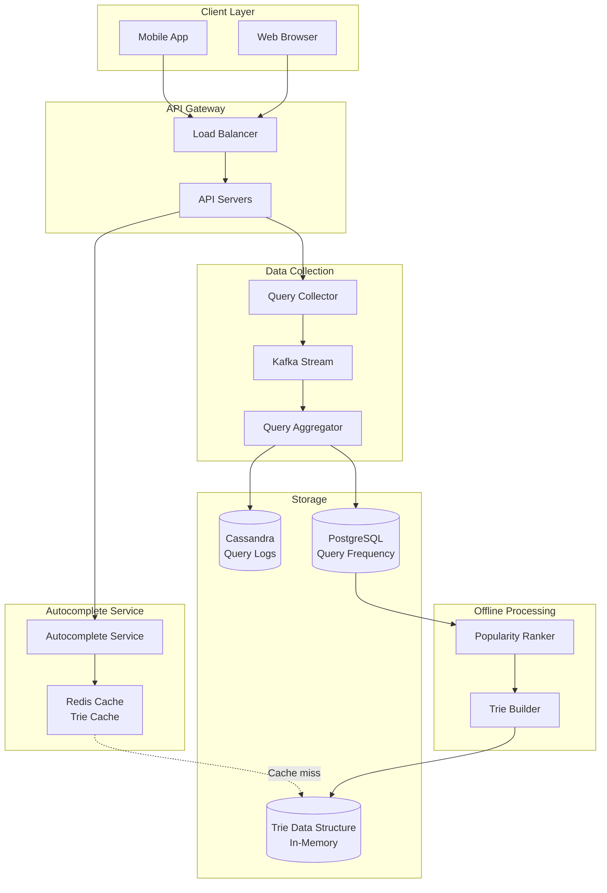
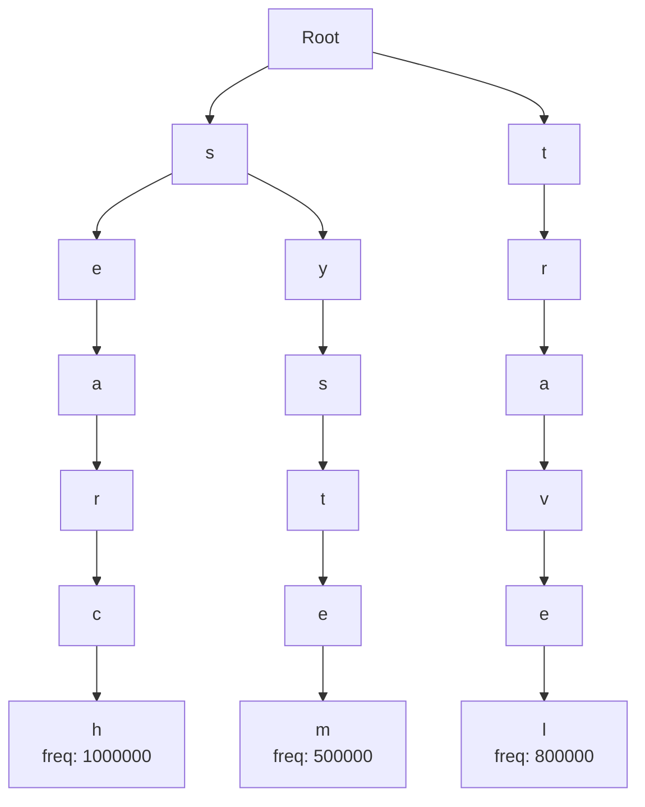

# Autocomplete/Typeahead Search System

[← Back to Topics](../topics.md#autocompletetypeahead-search)

## Problem Statement

Design an autocomplete system that provides real-time search suggestions as users type, supporting billions of queries per day with sub-100ms latency.

---

## Requirements

### Functional Requirements
1. **Real-time Suggestions**: Return suggestions as user types
2. **Ranking**: Sort by popularity and relevance
3. **Prefix Matching**: Match query prefixes
4. **Fuzzy Matching**: Handle typos (optional)
5. **Personalization**: User-specific suggestions
6. **Multi-language**: Support multiple languages
7. **Update Frequency**: Reflect trending queries
8. **Result Limit**: Return top 10 suggestions

### Non-Functional Requirements
1. **Scale**: 10B queries/day
2. **Latency**: <100ms p99
3. **Availability**: 99.99% uptime
4. **Suggestions**: Update every hour
5. **Storage**: 100M unique queries
6. **QPS**: 115K queries/second
7. **Data Freshness**: 1-hour lag acceptable

### Scale Estimates
- **Daily queries**: 10 billion
- **QPS**: 115,000
- **Peak QPS**: 350,000 (3x average)
- **Unique queries**: 100 million
- **Avg query length**: 20 characters
- **Storage**: ~2 GB for query strings

---

## High-Level Architecture



---

## Detailed Design

### 1. Trie Data Structure



---

### 2. Trie Implementation

```java
import java.util.*;
import java.util.concurrent.ConcurrentHashMap;

/**
 * Trie node
 */
class TrieNode {
    private Map<Character, TrieNode> children;
    private boolean isEndOfWord;
    private long frequency;      // Query frequency
    private String query;        // Complete query string
    
    public TrieNode() {
        this.children = new ConcurrentHashMap<>();
        this.isEndOfWord = false;
        this.frequency = 0;
    }
    
    public Map<Character, TrieNode> getChildren() {
        return children;
    }
    
    public boolean isEndOfWord() {
        return isEndOfWord;
    }
    
    public void setEndOfWord(boolean endOfWord) {
        isEndOfWord = endOfWord;
    }
    
    public long getFrequency() {
        return frequency;
    }
    
    public void setFrequency(long frequency) {
        this.frequency = frequency;
    }
    
    public String getQuery() {
        return query;
    }
    
    public void setQuery(String query) {
        this.query = query;
    }
}

/**
 * Trie data structure for autocomplete
 */
public class AutocompleteTrie {
    
    private final TrieNode root;
    private static final int MAX_SUGGESTIONS = 10;
    
    public AutocompleteTrie() {
        this.root = new TrieNode();
    }
    
    /**
     * Insert query into trie
     */
    public void insert(String query, long frequency) {
        
        query = query.toLowerCase().trim();
        
        if (query.isEmpty()) {
            return;
        }
        
        TrieNode current = root;
        
        for (char ch : query.toCharArray()) {
            current.getChildren().putIfAbsent(ch, new TrieNode());
            current = current.getChildren().get(ch);
        }
        
        current.setEndOfWord(true);
        current.setFrequency(frequency);
        current.setQuery(query);
    }
    
    /**
     * Get autocomplete suggestions for prefix
     */
    public List<String> getSuggestions(String prefix) {
        
        prefix = prefix.toLowerCase().trim();
        
        if (prefix.isEmpty()) {
            return Collections.emptyList();
        }
        
        // 1. Navigate to prefix node
        TrieNode prefixNode = findPrefixNode(prefix);
        
        if (prefixNode == null) {
            return Collections.emptyList();
        }
        
        // 2. Collect all queries under this prefix
        List<QuerySuggestion> suggestions = new ArrayList<>();
        collectSuggestions(prefixNode, suggestions);
        
        // 3. Sort by frequency (descending)
        suggestions.sort((a, b) -> Long.compare(b.getFrequency(), a.getFrequency()));
        
        // 4. Return top N
        return suggestions.stream()
            .limit(MAX_SUGGESTIONS)
            .map(QuerySuggestion::getQuery)
            .collect(java.util.stream.Collectors.toList());
    }
    
    /**
     * Find node corresponding to prefix
     */
    private TrieNode findPrefixNode(String prefix) {
        
        TrieNode current = root;
        
        for (char ch : prefix.toCharArray()) {
            current = current.getChildren().get(ch);
            
            if (current == null) {
                return null;
            }
        }
        
        return current;
    }
    
    /**
     * Collect all query suggestions from node
     */
    private void collectSuggestions(TrieNode node, List<QuerySuggestion> suggestions) {
        
        if (node == null) {
            return;
        }
        
        // If this is end of word, add to suggestions
        if (node.isEndOfWord()) {
            suggestions.add(new QuerySuggestion(node.getQuery(), node.getFrequency()));
        }
        
        // Recursively collect from children
        for (TrieNode child : node.getChildren().values()) {
            collectSuggestions(child, suggestions);
        }
    }
    
    /**
     * Get number of queries in trie
     */
    public int size() {
        return countQueries(root);
    }
    
    private int countQueries(TrieNode node) {
        if (node == null) {
            return 0;
        }
        
        int count = node.isEndOfWord() ? 1 : 0;
        
        for (TrieNode child : node.getChildren().values()) {
            count += countQueries(child);
        }
        
        return count;
    }
}

/**
 * Query suggestion
 */
class QuerySuggestion {
    private final String query;
    private final long frequency;
    
    public QuerySuggestion(String query, long frequency) {
        this.query = query;
        this.frequency = frequency;
    }
    
    public String getQuery() {
        return query;
    }
    
    public long getFrequency() {
        return frequency;
    }
}
```

---

### 3. Autocomplete Service

```java
import redis.clients.jedis.*;
import java.util.*;

/**
 * Autocomplete service
 * Provides real-time search suggestions
 */
public class AutocompleteService {
    
    private final AutocompleteTrie trie;
    private final JedisPool redisPool;
    private final QueryLogger queryLogger;
    
    private static final int CACHE_TTL_SECONDS = 3600; // 1 hour
    
    public AutocompleteService(
        AutocompleteTrie trie,
        JedisPool redisPool,
        QueryLogger queryLogger
    ) {
        this.trie = trie;
        this.redisPool = redisPool;
        this.queryLogger = queryLogger;
    }
    
    /**
     * Get autocomplete suggestions
     */
    public List<String> getSuggestions(String prefix, String userId) {
        
        // 1. Check cache first
        List<String> cachedSuggestions = getCachedSuggestions(prefix);
        
        if (cachedSuggestions != null) {
            return cachedSuggestions;
        }
        
        // 2. Get from trie
        List<String> suggestions = trie.getSuggestions(prefix);
        
        // 3. Personalize if user ID provided
        if (userId != null) {
            suggestions = personalize(suggestions, userId);
        }
        
        // 4. Cache suggestions
        cacheSuggestions(prefix, suggestions);
        
        // 5. Log query for analytics
        queryLogger.logQuery(prefix, userId);
        
        return suggestions;
    }
    
    /**
     * Get cached suggestions from Redis
     */
    private List<String> getCachedSuggestions(String prefix) {
        
        String cacheKey = "autocomplete:" + prefix.toLowerCase();
        
        try (Jedis jedis = redisPool.getResource()) {
            
            List<String> cached = jedis.lrange(cacheKey, 0, -1);
            
            return cached.isEmpty() ? null : cached;
        }
    }
    
    /**
     * Cache suggestions in Redis
     */
    private void cacheSuggestions(String prefix, List<String> suggestions) {
        
        String cacheKey = "autocomplete:" + prefix.toLowerCase();
        
        try (Jedis jedis = redisPool.getResource()) {
            
            // Delete existing key
            jedis.del(cacheKey);
            
            // Push all suggestions
            if (!suggestions.isEmpty()) {
                jedis.rpush(cacheKey, suggestions.toArray(new String[0]));
                jedis.expire(cacheKey, CACHE_TTL_SECONDS);
            }
        }
    }
    
    /**
     * Personalize suggestions based on user history
     */
    private List<String> personalize(List<String> suggestions, String userId) {
        
        // Get user's search history
        Set<String> userHistory = getUserSearchHistory(userId);
        
        if (userHistory.isEmpty()) {
            return suggestions;
        }
        
        // Boost suggestions that user has searched before
        List<String> personalized = new ArrayList<>();
        List<String> others = new ArrayList<>();
        
        for (String suggestion : suggestions) {
            if (userHistory.contains(suggestion)) {
                personalized.add(suggestion);
            } else {
                others.add(suggestion);
            }
        }
        
        // Combine: user history first, then others
        personalized.addAll(others);
        
        return personalized;
    }
    
    /**
     * Get user search history
     */
    private Set<String> getUserSearchHistory(String userId) {
        
        String key = "history:" + userId;
        
        try (Jedis jedis = redisPool.getResource()) {
            return jedis.smembers(key);
        }
    }
}

/**
 * Query logger
 * Logs queries for analytics and trie rebuilding
 */
class QueryLogger {
    
    private final QueryRepository queryRepository;
    
    public QueryLogger(QueryRepository queryRepository) {
        this.queryRepository = queryRepository;
    }
    
    /**
     * Log query (async)
     */
    public void logQuery(String query, String userId) {
        
        // Log asynchronously to avoid blocking
        java.util.concurrent.CompletableFuture.runAsync(() -> {
            queryRepository.log(query, userId, System.currentTimeMillis());
        });
    }
}

/**
 * Query repository interface
 */
interface QueryRepository {
    void log(String query, String userId, long timestamp);
    Map<String, Long> getQueryFrequencies();
}
```

---

### 4. Trie Builder (Offline Processing)

```java
import java.util.*;
import java.util.concurrent.*;

/**
 * Trie builder
 * Rebuilds trie periodically based on query frequencies
 */
public class TrieBuilder {
    
    private final QueryRepository queryRepository;
    private final AutocompleteTrie trie;
    private final ScheduledExecutorService scheduler;
    
    private static final int REBUILD_INTERVAL_HOURS = 1;
    
    public TrieBuilder(QueryRepository queryRepository, AutocompleteTrie trie) {
        this.queryRepository = queryRepository;
        this.trie = trie;
        this.scheduler = Executors.newSingleThreadScheduledExecutor();
    }
    
    /**
     * Start periodic trie rebuilding
     */
    public void startPeriodicRebuild() {
        
        scheduler.scheduleAtFixedRate(
            this::rebuildTrie,
            0,
            REBUILD_INTERVAL_HOURS,
            TimeUnit.HOURS
        );
        
        System.out.println("Trie rebuilding scheduled every " + REBUILD_INTERVAL_HOURS + " hours");
    }
    
    /**
     * Rebuild trie from query frequencies
     */
    public void rebuildTrie() {
        
        System.out.println("Rebuilding trie...");
        
        long startTime = System.currentTimeMillis();
        
        // 1. Get query frequencies from database
        Map<String, Long> queryFrequencies = queryRepository.getQueryFrequencies();
        
        System.out.println("Loaded " + queryFrequencies.size() + " queries");
        
        // 2. Filter queries (min frequency threshold)
        Map<String, Long> filtered = filterQueries(queryFrequencies, 10);
        
        // 3. Build new trie
        AutocompleteTrie newTrie = new AutocompleteTrie();
        
        for (Map.Entry<String, Long> entry : filtered.entrySet()) {
            newTrie.insert(entry.getKey(), entry.getValue());
        }
        
        // 4. Replace old trie (atomic swap)
        // In practice, use double buffering or pointer swap
        synchronized (trie) {
            // Copy new trie data to existing trie
            // Simplified: in production, use immutable trie and swap reference
        }
        
        long duration = System.currentTimeMillis() - startTime;
        
        System.out.println("Trie rebuilt in " + duration + "ms. Queries: " + newTrie.size());
    }
    
    /**
     * Filter queries by minimum frequency
     */
    private Map<String, Long> filterQueries(Map<String, Long> queries, long minFrequency) {
        
        Map<String, Long> filtered = new HashMap<>();
        
        for (Map.Entry<String, Long> entry : queries.entrySet()) {
            if (entry.getValue() >= minFrequency) {
                filtered.put(entry.getKey(), entry.getValue());
            }
        }
        
        return filtered;
    }
    
    public void shutdown() {
        scheduler.shutdown();
    }
}
```

---

### 5. Query Aggregator

```java
import java.util.*;
import java.util.concurrent.*;

/**
 * Query aggregator
 * Aggregates query frequencies in real-time
 */
public class QueryAggregator {
    
    private final Map<String, Long> queryFrequencies;
    private final QueryRepository queryRepository;
    private final ScheduledExecutorService scheduler;
    
    private static final int FLUSH_INTERVAL_SECONDS = 60;
    
    public QueryAggregator(QueryRepository queryRepository) {
        this.queryFrequencies = new ConcurrentHashMap<>();
        this.queryRepository = queryRepository;
        this.scheduler = Executors.newSingleThreadScheduledExecutor();
    }
    
    /**
     * Start periodic flushing
     */
    public void start() {
        
        scheduler.scheduleAtFixedRate(
            this::flushToDatabase,
            FLUSH_INTERVAL_SECONDS,
            FLUSH_INTERVAL_SECONDS,
            TimeUnit.SECONDS
        );
    }
    
    /**
     * Increment query count
     */
    public void incrementQuery(String query) {
        
        query = query.toLowerCase().trim();
        
        queryFrequencies.merge(query, 1L, Long::sum);
    }
    
    /**
     * Flush aggregated frequencies to database
     */
    private void flushToDatabase() {
        
        if (queryFrequencies.isEmpty()) {
            return;
        }
        
        // Copy and clear
        Map<String, Long> toFlush = new HashMap<>(queryFrequencies);
        queryFrequencies.clear();
        
        // Batch update to database
        queryRepository.batchUpdateFrequencies(toFlush);
        
        System.out.println("Flushed " + toFlush.size() + " query frequencies");
    }
    
    public void shutdown() {
        flushToDatabase();  // Final flush
        scheduler.shutdown();
    }
}

/**
 * Enhanced query repository
 */
interface QueryRepository {
    void log(String query, String userId, long timestamp);
    Map<String, Long> getQueryFrequencies();
    void batchUpdateFrequencies(Map<String, Long> frequencies);
}
```

---

## Technology Stack

| Component | Technology | Justification |
|-----------|------------|---------------|
| **Data Structure** | Trie | Prefix matching O(k) |
| **Cache** | Redis | Low-latency lookups |
| **Database** | Cassandra | Query logs at scale |
| **Aggregation** | PostgreSQL | Frequency aggregation |
| **Streaming** | Kafka | Real-time data pipeline |

---

## Performance Characteristics

### Query Performance
```
Latency: <100ms p99
Cache hit ratio: 95%
Trie lookup: O(k) where k = prefix length
Memory: ~2 GB for 100M queries
```

### Throughput
```
QPS: 115K average, 350K peak
Rebuild time: <5 minutes
Update frequency: Hourly
```

---

## Trade-offs

### 1. Trie vs Database
- **Trie**: Fast (O(k)), high memory
- **Database**: Slower, lower memory

### 2. Update Frequency
- **Real-time**: Fresh data, high cost
- **Hourly**: Stale data, cost-effective

### 3. Personalization
- **Heavy**: Better UX, complexity
- **Light**: Simple, less relevant

---

## Summary

This design provides:
- ✅ **<100ms p99** latency
- ✅ **115K QPS** (350K peak)
- ✅ **100M unique** queries
- ✅ **Hourly updates** for freshness
- ✅ **Personalization** support
- ✅ **95% cache** hit ratio

**Key Features:**
1. Trie-based prefix matching
2. Redis caching layer
3. Periodic trie rebuilding
4. Real-time query aggregation
5. User personalization
6. Scalable to billions of queries

[← Back to Topics](../topics.md#autocompletetypeahead-search)
