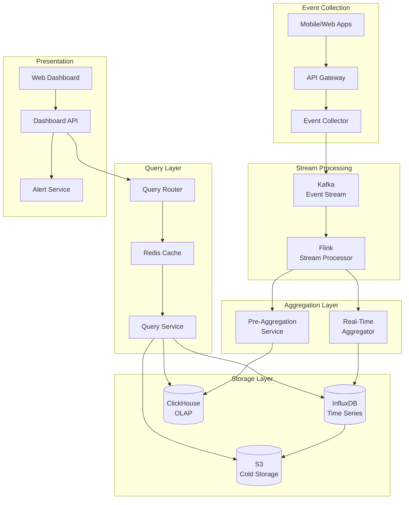
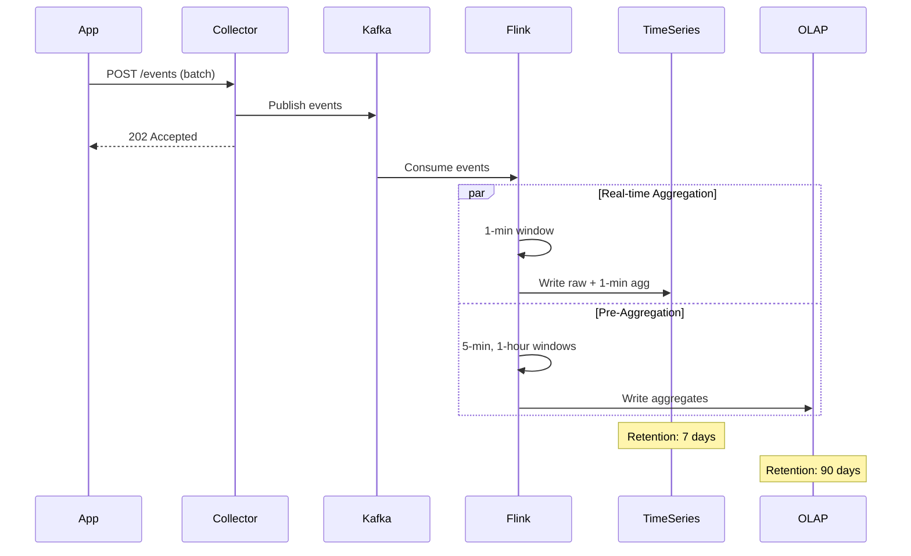

# Social Media Analytics Dashboard

[← Back to Topics](../topics.md#social-media-analytics-dashboard)

## Problem Statement

Design a real-time analytics dashboard that displays user engagement metrics (views, likes, shares, comments) with aggregations over various time windows for millions of users.

---

## Requirements

### Functional Requirements
1. **Real-time Metrics**: Views, likes, shares, comments
2. **Time Windows**: Last hour, day, week, month
3. **Aggregations**: Sum, average, percentiles
4. **User Segmentation**: By demographics, behavior
5. **Custom Reports**: User-defined metrics
6. **Alerts**: Threshold-based notifications
7. **Export**: CSV, PDF reports
8. **Drill-down**: Click to view details

### Non-Functional Requirements
1. **Scale**: 100M users, 1B events/day
2. **Latency**: <2s dashboard load
3. **Real-time**: <10s event to display
4. **Retention**: 90 days hot, 1 year cold
5. **Concurrency**: 10K dashboard users
6. **Availability**: 99.9% uptime

### Scale Estimates
- **Events per day**: 1 billion
- **Events per second**: 11,574 avg, 50K peak
- **Dashboard users**: 10,000 concurrent
- **Metrics stored**: 1 trillion data points
- **Storage**: 50 TB (90 days)
- **Query throughput**: 5K queries/sec

---

## High-Level Architecture



---

## Detailed Design

### 1. Event Flow



---

### 2. Event Collector

```java
import java.util.*;
import java.util.concurrent.*;
import org.apache.kafka.clients.producer.*;

/**
 * Event collector
 * Collects analytics events and publishes to Kafka
 */
public class EventCollector {
    
    private final KafkaProducer<String, AnalyticsEvent> producer;
    private final ExecutorService executor;
    
    private static final String TOPIC = "analytics_events";
    private static final int BATCH_SIZE = 100;
    
    public EventCollector(Properties kafkaProps) {
        this.producer = new KafkaProducer<>(kafkaProps);
        this.executor = Executors.newFixedThreadPool(10);
    }
    
    /**
     * Collect events (batch API)
     */
    public CompletableFuture<Void> collectEvents(List<AnalyticsEvent> events) {
        
        return CompletableFuture.runAsync(() -> {
            
            // Validate events
            List<AnalyticsEvent> validEvents = events.stream()
                .filter(this::validateEvent)
                .toList();
            
            // Enrich with metadata
            validEvents.forEach(this::enrichEvent);
            
            // Publish to Kafka
            List<CompletableFuture<RecordMetadata>> futures = new ArrayList<>();
            
            for (AnalyticsEvent event : validEvents) {
                
                ProducerRecord<String, AnalyticsEvent> record = new ProducerRecord<>(
                    TOPIC,
                    event.getUserId(),  // Partition by user
                    event
                );
                
                CompletableFuture<RecordMetadata> future = new CompletableFuture<>();
                
                producer.send(record, (metadata, exception) -> {
                    if (exception != null) {
                        future.completeExceptionally(exception);
                    } else {
                        future.complete(metadata);
                    }
                });
                
                futures.add(future);
            }
            
            // Wait for all sends
            CompletableFuture.allOf(futures.toArray(new CompletableFuture[0])).join();
            
        }, executor);
    }
    
    /**
     * Validate event
     */
    private boolean validateEvent(AnalyticsEvent event) {
        return event.getUserId() != null
            && event.getEventType() != null
            && event.getTimestamp() > 0;
    }
    
    /**
     * Enrich event with metadata
     */
    private void enrichEvent(AnalyticsEvent event) {
        
        if (event.getTimestamp() == 0) {
            event.setTimestamp(System.currentTimeMillis());
        }
        
        // Add server timestamp
        event.setServerTimestamp(System.currentTimeMillis());
        
        // Add session info if missing
        if (event.getSessionId() == null) {
            event.setSessionId(UUID.randomUUID().toString());
        }
    }
}

/**
 * Analytics event
 */
class AnalyticsEvent {
    
    private String userId;
    private String sessionId;
    private EventType eventType;
    private long timestamp;
    private long serverTimestamp;
    private Map<String, Object> properties;
    
    // Getters and setters
    public String getUserId() { return userId; }
    public void setUserId(String userId) { this.userId = userId; }
    
    public String getSessionId() { return sessionId; }
    public void setSessionId(String sessionId) { this.sessionId = sessionId; }
    
    public EventType getEventType() { return eventType; }
    public void setEventType(EventType eventType) { this.eventType = eventType; }
    
    public long getTimestamp() { return timestamp; }
    public void setTimestamp(long timestamp) { this.timestamp = timestamp; }
    
    public long getServerTimestamp() { return serverTimestamp; }
    public void setServerTimestamp(long serverTimestamp) { 
        this.serverTimestamp = serverTimestamp; 
    }
    
    public Map<String, Object> getProperties() { return properties; }
    public void setProperties(Map<String, Object> properties) { 
        this.properties = properties; 
    }
}

/**
 * Event types
 */
enum EventType {
    PAGE_VIEW,
    BUTTON_CLICK,
    POST_LIKE,
    POST_SHARE,
    POST_COMMENT,
    VIDEO_VIEW,
    SEARCH,
    PURCHASE
}
```

---

### 3. Real-Time Aggregator (Flink)

```java
import org.apache.flink.api.common.functions.AggregateFunction;
import org.apache.flink.streaming.api.datastream.DataStream;
import org.apache.flink.streaming.api.environment.StreamExecutionEnvironment;
import org.apache.flink.streaming.api.windowing.time.Time;
import org.apache.flink.streaming.api.windowing.assigners.TumblingEventTimeWindows;
import java.util.*;

/**
 * Real-time aggregator using Flink
 */
public class RealTimeAggregator {
    
    public static void main(String[] args) throws Exception {
        
        StreamExecutionEnvironment env = StreamExecutionEnvironment.getExecutionEnvironment();
        
        // Read from Kafka
        DataStream<AnalyticsEvent> events = env
            .addSource(new FlinkKafkaConsumer<>("analytics_events", ...))
            .assignTimestampsAndWatermarks(...);
        
        // 1-minute tumbling window
        DataStream<AggregatedMetrics> oneMinAgg = events
            .keyBy(event -> event.getUserId() + ":" + event.getEventType())
            .window(TumblingEventTimeWindows.of(Time.minutes(1)))
            .aggregate(new EventAggregator());
        
        // Write to InfluxDB
        oneMinAgg.addSink(new InfluxDBSink());
        
        // 5-minute tumbling window
        DataStream<AggregatedMetrics> fiveMinAgg = events
            .keyBy(event -> event.getUserId() + ":" + event.getEventType())
            .window(TumblingEventTimeWindows.of(Time.minutes(5)))
            .aggregate(new EventAggregator());
        
        // Write to ClickHouse
        fiveMinAgg.addSink(new ClickHouseSink());
        
        // 1-hour tumbling window
        DataStream<AggregatedMetrics> oneHourAgg = events
            .keyBy(event -> event.getUserId() + ":" + event.getEventType())
            .window(TumblingEventTimeWindows.of(Time.hours(1)))
            .aggregate(new EventAggregator());
        
        oneHourAgg.addSink(new ClickHouseSink());
        
        env.execute("Real-Time Analytics Aggregator");
    }
    
    /**
     * Event aggregator function
     */
    static class EventAggregator implements AggregateFunction<
        AnalyticsEvent,
        EventAccumulator,
        AggregatedMetrics
    > {
        
        @Override
        public EventAccumulator createAccumulator() {
            return new EventAccumulator();
        }
        
        @Override
        public EventAccumulator add(AnalyticsEvent event, EventAccumulator acc) {
            acc.count++;
            acc.sum += (Long) event.getProperties().getOrDefault("value", 0L);
            acc.users.add(event.getUserId());
            return acc;
        }
        
        @Override
        public AggregatedMetrics getResult(EventAccumulator acc) {
            AggregatedMetrics metrics = new AggregatedMetrics();
            metrics.setCount(acc.count);
            metrics.setSum(acc.sum);
            metrics.setAverage(acc.sum / (double) acc.count);
            metrics.setUniqueUsers(acc.users.size());
            return metrics;
        }
        
        @Override
        public EventAccumulator merge(EventAccumulator a, EventAccumulator b) {
            a.count += b.count;
            a.sum += b.sum;
            a.users.addAll(b.users);
            return a;
        }
    }
    
    /**
     * Event accumulator
     */
    static class EventAccumulator {
        long count = 0;
        long sum = 0;
        Set<String> users = new HashSet<>();
    }
}

/**
 * Aggregated metrics
 */
class AggregatedMetrics {
    private String metricKey;
    private long windowStart;
    private long windowEnd;
    private long count;
    private long sum;
    private double average;
    private int uniqueUsers;
    
    // Getters and setters
    public long getCount() { return count; }
    public void setCount(long count) { this.count = count; }
    
    public long getSum() { return sum; }
    public void setSum(long sum) { this.sum = sum; }
    
    public double getAverage() { return average; }
    public void setAverage(double average) { this.average = average; }
    
    public int getUniqueUsers() { return uniqueUsers; }
    public void setUniqueUsers(int uniqueUsers) { this.uniqueUsers = uniqueUsers; }
}
```

---

### 4. Query Service

```java
import java.util.*;
import java.util.concurrent.CompletableFuture;
import redis.clients.jedis.*;

/**
 * Query service
 * Handles dashboard queries with caching
 */
public class QueryService {
    
    private final InfluxDBClient influxDB;
    private final ClickHouseClient clickHouse;
    private final JedisPool jedisPool;
    
    private static final int CACHE_TTL_SECONDS = 60;
    
    public QueryService(
        InfluxDBClient influxDB,
        ClickHouseClient clickHouse,
        JedisPool jedisPool
    ) {
        this.influxDB = influxDB;
        this.clickHouse = clickHouse;
        this.jedisPool = jedisPool;
    }
    
    /**
     * Get metrics for dashboard
     */
    public DashboardMetrics getMetrics(MetricQuery query) {
        
        // Check cache
        String cacheKey = buildCacheKey(query);
        
        try (Jedis jedis = jedisPool.getResource()) {
            String cached = jedis.get(cacheKey);
            
            if (cached != null) {
                return deserialize(cached);
            }
        }
        
        // Query based on time range
        DashboardMetrics metrics;
        
        if (query.getTimeRange().isRecent()) {
            // Last hour: query InfluxDB (real-time)
            metrics = queryInfluxDB(query);
        } else {
            // Older: query ClickHouse (pre-aggregated)
            metrics = queryClickHouse(query);
        }
        
        // Cache result
        try (Jedis jedis = jedisPool.getResource()) {
            jedis.setex(cacheKey, CACHE_TTL_SECONDS, serialize(metrics));
        }
        
        return metrics;
    }
    
    /**
     * Query InfluxDB for recent data
     */
    private DashboardMetrics queryInfluxDB(MetricQuery query) {
        
        String flux = buildFluxQuery(query);
        List<FluxTable> tables = influxDB.query(flux);
        
        return parseInfluxResults(tables);
    }
    
    /**
     * Query ClickHouse for historical data
     */
    private DashboardMetrics queryClickHouse(MetricQuery query) {
        
        String sql = buildClickHouseQuery(query);
        ResultSet rs = clickHouse.query(sql);
        
        return parseClickHouseResults(rs);
    }
    
    /**
     * Build Flux query for InfluxDB
     */
    private String buildFluxQuery(MetricQuery query) {
        
        StringBuilder flux = new StringBuilder();
        
        flux.append("from(bucket: \"analytics\")\n");
        flux.append("  |> range(start: ").append(query.getStartTime()).append(")\n");
        flux.append("  |> filter(fn: (r) => r[\"_measurement\"] == \"events\")\n");
        
        if (query.getUserId() != null) {
            flux.append("  |> filter(fn: (r) => r[\"user_id\"] == \"")
                .append(query.getUserId()).append("\")\n");
        }
        
        if (query.getEventType() != null) {
            flux.append("  |> filter(fn: (r) => r[\"event_type\"] == \"")
                .append(query.getEventType()).append("\")\n");
        }
        
        flux.append("  |> aggregateWindow(every: ")
            .append(query.getGranularity()).append(", fn: sum)\n");
        
        return flux.toString();
    }
    
    /**
     * Build ClickHouse SQL query
     */
    private String buildClickHouseQuery(MetricQuery query) {
        
        StringBuilder sql = new StringBuilder();
        
        sql.append("SELECT\n");
        sql.append("  toStartOfInterval(timestamp, INTERVAL ")
            .append(query.getGranularity()).append(") AS time_bucket,\n");
        sql.append("  event_type,\n");
        sql.append("  count(*) AS count,\n");
        sql.append("  uniqExact(user_id) AS unique_users\n");
        sql.append("FROM analytics_events\n");
        sql.append("WHERE timestamp >= ").append(query.getStartTime()).append("\n");
        sql.append("  AND timestamp < ").append(query.getEndTime()).append("\n");
        
        if (query.getUserId() != null) {
            sql.append("  AND user_id = '").append(query.getUserId()).append("'\n");
        }
        
        if (query.getEventType() != null) {
            sql.append("  AND event_type = '").append(query.getEventType()).append("'\n");
        }
        
        sql.append("GROUP BY time_bucket, event_type\n");
        sql.append("ORDER BY time_bucket\n");
        
        return sql.toString();
    }
    
    /**
     * Build cache key
     */
    private String buildCacheKey(MetricQuery query) {
        return String.format("metrics:%s:%s:%s:%s",
            query.getStartTime(),
            query.getEndTime(),
            query.getUserId(),
            query.getEventType()
        );
    }
    
    // Placeholder methods
    private DashboardMetrics parseInfluxResults(List<FluxTable> tables) { return new DashboardMetrics(); }
    private DashboardMetrics parseClickHouseResults(ResultSet rs) { return new DashboardMetrics(); }
    private String serialize(DashboardMetrics metrics) { return "{}"; }
    private DashboardMetrics deserialize(String json) { return new DashboardMetrics(); }
}

/**
 * Metric query
 */
class MetricQuery {
    private long startTime;
    private long endTime;
    private String userId;
    private String eventType;
    private String granularity;  // "1m", "5m", "1h", "1d"
    private TimeRange timeRange;
    
    // Getters
    public long getStartTime() { return startTime; }
    public long getEndTime() { return endTime; }
    public String getUserId() { return userId; }
    public String getEventType() { return eventType; }
    public String getGranularity() { return granularity; }
    public TimeRange getTimeRange() { return timeRange; }
}

/**
 * Time range
 */
class TimeRange {
    private long start;
    private long end;
    
    public boolean isRecent() {
        return (System.currentTimeMillis() - start) < 3600_000; // 1 hour
    }
}

/**
 * Dashboard metrics
 */
class DashboardMetrics {
    private List<DataPoint> dataPoints;
    private Map<String, Long> aggregates;
    
    // Getters and setters
}

/**
 * Data point
 */
class DataPoint {
    private long timestamp;
    private double value;
    
    public DataPoint(long timestamp, double value) {
        this.timestamp = timestamp;
        this.value = value;
    }
}

// Placeholder interfaces
interface InfluxDBClient {
    List<FluxTable> query(String flux);
}

interface ClickHouseClient {
    ResultSet query(String sql);
}

interface FluxTable {}
interface ResultSet {}
```

---

## Technology Stack

| Component | Technology | Justification |
|-----------|------------|---------------|
| **Stream Processing** | Apache Flink | Real-time aggregation |
| **Time Series DB** | InfluxDB | Optimized for time-series |
| **OLAP** | ClickHouse | Fast analytical queries |
| **Cache** | Redis | Sub-ms query cache |
| **Message Queue** | Kafka | Event streaming |
| **Cold Storage** | S3 | Long-term retention |

---

## Performance Characteristics

### Ingestion Performance
```
Events/sec: 50K peak
Latency: <10ms collection
Kafka throughput: 1M msg/sec
Flink processing: 100K events/sec/core
```

### Query Performance
```
Dashboard load: <2s
Cache hit rate: 80%
InfluxDB query: <500ms
ClickHouse query: <1s
```

---

## Trade-offs

### 1. Storage Choice
- **InfluxDB**: Fast writes, 7-day retention
- **ClickHouse**: Analytical queries, 90-day retention
- **S3**: Cheap, slow queries

### 2. Aggregation Strategy
- **Real-time**: Fresh data, expensive
- **Pre-aggregated**: Fast queries, less flexible

### 3. Caching
- **Cache everything**: Fast, stale data
- **No cache**: Always fresh, slow

---

## Summary

This design provides:
- ✅ **<2s** dashboard load time
- ✅ **<10s** real-time updates
- ✅ **1B events/day** ingestion
- ✅ **50K events/sec** peak throughput
- ✅ **Multi-window** aggregations
- ✅ **90-day** retention

**Key Features:**
1. Flink stream processing
2. Lambda architecture (real-time + batch)
3. InfluxDB for recent data
4. ClickHouse for historical analytics
5. Redis caching layer
6. S3 cold storage

[← Back to Topics](../topics.md#social-media-analytics-dashboard)
