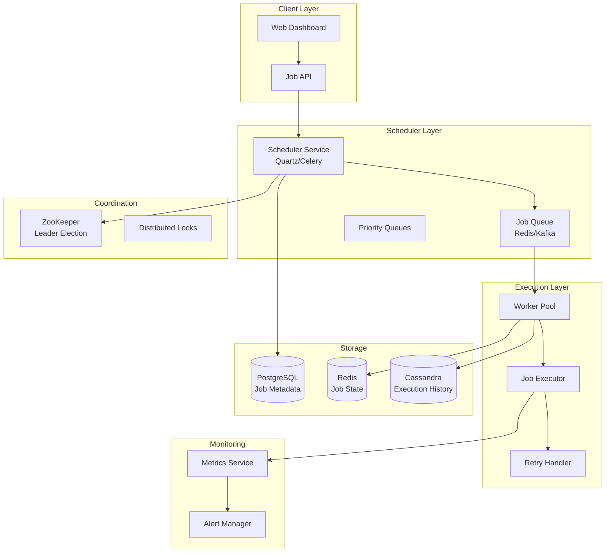
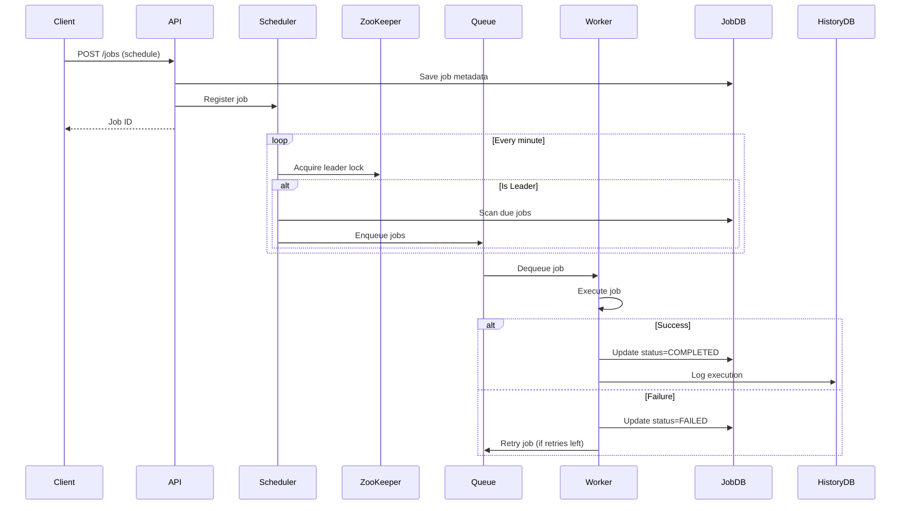

# Task Scheduler / Cron Job System

[← Back to Topics](../topics.md#task-scheduler--cron-job-system)

## Problem Statement

Design a distributed task scheduler (like cron) that can execute millions of scheduled jobs reliably with exactly-once execution guarantees and failure handling.

---

## Requirements

### Functional Requirements
1. **Schedule Jobs**: One-time, recurring (cron expressions)
2. **Exactly-Once**: No duplicate executions
3. **Reliability**: Retry failed jobs
4. **Priority**: High/medium/low priority jobs
5. **Dependencies**: Job chains (A → B → C)
6. **Monitoring**: Execution history, metrics
7. **API**: REST API to manage jobs
8. **Multi-tenancy**: Isolated job queues

### Non-Functional Requirements
1. **Scale**: 10M jobs/day
2. **Latency**: <5s execution delay
3. **Throughput**: 1000 jobs/sec
4. **Availability**: 99.99% uptime
5. **Durability**: No job loss
6. **Consistency**: Exactly-once execution

### Scale Estimates
- **Jobs per day**: 10 million
- **Jobs per second**: 116 avg, 1000 peak
- **Active jobs**: 100K scheduled
- **Job retention**: 30 days
- **Workers**: 100 servers
- **Storage**: 1 TB job metadata

---

## High-Level Architecture



---

## Detailed Design

### 1. Job Scheduling Flow



---

### 2. Scheduler Service

```java
import java.util.*;
import java.util.concurrent.*;
import org.quartz.*;
import org.quartz.impl.StdSchedulerFactory;

/**
 * Distributed task scheduler
 * Uses Quartz for scheduling and distributed locks for HA
 */
public class TaskSchedulerService {
    
    private final Scheduler scheduler;
    private final JobRepository jobRepository;
    private final JobQueue jobQueue;
    private final DistributedLockService lockService;
    
    private static final String SCHEDULER_LOCK = "scheduler_leader_lock";
    private static final int SCAN_INTERVAL_SECONDS = 60;
    
    public TaskSchedulerService(
        JobRepository jobRepository,
        JobQueue jobQueue,
        DistributedLockService lockService
    ) throws SchedulerException {
        
        this.scheduler = StdSchedulerFactory.getDefaultScheduler();
        this.jobRepository = jobRepository;
        this.jobQueue = jobQueue;
        this.lockService = lockService;
    }
    
    /**
     * Start scheduler
     */
    public void start() throws SchedulerException {
        
        scheduler.start();
        
        // Schedule periodic scan for due jobs
        JobDetail scanJob = JobBuilder.newJob(ScanDueJobsTask.class)
            .withIdentity("scan_due_jobs")
            .build();
        
        Trigger trigger = TriggerBuilder.newTrigger()
            .withIdentity("scan_trigger")
            .startNow()
            .withSchedule(SimpleScheduleBuilder.simpleSchedule()
                .withIntervalInSeconds(SCAN_INTERVAL_SECONDS)
                .repeatForever())
            .build();
        
        scheduler.scheduleJob(scanJob, trigger);
    }
    
    /**
     * Schedule a new job
     */
    public String scheduleJob(JobDefinition jobDef) {
        
        // Generate job ID
        String jobId = UUID.randomUUID().toString();
        jobDef.setId(jobId);
        
        // Save to database
        jobRepository.save(jobDef);
        
        // Add to Quartz scheduler
        addToQuartzScheduler(jobDef);
        
        return jobId;
    }
    
    /**
     * Add job to Quartz
     */
    private void addToQuartzScheduler(JobDefinition jobDef) {
        
        try {
            JobDetail jobDetail = JobBuilder.newJob(ExecuteJobTask.class)
                .withIdentity(jobDef.getId())
                .usingJobData("jobId", jobDef.getId())
                .build();
            
            Trigger trigger;
            
            if (jobDef.getCronExpression() != null) {
                // Recurring job with cron
                trigger = TriggerBuilder.newTrigger()
                    .withIdentity(jobDef.getId() + "_trigger")
                    .withSchedule(CronScheduleBuilder.cronSchedule(jobDef.getCronExpression()))
                    .build();
            } else {
                // One-time job
                trigger = TriggerBuilder.newTrigger()
                    .withIdentity(jobDef.getId() + "_trigger")
                    .startAt(new Date(jobDef.getScheduledTime()))
                    .build();
            }
            
            scheduler.scheduleJob(jobDetail, trigger);
            
        } catch (SchedulerException e) {
            throw new RuntimeException("Failed to schedule job", e);
        }
    }
    
    /**
     * Cancel a job
     */
    public void cancelJob(String jobId) {
        
        try {
            scheduler.deleteJob(new JobKey(jobId));
            jobRepository.updateStatus(jobId, JobStatus.CANCELLED);
            
        } catch (SchedulerException e) {
            throw new RuntimeException("Failed to cancel job", e);
        }
    }
    
    /**
     * Scan for due jobs (executed by leader only)
     */
    public static class ScanDueJobsTask implements Job {
        
        @Override
        public void execute(JobExecutionContext context) {
            
            TaskSchedulerService scheduler = getScheduler(context);
            
            // Try to acquire leader lock
            boolean isLeader = scheduler.lockService.tryAcquire(
                SCHEDULER_LOCK,
                30  // 30 seconds TTL
            );
            
            if (!isLeader) {
                // Another instance is the leader
                return;
            }
            
            try {
                // Scan for due jobs
                long now = System.currentTimeMillis();
                List<JobDefinition> dueJobs = scheduler.jobRepository.findDueJobs(now);
                
                for (JobDefinition job : dueJobs) {
                    
                    // Check if already enqueued
                    if (scheduler.jobRepository.isEnqueued(job.getId())) {
                        continue;
                    }
                    
                    // Enqueue job for execution
                    scheduler.jobQueue.enqueue(job);
                    
                    // Mark as enqueued
                    scheduler.jobRepository.markEnqueued(job.getId());
                    
                    // Update next execution time for recurring jobs
                    if (job.getCronExpression() != null) {
                        long nextTime = calculateNextExecutionTime(job.getCronExpression());
                        scheduler.jobRepository.updateNextExecutionTime(job.getId(), nextTime);
                    }
                }
                
            } finally {
                scheduler.lockService.release(SCHEDULER_LOCK);
            }
        }
        
        private static TaskSchedulerService getScheduler(JobExecutionContext context) {
            // Retrieve from application context
            return null;
        }
        
        private static long calculateNextExecutionTime(String cronExpression) {
            // Parse cron and calculate next time
            return 0L;
        }
    }
    
    /**
     * Execute job task
     */
    public static class ExecuteJobTask implements Job {
        
        @Override
        public void execute(JobExecutionContext context) {
            
            String jobId = context.getJobDetail().getJobDataMap().getString("jobId");
            TaskSchedulerService scheduler = getScheduler(context);
            
            // Enqueue job for workers
            JobDefinition job = scheduler.jobRepository.findById(jobId);
            scheduler.jobQueue.enqueue(job);
        }
        
        private static TaskSchedulerService getScheduler(JobExecutionContext context) {
            return null;
        }
    }
}

/**
 * Job definition
 */
class JobDefinition {
    
    private String id;
    private String name;
    private String cronExpression;  // For recurring jobs
    private long scheduledTime;     // For one-time jobs
    private JobType type;
    private Priority priority;
    private Map<String, Object> parameters;
    private int maxRetries;
    private int retryCount;
    private JobStatus status;
    
    // Getters and setters
    public String getId() { return id; }
    public void setId(String id) { this.id = id; }
    
    public String getName() { return name; }
    public void setName(String name) { this.name = name; }
    
    public String getCronExpression() { return cronExpression; }
    public void setCronExpression(String cronExpression) { 
        this.cronExpression = cronExpression; 
    }
    
    public long getScheduledTime() { return scheduledTime; }
    public void setScheduledTime(long scheduledTime) { 
        this.scheduledTime = scheduledTime; 
    }
    
    public JobType getType() { return type; }
    public void setType(JobType type) { this.type = type; }
    
    public Priority getPriority() { return priority; }
    public void setPriority(Priority priority) { this.priority = priority; }
    
    public Map<String, Object> getParameters() { return parameters; }
    public void setParameters(Map<String, Object> parameters) { 
        this.parameters = parameters; 
    }
    
    public int getMaxRetries() { return maxRetries; }
    public void setMaxRetries(int maxRetries) { this.maxRetries = maxRetries; }
    
    public int getRetryCount() { return retryCount; }
    public void setRetryCount(int retryCount) { this.retryCount = retryCount; }
    
    public JobStatus getStatus() { return status; }
    public void setStatus(JobStatus status) { this.status = status; }
}

/**
 * Job types
 */
enum JobType {
    HTTP_REQUEST,
    DATABASE_QUERY,
    ETL_TASK,
    NOTIFICATION,
    DATA_SYNC,
    CUSTOM
}

/**
 * Priority levels
 */
enum Priority {
    HIGH(1),
    MEDIUM(2),
    LOW(3);
    
    private final int level;
    
    Priority(int level) {
        this.level = level;
    }
    
    public int getLevel() {
        return level;
    }
}

/**
 * Job status
 */
enum JobStatus {
    SCHEDULED,
    ENQUEUED,
    RUNNING,
    COMPLETED,
    FAILED,
    CANCELLED,
    RETRYING
}
```

---

### 3. Job Worker

```java
import java.util.concurrent.*;

/**
 * Job worker
 * Polls queue and executes jobs
 */
public class JobWorker {
    
    private final JobQueue jobQueue;
    private final JobExecutor jobExecutor;
    private final JobRepository jobRepository;
    private final ExecutionHistoryService historyService;
    private final ExecutorService executorService;
    
    private static final int WORKER_THREADS = 10;
    private volatile boolean running = true;
    
    public JobWorker(
        JobQueue jobQueue,
        JobExecutor jobExecutor,
        JobRepository jobRepository,
        ExecutionHistoryService historyService
    ) {
        this.jobQueue = jobQueue;
        this.jobExecutor = jobExecutor;
        this.jobRepository = jobRepository;
        this.historyService = historyService;
        this.executorService = Executors.newFixedThreadPool(WORKER_THREADS);
    }
    
    /**
     * Start worker
     */
    public void start() {
        
        for (int i = 0; i < WORKER_THREADS; i++) {
            executorService.submit(this::processJobs);
        }
    }
    
    /**
     * Process jobs
     */
    private void processJobs() {
        
        while (running) {
            
            try {
                // Poll job from queue (blocking)
                JobDefinition job = jobQueue.dequeue(5, TimeUnit.SECONDS);
                
                if (job == null) {
                    continue;
                }
                
                // Execute job
                executeJob(job);
                
            } catch (Exception e) {
                // Log error and continue
                System.err.println("Error processing job: " + e.getMessage());
            }
        }
    }
    
    /**
     * Execute job
     */
    private void executeJob(JobDefinition job) {
        
        String executionId = UUID.randomUUID().toString();
        long startTime = System.currentTimeMillis();
        
        try {
            // Update status to RUNNING
            jobRepository.updateStatus(job.getId(), JobStatus.RUNNING);
            
            // Execute job
            JobExecutionResult result = jobExecutor.execute(job);
            
            long endTime = System.currentTimeMillis();
            long duration = endTime - startTime;
            
            if (result.isSuccess()) {
                
                // Mark as completed
                jobRepository.updateStatus(job.getId(), JobStatus.COMPLETED);
                
                // Log execution
                historyService.logExecution(
                    executionId,
                    job.getId(),
                    JobStatus.COMPLETED,
                    duration,
                    result.getOutput()
                );
                
            } else {
                handleFailure(job, result, executionId, duration);
            }
            
        } catch (Exception e) {
            
            long endTime = System.currentTimeMillis();
            long duration = endTime - startTime;
            
            JobExecutionResult result = new JobExecutionResult(false, null, e.getMessage());
            handleFailure(job, result, executionId, duration);
        }
    }
    
    /**
     * Handle job failure
     */
    private void handleFailure(
        JobDefinition job,
        JobExecutionResult result,
        String executionId,
        long duration
    ) {
        
        // Check if retries available
        if (job.getRetryCount() < job.getMaxRetries()) {
            
            // Increment retry count
            job.setRetryCount(job.getRetryCount() + 1);
            jobRepository.updateRetryCount(job.getId(), job.getRetryCount());
            
            // Update status to RETRYING
            jobRepository.updateStatus(job.getId(), JobStatus.RETRYING);
            
            // Re-enqueue with exponential backoff
            long delay = calculateRetryDelay(job.getRetryCount());
            jobQueue.enqueueWithDelay(job, delay, TimeUnit.MILLISECONDS);
            
        } else {
            
            // No more retries, mark as FAILED
            jobRepository.updateStatus(job.getId(), JobStatus.FAILED);
        }
        
        // Log execution
        historyService.logExecution(
            executionId,
            job.getId(),
            JobStatus.FAILED,
            duration,
            result.getError()
        );
    }
    
    /**
     * Calculate retry delay with exponential backoff
     */
    private long calculateRetryDelay(int retryCount) {
        // 2^retryCount * 1000ms
        return (long) Math.pow(2, retryCount) * 1000;
    }
    
    /**
     * Stop worker
     */
    public void stop() {
        running = false;
        executorService.shutdown();
    }
}

/**
 * Job executor
 */
interface JobExecutor {
    JobExecutionResult execute(JobDefinition job);
}

/**
 * Job execution result
 */
class JobExecutionResult {
    
    private final boolean success;
    private final String output;
    private final String error;
    
    public JobExecutionResult(boolean success, String output, String error) {
        this.success = success;
        this.output = output;
        this.error = error;
    }
    
    public boolean isSuccess() { return success; }
    public String getOutput() { return output; }
    public String getError() { return error; }
}

/**
 * Job repository
 */
interface JobRepository {
    void save(JobDefinition job);
    JobDefinition findById(String jobId);
    List<JobDefinition> findDueJobs(long timestamp);
    void updateStatus(String jobId, JobStatus status);
    void updateRetryCount(String jobId, int count);
    void updateNextExecutionTime(String jobId, long time);
    boolean isEnqueued(String jobId);
    void markEnqueued(String jobId);
}

/**
 * Job queue interface
 */
interface JobQueue {
    void enqueue(JobDefinition job);
    void enqueueWithDelay(JobDefinition job, long delay, TimeUnit unit);
    JobDefinition dequeue(long timeout, TimeUnit unit);
}

/**
 * Distributed lock service
 */
interface DistributedLockService {
    boolean tryAcquire(String lockKey, int ttlSeconds);
    void release(String lockKey);
}

/**
 * Execution history service
 */
interface ExecutionHistoryService {
    void logExecution(String executionId, String jobId, JobStatus status, long duration, String details);
}
```

---

## Technology Stack

| Component | Technology | Justification |
|-----------|------------|---------------|
| **Scheduler** | Quartz/Celery | Production-ready |
| **Queue** | Redis/Kafka | Reliable messaging |
| **Coordination** | ZooKeeper | Leader election |
| **Job DB** | PostgreSQL | ACID guarantees |
| **History** | Cassandra | High write throughput |
| **Monitoring** | Prometheus + Grafana | Metrics and alerts |

---

## Performance Characteristics

### Scheduling Performance
```
Job scheduling: <100ms
Queue throughput: 10K jobs/sec
Worker capacity: 1K concurrent jobs
Execution delay: <5s p99
```

### Reliability
```
Exactly-once: Distributed locks
Retry policy: Exponential backoff (max 3)
Job persistence: PostgreSQL ACID
Failover: <30s leader election
```

---

## Trade-offs

### 1. Exactly-Once vs At-Least-Once
- **Exactly-once**: Distributed locks, slower
- **At-least-once**: Simpler, idempotent jobs required

### 2. Centralized vs Distributed Queue
- **Centralized**: Redis, single point of failure
- **Distributed**: Kafka, complex

### 3. Polling vs Event-Driven
- **Polling**: Simpler, latency
- **Event-driven**: Complex, lower latency

---

## Summary

This design provides:
- ✅ **10M jobs/day** throughput
- ✅ **<5s** execution delay
- ✅ **Exactly-once** execution
- ✅ **99.99%** availability
- ✅ **Automatic retries** with backoff
- ✅ **Priority** queues

**Key Features:**
1. Quartz-based scheduler
2. Distributed locks for HA
3. Redis/Kafka queue
4. Worker pool with retries
5. Execution history tracking
6. Cron expression support

[← Back to Topics](../topics.md#task-scheduler--cron-job-system)
