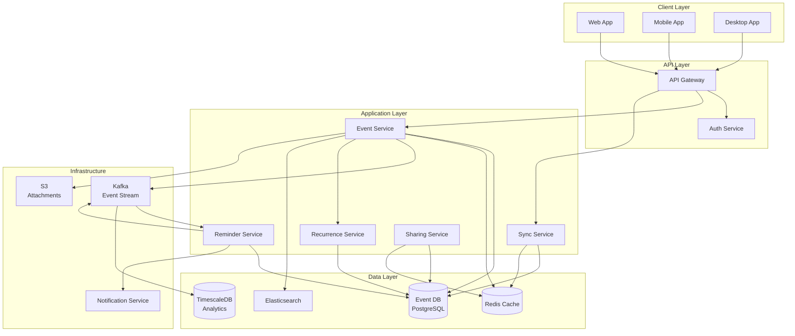

# Calendar Application like Google Calendar

## Requirements

### Functional Requirements
1. **Event Management**: Create, read, update, delete events with title, description, location, start/end times
2. **Recurring Events**: Support complex recurrence patterns (daily, weekly, monthly, yearly with exceptions)
3. **Time Zone Support**: Handle events across multiple time zones with automatic conversion
4. **Reminders**: Set multiple reminders (email, push, SMS) before events
5. **Calendar Sharing**: Share calendars with permissions (read-only, edit, admin)
6. **Conflict Detection**: Identify scheduling conflicts and suggest alternatives
7. **Free/Busy Status**: Show availability without revealing event details
8. **Offline Support**: Allow operations while offline with sync when reconnected
9. **Multi-Device Sync**: Real-time synchronization across web, mobile, desktop

### Non-Functional Requirements
1. **Availability**: 99.95% uptime
2. **Latency**: <200ms for event operations, <500ms for complex queries
3. **Consistency**: Strong consistency for individual calendars, eventual for shared calendars
4. **Scale**: Support 100M users, 1B events, 10K operations/second
5. **Concurrency**: Handle simultaneous edits from multiple devices
6. **Storage**: Efficient storage for recurring events (avoid explosion)

## Scale Estimates

- **Users**: 100M active users
- **Events per user**: Average 100 events (10B total events)
- **Recurring events**: 20% of events, expanded on-demand
- **Shared calendars**: Average 5 calendars per user
- **Read:Write Ratio**: 10:1 (more reads for viewing calendars)
- **Storage**: 
  - Event: ~2KB (metadata, recurrence rules, attendees)
  - Total: 10B events × 2KB = 20TB raw data
  - With indices and backups: ~60TB
- **API Load**: 10K requests/sec (8K reads, 2K writes)

## High-Level Design



## Detailed Design

### 1. Event Storage Schema

**Events Table (PostgreSQL)**:
```sql
CREATE TABLE events (
    event_id UUID PRIMARY KEY,
    calendar_id UUID NOT NULL,
    user_id UUID NOT NULL,
    title VARCHAR(500) NOT NULL,
    description TEXT,
    location VARCHAR(1000),
    start_time TIMESTAMPTZ NOT NULL,
    end_time TIMESTAMPTZ NOT NULL,
    start_timezone VARCHAR(50),
    end_timezone VARCHAR(50),
    is_all_day BOOLEAN DEFAULT FALSE,
    recurrence_rule TEXT,  -- RRULE format
    recurrence_parent_id UUID,  -- For exception instances
    color VARCHAR(20),
    visibility VARCHAR(20) DEFAULT 'default',  -- default, public, private
    status VARCHAR(20) DEFAULT 'confirmed',  -- confirmed, tentative, cancelled
    version INT NOT NULL DEFAULT 1,
    created_at TIMESTAMPTZ NOT NULL,
    updated_at TIMESTAMPTZ NOT NULL,
    deleted_at TIMESTAMPTZ,
    INDEX idx_calendar_time (calendar_id, start_time, end_time),
    INDEX idx_user_time (user_id, start_time),
    FOREIGN KEY (calendar_id) REFERENCES calendars(calendar_id)
);

CREATE TABLE recurrence_exceptions (
    exception_id UUID PRIMARY KEY,
    event_id UUID NOT NULL,
    original_start TIMESTAMPTZ NOT NULL,
    modified_event_id UUID,  -- NULL if deleted, points to new event if modified
    FOREIGN KEY (event_id) REFERENCES events(event_id)
);

CREATE TABLE reminders (
    reminder_id UUID PRIMARY KEY,
    event_id UUID NOT NULL,
    method VARCHAR(20) NOT NULL,  -- email, push, sms
    minutes_before INT NOT NULL,
    FOREIGN KEY (event_id) REFERENCES events(event_id)
);

CREATE TABLE attendees (
    attendee_id UUID PRIMARY KEY,
    event_id UUID NOT NULL,
    user_id UUID NOT NULL,
    email VARCHAR(255) NOT NULL,
    response_status VARCHAR(20) DEFAULT 'needsAction',  -- accepted, declined, tentative
    is_organizer BOOLEAN DEFAULT FALSE,
    FOREIGN KEY (event_id) REFERENCES events(event_id)
);

CREATE TABLE calendars (
    calendar_id UUID PRIMARY KEY,
    owner_id UUID NOT NULL,
    name VARCHAR(255) NOT NULL,
    description TEXT,
    timezone VARCHAR(50) NOT NULL,
    color VARCHAR(20),
    created_at TIMESTAMPTZ NOT NULL
);

CREATE TABLE calendar_permissions (
    permission_id UUID PRIMARY KEY,
    calendar_id UUID NOT NULL,
    user_id UUID NOT NULL,
    role VARCHAR(20) NOT NULL,  -- owner, writer, reader, freeBusyReader
    UNIQUE(calendar_id, user_id),
    FOREIGN KEY (calendar_id) REFERENCES calendars(calendar_id)
);
```

### 2. Event Service (Java)

```java
@Service
public class EventService {
    private final EventRepository eventRepository;
    private final RecurrenceService recurrenceService;
    private final CacheService cacheService;
    private final EventPublisher eventPublisher;
    private final TimeZoneConverter timeZoneConverter;
    
    public EventResponse createEvent(CreateEventRequest request, String userId) {
        // Validate time ranges
        if (request.getEndTime().isBefore(request.getStartTime())) {
            throw new ValidationException("End time must be after start time");
        }
        
        // Detect conflicts if requested
        if (request.isCheckConflicts()) {
            List<Event> conflicts = findConflicts(
                request.getCalendarId(),
                request.getStartTime(),
                request.getEndTime(),
                null  // No event ID to exclude
            );
            if (!conflicts.isEmpty()) {
                throw new ConflictException("Event conflicts with existing events", conflicts);
            }
        }
        
        // Create event entity
        Event event = Event.builder()
            .eventId(UUID.randomUUID())
            .calendarId(request.getCalendarId())
            .userId(userId)
            .title(request.getTitle())
            .description(request.getDescription())
            .location(request.getLocation())
            .startTime(request.getStartTime())
            .endTime(request.getEndTime())
            .startTimezone(request.getStartTimezone())
            .endTimezone(request.getEndTimezone())
            .isAllDay(request.isAllDay())
            .recurrenceRule(request.getRecurrenceRule())
            .color(request.getColor())
            .visibility(request.getVisibility())
            .status("confirmed")
            .version(1)
            .createdAt(Instant.now())
            .updatedAt(Instant.now())
            .build();
        
        // Save to database
        event = eventRepository.save(event);
        
        // Save reminders
        if (request.getReminders() != null) {
            saveReminders(event.getEventId(), request.getReminders());
        }
        
        // Save attendees
        if (request.getAttendees() != null) {
            saveAttendees(event.getEventId(), request.getAttendees(), userId);
        }
        
        // Invalidate cache
        cacheService.invalidateCalendarCache(request.getCalendarId());
        
        // Publish event for downstream processing (reminders, search indexing)
        eventPublisher.publishEventCreated(event);
        
        return toEventResponse(event);
    }
    
    public EventResponse updateEvent(UUID eventId, UpdateEventRequest request, String userId) {
        // Load existing event with optimistic locking
        Event existingEvent = eventRepository.findByIdForUpdate(eventId)
            .orElseThrow(() -> new NotFoundException("Event not found"));
        
        // Check permissions
        if (!hasEditPermission(existingEvent, userId)) {
            throw new UnauthorizedException("No permission to edit this event");
        }
        
        // Handle version conflict (optimistic locking)
        if (request.getVersion() != null && !request.getVersion().equals(existingEvent.getVersion())) {
            throw new ConflictException("Event was modified by another user");
        }
        
        // Handle recurring event updates
        if (existingEvent.getRecurrenceRule() != null) {
            return updateRecurringEvent(existingEvent, request, userId);
        }
        
        // Update fields
        existingEvent.setTitle(request.getTitle());
        existingEvent.setDescription(request.getDescription());
        existingEvent.setLocation(request.getLocation());
        existingEvent.setStartTime(request.getStartTime());
        existingEvent.setEndTime(request.getEndTime());
        existingEvent.setVersion(existingEvent.getVersion() + 1);
        existingEvent.setUpdatedAt(Instant.now());
        
        existingEvent = eventRepository.save(existingEvent);
        
        // Invalidate cache
        cacheService.invalidateCalendarCache(existingEvent.getCalendarId());
        
        // Publish update event
        eventPublisher.publishEventUpdated(existingEvent);
        
        return toEventResponse(existingEvent);
    }
    
    public List<EventResponse> getEventsInRange(UUID calendarId, Instant start, Instant end, String userId) {
        // Check cache first (5-minute TTL for read-heavy pattern)
        String cacheKey = String.format("calendar:%s:range:%s:%s", 
            calendarId, start.toEpochMilli(), end.toEpochMilli());
        
        List<EventResponse> cached = cacheService.get(cacheKey);
        if (cached != null) {
            return cached;
        }
        
        // Load non-recurring events in range
        List<Event> events = eventRepository.findByCalendarAndTimeRange(
            calendarId, start, end
        );
        
        List<EventResponse> responses = new ArrayList<>();
        
        for (Event event : events) {
            if (event.getRecurrenceRule() != null) {
                // Expand recurring event instances for the range
                List<EventInstance> instances = recurrenceService.expandRecurrence(
                    event, start, end
                );
                responses.addAll(instances.stream()
                    .map(inst -> toEventInstance(event, inst))
                    .collect(Collectors.toList()));
            } else {
                responses.add(toEventResponse(event));
            }
        }
        
        // Sort by start time
        responses.sort(Comparator.comparing(EventResponse::getStartTime));
        
        // Cache for 5 minutes
        cacheService.set(cacheKey, responses, Duration.ofMinutes(5));
        
        return responses;
    }
    
    private List<Event> findConflicts(UUID calendarId, Instant start, Instant end, UUID excludeEventId) {
        List<Event> events = eventRepository.findByCalendarAndTimeRange(calendarId, start, end);
        
        return events.stream()
            .filter(e -> !e.getEventId().equals(excludeEventId))
            .filter(e -> {
                // Check if time ranges overlap
                return !(e.getEndTime().isBefore(start) || e.getStartTime().isAfter(end));
            })
            .collect(Collectors.toList());
    }
}
```

### 3. Recurrence Service (Java)

Handles RRULE parsing and instance expansion:

```java
@Service
public class RecurrenceService {
    
    /**
     * Expands recurring events into individual instances for a given time range.
     * Uses RFC 5545 (iCalendar) RRULE format.
     * 
     * Example RRULE: "FREQ=WEEKLY;BYDAY=MO,WE,FR;UNTIL=20250630T000000Z"
     */
    public List<EventInstance> expandRecurrence(Event event, Instant start, Instant end) {
        if (event.getRecurrenceRule() == null) {
            return Collections.emptyList();
        }
        
        try {
            // Parse RRULE using library like iCal4j or custom parser
            RecurrenceRule rule = RecurrenceRule.parse(event.getRecurrenceRule());
            
            List<EventInstance> instances = new ArrayList<>();
            
            // Generate instances starting from event start time
            Instant current = event.getStartTime();
            Duration eventDuration = Duration.between(event.getStartTime(), event.getEndTime());
            
            int maxInstances = 1000;  // Safety limit
            int count = 0;
            
            while (current.isBefore(end) && count < maxInstances) {
                // Check if this instance is in the requested range
                if (!current.isBefore(start)) {
                    // Check if this instance has an exception
                    if (!hasException(event.getEventId(), current)) {
                        instances.add(new EventInstance(
                            current,
                            current.plus(eventDuration),
                            false  // Not an exception
                        ));
                    }
                }
                
                // Calculate next occurrence based on RRULE
                current = rule.getNext(current);
                
                if (current == null) {
                    break;  // No more occurrences (UNTIL reached or COUNT exhausted)
                }
                
                count++;
            }
            
            // Add modified exceptions
            List<EventInstance> modifiedExceptions = getModifiedExceptions(
                event.getEventId(), start, end
            );
            instances.addAll(modifiedExceptions);
            
            return instances;
            
        } catch (Exception e) {
            throw new RuntimeException("Failed to expand recurrence rule", e);
        }
    }
    
    /**
     * Parses RRULE string into structured format.
     * Supports: FREQ, INTERVAL, COUNT, UNTIL, BYDAY, BYMONTHDAY, BYMONTH
     */
    private static class RecurrenceRule {
        private Frequency frequency;  // DAILY, WEEKLY, MONTHLY, YEARLY
        private int interval = 1;
        private Integer count;
        private Instant until;
        private Set<DayOfWeek> byDay;
        private Set<Integer> byMonthDay;
        private Set<Integer> byMonth;
        
        public static RecurrenceRule parse(String rrule) {
            RecurrenceRule rule = new RecurrenceRule();
            
            // Parse RRULE components
            String[] parts = rrule.split(";");
            for (String part : parts) {
                String[] kv = part.split("=");
                String key = kv[0];
                String value = kv[1];
                
                switch (key) {
                    case "FREQ":
                        rule.frequency = Frequency.valueOf(value);
                        break;
                    case "INTERVAL":
                        rule.interval = Integer.parseInt(value);
                        break;
                    case "COUNT":
                        rule.count = Integer.parseInt(value);
                        break;
                    case "UNTIL":
                        rule.until = parseICalDate(value);
                        break;
                    case "BYDAY":
                        rule.byDay = Arrays.stream(value.split(","))
                            .map(RecurrenceRule::parseDayOfWeek)
                            .collect(Collectors.toSet());
                        break;
                    case "BYMONTHDAY":
                        rule.byMonthDay = Arrays.stream(value.split(","))
                            .map(Integer::parseInt)
                            .collect(Collectors.toSet());
                        break;
                    case "BYMONTH":
                        rule.byMonth = Arrays.stream(value.split(","))
                            .map(Integer::parseInt)
                            .collect(Collectors.toSet());
                        break;
                }
            }
            
            return rule;
        }
        
        public Instant getNext(Instant current) {
            ZonedDateTime dt = current.atZone(ZoneOffset.UTC);
            
            switch (frequency) {
                case DAILY:
                    dt = dt.plusDays(interval);
                    break;
                case WEEKLY:
                    dt = getNextWeeklyOccurrence(dt);
                    break;
                case MONTHLY:
                    dt = getNextMonthlyOccurrence(dt);
                    break;
                case YEARLY:
                    dt = dt.plusYears(interval);
                    break;
            }
            
            // Check UNTIL condition
            if (until != null && dt.toInstant().isAfter(until)) {
                return null;
            }
            
            return dt.toInstant();
        }
        
        private ZonedDateTime getNextWeeklyOccurrence(ZonedDateTime current) {
            if (byDay == null || byDay.isEmpty()) {
                return current.plusWeeks(interval);
            }
            
            // Find next day in BYDAY set
            ZonedDateTime next = current.plusDays(1);
            while (!byDay.contains(next.getDayOfWeek())) {
                next = next.plusDays(1);
                
                // If we've gone past the current week, jump to next interval week
                if (next.getDayOfWeek() == DayOfWeek.SUNDAY && 
                    !byDay.contains(DayOfWeek.SUNDAY)) {
                    next = next.plusWeeks(interval - 1);
                }
            }
            
            return next;
        }
        
        private ZonedDateTime getNextMonthlyOccurrence(ZonedDateTime current) {
            if (byMonthDay != null && !byMonthDay.isEmpty()) {
                // Find next occurrence based on day of month
                ZonedDateTime next = current.plusDays(1);
                while (!byMonthDay.contains(next.getDayOfMonth())) {
                    next = next.plusDays(1);
                    
                    // Moved to next month without finding match
                    if (next.getMonthValue() != current.getMonthValue()) {
                        next = next.plusMonths(interval - 1).withDayOfMonth(1);
                    }
                }
                return next;
            }
            
            return current.plusMonths(interval);
        }
        
        private static DayOfWeek parseDayOfWeek(String day) {
            switch (day) {
                case "SU": return DayOfWeek.SUNDAY;
                case "MO": return DayOfWeek.MONDAY;
                case "TU": return DayOfWeek.TUESDAY;
                case "WE": return DayOfWeek.WEDNESDAY;
                case "TH": return DayOfWeek.THURSDAY;
                case "FR": return DayOfWeek.FRIDAY;
                case "SA": return DayOfWeek.SATURDAY;
                default: throw new IllegalArgumentException("Invalid day: " + day);
            }
        }
        
        private static Instant parseICalDate(String date) {
            // Parse format: 20250630T000000Z
            return Instant.parse(date.replaceAll("(\\d{4})(\\d{2})(\\d{2})T(\\d{2})(\\d{2})(\\d{2})Z",
                "$1-$2-$3T$4:$5:$6Z"));
        }
        
        enum Frequency { DAILY, WEEKLY, MONTHLY, YEARLY }
    }
    
    @Data
    public static class EventInstance {
        private final Instant startTime;
        private final Instant endTime;
        private final boolean isException;
    }
}
```

### 4. Sync Service (Java)

Handles offline-first synchronization using operational transforms:

```java
@Service
public class SyncService {
    private final EventRepository eventRepository;
    private final SyncLogRepository syncLogRepository;
    private final CacheService cacheService;
    
    /**
     * Syncs changes from client to server.
     * Uses vector clocks or version numbers for conflict detection.
     */
    public SyncResponse sync(SyncRequest request, String userId) {
        List<SyncConflict> conflicts = new ArrayList<>();
        List<Event> appliedChanges = new ArrayList<>();
        
        // Process each change from client
        for (EventChange change : request.getChanges()) {
            try {
                Event serverEvent = eventRepository.findById(change.getEventId())
                    .orElse(null);
                
                if (serverEvent == null) {
                    // Create new event
                    if (change.getOperation() == Operation.CREATE) {
                        Event created = applyCreate(change, userId);
                        appliedChanges.add(created);
                    }
                } else {
                    // Check for conflicts
                    if (serverEvent.getVersion() != change.getExpectedVersion()) {
                        // Conflict detected - server version is ahead of client
                        conflicts.add(new SyncConflict(
                            change.getEventId(),
                            serverEvent,
                            change,
                            resolveConflict(serverEvent, change)
                        ));
                    } else {
                        // No conflict - apply change
                        Event updated = applyUpdate(serverEvent, change, userId);
                        appliedChanges.add(updated);
                    }
                }
            } catch (Exception e) {
                conflicts.add(new SyncConflict(
                    change.getEventId(),
                    null,
                    change,
                    SyncConflict.Resolution.ERROR
                ));
            }
        }
        
        // Get all changes since client's last sync
        Instant lastSyncTime = request.getLastSyncTime();
        List<Event> serverChanges = syncLogRepository.getChangesSince(
            userId, lastSyncTime
        );
        
        return SyncResponse.builder()
            .appliedChanges(appliedChanges)
            .conflicts(conflicts)
            .serverChanges(serverChanges)
            .syncTime(Instant.now())
            .build();
    }
    
    private Event applyUpdate(Event serverEvent, EventChange change, String userId) {
        // Apply operational transform
        serverEvent.setTitle(change.getTitle());
        serverEvent.setDescription(change.getDescription());
        serverEvent.setStartTime(change.getStartTime());
        serverEvent.setEndTime(change.getEndTime());
        serverEvent.setVersion(serverEvent.getVersion() + 1);
        serverEvent.setUpdatedAt(Instant.now());
        
        Event saved = eventRepository.save(serverEvent);
        
        // Log change for other devices
        syncLogRepository.logChange(saved, userId, change.getDeviceId());
        
        return saved;
    }
    
    private SyncConflict.Resolution resolveConflict(Event serverEvent, EventChange clientChange) {
        // Conflict resolution strategies:
        // 1. Last-write-wins (use server timestamp)
        // 2. Client-wins (if client is offline for extended period)
        // 3. Manual merge (send conflict to user)
        
        // Use last-write-wins by default
        if (serverEvent.getUpdatedAt().isAfter(clientChange.getTimestamp())) {
            return SyncConflict.Resolution.SERVER_WINS;
        } else {
            return SyncConflict.Resolution.CLIENT_WINS;
        }
    }
}
```

### 5. Reminder Service (Java)

Processes scheduled reminders:

```java
@Service
public class ReminderService {
    private final ReminderRepository reminderRepository;
    private final EventRepository eventRepository;
    private final NotificationService notificationService;
    private final ScheduledExecutorService scheduler;
    
    @PostConstruct
    public void init() {
        // Poll for upcoming reminders every minute
        scheduler.scheduleAtFixedRate(
            this::processUpcomingReminders,
            0,
            1,
            TimeUnit.MINUTES
        );
    }
    
    /**
     * Processes reminders that should fire in the next 5 minutes.
     * Uses database polling with a distributed lock to prevent duplicates.
     */
    private void processUpcomingReminders() {
        Instant now = Instant.now();
        Instant lookAhead = now.plus(Duration.ofMinutes(5));
        
        // Get all events starting in the next 5 minutes
        List<Event> upcomingEvents = eventRepository.findEventsStartingBetween(
            now, lookAhead
        );
        
        for (Event event : upcomingEvents) {
            // Get reminders for this event
            List<Reminder> reminders = reminderRepository.findByEventId(event.getEventId());
            
            for (Reminder reminder : reminders) {
                Instant fireTime = event.getStartTime().minus(
                    Duration.ofMinutes(reminder.getMinutesBefore())
                );
                
                // Check if reminder should fire now
                if (fireTime.isBefore(lookAhead) && fireTime.isAfter(now.minus(Duration.ofMinutes(1)))) {
                    sendReminder(event, reminder);
                }
            }
        }
    }
    
    private void sendReminder(Event event, Reminder reminder) {
        // Get calendar owner
        Calendar calendar = eventRepository.findCalendarById(event.getCalendarId());
        
        NotificationRequest notification = NotificationRequest.builder()
            .userId(calendar.getOwnerId())
            .method(reminder.getMethod())
            .title("Event Reminder: " + event.getTitle())
            .body(formatReminderBody(event, reminder))
            .data(Map.of(
                "eventId", event.getEventId().toString(),
                "startTime", event.getStartTime().toString()
            ))
            .build();
        
        notificationService.send(notification);
    }
    
    private String formatReminderBody(Event event, Reminder reminder) {
        long minutes = reminder.getMinutesBefore();
        String timeStr;
        
        if (minutes < 60) {
            timeStr = minutes + " minutes";
        } else if (minutes < 1440) {
            timeStr = (minutes / 60) + " hours";
        } else {
            timeStr = (minutes / 1440) + " days";
        }
        
        return String.format("Starts in %s at %s", 
            timeStr, 
            formatTime(event.getStartTime(), event.getStartTimezone())
        );
    }
}
```

### 6. Sharing Service (Java)

Manages calendar permissions:

```java
@Service
public class SharingService {
    private final CalendarRepository calendarRepository;
    private final PermissionRepository permissionRepository;
    private final CacheService cacheService;
    
    public void shareCalendar(UUID calendarId, String ownerId, ShareRequest request) {
        // Verify owner
        Calendar calendar = calendarRepository.findById(calendarId)
            .orElseThrow(() -> new NotFoundException("Calendar not found"));
        
        if (!calendar.getOwnerId().equals(ownerId)) {
            throw new UnauthorizedException("Only owner can share calendar");
        }
        
        // Create permission
        CalendarPermission permission = CalendarPermission.builder()
            .permissionId(UUID.randomUUID())
            .calendarId(calendarId)
            .userId(request.getUserId())
            .role(request.getRole())  // owner, writer, reader, freeBusyReader
            .build();
        
        permissionRepository.save(permission);
        
        // Invalidate permission cache
        cacheService.delete("permissions:" + calendarId);
        
        // Send notification to shared user
        sendSharingNotification(calendar, request.getUserId(), request.getRole());
    }
    
    public boolean hasPermission(UUID calendarId, String userId, Permission requiredPermission) {
        // Check cache first
        String cacheKey = String.format("permissions:%s:%s", calendarId, userId);
        String role = cacheService.get(cacheKey);
        
        if (role == null) {
            CalendarPermission permission = permissionRepository.findByCalendarAndUser(
                calendarId, userId
            );
            
            if (permission == null) {
                // Check if user is owner
                Calendar calendar = calendarRepository.findById(calendarId).orElse(null);
                if (calendar != null && calendar.getOwnerId().equals(userId)) {
                    role = "owner";
                } else {
                    return false;
                }
            } else {
                role = permission.getRole();
            }
            
            // Cache for 5 minutes
            cacheService.set(cacheKey, role, Duration.ofMinutes(5));
        }
        
        // Check if role has required permission
        return hasRole(role, requiredPermission);
    }
    
    private boolean hasRole(String role, Permission required) {
        switch (required) {
            case READ:
                return role.equals("owner") || role.equals("writer") || 
                       role.equals("reader") || role.equals("freeBusyReader");
            case WRITE:
                return role.equals("owner") || role.equals("writer");
            case ADMIN:
                return role.equals("owner");
            case FREE_BUSY:
                return role.equals("owner") || role.equals("writer") || 
                       role.equals("reader") || role.equals("freeBusyReader");
            default:
                return false;
        }
    }
    
    public FreeBusyResponse getFreeBusy(UUID calendarId, Instant start, Instant end, String userId) {
        // Check if user has free/busy permission
        if (!hasPermission(calendarId, userId, Permission.FREE_BUSY)) {
            throw new UnauthorizedException("No permission to view free/busy");
        }
        
        // Get all events in range (without details)
        List<Event> events = eventRepository.findByCalendarAndTimeRange(calendarId, start, end);
        
        // Return only time slots, no event details
        List<TimeSlot> busySlots = events.stream()
            .filter(e -> !e.getVisibility().equals("private"))
            .map(e -> new TimeSlot(e.getStartTime(), e.getEndTime()))
            .collect(Collectors.toList());
        
        return new FreeBusyResponse(busySlots);
    }
}
```

## Technology Stack

| Component | Technology | Justification |
|-----------|-----------|---------------|
| **API Layer** | Spring Boot, REST | Standard enterprise framework with good ecosystem |
| **Primary Database** | PostgreSQL | ACID transactions, good indexing for time ranges, supports JSON for flexible schemas |
| **Caching** | Redis | Fast reads for calendar views, distributed cache |
| **Search** | Elasticsearch | Full-text search for event titles/descriptions |
| **Message Queue** | Kafka | Event streaming for reminders and notifications |
| **Time Series** | TimescaleDB | Efficient storage for analytics on event patterns |
| **Object Storage** | S3 | Event attachments and backups |
| **Notifications** | FCM, SendGrid, Twilio | Multi-channel delivery |
| **Client Sync** | WebSocket, Server-Sent Events | Real-time updates across devices |

## Performance Optimizations

1. **Caching Strategy**:
   - Cache calendar views for 5 minutes (high read:write ratio)
   - Cache permissions for 5 minutes
   - Cache expanded recurrence instances for common ranges
   - Invalidate on writes

2. **Database Indexing**:
   - B-tree index on `(calendar_id, start_time, end_time)` for range queries
   - Covering index for free/busy queries
   - Partial index on non-deleted events

3. **Recurrence Expansion**:
   - Lazy expansion - generate instances on-demand for requested range
   - Cache expanded instances for popular calendars
   - Limit expansion to 1000 instances per query

4. **Conflict Detection**:
   - Use optimistic locking with version numbers
   - Avoid full table locks
   - Client-side validation before submission

## Trade-offs & Considerations

1. **Strong vs Eventual Consistency**:
   - **Chosen**: Strong consistency within a calendar, eventual for shared calendars
   - Trade-off: Slight latency increase for multi-device sync vs guaranteed consistency

2. **Recurrence Storage**:
   - **Chosen**: Store RRULE and expand on-demand
   - Trade-off: Slower queries for recurring events vs massive storage savings
   - Alternative: Pre-expand for next year and re-generate periodically

3. **Time Zone Handling**:
   - **Chosen**: Store in UTC with separate timezone field
   - Trade-off: Requires conversion on every read vs consistent storage format
   - Handles DST transitions correctly

4. **Conflict Resolution**:
   - **Chosen**: Last-write-wins with version numbers
   - Trade-off: May lose client changes if server ahead vs complex merge logic
   - Alternative: Operational transforms for fine-grained merging

5. **Free/Busy Privacy**:
   - **Chosen**: Separate permission level for free/busy
   - Trade-off: More complex permission model vs better privacy control

## Summary

This calendar application design handles 100M users with strong consistency guarantees for individual calendars. Key features include:

1. **Recurrence Handling**: On-demand expansion of RRULE patterns saves storage while maintaining query performance
2. **Multi-Device Sync**: Optimistic locking with vector clocks enables offline support
3. **Conflict Detection**: Version-based concurrency control prevents double-booking
4. **Scalability**: Caching layer reduces database load for read-heavy workload
5. **Time Zone Support**: UTC storage with timezone metadata handles DST correctly
6. **Sharing**: Flexible permission model from free/busy to full admin access

The system scales horizontally with stateless API servers and achieves <200ms latency for common operations through aggressive caching and efficient indexing strategies.
