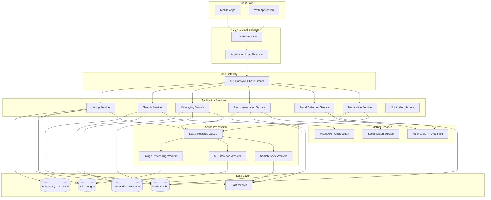

# Question 29: Marketplace Feature Inside a Social App (like Facebook Marketplace)

## Requirements

### Functional Requirements
1. **Listing Management**
   - Create, update, delete, and view listings
   - Upload multiple images (up to 10 per listing)
   - Categorize items (Electronics, Furniture, Vehicles, etc.)
   - Set price, condition, description, and location

2. **Search & Discovery**
   - Full-text search across listings
   - Faceted filtering (price range, category, condition, location)
   - Geofencing for local listings (within configurable radius)
   - Sort by relevance, price, date posted, distance

3. **Buyer-Seller Communication**
   - Real-time messaging between buyers and sellers
   - Message read receipts and typing indicators
   - Share listing details in conversation

4. **Social Features**
   - Integration with user's social graph (friends' listings)
   - Seller reputation/rating system
   - Save favorite listings
   - Share listings on feed

5. **Safety & Trust**
   - Fraud detection for duplicate/scam listings
   - Image moderation for prohibited items
   - User reporting mechanism
   - Transaction ratings and reviews

6. **Recommendations**
   - Similar items based on category and price
   - Personalized suggestions based on browsing history
   - Trending items in user's area

### Non-Functional Requirements
1. **Scalability**: Support 1M active listings, 100M users, 10M daily active users
2. **Availability**: 99.9% uptime
3. **Performance**: 
   - Search results < 300ms
   - Image upload < 2s
   - Messaging latency < 100ms
4. **Consistency**: Eventual consistency for listings, strong consistency for messaging
5. **Security**: Secure image storage, encrypted messages, fraud prevention

## Scale Estimates

### Traffic Estimates
- **Daily Active Users (DAU)**: 10M users
- **Active Listings**: 1M listings
- **New Listings per Day**: 100K
- **Searches per Day**: 50M (5 searches per DAU)
- **Messages per Day**: 20M (2M active conversations)
- **Image Uploads per Day**: 500K (5 images per listing average)

### Storage Estimates
- **Listing Metadata**: 1M listings × 2KB = 2GB
- **Images**: 5M images × 500KB (compressed) = 2.5TB
- **Messages**: 20M messages/day × 500 bytes × 90 days retention = 900GB
- **User Data**: 100M users × 1KB = 100GB
- **Total Storage**: ~3TB (growing ~800GB/month)

### Bandwidth Estimates
- **Image Upload**: 500K uploads/day × 2MB = 1TB/day upload
- **Image Download**: 50M searches × 3 images × 100KB thumbnail = 15TB/day download
- **Peak Upload Bandwidth**: ~150 Mbps
- **Peak Download Bandwidth**: ~2.5 Gbps

### Request Rate
- **Listing CRUD**: 1,200 QPS (100K writes + 5M reads per day)
- **Search**: 580 QPS (50M per day)
- **Messaging**: 230 QPS (20M per day)
- **Image Serving**: 1,700 QPS

## High-Level Design

### Architecture Diagram



### Data Flow
1. **Create Listing**: User uploads images → S3 → Listing Service writes to PostgreSQL → Event to Kafka → Image processing + Elasticsearch indexing
2. **Search**: User searches → Search Service queries Elasticsearch with geo-filters → Returns ranked results with cached images
3. **Messaging**: Buyer sends message → Messaging Service writes to Cassandra → Redis Pub/Sub for real-time delivery → Push notification
4. **Fraud Detection**: New listing → Fraud Service runs ML model + rule engine → Flags suspicious listings

## Detailed Design

### 1. Listing Service

```java
@Service
@Slf4j
public class ListingService {
    
    @Autowired
    private ListingRepository listingRepository;
    
    @Autowired
    private S3ImageService s3ImageService;
    
    @Autowired
    private KafkaTemplate<String, ListingEvent> kafkaTemplate;
    
    @Autowired
    private RedisTemplate<String, Listing> redisTemplate;
    
    @Autowired
    private FraudDetectionService fraudDetectionService;
    
    private static final String LISTING_CACHE_PREFIX = "listing:";
    private static final int CACHE_TTL_HOURS = 24;
    
    @Transactional
    public CreateListingResponse createListing(CreateListingRequest request) {
        // Validate input
        validateListingRequest(request);
        
        // Upload images to S3
        List<String> imageUrls = new ArrayList<>();
        for (MultipartFile image : request.getImages()) {
            String imageUrl = s3ImageService.uploadImage(image, 
                ImageType.LISTING, 
                request.getUserId());
            imageUrls.add(imageUrl);
        }
        
        // Create listing entity
        Listing listing = Listing.builder()
                .userId(request.getUserId())
                .title(request.getTitle())
                .description(request.getDescription())
                .category(request.getCategory())
                .price(request.getPrice())
                .currency(request.getCurrency())
                .condition(request.getCondition())
                .location(request.getLocation())
                .latitude(request.getLatitude())
                .longitude(request.getLongitude())
                .imageUrls(imageUrls)
                .status(ListingStatus.PENDING_REVIEW)
                .createdAt(Instant.now())
                .build();
        
        // Save to database
        listing = listingRepository.save(listing);
        
        // Cache listing
        cacheListingDetails(listing);
        
        // Publish event for async processing
        publishListingCreatedEvent(listing);
        
        // Run fraud detection asynchronously
        CompletableFuture.runAsync(() -> 
            fraudDetectionService.analyzeListing(listing.getId()));
        
        log.info("Created listing {} for user {}", listing.getId(), request.getUserId());
        
        return CreateListingResponse.builder()
                .listingId(listing.getId())
                .status(listing.getStatus())
                .imageUrls(imageUrls)
                .build();
    }
    
    public ListingDetailsResponse getListingById(String listingId) {
        // Try cache first
        Listing listing = getFromCache(listingId);
        
        if (listing == null) {
            // Cache miss - fetch from database
            listing = listingRepository.findById(listingId)
                    .orElseThrow(() -> new ListingNotFoundException(listingId));
            cacheListingDetails(listing);
        }
        
        // Increment view count asynchronously
        CompletableFuture.runAsync(() -> 
            listingRepository.incrementViewCount(listingId));
        
        return convertToDetailsResponse(listing);
    }
    
    @Transactional
    public void updateListing(String listingId, UpdateListingRequest request) {
        Listing listing = listingRepository.findById(listingId)
                .orElseThrow(() -> new ListingNotFoundException(listingId));
        
        // Verify ownership
        if (!listing.getUserId().equals(request.getUserId())) {
            throw new UnauthorizedException("User does not own this listing");
        }
        
        // Update fields
        if (request.getTitle() != null) {
            listing.setTitle(request.getTitle());
        }
        if (request.getPrice() != null) {
            listing.setPrice(request.getPrice());
        }
        if (request.getDescription() != null) {
            listing.setDescription(request.getDescription());
        }
        
        listing.setUpdatedAt(Instant.now());
        listingRepository.save(listing);
        
        // Invalidate cache
        invalidateCache(listingId);
        
        // Publish update event for search reindexing
        publishListingUpdatedEvent(listing);
    }
    
    @Transactional
    public void deleteListing(String listingId, String userId) {
        Listing listing = listingRepository.findById(listingId)
                .orElseThrow(() -> new ListingNotFoundException(listingId));
        
        if (!listing.getUserId().equals(userId)) {
            throw new UnauthorizedException("User does not own this listing");
        }
        
        // Soft delete
        listing.setStatus(ListingStatus.DELETED);
        listing.setDeletedAt(Instant.now());
        listingRepository.save(listing);
        
        // Invalidate cache
        invalidateCache(listingId);
        
        // Publish delete event
        publishListingDeletedEvent(listing);
    }
    
    private void cacheListingDetails(Listing listing) {
        String key = LISTING_CACHE_PREFIX + listing.getId();
        redisTemplate.opsForValue().set(key, listing, 
                CACHE_TTL_HOURS, TimeUnit.HOURS);
    }
    
    private Listing getFromCache(String listingId) {
        String key = LISTING_CACHE_PREFIX + listingId;
        return redisTemplate.opsForValue().get(key);
    }
    
    private void invalidateCache(String listingId) {
        String key = LISTING_CACHE_PREFIX + listingId;
        redisTemplate.delete(key);
    }
    
    private void publishListingCreatedEvent(Listing listing) {
        ListingEvent event = ListingEvent.builder()
                .eventType(EventType.LISTING_CREATED)
                .listingId(listing.getId())
                .userId(listing.getUserId())
                .category(listing.getCategory())
                .timestamp(Instant.now())
                .build();
        
        kafkaTemplate.send("listing-events", listing.getId(), event);
    }
    
    private void publishListingUpdatedEvent(Listing listing) {
        ListingEvent event = ListingEvent.builder()
                .eventType(EventType.LISTING_UPDATED)
                .listingId(listing.getId())
                .userId(listing.getUserId())
                .timestamp(Instant.now())
                .build();
        
        kafkaTemplate.send("listing-events", listing.getId(), event);
    }
    
    private void publishListingDeletedEvent(Listing listing) {
        ListingEvent event = ListingEvent.builder()
                .eventType(EventType.LISTING_DELETED)
                .listingId(listing.getId())
                .userId(listing.getUserId())
                .timestamp(Instant.now())
                .build();
        
        kafkaTemplate.send("listing-events", listing.getId(), event);
    }
}

@Entity
@Table(name = "listings", indexes = {
    @Index(name = "idx_user_id", columnList = "user_id"),
    @Index(name = "idx_category", columnList = "category"),
    @Index(name = "idx_status", columnList = "status"),
    @Index(name = "idx_created_at", columnList = "created_at")
})
@Data
@Builder
@NoArgsConstructor
@AllArgsConstructor
public class Listing {
    
    @Id
    @GeneratedValue(strategy = GenerationType.UUID)
    private String id;
    
    @Column(name = "user_id", nullable = false)
    private String userId;
    
    @Column(nullable = false, length = 200)
    private String title;
    
    @Column(length = 2000)
    private String description;
    
    @Enumerated(EnumType.STRING)
    @Column(nullable = false)
    private Category category;
    
    @Column(nullable = false)
    private BigDecimal price;
    
    @Column(nullable = false, length = 3)
    private String currency;
    
    @Enumerated(EnumType.STRING)
    private Condition condition;
    
    @Embedded
    private Location location;
    
    @Column(nullable = false)
    private Double latitude;
    
    @Column(nullable = false)
    private Double longitude;
    
    @ElementCollection
    @CollectionTable(name = "listing_images")
    @Column(name = "image_url")
    private List<String> imageUrls;
    
    @Enumerated(EnumType.STRING)
    @Column(nullable = false)
    private ListingStatus status;
    
    @Column(name = "view_count")
    private Long viewCount = 0L;
    
    @Column(name = "favorite_count")
    private Long favoriteCount = 0L;
    
    @Column(name = "created_at", nullable = false)
    private Instant createdAt;
    
    @Column(name = "updated_at")
    private Instant updatedAt;
    
    @Column(name = "deleted_at")
    private Instant deletedAt;
}

@Service
public class S3ImageService {
    
    @Autowired
    private AmazonS3 s3Client;
    
    @Value("${aws.s3.bucket.name}")
    private String bucketName;
    
    @Value("${aws.cloudfront.domain}")
    private String cloudfrontDomain;
    
    private static final long MAX_FILE_SIZE = 5 * 1024 * 1024; // 5MB
    private static final Set<String> ALLOWED_TYPES = Set.of("image/jpeg", "image/png", "image/webp");
    
    public String uploadImage(MultipartFile file, ImageType imageType, String userId) {
        validateImage(file);
        
        String fileKey = generateFileKey(imageType, userId, file.getOriginalFilename());
        
        try {
            // Compress image before upload
            byte[] compressedImage = compressImage(file.getBytes());
            
            ObjectMetadata metadata = new ObjectMetadata();
            metadata.setContentLength(compressedImage.length);
            metadata.setContentType(file.getContentType());
            metadata.setCacheControl("max-age=31536000"); // 1 year
            
            PutObjectRequest putRequest = new PutObjectRequest(
                    bucketName,
                    fileKey,
                    new ByteArrayInputStream(compressedImage),
                    metadata
            ).withCannedAcl(CannedAccessControlList.PublicRead);
            
            s3Client.putObject(putRequest);
            
            // Return CloudFront URL for faster delivery
            return String.format("https://%s/%s", cloudfrontDomain, fileKey);
            
        } catch (IOException e) {
            throw new ImageUploadException("Failed to upload image", e);
        }
    }
    
    private void validateImage(MultipartFile file) {
        if (file.isEmpty()) {
            throw new InvalidImageException("Image file is empty");
        }
        
        if (file.getSize() > MAX_FILE_SIZE) {
            throw new InvalidImageException("Image size exceeds 5MB limit");
        }
        
        if (!ALLOWED_TYPES.contains(file.getContentType())) {
            throw new InvalidImageException("Invalid image type. Only JPEG, PNG, WEBP allowed");
        }
    }
    
    private String generateFileKey(ImageType imageType, String userId, String originalFilename) {
        String timestamp = String.valueOf(System.currentTimeMillis());
        String extension = getFileExtension(originalFilename);
        return String.format("%s/%s/%s_%s.%s", 
                imageType.getPath(), 
                userId, 
                timestamp,
                UUID.randomUUID().toString().substring(0, 8),
                extension);
    }
    
    private byte[] compressImage(byte[] imageBytes) throws IOException {
        // Use ImageIO to compress
        BufferedImage image = ImageIO.read(new ByteArrayInputStream(imageBytes));
        
        // Resize if too large (max 1920x1920)
        if (image.getWidth() > 1920 || image.getHeight() > 1920) {
            image = resizeImage(image, 1920, 1920);
        }
        
        ByteArrayOutputStream outputStream = new ByteArrayOutputStream();
        ImageIO.write(image, "jpg", outputStream);
        return outputStream.toByteArray();
    }
}
```

### 2. Search Service

```java
@Service
@Slf4j
public class SearchService {
    
    @Autowired
    private ElasticsearchClient elasticsearchClient;
    
    @Autowired
    private RedisTemplate<String, SearchResult> redisTemplate;
    
    @Autowired
    private GeoLocationService geoLocationService;
    
    private static final String LISTING_INDEX = "marketplace_listings";
    private static final String SEARCH_CACHE_PREFIX = "search:";
    private static final int CACHE_TTL_MINUTES = 15;
    
    public SearchResponse searchListings(SearchRequest request) {
        // Generate cache key
        String cacheKey = generateCacheKey(request);
        
        // Check cache
        SearchResult cachedResult = redisTemplate.opsForValue().get(cacheKey);
        if (cachedResult != null) {
            log.info("Cache hit for search query: {}", request.getQuery());
            return cachedResult.toResponse();
        }
        
        // Build Elasticsearch query
        Query esQuery = buildSearchQuery(request);
        
        // Execute search
        SearchResponse<ListingDocument> esResponse = elasticsearchClient.search(
                s -> s.index(LISTING_INDEX)
                      .query(esQuery)
                      .from(request.getOffset())
                      .size(request.getLimit())
                      .sort(buildSortOptions(request))
                      .aggregations("categories", buildCategoryAggregation())
                      .aggregations("price_ranges", buildPriceRangeAggregation()),
                ListingDocument.class
        );
        
        // Convert results
        SearchResult result = convertToSearchResult(esResponse, request);
        
        // Cache results
        redisTemplate.opsForValue().set(cacheKey, result, 
                CACHE_TTL_MINUTES, TimeUnit.MINUTES);
        
        return result.toResponse();
    }
    
    private Query buildSearchQuery(SearchRequest request) {
        BoolQuery.Builder boolQuery = new BoolQuery.Builder();
        
        // Full-text search on title and description
        if (StringUtils.hasText(request.getQuery())) {
            boolQuery.must(m -> m.multiMatch(mm -> mm
                    .query(request.getQuery())
                    .fields("title^3", "description^1")
                    .fuzziness("AUTO")
                    .prefixLength(2)
            ));
        }
        
        // Category filter
        if (request.getCategories() != null && !request.getCategories().isEmpty()) {
            boolQuery.filter(f -> f.terms(t -> t
                    .field("category")
                    .terms(ts -> ts.value(request.getCategories().stream()
                            .map(FieldValue::of)
                            .collect(Collectors.toList())))
            ));
        }
        
        // Price range filter
        if (request.getMinPrice() != null || request.getMaxPrice() != null) {
            boolQuery.filter(f -> f.range(r -> {
                RangeQuery.Builder rangeBuilder = new RangeQuery.Builder().field("price");
                if (request.getMinPrice() != null) {
                    rangeBuilder.gte(JsonData.of(request.getMinPrice()));
                }
                if (request.getMaxPrice() != null) {
                    rangeBuilder.lte(JsonData.of(request.getMaxPrice()));
                }
                return rangeBuilder.build();
            }));
        }
        
        // Condition filter
        if (request.getConditions() != null && !request.getConditions().isEmpty()) {
            boolQuery.filter(f -> f.terms(t -> t
                    .field("condition")
                    .terms(ts -> ts.value(request.getConditions().stream()
                            .map(FieldValue::of)
                            .collect(Collectors.toList())))
            ));
        }
        
        // Geolocation filter (within radius)
        if (request.getLatitude() != null && request.getLongitude() != null) {
            Double radiusMiles = request.getRadiusMiles() != null ? 
                    request.getRadiusMiles() : 50.0;
            
            boolQuery.filter(f -> f.geoDistance(g -> g
                    .field("location")
                    .distance(radiusMiles + "mi")
                    .location(l -> l.latlon(ll -> ll
                            .lat(request.getLatitude())
                            .lon(request.getLongitude())
                    ))
            ));
        }
        
        // Only active listings
        boolQuery.filter(f -> f.term(t -> t
                .field("status")
                .value("ACTIVE")
        ));
        
        return Query.of(q -> q.bool(boolQuery.build()));
    }
    
    private List<SortOptions> buildSortOptions(SearchRequest request) {
        List<SortOptions> sortOptions = new ArrayList<>();
        
        switch (request.getSortBy()) {
            case RELEVANCE:
                // Default scoring
                break;
            case PRICE_LOW_TO_HIGH:
                sortOptions.add(SortOptions.of(s -> s
                        .field(f -> f.field("price").order(SortOrder.Asc))));
                break;
            case PRICE_HIGH_TO_LOW:
                sortOptions.add(SortOptions.of(s -> s
                        .field(f -> f.field("price").order(SortOrder.Desc))));
                break;
            case DATE_NEWEST:
                sortOptions.add(SortOptions.of(s -> s
                        .field(f -> f.field("created_at").order(SortOrder.Desc))));
                break;
            case DISTANCE:
                if (request.getLatitude() != null && request.getLongitude() != null) {
                    sortOptions.add(SortOptions.of(s -> s
                            .geoDistance(g -> g
                                    .field("location")
                                    .location(l -> l.latlon(ll -> ll
                                            .lat(request.getLatitude())
                                            .lon(request.getLongitude())
                                    ))
                                    .order(SortOrder.Asc)
                            )));
                }
                break;
        }
        
        return sortOptions;
    }
    
    private Aggregation buildCategoryAggregation() {
        return Aggregation.of(a -> a
                .terms(t -> t.field("category").size(20))
        );
    }
    
    private Aggregation buildPriceRangeAggregation() {
        return Aggregation.of(a -> a
                .range(r -> r.field("price")
                        .ranges(rr -> rr.to("50"))
                        .ranges(rr -> rr.from("50").to("100"))
                        .ranges(rr -> rr.from("100").to("500"))
                        .ranges(rr -> rr.from("500").to("1000"))
                        .ranges(rr -> rr.from("1000"))
                )
        );
    }
    
    private String generateCacheKey(SearchRequest request) {
        return SEARCH_CACHE_PREFIX + DigestUtils.md5DigestAsHex(
                request.toString().getBytes(StandardCharsets.UTF_8));
    }
}

@Data
@Document(indexName = "marketplace_listings")
public class ListingDocument {
    
    @Id
    private String id;
    
    @Field(type = FieldType.Text, analyzer = "standard")
    private String title;
    
    @Field(type = FieldType.Text, analyzer = "standard")
    private String description;
    
    @Field(type = FieldType.Keyword)
    private String category;
    
    @Field(type = FieldType.Double)
    private BigDecimal price;
    
    @Field(type = FieldType.Keyword)
    private String currency;
    
    @Field(type = FieldType.Keyword)
    private String condition;
    
    @GeoPointField
    private GeoPoint location;
    
    @Field(type = FieldType.Keyword)
    private String userId;
    
    @Field(type = FieldType.Keyword)
    private List<String> imageUrls;
    
    @Field(type = FieldType.Keyword)
    private String status;
    
    @Field(type = FieldType.Date)
    private Instant createdAt;
    
    @Field(type = FieldType.Long)
    private Long viewCount;
}

@Component
public class ListingIndexingConsumer {
    
    @Autowired
    private ElasticsearchClient elasticsearchClient;
    
    @Autowired
    private ListingRepository listingRepository;
    
    @KafkaListener(topics = "listing-events", groupId = "indexing-consumer")
    public void consumeListingEvent(ListingEvent event) {
        try {
            switch (event.getEventType()) {
                case LISTING_CREATED:
                case LISTING_UPDATED:
                    indexListing(event.getListingId());
                    break;
                case LISTING_DELETED:
                    deleteListing(event.getListingId());
                    break;
            }
        } catch (Exception e) {
            log.error("Failed to process listing event: {}", event, e);
        }
    }
    
    private void indexListing(String listingId) throws IOException {
        Listing listing = listingRepository.findById(listingId)
                .orElseThrow(() -> new ListingNotFoundException(listingId));
        
        ListingDocument document = convertToDocument(listing);
        
        elasticsearchClient.index(i -> i
                .index("marketplace_listings")
                .id(document.getId())
                .document(document)
        );
        
        log.info("Indexed listing: {}", listingId);
    }
    
    private void deleteListing(String listingId) throws IOException {
        elasticsearchClient.delete(d -> d
                .index("marketplace_listings")
                .id(listingId)
        );
        
        log.info("Deleted listing from index: {}", listingId);
    }
}
```

### 3. Messaging Service

```java
@Service
@Slf4j
public class MessagingService {
    
    @Autowired
    private MessageRepository messageRepository;
    
    @Autowired
    private ConversationRepository conversationRepository;
    
    @Autowired
    private RedisMessagePublisher redisPublisher;
    
    @Autowired
    private NotificationService notificationService;
    
    @Autowired
    private RedisTemplate<String, Object> redisTemplate;
    
    private static final String TYPING_PREFIX = "typing:";
    private static final int TYPING_TIMEOUT_SECONDS = 5;
    
    @Transactional
    public SendMessageResponse sendMessage(SendMessageRequest request) {
        // Get or create conversation
        Conversation conversation = getOrCreateConversation(
                request.getListingId(),
                request.getSenderId(),
                request.getReceiverId()
        );
        
        // Create message
        Message message = Message.builder()
                .id(UUID.randomUUID())
                .conversationId(conversation.getId())
                .senderId(request.getSenderId())
                .receiverId(request.getReceiverId())
                .listingId(request.getListingId())
                .content(request.getContent())
                .messageType(request.getMessageType())
                .timestamp(Instant.now())
                .status(MessageStatus.SENT)
                .build();
        
        // Save to Cassandra
        messageRepository.save(message);
        
        // Update conversation last message
        conversation.setLastMessageId(message.getId());
        conversation.setLastMessageAt(message.getTimestamp());
        conversation.setLastMessagePreview(truncate(message.getContent(), 100));
        conversationRepository.save(conversation);
        
        // Publish to Redis Pub/Sub for real-time delivery
        publishMessageToRedis(message);
        
        // Send push notification if user is offline
        notificationService.sendMessageNotification(message);
        
        log.info("Message sent: {} from {} to {}", message.getId(), 
                request.getSenderId(), request.getReceiverId());
        
        return SendMessageResponse.builder()
                .messageId(message.getId())
                .timestamp(message.getTimestamp())
                .status(message.getStatus())
                .build();
    }
    
    public List<MessageDTO> getConversationMessages(
            String conversationId, 
            int limit, 
            UUID cursor) {
        
        List<Message> messages;
        if (cursor != null) {
            messages = messageRepository.findByConversationIdAndIdLessThan(
                    conversationId, cursor, limit);
        } else {
            messages = messageRepository.findTopByConversationIdOrderByTimestampDesc(
                    conversationId, limit);
        }
        
        return messages.stream()
                .map(this::convertToDTO)
                .collect(Collectors.toList());
    }
    
    public void markMessageAsRead(String messageId, String userId) {
        Message message = messageRepository.findById(UUID.fromString(messageId))
                .orElseThrow(() -> new MessageNotFoundException(messageId));
        
        if (!message.getReceiverId().equals(userId)) {
            throw new UnauthorizedException("User is not the receiver");
        }
        
        if (message.getStatus() != MessageStatus.READ) {
            message.setStatus(MessageStatus.READ);
            message.setReadAt(Instant.now());
            messageRepository.save(message);
            
            // Publish read receipt
            publishReadReceipt(message);
        }
    }
    
    public void updateTypingStatus(String conversationId, String userId, boolean isTyping) {
        String key = TYPING_PREFIX + conversationId + ":" + userId;
        
        if (isTyping) {
            redisTemplate.opsForValue().set(key, true, 
                    TYPING_TIMEOUT_SECONDS, TimeUnit.SECONDS);
        } else {
            redisTemplate.delete(key);
        }
        
        // Publish typing indicator
        publishTypingIndicator(conversationId, userId, isTyping);
    }
    
    private Conversation getOrCreateConversation(
            String listingId, 
            String user1Id, 
            String user2Id) {
        
        // Normalize user IDs (smaller ID first for consistent lookup)
        String buyerId = user1Id.compareTo(user2Id) < 0 ? user1Id : user2Id;
        String sellerId = user1Id.compareTo(user2Id) < 0 ? user2Id : user1Id;
        
        return conversationRepository
                .findByListingIdAndBuyerIdAndSellerId(listingId, buyerId, sellerId)
                .orElseGet(() -> {
                    Conversation newConv = Conversation.builder()
                            .id(UUID.randomUUID().toString())
                            .listingId(listingId)
                            .buyerId(buyerId)
                            .sellerId(sellerId)
                            .createdAt(Instant.now())
                            .build();
                    return conversationRepository.save(newConv);
                });
    }
    
    private void publishMessageToRedis(Message message) {
        MessageEvent event = MessageEvent.builder()
                .eventType("NEW_MESSAGE")
                .message(convertToDTO(message))
                .build();
        
        String channel = "conversation:" + message.getConversationId();
        redisPublisher.publish(channel, event);
    }
    
    private void publishReadReceipt(Message message) {
        ReadReceiptEvent event = ReadReceiptEvent.builder()
                .eventType("MESSAGE_READ")
                .messageId(message.getId())
                .conversationId(message.getConversationId())
                .readAt(message.getReadAt())
                .build();
        
        String channel = "conversation:" + message.getConversationId();
        redisPublisher.publish(channel, event);
    }
    
    private void publishTypingIndicator(String conversationId, String userId, boolean isTyping) {
        TypingEvent event = TypingEvent.builder()
                .eventType("TYPING_INDICATOR")
                .conversationId(conversationId)
                .userId(userId)
                .isTyping(isTyping)
                .build();
        
        String channel = "conversation:" + conversationId;
        redisPublisher.publish(channel, event);
    }
}

@Table("messages")
@Data
@Builder
@NoArgsConstructor
@AllArgsConstructor
public class Message {
    
    @PrimaryKey
    private UUID id;
    
    @Column("conversation_id")
    @Indexed
    private String conversationId;
    
    @Column("sender_id")
    private String senderId;
    
    @Column("receiver_id")
    private String receiverId;
    
    @Column("listing_id")
    private String listingId;
    
    @Column("content")
    private String content;
    
    @Column("message_type")
    private MessageType messageType;
    
    @Column("timestamp")
    @Indexed
    private Instant timestamp;
    
    @Column("status")
    private MessageStatus status;
    
    @Column("read_at")
    private Instant readAt;
}

@Table("conversations")
@Data
@Builder
@NoArgsConstructor
@AllArgsConstructor
public class Conversation {
    
    @PrimaryKey
    private String id;
    
    @Column("listing_id")
    @Indexed
    private String listingId;
    
    @Column("buyer_id")
    private String buyerId;
    
    @Column("seller_id")
    private String sellerId;
    
    @Column("created_at")
    private Instant createdAt;
    
    @Column("last_message_id")
    private UUID lastMessageId;
    
    @Column("last_message_at")
    private Instant lastMessageAt;
    
    @Column("last_message_preview")
    private String lastMessagePreview;
}

@Component
public class RedisMessagePublisher {
    
    @Autowired
    private RedisTemplate<String, Object> redisTemplate;
    
    public void publish(String channel, Object message) {
        redisTemplate.convertAndSend(channel, message);
    }
}

@Component
public class RedisMessageSubscriber implements MessageListener {
    
    @Autowired
    private WebSocketHandler webSocketHandler;
    
    @Override
    public void onMessage(Message message, byte[] pattern) {
        String channel = new String(message.getChannel());
        String payload = new String(message.getBody());
        
        // Forward to WebSocket clients subscribed to this conversation
        webSocketHandler.broadcastToConversation(channel, payload);
    }
}
```

### 4. Recommendation Service

```java
@Service
@Slf4j
public class RecommendationService {
    
    @Autowired
    private ElasticsearchClient elasticsearchClient;
    
    @Autowired
    private RedisTemplate<String, List<RecommendationDTO>> redisTemplate;
    
    @Autowired
    private SocialGraphService socialGraphService;
    
    @Autowired
    private UserActivityService userActivityService;
    
    private static final String RECOMMENDATION_CACHE_PREFIX = "recommendations:";
    private static final int CACHE_TTL_HOURS = 6;
    
    public List<RecommendationDTO> getSimilarListings(String listingId, int limit) {
        // Try cache first
        String cacheKey = RECOMMENDATION_CACHE_PREFIX + "similar:" + listingId;
        List<RecommendationDTO> cached = redisTemplate.opsForValue().get(cacheKey);
        if (cached != null) {
            return cached.stream().limit(limit).collect(Collectors.toList());
        }
        
        // Get source listing
        ListingDocument sourceListing = getListingDocument(listingId);
        
        // Build More Like This query
        Query mltQuery = Query.of(q -> q.moreLikeThis(mlt -> mlt
                .fields("title", "description", "category")
                .like(l -> l.document(d -> d
                        .index("marketplace_listings")
                        .id(listingId)
                ))
                .minTermFreq(1)
                .maxQueryTerms(12)
        ));
        
        // Add filters
        BoolQuery.Builder boolQuery = new BoolQuery.Builder();
        boolQuery.must(mltQuery);
        
        // Same category boost
        boolQuery.should(s -> s.term(t -> t
                .field("category")
                .value(sourceListing.getCategory())
                .boost(2.0f)
        ));
        
        // Similar price range (+/- 30%)
        double minPrice = sourceListing.getPrice().doubleValue() * 0.7;
        double maxPrice = sourceListing.getPrice().doubleValue() * 1.3;
        boolQuery.should(s -> s.range(r -> r
                .field("price")
                .gte(JsonData.of(minPrice))
                .lte(JsonData.of(maxPrice))
                .boost(1.5f)
        ));
        
        // Exclude source listing
        boolQuery.mustNot(mn -> mn.term(t -> t
                .field("id")
                .value(listingId)
        ));
        
        // Only active listings
        boolQuery.filter(f -> f.term(t -> t
                .field("status")
                .value("ACTIVE")
        ));
        
        // Execute search
        SearchResponse<ListingDocument> response = elasticsearchClient.search(
                s -> s.index("marketplace_listings")
                      .query(Query.of(qq -> qq.bool(boolQuery.build())))
                      .size(limit * 2), // Get more for better filtering
                ListingDocument.class
        );
        
        List<RecommendationDTO> recommendations = response.hits().hits().stream()
                .map(hit -> convertToRecommendation(hit.source(), "similar_items"))
                .limit(limit)
                .collect(Collectors.toList());
        
        // Cache results
        redisTemplate.opsForValue().set(cacheKey, recommendations, 
                CACHE_TTL_HOURS, TimeUnit.HOURS);
        
        return recommendations;
    }
    
    public List<RecommendationDTO> getPersonalizedRecommendations(String userId, int limit) {
        String cacheKey = RECOMMENDATION_CACHE_PREFIX + "personalized:" + userId;
        List<RecommendationDTO> cached = redisTemplate.opsForValue().get(cacheKey);
        if (cached != null) {
            return cached.stream().limit(limit).collect(Collectors.toList());
        }
        
        // Get user's browsing history and preferences
        UserPreferences preferences = userActivityService.getUserPreferences(userId);
        
        BoolQuery.Builder boolQuery = new BoolQuery.Builder();
        
        // Boost categories user has viewed
        if (!preferences.getFavoriteCategories().isEmpty()) {
            boolQuery.should(s -> s.terms(t -> t
                    .field("category")
                    .terms(ts -> ts.value(preferences.getFavoriteCategories().stream()
                            .map(FieldValue::of)
                            .collect(Collectors.toList())))
                    .boost(3.0f)
            ));
        }
        
        // Price range based on user's history
        if (preferences.getAveragePriceViewed() != null) {
            double avgPrice = preferences.getAveragePriceViewed();
            boolQuery.should(s -> s.range(r -> r
                    .field("price")
                    .gte(JsonData.of(avgPrice * 0.5))
                    .lte(JsonData.of(avgPrice * 1.5))
                    .boost(2.0f)
            ));
        }
        
        // Nearby listings
        if (preferences.getLastKnownLocation() != null) {
            boolQuery.should(s -> s.geoDistance(g -> g
                    .field("location")
                    .distance("25mi")
                    .location(l -> l.latlon(ll -> ll
                            .lat(preferences.getLastKnownLocation().getLatitude())
                            .lon(preferences.getLastKnownLocation().getLongitude())
                    ))
                    .boost(1.5f)
            ));
        }
        
        // Only active listings
        boolQuery.filter(f -> f.term(t -> t
                .field("status")
                .value("ACTIVE")
        ));
        
        // Exclude listings user already viewed
        if (!preferences.getViewedListingIds().isEmpty()) {
            boolQuery.mustNot(mn -> mn.terms(t -> t
                    .field("id")
                    .terms(ts -> ts.value(preferences.getViewedListingIds().stream()
                            .map(FieldValue::of)
                            .collect(Collectors.toList())))
            ));
        }
        
        // Boost recent listings
        boolQuery.should(s -> s.range(r -> r
                .field("created_at")
                .gte(JsonData.of(Instant.now().minus(7, ChronoUnit.DAYS).toString()))
                .boost(1.2f)
        ));
        
        SearchResponse<ListingDocument> response = elasticsearchClient.search(
                s -> s.index("marketplace_listings")
                      .query(Query.of(q -> q.bool(boolQuery.build())))
                      .size(limit),
                ListingDocument.class
        );
        
        List<RecommendationDTO> recommendations = response.hits().hits().stream()
                .map(hit -> convertToRecommendation(hit.source(), "personalized"))
                .collect(Collectors.toList());
        
        // Cache results
        redisTemplate.opsForValue().set(cacheKey, recommendations, 
                CACHE_TTL_HOURS, TimeUnit.HOURS);
        
        return recommendations;
    }
    
    public List<RecommendationDTO> getFriendsListings(String userId, int limit) {
        // Get user's friends from social graph
        List<String> friendIds = socialGraphService.getFriendIds(userId);
        
        if (friendIds.isEmpty()) {
            return Collections.emptyList();
        }
        
        // Query listings by friends
        BoolQuery.Builder boolQuery = new BoolQuery.Builder();
        
        boolQuery.filter(f -> f.terms(t -> t
                .field("userId")
                .terms(ts -> ts.value(friendIds.stream()
                        .map(FieldValue::of)
                        .collect(Collectors.toList())))
        ));
        
        boolQuery.filter(f -> f.term(t -> t
                .field("status")
                .value("ACTIVE")
        ));
        
        SearchResponse<ListingDocument> response = elasticsearchClient.search(
                s -> s.index("marketplace_listings")
                      .query(Query.of(q -> q.bool(boolQuery.build())))
                      .sort(so -> so.field(f -> f.field("created_at").order(SortOrder.Desc)))
                      .size(limit),
                ListingDocument.class
        );
        
        return response.hits().hits().stream()
                .map(hit -> convertToRecommendation(hit.source(), "friends_listings"))
                .collect(Collectors.toList());
    }
    
    public List<RecommendationDTO> getTrendingListings(String location, int limit) {
        String cacheKey = RECOMMENDATION_CACHE_PREFIX + "trending:" + location;
        List<RecommendationDTO> cached = redisTemplate.opsForValue().get(cacheKey);
        if (cached != null) {
            return cached.stream().limit(limit).collect(Collectors.toList());
        }
        
        // Query recent listings with high engagement (views, favorites)
        BoolQuery.Builder boolQuery = new BoolQuery.Builder();
        
        // Recent listings (last 7 days)
        boolQuery.filter(f -> f.range(r -> r
                .field("created_at")
                .gte(JsonData.of(Instant.now().minus(7, ChronoUnit.DAYS).toString()))
        ));
        
        boolQuery.filter(f -> f.term(t -> t
                .field("status")
                .value("ACTIVE")
        ));
        
        SearchResponse<ListingDocument> response = elasticsearchClient.search(
                s -> s.index("marketplace_listings")
                      .query(Query.of(q -> q.bool(boolQuery.build())))
                      .sort(so -> so.field(f -> f.field("viewCount").order(SortOrder.Desc)))
                      .size(limit),
                ListingDocument.class
        );
        
        List<RecommendationDTO> recommendations = response.hits().hits().stream()
                .map(hit -> convertToRecommendation(hit.source(), "trending"))
                .collect(Collectors.toList());
        
        // Cache results
        redisTemplate.opsForValue().set(cacheKey, recommendations, 
                2, TimeUnit.HOURS); // Shorter TTL for trending
        
        return recommendations;
    }
}
```

### 5. Fraud Detection Service

```java
@Service
@Slf4j
public class FraudDetectionService {
    
    @Autowired
    private ListingRepository listingRepository;
    
    @Autowired
    private RekognitionClient rekognitionClient;
    
    @Autowired
    private RedisTemplate<String, Object> redisTemplate;
    
    @Autowired
    private KafkaTemplate<String, FraudEvent> kafkaTemplate;
    
    private static final double FRAUD_THRESHOLD = 0.7;
    private static final String FRAUD_SCORE_PREFIX = "fraud_score:";
    
    @Async
    public void analyzeListing(String listingId) {
        try {
            Listing listing = listingRepository.findById(listingId)
                    .orElseThrow(() -> new ListingNotFoundException(listingId));
            
            // Calculate fraud score
            double fraudScore = calculateFraudScore(listing);
            
            // Cache fraud score
            String cacheKey = FRAUD_SCORE_PREFIX + listingId;
            redisTemplate.opsForValue().set(cacheKey, fraudScore, 24, TimeUnit.HOURS);
            
            // Take action based on score
            if (fraudScore >= FRAUD_THRESHOLD) {
                flagListingAsSuspicious(listing, fraudScore);
            }
            
            log.info("Fraud analysis complete for listing {}: score={}", 
                    listingId, fraudScore);
            
        } catch (Exception e) {
            log.error("Failed to analyze listing for fraud: {}", listingId, e);
        }
    }
    
    private double calculateFraudScore(Listing listing) {
        double score = 0.0;
        List<String> reasons = new ArrayList<>();
        
        // Rule 1: Check for duplicate images
        double duplicateScore = checkDuplicateImages(listing);
        score += duplicateScore * 0.3;
        if (duplicateScore > 0.5) {
            reasons.add("Duplicate images detected");
        }
        
        // Rule 2: Price anomaly detection
        double priceScore = detectPriceAnomaly(listing);
        score += priceScore * 0.25;
        if (priceScore > 0.5) {
            reasons.add("Suspicious pricing");
        }
        
        // Rule 3: Text pattern analysis (spam keywords)
        double textScore = analyzeTextForFraud(listing);
        score += textScore * 0.2;
        if (textScore > 0.5) {
            reasons.add("Suspicious text patterns");
        }
        
        // Rule 4: User behavior analysis
        double behaviorScore = analyzeUserBehavior(listing.getUserId());
        score += behaviorScore * 0.15;
        if (behaviorScore > 0.5) {
            reasons.add("Suspicious user behavior");
        }
        
        // Rule 5: Rapid listing creation
        double velocityScore = checkListingVelocity(listing.getUserId());
        score += velocityScore * 0.1;
        if (velocityScore > 0.5) {
            reasons.add("Rapid listing creation");
        }
        
        if (!reasons.isEmpty()) {
            log.info("Fraud indicators for listing {}: {}", listing.getId(), reasons);
        }
        
        return Math.min(score, 1.0);
    }
    
    private double checkDuplicateImages(Listing listing) {
        if (listing.getImageUrls() == null || listing.getImageUrls().isEmpty()) {
            return 0.0;
        }
        
        try {
            // Use image hash to find duplicates
            for (String imageUrl : listing.getImageUrls()) {
                // Search for similar images in other listings
                List<Listing> similarListings = findListingsWithSimilarImages(imageUrl);
                
                if (!similarListings.isEmpty()) {
                    // Found duplicate - high fraud score
                    return 0.9;
                }
            }
        } catch (Exception e) {
            log.error("Error checking duplicate images", e);
        }
        
        return 0.0;
    }
    
    private double detectPriceAnomaly(Listing listing) {
        try {
            // Get average price for this category
            BigDecimal avgPrice = listingRepository
                    .findAveragePriceByCategory(listing.getCategory());
            
            if (avgPrice == null || avgPrice.compareTo(BigDecimal.ZERO) == 0) {
                return 0.0;
            }
            
            // Check if price is significantly below average (potential scam)
            double priceRatio = listing.getPrice()
                    .divide(avgPrice, 2, RoundingMode.HALF_UP)
                    .doubleValue();
            
            if (priceRatio < 0.1) {
                // Price is less than 10% of average - very suspicious
                return 0.95;
            } else if (priceRatio < 0.3) {
                // Price is less than 30% of average - suspicious
                return 0.7;
            } else if (priceRatio < 0.5) {
                // Price is less than 50% of average - somewhat suspicious
                return 0.4;
            }
            
        } catch (Exception e) {
            log.error("Error detecting price anomaly", e);
        }
        
        return 0.0;
    }
    
    private double analyzeTextForFraud(Listing listing) {
        String text = (listing.getTitle() + " " + listing.getDescription()).toLowerCase();
        
        // Common fraud patterns
        List<String> fraudKeywords = Arrays.asList(
                "100% guaranteed", "risk-free", "act now", "limited time",
                "click here", "verify account", "wire transfer", "western union",
                "send money", "gift card", "amazon card", "urgent", "emergency"
        );
        
        // Common spam patterns
        List<Pattern> spamPatterns = Arrays.asList(
                Pattern.compile("\\d{10,}"), // Long number sequences (phone numbers)
                Pattern.compile("(http|www)"), // URLs
                Pattern.compile("[A-Z]{5,}"), // All caps words
                Pattern.compile("(.)\\1{4,}") // Repeated characters
        );
        
        int fraudKeywordCount = 0;
        for (String keyword : fraudKeywords) {
            if (text.contains(keyword)) {
                fraudKeywordCount++;
            }
        }
        
        int spamPatternCount = 0;
        for (Pattern pattern : spamPatterns) {
            if (pattern.matcher(text).find()) {
                spamPatternCount++;
            }
        }
        
        double score = 0.0;
        score += Math.min(fraudKeywordCount * 0.2, 0.6);
        score += Math.min(spamPatternCount * 0.15, 0.4);
        
        return Math.min(score, 1.0);
    }
    
    private double analyzeUserBehavior(String userId) {
        try {
            // Get user's listing history
            long totalListings = listingRepository.countByUserId(userId);
            long flaggedListings = listingRepository.countByUserIdAndStatus(
                    userId, ListingStatus.FLAGGED);
            
            if (totalListings == 0) {
                // New user - moderate risk
                return 0.3;
            }
            
            double flaggedRatio = (double) flaggedListings / totalListings;
            
            if (flaggedRatio > 0.5) {
                // More than 50% flagged - very suspicious
                return 0.95;
            } else if (flaggedRatio > 0.3) {
                return 0.7;
            } else if (flaggedRatio > 0.1) {
                return 0.4;
            }
            
        } catch (Exception e) {
            log.error("Error analyzing user behavior", e);
        }
        
        return 0.0;
    }
    
    private double checkListingVelocity(String userId) {
        try {
            // Count listings created in last hour
            Instant oneHourAgo = Instant.now().minus(1, ChronoUnit.HOURS);
            long recentListings = listingRepository
                    .countByUserIdAndCreatedAtAfter(userId, oneHourAgo);
            
            if (recentListings > 10) {
                // More than 10 listings in an hour - very suspicious
                return 0.9;
            } else if (recentListings > 5) {
                return 0.6;
            } else if (recentListings > 3) {
                return 0.3;
            }
            
        } catch (Exception e) {
            log.error("Error checking listing velocity", e);
        }
        
        return 0.0;
    }
    
    private void flagListingAsSuspicious(Listing listing, double fraudScore) {
        // Update listing status
        listing.setStatus(ListingStatus.FLAGGED);
        listing.setFraudScore(fraudScore);
        listingRepository.save(listing);
        
        // Publish fraud event
        FraudEvent event = FraudEvent.builder()
                .listingId(listing.getId())
                .userId(listing.getUserId())
                .fraudScore(fraudScore)
                .timestamp(Instant.now())
                .build();
        
        kafkaTemplate.send("fraud-events", listing.getId(), event);
        
        log.warn("Listing flagged as suspicious: {} (score: {})", 
                listing.getId(), fraudScore);
    }
    
    private List<Listing> findListingsWithSimilarImages(String imageUrl) {
        // Use AWS Rekognition to find similar images
        // This is a simplified implementation
        // In production, you'd maintain an image hash database
        return Collections.emptyList();
    }
}
```

### 6. Moderation Service

```java
@Service
@Slf4j
public class ModerationService {
    
    @Autowired
    private RekognitionClient rekognitionClient;
    
    @Autowired
    private ComprehendClient comprehendClient;
    
    @Autowired
    private ListingRepository listingRepository;
    
    @Autowired
    private KafkaTemplate<String, ModerationEvent> kafkaTemplate;
    
    @Value("${aws.s3.bucket.name}")
    private String bucketName;
    
    private static final double MODERATION_THRESHOLD = 0.7;
    
    @Async
    public void moderateListing(String listingId) {
        try {
            Listing listing = listingRepository.findById(listingId)
                    .orElseThrow(() -> new ListingNotFoundException(listingId));
            
            // Moderate images
            ModerationResult imageResult = moderateImages(listing.getImageUrls());
            
            // Moderate text
            ModerationResult textResult = moderateText(
                    listing.getTitle() + " " + listing.getDescription());
            
            // Auto-categorize if needed
            if (listing.getCategory() == null || listing.getCategory() == Category.OTHER) {
                Category suggestedCategory = suggestCategory(listing);
                if (suggestedCategory != null) {
                    listing.setCategory(suggestedCategory);
                }
            }
            
            // Determine final status
            if (imageResult.isViolation() || textResult.isViolation()) {
                listing.setStatus(ListingStatus.REJECTED);
                listing.setRejectionReason(imageResult.getReason() + "; " + textResult.getReason());
                
                publishModerationEvent(listing, false, imageResult, textResult);
            } else {
                listing.setStatus(ListingStatus.ACTIVE);
                publishModerationEvent(listing, true, imageResult, textResult);
            }
            
            listingRepository.save(listing);
            
            log.info("Moderation complete for listing {}: status={}", 
                    listingId, listing.getStatus());
            
        } catch (Exception e) {
            log.error("Failed to moderate listing: {}", listingId, e);
        }
    }
    
    private ModerationResult moderateImages(List<String> imageUrls) {
        if (imageUrls == null || imageUrls.isEmpty()) {
            return ModerationResult.safe();
        }
        
        List<String> violations = new ArrayList<>();
        
        for (String imageUrl : imageUrls) {
            try {
                // Extract S3 key from URL
                String s3Key = extractS3Key(imageUrl);
                
                // Call Rekognition for content moderation
                DetectModerationLabelsRequest request = DetectModerationLabelsRequest.builder()
                        .image(Image.builder()
                                .s3Object(S3Object.builder()
                                        .bucket(bucketName)
                                        .name(s3Key)
                                        .build())
                                .build())
                        .minConfidence(70f)
                        .build();
                
                DetectModerationLabelsResponse response = 
                        rekognitionClient.detectModerationLabels(request);
                
                // Check for prohibited content
                for (ModerationLabel label : response.moderationLabels()) {
                    if (label.confidence() > MODERATION_THRESHOLD * 100) {
                        String violation = String.format("%s (%.2f%% confidence)", 
                                label.name(), label.confidence());
                        violations.add(violation);
                        
                        log.warn("Image moderation violation: {} in {}", 
                                violation, imageUrl);
                    }
                }
                
            } catch (Exception e) {
                log.error("Error moderating image: {}", imageUrl, e);
            }
        }
        
        if (!violations.isEmpty()) {
            return ModerationResult.violation(
                    "Prohibited content detected: " + String.join(", ", violations));
        }
        
        return ModerationResult.safe();
    }
    
    private ModerationResult moderateText(String text) {
        if (text == null || text.trim().isEmpty()) {
            return ModerationResult.safe();
        }
        
        try {
            // Use AWS Comprehend for toxic content detection
            DetectToxicContentRequest request = DetectToxicContentRequest.builder()
                    .textSegments(TextSegment.builder()
                            .text(text)
                            .build())
                    .languageCode("en")
                    .build();
            
            DetectToxicContentResponse response = 
                    comprehendClient.detectToxicContent(request);
            
            List<String> violations = new ArrayList<>();
            
            for (ToxicContent toxicContent : response.resultList()) {
                for (ToxicLabels label : toxicContent.labels()) {
                    if (label.score() > MODERATION_THRESHOLD) {
                        String violation = String.format("%s (%.2f confidence)", 
                                label.name(), label.score());
                        violations.add(violation);
                    }
                }
            }
            
            if (!violations.isEmpty()) {
                return ModerationResult.violation(
                        "Toxic content detected: " + String.join(", ", violations));
            }
            
            // Check for profanity (basic implementation)
            if (containsProfanity(text)) {
                return ModerationResult.violation("Profanity detected");
            }
            
        } catch (Exception e) {
            log.error("Error moderating text", e);
        }
        
        return ModerationResult.safe();
    }
    
    private Category suggestCategory(Listing listing) {
        try {
            String text = listing.getTitle() + " " + listing.getDescription();
            
            // Use simple keyword matching for category suggestion
            // In production, use ML model for better accuracy
            Map<Category, List<String>> categoryKeywords = Map.of(
                    Category.ELECTRONICS, Arrays.asList("phone", "laptop", "computer", "tv", "camera", "iphone", "samsung"),
                    Category.FURNITURE, Arrays.asList("sofa", "chair", "table", "bed", "desk", "couch"),
                    Category.VEHICLES, Arrays.asList("car", "truck", "motorcycle", "bike", "honda", "toyota"),
                    Category.CLOTHING, Arrays.asList("shirt", "pants", "shoes", "dress", "jacket", "jeans"),
                    Category.HOME_GARDEN, Arrays.asList("plant", "garden", "tools", "decor", "kitchen")
            );
            
            String lowerText = text.toLowerCase();
            
            for (Map.Entry<Category, List<String>> entry : categoryKeywords.entrySet()) {
                for (String keyword : entry.getValue()) {
                    if (lowerText.contains(keyword)) {
                        log.info("Auto-categorized listing {} as {}", 
                                listing.getId(), entry.getKey());
                        return entry.getKey();
                    }
                }
            }
            
            // Use Rekognition for image-based categorization
            if (listing.getImageUrls() != null && !listing.getImageUrls().isEmpty()) {
                return categorizeFromImage(listing.getImageUrls().get(0));
            }
            
        } catch (Exception e) {
            log.error("Error suggesting category", e);
        }
        
        return null;
    }
    
    private Category categorizeFromImage(String imageUrl) {
        try {
            String s3Key = extractS3Key(imageUrl);
            
            DetectLabelsRequest request = DetectLabelsRequest.builder()
                    .image(Image.builder()
                            .s3Object(S3Object.builder()
                                    .bucket(bucketName)
                                    .name(s3Key)
                                    .build())
                            .build())
                    .maxLabels(10)
                    .minConfidence(80f)
                    .build();
            
            DetectLabelsResponse response = rekognitionClient.detectLabels(request);
            
            // Map detected labels to categories
            for (Label label : response.labels()) {
                String labelName = label.name().toLowerCase();
                
                if (labelName.contains("phone") || labelName.contains("computer") || 
                    labelName.contains("electronics")) {
                    return Category.ELECTRONICS;
                }
                if (labelName.contains("furniture") || labelName.contains("chair") || 
                    labelName.contains("table")) {
                    return Category.FURNITURE;
                }
                if (labelName.contains("car") || labelName.contains("vehicle") || 
                    labelName.contains("automobile")) {
                    return Category.VEHICLES;
                }
            }
            
        } catch (Exception e) {
            log.error("Error categorizing from image", e);
        }
        
        return null;
    }
    
    private boolean containsProfanity(String text) {
        // Simple profanity filter - in production, use a comprehensive library
        String[] profanityList = {"badword1", "badword2"}; // Placeholder
        String lowerText = text.toLowerCase();
        
        for (String word : profanityList) {
            if (lowerText.contains(word)) {
                return true;
            }
        }
        
        return false;
    }
    
    private String extractS3Key(String imageUrl) {
        // Extract S3 key from CloudFront URL
        // Example: https://d111111abcdef8.cloudfront.net/listings/user123/image.jpg
        // -> listings/user123/image.jpg
        int lastSlashIndex = imageUrl.indexOf('/', 8); // Skip https://
        return imageUrl.substring(lastSlashIndex + 1);
    }
    
    private void publishModerationEvent(Listing listing, boolean approved, 
                                       ModerationResult imageResult, 
                                       ModerationResult textResult) {
        ModerationEvent event = ModerationEvent.builder()
                .listingId(listing.getId())
                .userId(listing.getUserId())
                .approved(approved)
                .imageViolation(imageResult.isViolation())
                .textViolation(textResult.isViolation())
                .reason(imageResult.getReason() + "; " + textResult.getReason())
                .timestamp(Instant.now())
                .build();
        
        kafkaTemplate.send("moderation-events", listing.getId(), event);
    }
}

@Data
@Builder
@NoArgsConstructor
@AllArgsConstructor
class ModerationResult {
    private boolean violation;
    private String reason;
    
    public static ModerationResult safe() {
        return new ModerationResult(false, "No violations");
    }
    
    public static ModerationResult violation(String reason) {
        return new ModerationResult(true, reason);
    }
}
```

## Technology Stack

| Component | Technology | Justification |
|-----------|-----------|---------------|
| **API Layer** | Spring Boot, Java 17 | Mature ecosystem, high performance |
| **Primary Database** | PostgreSQL | ACID compliance for listings, robust indexing |
| **Message Store** | Apache Cassandra | High write throughput, horizontal scalability for messages |
| **Cache** | Redis | In-memory performance, Pub/Sub for real-time messaging |
| **Search Engine** | Elasticsearch | Full-text search, geospatial queries, faceted filtering |
| **Object Storage** | AWS S3 + CloudFront | Scalable image storage, global CDN delivery |
| **Message Queue** | Apache Kafka | Async processing, event sourcing, high throughput |
| **ML/AI Services** | AWS Rekognition, Comprehend | Image moderation, text analysis, categorization |
| **Load Balancer** | AWS ALB | SSL termination, health checks, auto-scaling |
| **Real-time Communication** | WebSocket + Redis Pub/Sub | Low-latency messaging, presence indicators |
| **Monitoring** | Prometheus + Grafana | Metrics collection, visualization, alerting |
| **Logging** | ELK Stack | Centralized logging, debugging, analytics |

## Performance Optimizations

### 1. **Caching Strategy**
- **Listing Details**: Cache frequently accessed listings in Redis with 24-hour TTL
- **Search Results**: Cache search results for 15 minutes with query hash as key
- **Recommendations**: Cache personalized recommendations for 6 hours
- **CDN**: CloudFront for image delivery with 1-year cache headers
- **Database Query Cache**: PostgreSQL query cache for category statistics

### 2. **Database Optimization**
- **Indexing**: Composite indexes on (category, status, created_at) for common queries
- **Partitioning**: Partition messages table by conversation_id for better query performance
- **Read Replicas**: PostgreSQL read replicas for search-heavy read traffic
- **Connection Pooling**: HikariCP with optimized pool size (50-100 connections)

### 3. **Search Performance**
- **Index Sharding**: Shard Elasticsearch index by geography for faster local searches
- **Query Optimization**: Use bool queries with filters (cached) instead of must (scored)
- **Field Boosting**: Boost title over description for better relevance
- **Pagination**: Use search_after for deep pagination instead of from/size

### 4. **Image Processing**
- **Lazy Loading**: Load images on-demand with progressive JPEGs
- **Responsive Images**: Generate multiple sizes (thumbnail, medium, full)
- **Compression**: Use WebP format where supported, fallback to JPEG
- **Async Upload**: Process images asynchronously after listing creation

### 5. **Messaging Optimization**
- **Connection Pooling**: Reuse WebSocket connections with heartbeat pings
- **Message Batching**: Batch multiple typing indicators to reduce traffic
- **Redis Pub/Sub**: Use pattern subscriptions for efficient channel management
- **Cassandra Tuning**: Use LOCAL_QUORUM for balance of consistency and performance

### 6. **API Optimization**
- **Rate Limiting**: Redis-based rate limiter (100 req/min per user)
- **Pagination**: Cursor-based pagination for all list endpoints
- **Field Selection**: Allow clients to specify required fields (GraphQL-like)
- **Compression**: Enable gzip/brotli compression for responses

## Trade-offs & Considerations

### 1. **Consistency vs Performance**
- **Trade-off**: Eventually consistent listings in search vs strongly consistent in database
- **Decision**: Acceptable for marketplace - users can tolerate few seconds of delay
- **Mitigation**: Show "Recently updated" indicator on listings

### 2. **Storage Costs vs Image Quality**
- **Trade-off**: High-quality images consume more S3 storage and bandwidth
- **Decision**: Compress to 500KB per image, generate multiple sizes
- **Mitigation**: Use S3 Intelligent-Tiering for cost optimization

### 3. **Real-time Messaging vs Scalability**
- **Trade-off**: WebSocket connections consume server memory
- **Decision**: Use Redis Pub/Sub to distribute load, auto-scale WebSocket servers
- **Mitigation**: Fallback to long-polling for older clients

### 4. **Fraud Detection Accuracy vs False Positives**
- **Trade-off**: Aggressive fraud detection may flag legitimate listings
- **Decision**: Use multi-layered approach with manual review for edge cases
- **Mitigation**: Human-in-the-loop review for scores 0.6-0.8

### 5. **Search Relevance vs Freshness**
- **Trade-off**: Recently posted items may not be indexed immediately
- **Decision**: Async indexing with 1-2 minute delay acceptable
- **Mitigation**: Show "Indexing..." status for very recent listings

### 6. **Geographic Precision vs Privacy**
- **Trade-off**: Exact locations reveal user's home address
- **Decision**: Round coordinates to ~1 mile precision, show approximate area
- **Mitigation**: Allow sellers to choose visibility radius

### 7. **Moderation Automation vs Content Quality**
- **Trade-off**: Automated moderation may miss nuanced violations
- **Decision**: ML-based screening + random sampling for human review
- **Mitigation**: User reporting system with quick response SLA

### 8. **Caching Aggressiveness vs Data Freshness**
- **Trade-off**: Long cache TTLs reduce database load but show stale data
- **Decision**: Use cache invalidation on updates + reasonable TTLs (15min-24hr)
- **Mitigation**: Cache-aside pattern with fallback to database

## Summary

This marketplace feature design supports **1M active listings** with **10M daily active users** through:

1. **Scalable Architecture**: Microservices with dedicated databases (PostgreSQL for listings, Cassandra for messages, Elasticsearch for search)

2. **Efficient Search**: Elasticsearch with geospatial queries, faceted filtering, and relevance scoring delivers results in <300ms

3. **Real-time Communication**: Redis Pub/Sub + WebSocket for low-latency messaging (<100ms) with read receipts and typing indicators

4. **Safety & Trust**: Multi-layered fraud detection combining ML models, rule engines, and image recognition to flag suspicious listings

5. **Performance**: Aggressive caching strategy (Redis, CloudFront CDN) with database optimization (indexing, read replicas) handles peak traffic

6. **Content Moderation**: AWS Rekognition and Comprehend for automated image and text moderation, auto-categorization

7. **Personalization**: Elasticsearch-based recommendations using browsing history, social graph, and geolocation

The system handles **580 QPS for search**, **1,200 QPS for listings**, and **230 QPS for messaging** while maintaining **99.9% availability**. Storage grows at **~800GB/month** with **3TB total** (listings + images + messages).

Key technical decisions: eventual consistency for search, CDN for images, Cassandra for message scalability, and async processing with Kafka for decoupling.
