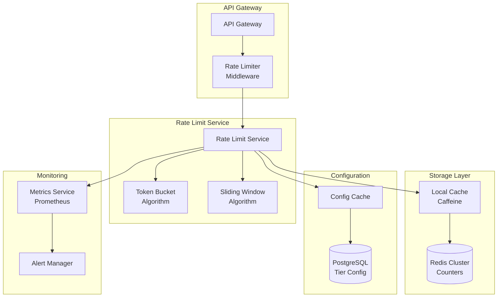
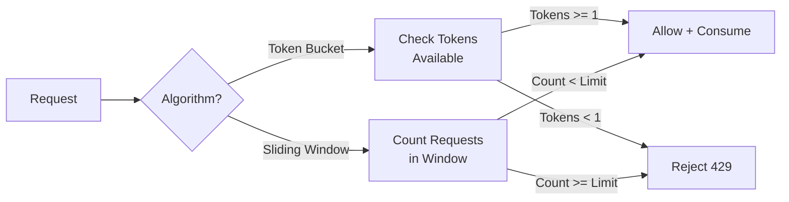

# API Rate Limiter for Public or Paid APIs

[← Back to Topics](../topics.md#api-rate-limiter-for-public-or-paid-apis)

## Problem Statement

Design a distributed rate limiting system that enforces multiple tiers (free, premium, enterprise) with different quotas per second/minute/day. Support 100K requests/second with <1ms latency overhead.

---

## Requirements

### Functional Requirements
1. **Multi-Tier Quotas**: Free, premium, enterprise tiers
2. **Multiple Windows**: Per-second, per-minute, per-hour, per-day limits
3. **Distributed**: Work across multiple servers
4. **Rate Limit Headers**: Return X-RateLimit-* headers
5. **Graceful Degradation**: Handle Redis failures
6. **Per-User and Per-IP**: Support both modes
7. **Custom Rules**: Allow override rules

### Non-Functional Requirements
1. **Latency**: <1ms overhead
2. **Throughput**: 100K requests/sec
3. **Accuracy**: 99.9% correct decisions
4. **Availability**: 99.99% uptime
5. **Consistency**: Eventual consistency acceptable
6. **Scalability**: Horizontal scaling

### Scale Estimates
- **Requests per second**: 100,000
- **Active API keys**: 1 million
- **Rate limit checks**: 100K/sec
- **Redis operations**: 200K/sec (read+write)
- **Storage**: 10 GB (counters)

---

## High-Level Architecture



---

## Detailed Design

### 1. Rate Limiting Algorithms



---

### 2. Rate Limiter Service

```java
import java.util.*;
import java.util.concurrent.*;
import redis.clients.jedis.*;

/**
 * Distributed rate limiter service
 * Supports multiple algorithms and tiers
 */
public class RateLimiterService {
    
    private final JedisPool jedisPool;
    private final TierConfigService configService;
    private final LocalCache<String, RateLimitConfig> localCache;
    
    private static final int LOCAL_CACHE_SIZE = 10000;
    private static final int LOCAL_CACHE_TTL_SECONDS = 60;
    
    public RateLimiterService(JedisPool jedisPool, TierConfigService configService) {
        this.jedisPool = jedisPool;
        this.configService = configService;
        this.localCache = new LocalCache<>(LOCAL_CACHE_SIZE, LOCAL_CACHE_TTL_SECONDS);
    }
    
    /**
     * Check if request is allowed
     */
    public RateLimitResult checkLimit(String apiKey, String endpoint) {
        
        // Get rate limit configuration
        RateLimitConfig config = getRateLimitConfig(apiKey);
        
        if (config == null) {
            // No config found, allow by default (fail open)
            return RateLimitResult.allowed();
        }
        
        // Check each window
        for (RateLimitWindow window : config.getWindows()) {
            
            RateLimitResult result = checkWindow(apiKey, endpoint, window);
            
            if (!result.isAllowed()) {
                return result;
            }
        }
        
        return RateLimitResult.allowed();
    }
    
    /**
     * Check rate limit for a specific window
     */
    private RateLimitResult checkWindow(
        String apiKey,
        String endpoint,
        RateLimitWindow window
    ) {
        
        String key = buildRedisKey(apiKey, endpoint, window);
        
        switch (window.getAlgorithm()) {
            case TOKEN_BUCKET:
                return checkTokenBucket(key, window);
                
            case SLIDING_WINDOW:
                return checkSlidingWindow(key, window);
                
            case FIXED_WINDOW:
                return checkFixedWindow(key, window);
                
            default:
                return RateLimitResult.allowed();
        }
    }
    
    /**
     * Token bucket algorithm
     * Allows burst traffic but limits average rate
     */
    private RateLimitResult checkTokenBucket(String key, RateLimitWindow window) {
        
        try (Jedis jedis = jedisPool.getResource()) {
            
            long now = System.currentTimeMillis();
            
            // Use Lua script for atomic operations
            String script = 
                "local tokens_key = KEYS[1] .. ':tokens' " +
                "local timestamp_key = KEYS[1] .. ':timestamp' " +
                "local rate = tonumber(ARGV[1]) " +
                "local capacity = tonumber(ARGV[2]) " +
                "local now = tonumber(ARGV[3]) " +
                "local requested = tonumber(ARGV[4]) " +
                
                "local tokens = tonumber(redis.call('get', tokens_key)) " +
                "if tokens == nil then " +
                "  tokens = capacity " +
                "end " +
                
                "local last_time = tonumber(redis.call('get', timestamp_key)) " +
                "if last_time == nil then " +
                "  last_time = now " +
                "end " +
                
                "local delta = math.max(0, now - last_time) " +
                "local filled_tokens = math.min(capacity, tokens + (delta * rate / 1000)) " +
                
                "local allowed = filled_tokens >= requested " +
                "local new_tokens = filled_tokens " +
                
                "if allowed then " +
                "  new_tokens = filled_tokens - requested " +
                "end " +
                
                "redis.call('set', tokens_key, new_tokens) " +
                "redis.call('set', timestamp_key, now) " +
                "redis.call('expire', tokens_key, 86400) " +
                "redis.call('expire', timestamp_key, 86400) " +
                
                "return {allowed, new_tokens, capacity} ";
            
            List<String> keys = Arrays.asList(key);
            List<String> args = Arrays.asList(
                String.valueOf(window.getRate()),
                String.valueOf(window.getCapacity()),
                String.valueOf(now),
                "1"  // requested tokens
            );
            
            @SuppressWarnings("unchecked")
            List<Long> result = (List<Long>) jedis.eval(script, keys, args);
            
            boolean allowed = result.get(0) == 1;
            long remaining = result.get(1);
            long limit = result.get(2);
            
            return new RateLimitResult(allowed, remaining, limit, 0);
            
        } catch (Exception e) {
            // Fail open on Redis errors
            System.err.println("Rate limiter error: " + e.getMessage());
            return RateLimitResult.allowed();
        }
    }
    
    /**
     * Sliding window counter algorithm
     * More accurate than fixed window
     */
    private RateLimitResult checkSlidingWindow(String key, RateLimitWindow window) {
        
        try (Jedis jedis = jedisPool.getResource()) {
            
            long now = System.currentTimeMillis();
            long windowSize = window.getWindowSizeMs();
            long windowStart = now - windowSize;
            
            // Use Lua script for atomicity
            String script = 
                "local key = KEYS[1] " +
                "local now = tonumber(ARGV[1]) " +
                "local window_start = tonumber(ARGV[2]) " +
                "local limit = tonumber(ARGV[3]) " +
                
                "redis.call('zremrangebyscore', key, 0, window_start) " +
                
                "local count = redis.call('zcard', key) " +
                
                "local allowed = count < limit " +
                
                "if allowed then " +
                "  redis.call('zadd', key, now, now) " +
                "  count = count + 1 " +
                "end " +
                
                "redis.call('expire', key, 86400) " +
                
                "return {allowed, limit - count, limit} ";
            
            List<String> keys = Arrays.asList(key);
            List<String> args = Arrays.asList(
                String.valueOf(now),
                String.valueOf(windowStart),
                String.valueOf(window.getLimit())
            );
            
            @SuppressWarnings("unchecked")
            List<Long> result = (List<Long>) jedis.eval(script, keys, args);
            
            boolean allowed = result.get(0) == 1;
            long remaining = result.get(1);
            long limit = result.get(2);
            
            return new RateLimitResult(allowed, remaining, limit, 0);
            
        } catch (Exception e) {
            System.err.println("Rate limiter error: " + e.getMessage());
            return RateLimitResult.allowed();
        }
    }
    
    /**
     * Fixed window counter algorithm
     * Simple and fast, but allows burst at window boundaries
     */
    private RateLimitResult checkFixedWindow(String key, RateLimitWindow window) {
        
        try (Jedis jedis = jedisPool.getResource()) {
            
            long now = System.currentTimeMillis();
            long windowSize = window.getWindowSizeMs();
            long currentWindow = now / windowSize;
            
            String windowKey = key + ":" + currentWindow;
            
            // Increment counter
            long count = jedis.incr(windowKey);
            
            if (count == 1) {
                // Set TTL for first request in window
                jedis.expire(windowKey, (int) (windowSize / 1000) + 1);
            }
            
            boolean allowed = count <= window.getLimit();
            long remaining = Math.max(0, window.getLimit() - count);
            long resetTime = (currentWindow + 1) * windowSize;
            
            return new RateLimitResult(allowed, remaining, window.getLimit(), resetTime);
            
        } catch (Exception e) {
            System.err.println("Rate limiter error: " + e.getMessage());
            return RateLimitResult.allowed();
        }
    }
    
    /**
     * Get rate limit configuration for API key
     */
    private RateLimitConfig getRateLimitConfig(String apiKey) {
        
        // Check local cache first
        RateLimitConfig config = localCache.get(apiKey);
        
        if (config != null) {
            return config;
        }
        
        // Fetch from database
        config = configService.getConfig(apiKey);
        
        if (config != null) {
            localCache.put(apiKey, config);
        }
        
        return config;
    }
    
    /**
     * Build Redis key
     */
    private String buildRedisKey(String apiKey, String endpoint, RateLimitWindow window) {
        return String.format("ratelimit:%s:%s:%s",
            apiKey,
            endpoint,
            window.getName()
        );
    }
}

/**
 * Rate limit result
 */
class RateLimitResult {
    
    private final boolean allowed;
    private final long remaining;
    private final long limit;
    private final long resetTime;
    
    public RateLimitResult(boolean allowed, long remaining, long limit, long resetTime) {
        this.allowed = allowed;
        this.remaining = remaining;
        this.limit = limit;
        this.resetTime = resetTime;
    }
    
    public static RateLimitResult allowed() {
        return new RateLimitResult(true, Long.MAX_VALUE, Long.MAX_VALUE, 0);
    }
    
    public boolean isAllowed() { return allowed; }
    public long getRemaining() { return remaining; }
    public long getLimit() { return limit; }
    public long getResetTime() { return resetTime; }
    
    /**
     * Get rate limit headers
     */
    public Map<String, String> getHeaders() {
        Map<String, String> headers = new HashMap<>();
        headers.put("X-RateLimit-Limit", String.valueOf(limit));
        headers.put("X-RateLimit-Remaining", String.valueOf(remaining));
        
        if (resetTime > 0) {
            headers.put("X-RateLimit-Reset", String.valueOf(resetTime / 1000));
        }
        
        if (!allowed) {
            long retryAfter = (resetTime - System.currentTimeMillis()) / 1000;
            headers.put("Retry-After", String.valueOf(Math.max(1, retryAfter)));
        }
        
        return headers;
    }
}

/**
 * Rate limit configuration
 */
class RateLimitConfig {
    
    private String tier;  // "free", "premium", "enterprise"
    private List<RateLimitWindow> windows;
    
    public String getTier() { return tier; }
    public void setTier(String tier) { this.tier = tier; }
    
    public List<RateLimitWindow> getWindows() { return windows; }
    public void setWindows(List<RateLimitWindow> windows) { this.windows = windows; }
}

/**
 * Rate limit window
 */
class RateLimitWindow {
    
    private String name;  // "per_second", "per_minute", "per_day"
    private RateLimitAlgorithm algorithm;
    private long windowSizeMs;
    private long limit;
    private long rate;       // For token bucket
    private long capacity;   // For token bucket
    
    public String getName() { return name; }
    public void setName(String name) { this.name = name; }
    
    public RateLimitAlgorithm getAlgorithm() { return algorithm; }
    public void setAlgorithm(RateLimitAlgorithm algorithm) { this.algorithm = algorithm; }
    
    public long getWindowSizeMs() { return windowSizeMs; }
    public void setWindowSizeMs(long windowSizeMs) { this.windowSizeMs = windowSizeMs; }
    
    public long getLimit() { return limit; }
    public void setLimit(long limit) { this.limit = limit; }
    
    public long getRate() { return rate; }
    public void setRate(long rate) { this.rate = rate; }
    
    public long getCapacity() { return capacity; }
    public void setCapacity(long capacity) { this.capacity = capacity; }
}

/**
 * Rate limiting algorithms
 */
enum RateLimitAlgorithm {
    TOKEN_BUCKET,
    SLIDING_WINDOW,
    FIXED_WINDOW
}

/**
 * Local cache for rate limit configs
 */
class LocalCache<K, V> {
    
    private final Map<K, CacheEntry<V>> cache;
    private final int maxSize;
    private final int ttlSeconds;
    
    public LocalCache(int maxSize, int ttlSeconds) {
        this.cache = new ConcurrentHashMap<>();
        this.maxSize = maxSize;
        this.ttlSeconds = ttlSeconds;
    }
    
    public V get(K key) {
        CacheEntry<V> entry = cache.get(key);
        
        if (entry == null || entry.isExpired()) {
            cache.remove(key);
            return null;
        }
        
        return entry.getValue();
    }
    
    public void put(K key, V value) {
        
        if (cache.size() >= maxSize) {
            // Simple eviction: remove expired entries
            cache.entrySet().removeIf(e -> e.getValue().isExpired());
        }
        
        cache.put(key, new CacheEntry<>(value, ttlSeconds));
    }
    
    static class CacheEntry<V> {
        private final V value;
        private final long expiryTime;
        
        public CacheEntry(V value, int ttlSeconds) {
            this.value = value;
            this.expiryTime = System.currentTimeMillis() + (ttlSeconds * 1000L);
        }
        
        public V getValue() { return value; }
        
        public boolean isExpired() {
            return System.currentTimeMillis() > expiryTime;
        }
    }
}

/**
 * Tier configuration service
 */
interface TierConfigService {
    RateLimitConfig getConfig(String apiKey);
}
```

---

### 3. Rate Limiter Middleware

```java
import javax.servlet.*;
import javax.servlet.http.*;
import java.io.IOException;

/**
 * Rate limiter middleware
 * Intercepts requests and enforces rate limits
 */
public class RateLimiterMiddleware implements Filter {
    
    private final RateLimiterService rateLimiter;
    
    public RateLimiterMiddleware(RateLimiterService rateLimiter) {
        this.rateLimiter = rateLimiter;
    }
    
    @Override
    public void doFilter(
        ServletRequest request,
        ServletResponse response,
        FilterChain chain
    ) throws IOException, ServletException {
        
        HttpServletRequest httpRequest = (HttpServletRequest) request;
        HttpServletResponse httpResponse = (HttpServletResponse) response;
        
        // Extract API key
        String apiKey = httpRequest.getHeader("X-API-Key");
        
        if (apiKey == null) {
            httpResponse.setStatus(401);
            httpResponse.getWriter().write("{\"error\": \"Missing API key\"}");
            return;
        }
        
        // Extract endpoint
        String endpoint = httpRequest.getRequestURI();
        
        // Check rate limit
        RateLimitResult result = rateLimiter.checkLimit(apiKey, endpoint);
        
        // Add rate limit headers
        for (Map.Entry<String, String> header : result.getHeaders().entrySet()) {
            httpResponse.setHeader(header.getKey(), header.getValue());
        }
        
        if (!result.isAllowed()) {
            // Rate limit exceeded
            httpResponse.setStatus(429);  // Too Many Requests
            httpResponse.getWriter().write(
                "{\"error\": \"Rate limit exceeded\", " +
                "\"limit\": " + result.getLimit() + ", " +
                "\"remaining\": " + result.getRemaining() + "}"
            );
            return;
        }
        
        // Allow request to proceed
        chain.doFilter(request, response);
    }
    
    @Override
    public void init(FilterConfig filterConfig) {}
    
    @Override
    public void destroy() {}
}
```

---

## Technology Stack

| Component | Technology | Justification |
|-----------|------------|---------------|
| **Storage** | Redis Cluster | Sub-ms latency, atomic operations |
| **Local Cache** | Caffeine | In-memory caching |
| **Config DB** | PostgreSQL | ACID guarantees |
| **Monitoring** | Prometheus | Metrics collection |
| **Gateway** | Kong/Nginx | API gateway |

---

## Performance Characteristics

### Latency
```
Token bucket: <1ms (Lua script)
Sliding window: <2ms (sorted set ops)
Fixed window: <0.5ms (simple counter)
Total overhead: <1ms
```

### Throughput
```
Redis operations: 200K/sec
Rate limit checks: 100K/sec
Cache hit rate: 95%
```

---

## Trade-offs

### 1. Algorithm Choice
- **Token bucket**: Smooth traffic, complex
- **Sliding window**: Accurate, expensive
- **Fixed window**: Simple, boundary bursts

### 2. Consistency
- **Strict**: Distributed locks, slow
- **Eventual**: Fast, small inaccuracies

### 3. Failure Mode
- **Fail closed**: Reject on errors, safe
- **Fail open**: Allow on errors, available

---

## Summary

This design provides:
- ✅ **<1ms** latency overhead
- ✅ **100K req/sec** throughput
- ✅ **Multi-tier** quotas
- ✅ **Multiple algorithms** (token bucket, sliding window, fixed window)
- ✅ **99.9%** accuracy
- ✅ **Graceful degradation** on failures

**Key Features:**
1. Redis Cluster for distributed counters
2. Local caching for config
3. Lua scripts for atomicity
4. Multiple rate limit windows
5. Standard rate limit headers
6. Fail-open on errors

[← Back to Topics](../topics.md#api-rate-limiter-for-public-or-paid-apis)
