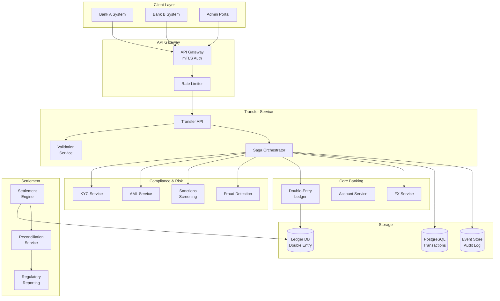
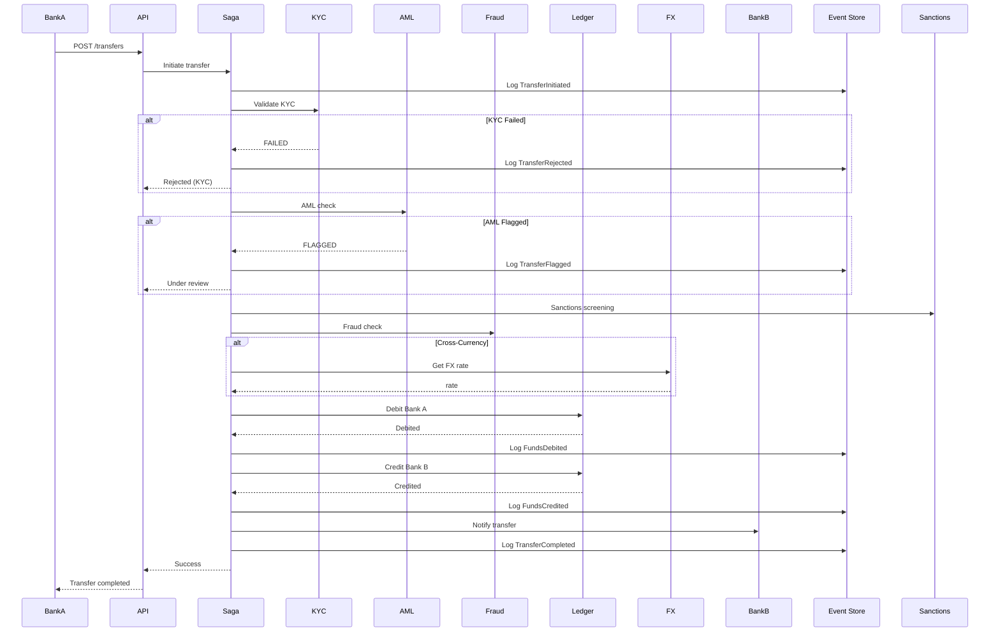

# Wire Transfer API Between Banks

[← Back to Topics](../topics.md#wire-transfer-api-between-banks)

## Problem Statement

Design an inter-bank wire transfer system supporting real-time settlements with ACID guarantees, fraud detection, regulatory compliance, and audit trails. Handle cross-currency transfers with 99.999% reliability.

---

## Requirements

### Functional Requirements
1. **Initiate Transfer**: Submit wire transfers between banks
2. **Real-Time Settlement**: Process within minutes
3. **Cross-Currency**: Support FX conversions
4. **Fraud Detection**: Real-time fraud checks
5. **Compliance**: AML/KYC validation
6. **Audit Trail**: Complete transaction history
7. **Reconciliation**: Daily reconciliation with banks
8. **Status Tracking**: Real-time status updates

### Non-Functional Requirements
1. **Throughput**: 10K transfers/day
2. **Availability**: 99.999% uptime
3. **Consistency**: ACID guarantees
4. **Security**: End-to-end encryption
5. **Latency**: <5 min settlement
6. **Audit**: Immutable audit log
7. **Compliance**: Regulatory reporting

### Scale Estimates
- **Transfers per day**: 10,000
- **Transfers per second**: 0.1 avg, 5 peak
- **Banks**: 1,000+ connected
- **Average transfer**: $50,000
- **Daily volume**: $500 million
- **Storage**: 100 TB (audit logs)

---

## High-Level Architecture



---

## Detailed Design

### 1. Transfer Flow (Saga Pattern)



---

### 2. Wire Transfer Service

```java
import java.util.*;
import java.util.concurrent.*;

/**
 * Wire transfer service
 * Handles inter-bank transfers with ACID guarantees
 */
public class WireTransferService {
    
    private final SagaOrchestrator sagaOrchestrator;
    private final TransferValidator validator;
    private final TransactionRepository txnRepository;
    private final EventStore eventStore;
    private final IdempotencyService idempotency;
    
    public WireTransferService(
        SagaOrchestrator sagaOrchestrator,
        TransferValidator validator,
        TransactionRepository txnRepository,
        EventStore eventStore,
        IdempotencyService idempotency
    ) {
        this.sagaOrchestrator = sagaOrchestrator;
        this.validator = validator;
        this.txnRepository = txnRepository;
        this.eventStore = eventStore;
        this.idempotency = idempotency;
    }
    
    /**
     * Initiate wire transfer
     */
    public TransferResult initiateTransfer(TransferRequest request) {
        
        // Check idempotency
        String idempotencyKey = request.getIdempotencyKey();
        
        if (idempotencyKey != null) {
            TransferResult cached = idempotency.get(idempotencyKey);
            if (cached != null) {
                return cached;
            }
        }
        
        // Validate request
        ValidationResult validation = validator.validate(request);
        
        if (!validation.isValid()) {
            return TransferResult.rejected(validation.getErrors());
        }
        
        // Create transfer record
        WireTransfer transfer = createTransfer(request);
        txnRepository.save(transfer);
        
        // Log event
        eventStore.append(new TransferInitiatedEvent(transfer.getId(), request));
        
        // Execute saga
        try {
            SagaResult result = sagaOrchestrator.execute(transfer);
            
            if (result.isSuccess()) {
                
                transfer.setStatus(TransferStatus.COMPLETED);
                transfer.setCompletedAt(System.currentTimeMillis());
                txnRepository.update(transfer);
                
                eventStore.append(new TransferCompletedEvent(transfer.getId()));
                
                TransferResult transferResult = TransferResult.success(
                    transfer.getId(),
                    transfer.getStatus()
                );
                
                // Cache for idempotency
                if (idempotencyKey != null) {
                    idempotency.put(idempotencyKey, transferResult, 86400);
                }
                
                return transferResult;
                
            } else {
                
                transfer.setStatus(result.getTransferStatus());
                transfer.setFailureReason(result.getFailureReason());
                txnRepository.update(transfer);
                
                eventStore.append(new TransferFailedEvent(
                    transfer.getId(),
                    result.getFailureReason()
                ));
                
                return TransferResult.failed(result.getFailureReason());
            }
            
        } catch (Exception e) {
            
            // Saga failed, rollback
            transfer.setStatus(TransferStatus.FAILED);
            transfer.setFailureReason(e.getMessage());
            txnRepository.update(transfer);
            
            eventStore.append(new TransferFailedEvent(transfer.getId(), e.getMessage()));
            
            return TransferResult.failed(e.getMessage());
        }
    }
    
    /**
     * Get transfer status
     */
    public TransferStatusResponse getStatus(String transferId) {
        
        WireTransfer transfer = txnRepository.findById(transferId);
        
        if (transfer == null) {
            throw new TransferException("Transfer not found");
        }
        
        return new TransferStatusResponse(
            transfer.getId(),
            transfer.getStatus(),
            transfer.getCreatedAt(),
            transfer.getCompletedAt()
        );
    }
    
    /**
     * Create transfer record
     */
    private WireTransfer createTransfer(TransferRequest request) {
        
        WireTransfer transfer = new WireTransfer();
        transfer.setId(UUID.randomUUID().toString());
        transfer.setSourceBank(request.getSourceBank());
        transfer.setSourceAccount(request.getSourceAccount());
        transfer.setDestinationBank(request.getDestinationBank());
        transfer.setDestinationAccount(request.getDestinationAccount());
        transfer.setAmount(request.getAmount());
        transfer.setSourceCurrency(request.getSourceCurrency());
        transfer.setDestinationCurrency(request.getDestinationCurrency());
        transfer.setStatus(TransferStatus.PENDING);
        transfer.setCreatedAt(System.currentTimeMillis());
        transfer.setPurpose(request.getPurpose());
        transfer.setBeneficiaryName(request.getBeneficiaryName());
        
        return transfer;
    }
}

/**
 * Saga orchestrator
 * Coordinates distributed transaction across services
 */
class SagaOrchestrator {
    
    private final KYCService kycService;
    private final AMLService amlService;
    private final SanctionsService sanctionsService;
    private final FraudDetectionService fraudService;
    private final LedgerService ledgerService;
    private final FXService fxService;
    private final EventStore eventStore;
    
    public SagaOrchestrator(
        KYCService kycService,
        AMLService amlService,
        SanctionsService sanctionsService,
        FraudDetectionService fraudService,
        LedgerService ledgerService,
        FXService fxService,
        EventStore eventStore
    ) {
        this.kycService = kycService;
        this.amlService = amlService;
        this.sanctionsService = sanctionsService;
        this.fraudService = fraudService;
        this.ledgerService = ledgerService;
        this.fxService = fxService;
        this.eventStore = eventStore;
    }
    
    /**
     * Execute saga for wire transfer
     */
    public SagaResult execute(WireTransfer transfer) {
        
        List<CompensatingAction> compensations = new ArrayList<>();
        
        try {
            // Step 1: KYC verification
            KYCResult kycResult = kycService.verify(
                transfer.getSourceAccount(),
                transfer.getDestinationAccount()
            );
            
            if (!kycResult.isPassed()) {
                return SagaResult.failed(
                    TransferStatus.REJECTED,
                    "KYC verification failed"
                );
            }
            
            eventStore.append(new KYCVerifiedEvent(transfer.getId()));
            
            // Step 2: AML check
            AMLResult amlResult = amlService.check(transfer);
            
            if (amlResult.isFlagged()) {
                return SagaResult.failed(
                    TransferStatus.UNDER_REVIEW,
                    "AML review required"
                );
            }
            
            eventStore.append(new AMLCheckedEvent(transfer.getId()));
            
            // Step 3: Sanctions screening
            SanctionsResult sanctionsResult = sanctionsService.screen(
                transfer.getBeneficiaryName(),
                transfer.getDestinationBank()
            );
            
            if (sanctionsResult.isBlocked()) {
                return SagaResult.failed(
                    TransferStatus.REJECTED,
                    "Sanctioned entity"
                );
            }
            
            // Step 4: Fraud detection
            FraudResult fraudResult = fraudService.check(transfer);
            
            if (fraudResult.isFraudulent()) {
                return SagaResult.failed(
                    TransferStatus.REJECTED,
                    "Fraud detected"
                );
            }
            
            // Step 5: FX conversion (if needed)
            double destinationAmount = transfer.getAmount();
            
            if (!transfer.getSourceCurrency().equals(transfer.getDestinationCurrency())) {
                
                FXRate fxRate = fxService.getRate(
                    transfer.getSourceCurrency(),
                    transfer.getDestinationCurrency()
                );
                
                destinationAmount = transfer.getAmount() * fxRate.getRate();
                transfer.setFxRate(fxRate.getRate());
                transfer.setDestinationAmount(destinationAmount);
                
                eventStore.append(new FXConvertedEvent(
                    transfer.getId(),
                    fxRate.getRate()
                ));
            }
            
            // Step 6: Debit source account
            LedgerEntry debitEntry = ledgerService.debit(
                transfer.getSourceBank(),
                transfer.getSourceAccount(),
                transfer.getAmount(),
                transfer.getSourceCurrency(),
                transfer.getId()
            );
            
            compensations.add(() -> ledgerService.credit(
                transfer.getSourceBank(),
                transfer.getSourceAccount(),
                transfer.getAmount(),
                transfer.getSourceCurrency(),
                transfer.getId() + "_reversal"
            ));
            
            eventStore.append(new FundsDebitedEvent(
                transfer.getId(),
                transfer.getAmount()
            ));
            
            // Step 7: Credit destination account
            LedgerEntry creditEntry = ledgerService.credit(
                transfer.getDestinationBank(),
                transfer.getDestinationAccount(),
                destinationAmount,
                transfer.getDestinationCurrency(),
                transfer.getId()
            );
            
            eventStore.append(new FundsCreditedEvent(
                transfer.getId(),
                destinationAmount
            ));
            
            return SagaResult.success();
            
        } catch (Exception e) {
            
            // Compensate (rollback)
            for (CompensatingAction compensation : compensations) {
                try {
                    compensation.execute();
                } catch (Exception rollbackError) {
                    // Log rollback failure
                    System.err.println("Compensation failed: " + rollbackError.getMessage());
                }
            }
            
            return SagaResult.failed(
                TransferStatus.FAILED,
                e.getMessage()
            );
        }
    }
}

/**
 * Wire transfer
 */
class WireTransfer {
    
    private String id;
    private String sourceBank;
    private String sourceAccount;
    private String destinationBank;
    private String destinationAccount;
    private double amount;
    private String sourceCurrency;
    private String destinationCurrency;
    private double destinationAmount;
    private double fxRate;
    private TransferStatus status;
    private long createdAt;
    private long completedAt;
    private String failureReason;
    private String purpose;
    private String beneficiaryName;
    
    // Getters and setters
    public String getId() { return id; }
    public void setId(String id) { this.id = id; }
    
    public String getSourceBank() { return sourceBank; }
    public void setSourceBank(String sourceBank) { this.sourceBank = sourceBank; }
    
    public String getSourceAccount() { return sourceAccount; }
    public void setSourceAccount(String sourceAccount) { 
        this.sourceAccount = sourceAccount; 
    }
    
    public String getDestinationBank() { return destinationBank; }
    public void setDestinationBank(String destinationBank) { 
        this.destinationBank = destinationBank; 
    }
    
    public String getDestinationAccount() { return destinationAccount; }
    public void setDestinationAccount(String destinationAccount) { 
        this.destinationAccount = destinationAccount; 
    }
    
    public double getAmount() { return amount; }
    public void setAmount(double amount) { this.amount = amount; }
    
    public String getSourceCurrency() { return sourceCurrency; }
    public void setSourceCurrency(String sourceCurrency) { 
        this.sourceCurrency = sourceCurrency; 
    }
    
    public String getDestinationCurrency() { return destinationCurrency; }
    public void setDestinationCurrency(String destinationCurrency) { 
        this.destinationCurrency = destinationCurrency; 
    }
    
    public double getDestinationAmount() { return destinationAmount; }
    public void setDestinationAmount(double destinationAmount) { 
        this.destinationAmount = destinationAmount; 
    }
    
    public double getFxRate() { return fxRate; }
    public void setFxRate(double fxRate) { this.fxRate = fxRate; }
    
    public TransferStatus getStatus() { return status; }
    public void setStatus(TransferStatus status) { this.status = status; }
    
    public long getCreatedAt() { return createdAt; }
    public void setCreatedAt(long createdAt) { this.createdAt = createdAt; }
    
    public long getCompletedAt() { return completedAt; }
    public void setCompletedAt(long completedAt) { this.completedAt = completedAt; }
    
    public String getFailureReason() { return failureReason; }
    public void setFailureReason(String failureReason) { 
        this.failureReason = failureReason; 
    }
    
    public String getPurpose() { return purpose; }
    public void setPurpose(String purpose) { this.purpose = purpose; }
    
    public String getBeneficiaryName() { return beneficiaryName; }
    public void setBeneficiaryName(String beneficiaryName) { 
        this.beneficiaryName = beneficiaryName; 
    }
}

/**
 * Transfer status
 */
enum TransferStatus {
    PENDING,
    UNDER_REVIEW,
    COMPLETED,
    REJECTED,
    FAILED
}

/**
 * Transfer request
 */
class TransferRequest {
    private String sourceBank;
    private String sourceAccount;
    private String destinationBank;
    private String destinationAccount;
    private double amount;
    private String sourceCurrency;
    private String destinationCurrency;
    private String purpose;
    private String beneficiaryName;
    private String idempotencyKey;
    
    // Getters
    public String getSourceBank() { return sourceBank; }
    public String getSourceAccount() { return sourceAccount; }
    public String getDestinationBank() { return destinationBank; }
    public String getDestinationAccount() { return destinationAccount; }
    public double getAmount() { return amount; }
    public String getSourceCurrency() { return sourceCurrency; }
    public String getDestinationCurrency() { return destinationCurrency; }
    public String getPurpose() { return purpose; }
    public String getBeneficiaryName() { return beneficiaryName; }
    public String getIdempotencyKey() { return idempotencyKey; }
}

/**
 * Transfer result
 */
class TransferResult {
    private boolean success;
    private String transferId;
    private TransferStatus status;
    private List<String> errors;
    private String failureReason;
    
    public static TransferResult success(String transferId, TransferStatus status) {
        TransferResult result = new TransferResult();
        result.success = true;
        result.transferId = transferId;
        result.status = status;
        return result;
    }
    
    public static TransferResult rejected(List<String> errors) {
        TransferResult result = new TransferResult();
        result.success = false;
        result.errors = errors;
        return result;
    }
    
    public static TransferResult failed(String reason) {
        TransferResult result = new TransferResult();
        result.success = false;
        result.failureReason = reason;
        return result;
    }
    
    public boolean isSuccess() { return success; }
    public String getTransferId() { return transferId; }
}

// Placeholder classes
class SagaResult {
    private boolean success;
    private TransferStatus transferStatus;
    private String failureReason;
    
    public static SagaResult success() {
        SagaResult result = new SagaResult();
        result.success = true;
        return result;
    }
    
    public static SagaResult failed(TransferStatus status, String reason) {
        SagaResult result = new SagaResult();
        result.success = false;
        result.transferStatus = status;
        result.failureReason = reason;
        return result;
    }
    
    public boolean isSuccess() { return success; }
    public TransferStatus getTransferStatus() { return transferStatus; }
    public String getFailureReason() { return failureReason; }
}

interface CompensatingAction {
    void execute() throws Exception;
}

class TransferException extends RuntimeException {
    public TransferException(String message) { super(message); }
}

class ValidationResult {
    private boolean valid;
    private List<String> errors;
    
    public boolean isValid() { return valid; }
    public List<String> getErrors() { return errors; }
}

class TransferStatusResponse {
    private String transferId;
    private TransferStatus status;
    private long createdAt;
    private long completedAt;
    
    public TransferStatusResponse(String transferId, TransferStatus status, 
                                 long createdAt, long completedAt) {
        this.transferId = transferId;
        this.status = status;
        this.createdAt = createdAt;
        this.completedAt = completedAt;
    }
}

// Service interfaces
interface KYCService {
    KYCResult verify(String sourceAccount, String destAccount);
}

interface AMLService {
    AMLResult check(WireTransfer transfer);
}

interface SanctionsService {
    SanctionsResult screen(String beneficiary, String bank);
}

interface FraudDetectionService {
    FraudResult check(WireTransfer transfer);
}

interface LedgerService {
    LedgerEntry debit(String bank, String account, double amount, String currency, String ref);
    LedgerEntry credit(String bank, String account, double amount, String currency, String ref);
}

interface FXService {
    FXRate getRate(String fromCurrency, String toCurrency);
}

interface TransferValidator {
    ValidationResult validate(TransferRequest request);
}

interface TransactionRepository {
    void save(WireTransfer transfer);
    void update(WireTransfer transfer);
    WireTransfer findById(String id);
}

interface EventStore {
    void append(Object event);
}

interface IdempotencyService {
    TransferResult get(String key);
    void put(String key, TransferResult result, int ttlSeconds);
}

// Result classes
class KYCResult {
    private boolean passed;
    public boolean isPassed() { return passed; }
}

class AMLResult {
    private boolean flagged;
    public boolean isFlagged() { return flagged; }
}

class SanctionsResult {
    private boolean blocked;
    public boolean isBlocked() { return blocked; }
}

class FraudResult {
    private boolean fraudulent;
    public boolean isFraudulent() { return fraudulent; }
}

class FXRate {
    private double rate;
    public double getRate() { return rate; }
}

class LedgerEntry {
    private String id;
    private double amount;
}

// Event classes
class TransferInitiatedEvent {
    public TransferInitiatedEvent(String transferId, TransferRequest request) {}
}

class TransferCompletedEvent {
    public TransferCompletedEvent(String transferId) {}
}

class TransferFailedEvent {
    public TransferFailedEvent(String transferId, String reason) {}
}

class KYCVerifiedEvent {
    public KYCVerifiedEvent(String transferId) {}
}

class AMLCheckedEvent {
    public AMLCheckedEvent(String transferId) {}
}

class FXConvertedEvent {
    public FXConvertedEvent(String transferId, double rate) {}
}

class FundsDebitedEvent {
    public FundsDebitedEvent(String transferId, double amount) {}
}

class FundsCreditedEvent {
    public FundsCreditedEvent(String transferId, double amount) {}
}
```

---

## Technology Stack

| Component | Technology | Justification |
|-----------|------------|---------------|
| **Transaction DB** | PostgreSQL | ACID guarantees |
| **Event Store** | EventStoreDB | Immutable audit log |
| **Messaging** | Kafka | Event streaming |
| **Ledger** | Custom/Tigerbeetle | Double-entry bookkeeping |
| **Encryption** | TLS 1.3, mTLS | Secure communication |

---

## Performance Characteristics

### Transfer Processing
```
Validation: <100ms
Compliance checks: <1s
Settlement: <5 min
Throughput: 5 TPS peak
```

### Reliability
```
Uptime: 99.999%
Data consistency: ACID
Event ordering: Guaranteed
Audit completeness: 100%
```

---

## Trade-offs

### 1. Consistency vs Availability
- **Strong consistency**: ACID, slower
- **Eventual consistency**: Fast, risk

### 2. Real-Time vs Batch
- **Real-time**: <5 min, expensive
- **Batch**: Daily, efficient

### 3. Saga vs 2PC
- **Saga**: Scalable, compensations
- **2PC**: ACID, blocking

---

## Summary

This design provides:
- ✅ **ACID** guarantees for transfers
- ✅ **<5 min** settlement time
- ✅ **99.999%** availability
- ✅ **Complete audit** trail (event sourcing)
- ✅ **Compliance** (KYC/AML/Sanctions)
- ✅ **Cross-currency** support

**Key Features:**
1. Saga pattern for distributed transactions
2. Event sourcing for audit trail
3. Double-entry ledger
4. Comprehensive compliance checks
5. FX conversion support
6. Compensating transactions for rollback

[← Back to Topics](../topics.md#wire-transfer-api-between-banks)
