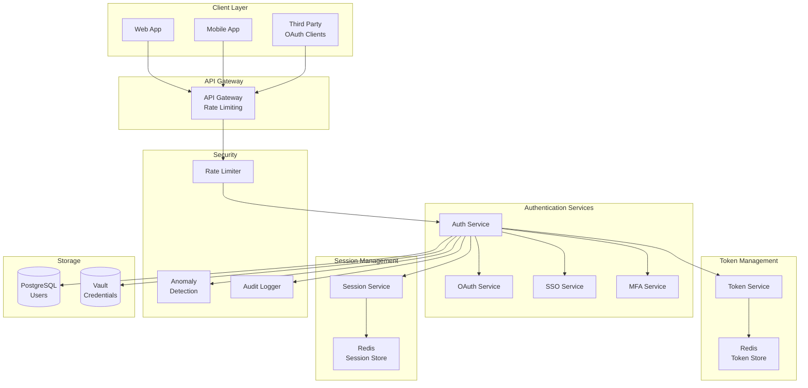
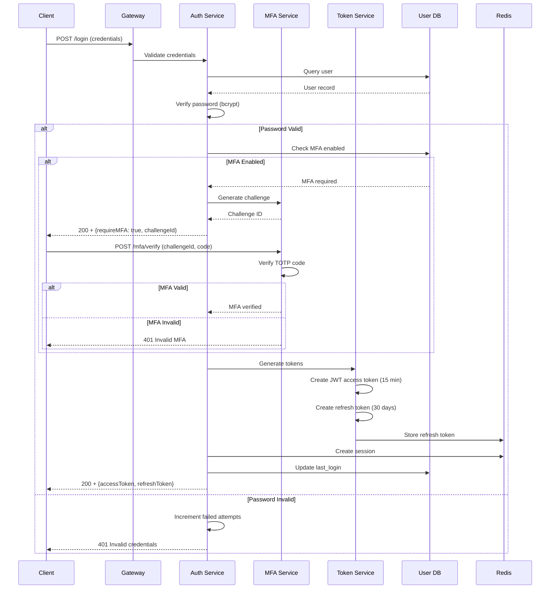

# Login and Authentication System for Web and Mobile Apps

[← Back to Topics](../topics.md#login-and-authentication-system-for-web-and-mobile-apps)

## Problem Statement

Design a multi-tenant authentication system supporting multiple authentication methods (username/password, OAuth, SSO, MFA, biometrics) that handles 1M logins/day with 99.99% availability and secure session management across web and mobile platforms.

---

## Requirements

### Functional Requirements
1. **Multi-Method Auth**: Username/password, OAuth, SSO, MFA, biometrics
2. **Session Management**: Stateless JWT and stateful sessions
3. **Token Management**: Access/refresh tokens with rotation
4. **MFA Support**: TOTP, SMS, push notifications
5. **Password Management**: Reset, change, policies
6. **Account Security**: Rate limiting, anomaly detection
7. **SSO Integration**: SAML, OAuth 2.0, OpenID Connect

### Non-Functional Requirements
1. **Scale**: 1M logins/day (~12 logins/sec)
2. **Availability**: 99.99% uptime
3. **Latency**: <200ms login response
4. **Security**: PCI DSS, OWASP compliance
5. **Multi-tenancy**: Isolated tenant data

### Scale Estimates
- **Peak logins**: ~50/sec (5x average)
- **Active sessions**: 500K concurrent
- **Session storage**: ~50MB (100 bytes × 500K)
- **Token refresh**: 10K/min
- **MFA requests**: 30% of logins (~4 req/sec)

---

## High-Level Architecture



---

## Detailed Design

### 1. Authentication Flow



---

### 2. Authentication Service

```java
import java.time.*;
import java.util.*;
import org.springframework.security.crypto.bcrypt.BCryptPasswordEncoder;
import io.jsonwebtoken.*;

/**
 * Authentication service
 * Handles login, token generation, and session management
 */
public class AuthenticationService {
    
    private final UserRepository userRepository;
    private final PasswordEncoder passwordEncoder;
    private final TokenService tokenService;
    private final SessionService sessionService;
    private final MFAService mfaService;
    private final RateLimiter rateLimiter;
    private final AuditLogger auditLogger;
    
    private static final int MAX_LOGIN_ATTEMPTS = 5;
    private static final int LOCKOUT_DURATION_MINUTES = 15;
    
    public AuthenticationService(
        UserRepository userRepository,
        PasswordEncoder passwordEncoder,
        TokenService tokenService,
        SessionService sessionService,
        MFAService mfaService,
        RateLimiter rateLimiter,
        AuditLogger auditLogger
    ) {
        this.userRepository = userRepository;
        this.passwordEncoder = passwordEncoder;
        this.tokenService = tokenService;
        this.sessionService = sessionService;
        this.mfaService = mfaService;
        this.rateLimiter = rateLimiter;
        this.auditLogger = auditLogger;
    }
    
    /**
     * Login with username and password
     */
    public LoginResponse login(LoginRequest request) {
        
        String username = request.getUsername();
        String password = request.getPassword();
        String ipAddress = request.getIpAddress();
        
        // Rate limiting
        if (!rateLimiter.allowLogin(username, ipAddress)) {
            auditLogger.logFailedLogin(username, ipAddress, "RATE_LIMIT_EXCEEDED");
            throw new AuthenticationException("Too many login attempts");
        }
        
        // Fetch user
        User user = userRepository.findByUsername(username)
            .orElseThrow(() -> new AuthenticationException("Invalid credentials"));
        
        // Check account lockout
        if (isAccountLocked(user)) {
            auditLogger.logFailedLogin(username, ipAddress, "ACCOUNT_LOCKED");
            throw new AuthenticationException("Account locked");
        }
        
        // Verify password
        if (!passwordEncoder.matches(password, user.getPasswordHash())) {
            
            // Increment failed attempts
            incrementFailedAttempts(user);
            
            auditLogger.logFailedLogin(username, ipAddress, "INVALID_PASSWORD");
            throw new AuthenticationException("Invalid credentials");
        }
        
        // Reset failed attempts
        resetFailedAttempts(user);
        
        // Check MFA
        if (user.isMfaEnabled()) {
            
            // Generate MFA challenge
            String challengeId = mfaService.createChallenge(user.getId());
            
            return LoginResponse.mfaRequired(challengeId);
        }
        
        // Generate tokens
        return completeLogin(user, ipAddress);
    }
    
    /**
     * Complete login after MFA verification
     */
    public LoginResponse completeMfaLogin(String challengeId, String mfaCode, String ipAddress) {
        
        // Verify MFA code
        MFAVerification verification = mfaService.verifyChallenge(challengeId, mfaCode);
        
        if (!verification.isValid()) {
            throw new AuthenticationException("Invalid MFA code");
        }
        
        // Fetch user
        User user = userRepository.findById(verification.getUserId())
            .orElseThrow(() -> new AuthenticationException("User not found"));
        
        return completeLogin(user, ipAddress);
    }
    
    /**
     * Complete login - generate tokens and session
     */
    private LoginResponse completeLogin(User user, String ipAddress) {
        
        // Generate access token (JWT)
        String accessToken = tokenService.generateAccessToken(user);
        
        // Generate refresh token
        String refreshToken = tokenService.generateRefreshToken(user);
        
        // Create session
        Session session = sessionService.createSession(
            user.getId(),
            ipAddress,
            refreshToken
        );
        
        // Update last login
        user.setLastLoginAt(Instant.now());
        user.setLastLoginIp(ipAddress);
        userRepository.save(user);
        
        // Audit log
        auditLogger.logSuccessfulLogin(user.getUsername(), ipAddress);
        
        return LoginResponse.success(accessToken, refreshToken, session.getId());
    }
    
    /**
     * Refresh access token
     */
    public TokenRefreshResponse refreshToken(String refreshToken) {
        
        // Verify refresh token
        if (!tokenService.isValidRefreshToken(refreshToken)) {
            throw new AuthenticationException("Invalid refresh token");
        }
        
        // Get user from token
        String userId = tokenService.extractUserId(refreshToken);
        
        User user = userRepository.findById(userId)
            .orElseThrow(() -> new AuthenticationException("User not found"));
        
        // Generate new access token
        String newAccessToken = tokenService.generateAccessToken(user);
        
        // Rotate refresh token (optional)
        String newRefreshToken = tokenService.rotateRefreshToken(refreshToken, user);
        
        return new TokenRefreshResponse(newAccessToken, newRefreshToken);
    }
    
    /**
     * Logout
     */
    public void logout(String userId, String sessionId) {
        
        // Invalidate session
        sessionService.invalidateSession(sessionId);
        
        // Revoke tokens
        tokenService.revokeUserTokens(userId);
        
        auditLogger.logLogout(userId);
    }
    
    /**
     * Check if account is locked
     */
    private boolean isAccountLocked(User user) {
        
        if (user.getFailedLoginAttempts() < MAX_LOGIN_ATTEMPTS) {
            return false;
        }
        
        // Check if lockout period expired
        if (user.getLockedUntil() != null) {
            
            if (Instant.now().isAfter(user.getLockedUntil())) {
                // Lockout expired, reset
                resetFailedAttempts(user);
                return false;
            }
            
            return true;
        }
        
        return false;
    }
    
    /**
     * Increment failed login attempts
     */
    private void incrementFailedAttempts(User user) {
        
        int attempts = user.getFailedLoginAttempts() + 1;
        user.setFailedLoginAttempts(attempts);
        
        if (attempts >= MAX_LOGIN_ATTEMPTS) {
            // Lock account
            Instant lockoutUntil = Instant.now().plus(
                Duration.ofMinutes(LOCKOUT_DURATION_MINUTES)
            );
            user.setLockedUntil(lockoutUntil);
        }
        
        userRepository.save(user);
    }
    
    /**
     * Reset failed attempts
     */
    private void resetFailedAttempts(User user) {
        user.setFailedLoginAttempts(0);
        user.setLockedUntil(null);
        userRepository.save(user);
    }
}

/**
 * Token service
 * JWT generation and validation
 */
class TokenService {
    
    private final String jwtSecret;
    private final JedisPool jedisPool;
    
    private static final int ACCESS_TOKEN_EXPIRY_MINUTES = 15;
    private static final int REFRESH_TOKEN_EXPIRY_DAYS = 30;
    
    public TokenService(String jwtSecret, JedisPool jedisPool) {
        this.jwtSecret = jwtSecret;
        this.jedisPool = jedisPool;
    }
    
    /**
     * Generate JWT access token
     */
    public String generateAccessToken(User user) {
        
        Instant now = Instant.now();
        Instant expiry = now.plus(Duration.ofMinutes(ACCESS_TOKEN_EXPIRY_MINUTES));
        
        return Jwts.builder()
            .setSubject(user.getId())
            .claim("username", user.getUsername())
            .claim("email", user.getEmail())
            .claim("roles", user.getRoles())
            .setIssuedAt(Date.from(now))
            .setExpiration(Date.from(expiry))
            .signWith(SignatureAlgorithm.HS512, jwtSecret)
            .compact();
    }
    
    /**
     * Generate refresh token
     */
    public String generateRefreshToken(User user) {
        
        // Generate random token
        String token = UUID.randomUUID().toString();
        
        // Store in Redis with expiry
        try (Jedis jedis = jedisPool.getResource()) {
            
            String key = "refresh_token:" + token;
            
            jedis.setex(
                key,
                REFRESH_TOKEN_EXPIRY_DAYS * 24 * 3600,  // TTL in seconds
                user.getId()
            );
        }
        
        return token;
    }
    
    /**
     * Validate refresh token
     */
    public boolean isValidRefreshToken(String token) {
        
        try (Jedis jedis = jedisPool.getResource()) {
            
            String key = "refresh_token:" + token;
            return jedis.exists(key);
        }
    }
    
    /**
     * Extract user ID from refresh token
     */
    public String extractUserId(String token) {
        
        try (Jedis jedis = jedisPool.getResource()) {
            
            String key = "refresh_token:" + token;
            return jedis.get(key);
        }
    }
    
    /**
     * Rotate refresh token
     */
    public String rotateRefreshToken(String oldToken, User user) {
        
        // Revoke old token
        revokeRefreshToken(oldToken);
        
        // Generate new token
        return generateRefreshToken(user);
    }
    
    /**
     * Revoke refresh token
     */
    public void revokeRefreshToken(String token) {
        
        try (Jedis jedis = jedisPool.getResource()) {
            
            String key = "refresh_token:" + token;
            jedis.del(key);
        }
    }
    
    /**
     * Revoke all user tokens
     */
    public void revokeUserTokens(String userId) {
        
        try (Jedis jedis = jedisPool.getResource()) {
            
            // Find all refresh tokens for user
            Set<String> keys = jedis.keys("refresh_token:*");
            
            for (String key : keys) {
                
                String storedUserId = jedis.get(key);
                
                if (userId.equals(storedUserId)) {
                    jedis.del(key);
                }
            }
        }
    }
}

/**
 * MFA service
 * TOTP-based multi-factor authentication
 */
class MFAService {
    
    private final JedisPool jedisPool;
    
    private static final int CHALLENGE_EXPIRY_MINUTES = 5;
    private static final int TOTP_WINDOW = 1;  // Allow 1 time step before/after
    
    public MFAService(JedisPool jedisPool) {
        this.jedisPool = jedisPool;
    }
    
    /**
     * Create MFA challenge
     */
    public String createChallenge(String userId) {
        
        String challengeId = UUID.randomUUID().toString();
        
        try (Jedis jedis = jedisPool.getResource()) {
            
            String key = "mfa_challenge:" + challengeId;
            
            jedis.setex(
                key,
                CHALLENGE_EXPIRY_MINUTES * 60,
                userId
            );
        }
        
        return challengeId;
    }
    
    /**
     * Verify MFA challenge
     */
    public MFAVerification verifyChallenge(String challengeId, String code) {
        
        try (Jedis jedis = jedisPool.getResource()) {
            
            String key = "mfa_challenge:" + challengeId;
            String userId = jedis.get(key);
            
            if (userId == null) {
                return MFAVerification.invalid("Challenge expired or not found");
            }
            
            // TODO: Fetch user's TOTP secret and verify code
            // Using Google Authenticator compatible TOTP
            boolean valid = verifyTOTP(userId, code);
            
            if (valid) {
                // Delete challenge
                jedis.del(key);
                return MFAVerification.valid(userId);
            }
            
            return MFAVerification.invalid("Invalid code");
        }
    }
    
    /**
     * Verify TOTP code
     */
    private boolean verifyTOTP(String userId, String code) {
        // TODO: Implement TOTP verification using user's secret
        // Use library like google-authenticator
        return true;  // Placeholder
    }
}

/**
 * Login request
 */
class LoginRequest {
    private String username;
    private String password;
    private String ipAddress;
    
    // Getters
    public String getUsername() { return username; }
    public String getPassword() { return password; }
    public String getIpAddress() { return ipAddress; }
}

/**
 * Login response
 */
class LoginResponse {
    
    private boolean success;
    private boolean requireMfa;
    private String challengeId;
    private String accessToken;
    private String refreshToken;
    private String sessionId;
    
    public static LoginResponse success(String accessToken, String refreshToken, String sessionId) {
        LoginResponse response = new LoginResponse();
        response.success = true;
        response.requireMfa = false;
        response.accessToken = accessToken;
        response.refreshToken = refreshToken;
        response.sessionId = sessionId;
        return response;
    }
    
    public static LoginResponse mfaRequired(String challengeId) {
        LoginResponse response = new LoginResponse();
        response.success = false;
        response.requireMfa = true;
        response.challengeId = challengeId;
        return response;
    }
}

/**
 * Token refresh response
 */
class TokenRefreshResponse {
    private String accessToken;
    private String refreshToken;
    
    public TokenRefreshResponse(String accessToken, String refreshToken) {
        this.accessToken = accessToken;
        this.refreshToken = refreshToken;
    }
}

/**
 * MFA verification result
 */
class MFAVerification {
    
    private boolean valid;
    private String userId;
    private String errorMessage;
    
    public static MFAVerification valid(String userId) {
        MFAVerification v = new MFAVerification();
        v.valid = true;
        v.userId = userId;
        return v;
    }
    
    public static MFAVerification invalid(String errorMessage) {
        MFAVerification v = new MFAVerification();
        v.valid = false;
        v.errorMessage = errorMessage;
        return v;
    }
    
    public boolean isValid() { return valid; }
    public String getUserId() { return userId; }
}

// Service interfaces
interface UserRepository {
    Optional<User> findByUsername(String username);
    Optional<User> findById(String id);
    void save(User user);
}

interface SessionService {
    Session createSession(String userId, String ipAddress, String refreshToken);
    void invalidateSession(String sessionId);
}

interface RateLimiter {
    boolean allowLogin(String username, String ipAddress);
}

interface AuditLogger {
    void logSuccessfulLogin(String username, String ipAddress);
    void logFailedLogin(String username, String ipAddress, String reason);
    void logLogout(String userId);
}

interface PasswordEncoder {
    boolean matches(String rawPassword, String encodedPassword);
}

// Model classes
class User {
    private String id;
    private String username;
    private String email;
    private String passwordHash;
    private boolean mfaEnabled;
    private List<String> roles;
    private int failedLoginAttempts;
    private Instant lockedUntil;
    private Instant lastLoginAt;
    private String lastLoginIp;
    
    // Getters and setters
    public String getId() { return id; }
    public String getUsername() { return username; }
    public String getEmail() { return email; }
    public String getPasswordHash() { return passwordHash; }
    public boolean isMfaEnabled() { return mfaEnabled; }
    public List<String> getRoles() { return roles; }
    public int getFailedLoginAttempts() { return failedLoginAttempts; }
    public void setFailedLoginAttempts(int attempts) { 
        this.failedLoginAttempts = attempts; 
    }
    public Instant getLockedUntil() { return lockedUntil; }
    public void setLockedUntil(Instant lockedUntil) { this.lockedUntil = lockedUntil; }
    public Instant getLastLoginAt() { return lastLoginAt; }
    public void setLastLoginAt(Instant lastLoginAt) { this.lastLoginAt = lastLoginAt; }
    public String getLastLoginIp() { return lastLoginIp; }
    public void setLastLoginIp(String ip) { this.lastLoginIp = ip; }
}

class Session {
    private String id;
    private String userId;
    private String ipAddress;
    private Instant createdAt;
    private Instant expiresAt;
    
    public String getId() { return id; }
}

class AuthenticationException extends RuntimeException {
    public AuthenticationException(String message) {
        super(message);
    }
}
```

---

## Technology Stack

| Component | Technology | Justification |
|-----------|------------|---------------|
| **JWT** | JJWT Library | Stateless tokens |
| **Password** | BCrypt/Argon2 | Secure hashing |
| **Session** | Redis | Fast access |
| **Database** | PostgreSQL | User data |
| **MFA** | TOTP (RFC 6238) | Time-based OTP |

---

## Performance Characteristics

### Login Performance
```
Login latency: <200ms p95
Token generation: <50ms
Password verification: ~100ms (bcrypt)
MFA verification: <100ms
```

### Scale
```
Logins/day: 1M (~12/sec)
Peak logins: 50/sec
Active sessions: 500K
Token refresh: 10K/min
```

---

## Trade-offs

### 1. JWT vs Session Tokens
- **JWT**: Stateless, scalable, larger size
- **Session**: Stateful, smaller, instant revocation

### 2. Access Token Expiry
- **Short (15 min)**: More secure, frequent refresh
- **Long (24 hr)**: Convenient, security risk

### 3. MFA Methods
- **TOTP**: No SMS costs, requires app
- **SMS**: Easy, expensive, less secure

---

## Summary

This design provides:
- ✅ **Multi-method** authentication (password, OAuth, SSO, MFA)
- ✅ **99.99%** availability
- ✅ **<200ms** login latency
- ✅ **1M** logins/day capacity
- ✅ **Secure** token management
- ✅ **Account** protection (rate limiting, lockout)

**Key Features:**
1. JWT for stateless access tokens (15 min expiry)
2. Refresh token rotation for security
3. TOTP-based MFA with challenge flow
4. BCrypt password hashing (10 rounds)
5. Rate limiting: 5 failed attempts → 15 min lockout
6. Session storage in Redis with 30-day TTL
7. Comprehensive audit logging

[← Back to Topics](../topics.md#login-and-authentication-system-for-web-and-mobile-apps)
