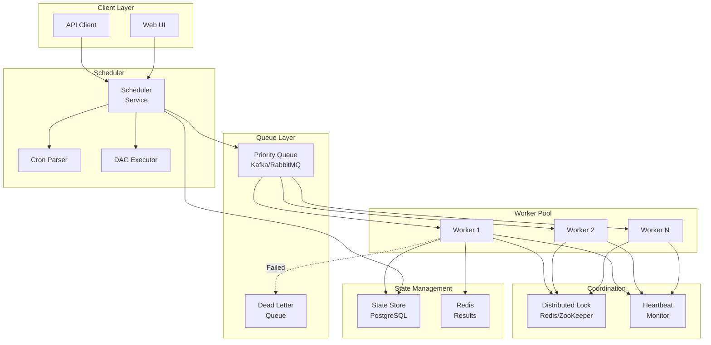
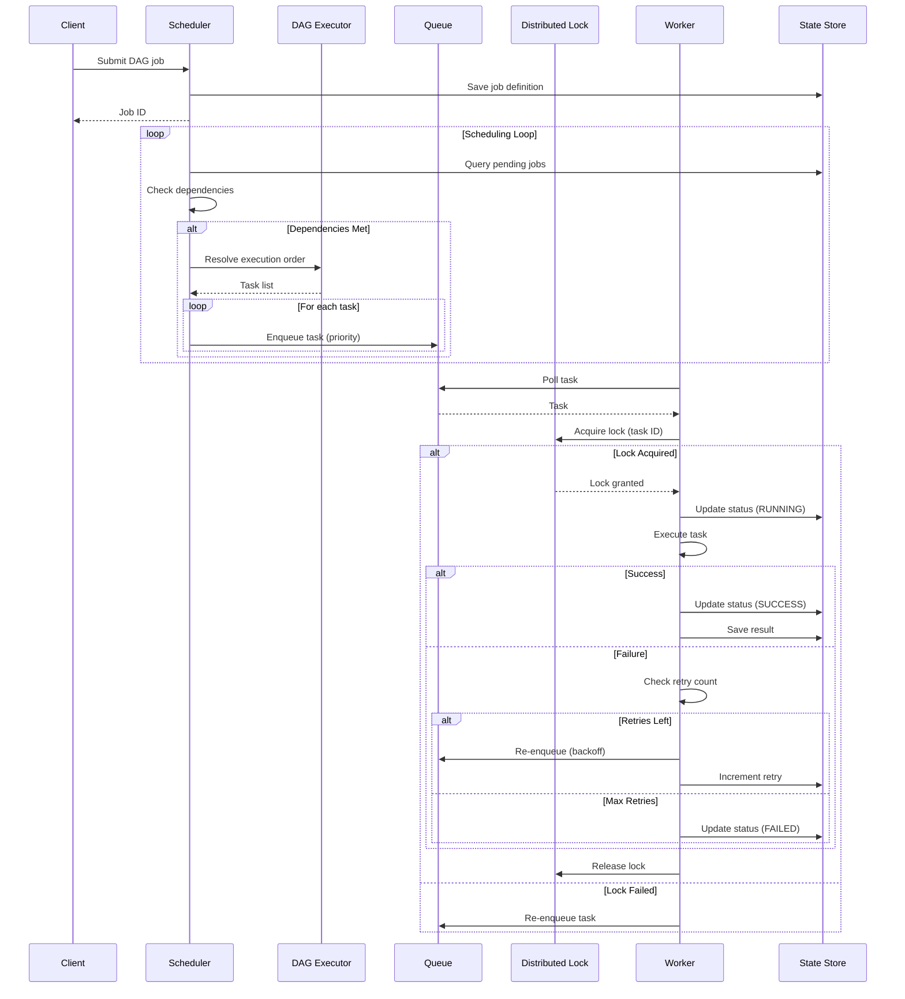

# Distributed Job Scheduler for Background Tasks

[← Back to Topics](../topics.md#distributed-job-scheduler-for-background-tasks-like-airflow-temporal)

## Problem Statement

Design a distributed task scheduler like Airflow or Temporal that executes millions of background jobs with dependency management (DAG workflows), retries, priority queues, and exactly-once execution guarantees. Support cron schedules and handle worker failures gracefully.

---

## Requirements

### Functional Requirements
1. **Job Scheduling**: Cron, one-time, recurring
2. **DAG Workflows**: Task dependencies
3. **Priority Queues**: High/medium/low priority
4. **Retry Logic**: Exponential backoff
5. **Exactly-Once**: Idempotent execution
6. **Worker Pool**: Dynamic scaling
7. **Job Status**: Pending, running, success, failed

### Non-Functional Requirements
1. **Scale**: 10M jobs/day
2. **Throughput**: 1K jobs/sec
3. **Latency**: <1s scheduling
4. **Availability**: 99.99% uptime
5. **Durability**: No job loss

### Scale Estimates
- **Jobs per day**: 10M (~115 jobs/sec)
- **Peak load**: 1K jobs/sec
- **Average job duration**: 5 minutes
- **Concurrent jobs**: ~25K
- **Workers**: 1000 workers
- **DAG workflows**: 10K active DAGs

---

## High-Level Architecture



---

## Detailed Design

### 1. Scheduler and Execution Flow



---

### 2. Scheduler Service

```java
import java.time.*;
import java.util.*;
import java.util.concurrent.*;

/**
 * Scheduler service
 * Schedules jobs and manages DAG execution
 */
public class SchedulerService {
    
    private final JobRepository jobRepository;
    private final DAGExecutor dagExecutor;
    private final TaskQueue taskQueue;
    private final ScheduledExecutorService executor;
    
    private static final int SCHEDULING_INTERVAL_SECONDS = 5;
    
    public SchedulerService(
        JobRepository jobRepository,
        DAGExecutor dagExecutor,
        TaskQueue taskQueue
    ) {
        this.jobRepository = jobRepository;
        this.dagExecutor = dagExecutor;
        this.taskQueue = taskQueue;
        this.executor = Executors.newScheduledThreadPool(4);
    }
    
    /**
     * Start scheduler
     */
    public void start() {
        
        // Schedule jobs periodically
        executor.scheduleAtFixedRate(
            this::scheduleReadyJobs,
            0,
            SCHEDULING_INTERVAL_SECONDS,
            TimeUnit.SECONDS
        );
        
        // Check for stale jobs
        executor.scheduleAtFixedRate(
            this::checkStaleJobs,
            0,
            60,
            TimeUnit.SECONDS
        );
    }
    
    /**
     * Submit a new job
     */
    public String submitJob(JobDefinition jobDef) {
        
        // Generate job ID
        String jobId = UUID.randomUUID().toString();
        
        // Create job
        Job job = new Job();
        job.setId(jobId);
        job.setName(jobDef.getName());
        job.setDag(jobDef.getDag());
        job.setSchedule(jobDef.getSchedule());
        job.setStatus(JobStatus.PENDING);
        job.setCreatedAt(Instant.now());
        job.setNextRunAt(calculateNextRun(jobDef.getSchedule()));
        
        // Save to database
        jobRepository.save(job);
        
        return jobId;
    }
    
    /**
     * Schedule ready jobs
     */
    private void scheduleReadyJobs() {
        
        Instant now = Instant.now();
        
        // Find jobs ready to run
        List<Job> readyJobs = jobRepository.findReadyJobs(now);
        
        for (Job job : readyJobs) {
            
            try {
                
                // Check if DAG job or simple job
                if (job.getDag() != null) {
                    
                    // Execute DAG
                    dagExecutor.executeDag(job);
                    
                } else {
                    
                    // Enqueue single task
                    Task task = createTask(job);
                    taskQueue.enqueue(task);
                    
                    // Update job status
                    job.setStatus(JobStatus.RUNNING);
                    jobRepository.save(job);
                }
                
                // Schedule next run if recurring
                if (job.getSchedule() != null) {
                    
                    Instant nextRun = calculateNextRun(job.getSchedule());
                    job.setNextRunAt(nextRun);
                    jobRepository.save(job);
                }
                
            } catch (Exception e) {
                
                // Handle scheduling error
                job.setStatus(JobStatus.FAILED);
                job.setError(e.getMessage());
                jobRepository.save(job);
            }
        }
    }
    
    /**
     * Check for stale jobs (workers died)
     */
    private void checkStaleJobs() {
        
        Instant staleThreshold = Instant.now().minus(Duration.ofMinutes(15));
        
        // Find jobs stuck in RUNNING state
        List<Job> staleJobs = jobRepository.findStaleJobs(staleThreshold);
        
        for (Job job : staleJobs) {
            
            // Re-enqueue tasks
            if (job.getDag() != null) {
                dagExecutor.retryDag(job);
            } else {
                Task task = createTask(job);
                taskQueue.enqueue(task);
            }
            
            job.setStatus(JobStatus.PENDING);
            jobRepository.save(job);
        }
    }
    
    /**
     * Calculate next run time from cron schedule
     */
    private Instant calculateNextRun(String cronExpression) {
        
        if (cronExpression == null) {
            return null;
        }
        
        // Parse cron expression
        CronParser parser = new CronParser();
        Instant next = parser.getNextExecution(cronExpression, Instant.now());
        
        return next;
    }
    
    /**
     * Create task from job
     */
    private Task createTask(Job job) {
        
        Task task = new Task();
        task.setId(UUID.randomUUID().toString());
        task.setJobId(job.getId());
        task.setName(job.getName());
        task.setPayload(job.getPayload());
        task.setPriority(job.getPriority());
        task.setMaxRetries(job.getMaxRetries());
        task.setCreatedAt(Instant.now());
        
        return task;
    }
}

/**
 * DAG executor
 * Executes directed acyclic graph workflows
 */
class DAGExecutor {
    
    private final TaskQueue taskQueue;
    private final JobRepository jobRepository;
    
    public DAGExecutor(TaskQueue taskQueue, JobRepository jobRepository) {
        this.taskQueue = taskQueue;
        this.jobRepository = jobRepository;
    }
    
    /**
     * Execute DAG workflow
     */
    public void executeDag(Job job) {
        
        DAG dag = job.getDag();
        
        // Validate DAG (no cycles)
        if (!isValidDag(dag)) {
            throw new IllegalArgumentException("DAG contains cycles");
        }
        
        // Get execution order (topological sort)
        List<DagNode> executionOrder = topologicalSort(dag);
        
        // Track DAG execution
        DagExecution dagExecution = new DagExecution();
        dagExecution.setJobId(job.getId());
        dagExecution.setStartedAt(Instant.now());
        dagExecution.setNodeStatuses(new HashMap<>());
        
        // Enqueue tasks with dependencies
        for (DagNode node : executionOrder) {
            
            // Create task
            Task task = new Task();
            task.setId(UUID.randomUUID().toString());
            task.setJobId(job.getId());
            task.setDagNodeId(node.getId());
            task.setName(node.getName());
            task.setPayload(node.getPayload());
            task.setPriority(job.getPriority());
            task.setDependencies(node.getDependencies());
            
            // Mark as pending
            dagExecution.getNodeStatuses().put(node.getId(), TaskStatus.PENDING);
            
            // Enqueue if no dependencies or dependencies met
            if (canExecute(node, dagExecution)) {
                taskQueue.enqueue(task);
                dagExecution.getNodeStatuses().put(node.getId(), TaskStatus.QUEUED);
            }
        }
        
        // Save DAG execution state
        jobRepository.saveDagExecution(dagExecution);
    }
    
    /**
     * Check if node can execute (dependencies met)
     */
    private boolean canExecute(DagNode node, DagExecution dagExecution) {
        
        List<String> dependencies = node.getDependencies();
        
        if (dependencies == null || dependencies.isEmpty()) {
            return true;
        }
        
        // Check all dependencies completed
        for (String depId : dependencies) {
            
            TaskStatus status = dagExecution.getNodeStatuses().get(depId);
            
            if (status != TaskStatus.SUCCESS) {
                return false;
            }
        }
        
        return true;
    }
    
    /**
     * Validate DAG (detect cycles)
     */
    private boolean isValidDag(DAG dag) {
        
        // Use DFS to detect cycles
        Set<String> visited = new HashSet<>();
        Set<String> recursionStack = new HashSet<>();
        
        for (DagNode node : dag.getNodes()) {
            
            if (hasCycle(node, dag, visited, recursionStack)) {
                return false;
            }
        }
        
        return true;
    }
    
    /**
     * Detect cycle using DFS
     */
    private boolean hasCycle(
        DagNode node,
        DAG dag,
        Set<String> visited,
        Set<String> recursionStack
    ) {
        
        if (recursionStack.contains(node.getId())) {
            return true;  // Cycle detected
        }
        
        if (visited.contains(node.getId())) {
            return false;
        }
        
        visited.add(node.getId());
        recursionStack.add(node.getId());
        
        // Visit dependencies
        if (node.getDependencies() != null) {
            
            for (String depId : node.getDependencies()) {
                
                DagNode depNode = dag.getNode(depId);
                
                if (hasCycle(depNode, dag, visited, recursionStack)) {
                    return true;
                }
            }
        }
        
        recursionStack.remove(node.getId());
        
        return false;
    }
    
    /**
     * Topological sort
     */
    private List<DagNode> topologicalSort(DAG dag) {
        
        List<DagNode> sorted = new ArrayList<>();
        Set<String> visited = new HashSet<>();
        
        for (DagNode node : dag.getNodes()) {
            
            if (!visited.contains(node.getId())) {
                topologicalSortUtil(node, dag, visited, sorted);
            }
        }
        
        return sorted;
    }
    
    /**
     * Topological sort utility (DFS)
     */
    private void topologicalSortUtil(
        DagNode node,
        DAG dag,
        Set<String> visited,
        List<DagNode> sorted
    ) {
        
        visited.add(node.getId());
        
        // Visit dependencies first
        if (node.getDependencies() != null) {
            
            for (String depId : node.getDependencies()) {
                
                if (!visited.contains(depId)) {
                    
                    DagNode depNode = dag.getNode(depId);
                    topologicalSortUtil(depNode, dag, visited, sorted);
                }
            }
        }
        
        // Add node to sorted list
        sorted.add(node);
    }
    
    /**
     * Retry DAG
     */
    public void retryDag(Job job) {
        // TODO: Implement DAG retry logic
        executeDag(job);
    }
}

/**
 * Worker
 * Executes tasks from queue
 */
class Worker implements Runnable {
    
    private final String workerId;
    private final TaskQueue taskQueue;
    private final DistributedLock distributedLock;
    private final JobRepository jobRepository;
    private final HeartbeatService heartbeat;
    
    private volatile boolean running = true;
    
    public Worker(
        String workerId,
        TaskQueue taskQueue,
        DistributedLock distributedLock,
        JobRepository jobRepository,
        HeartbeatService heartbeat
    ) {
        this.workerId = workerId;
        this.taskQueue = taskQueue;
        this.distributedLock = distributedLock;
        this.jobRepository = jobRepository;
        this.heartbeat = heartbeat;
    }
    
    @Override
    public void run() {
        
        // Send initial heartbeat
        heartbeat.register(workerId);
        
        while (running) {
            
            try {
                
                // Poll task from queue
                Task task = taskQueue.dequeue();
                
                if (task == null) {
                    Thread.sleep(1000);
                    continue;
                }
                
                // Execute task with lock
                executeTask(task);
                
            } catch (InterruptedException e) {
                Thread.currentThread().interrupt();
                break;
            } catch (Exception e) {
                // Log error and continue
                System.err.println("Worker error: " + e.getMessage());
            }
        }
        
        // Deregister heartbeat
        heartbeat.deregister(workerId);
    }
    
    /**
     * Execute task with distributed lock
     */
    private void executeTask(Task task) {
        
        String lockKey = "task_lock:" + task.getId();
        
        // Try to acquire lock (exactly-once guarantee)
        boolean acquired = distributedLock.tryLock(lockKey, Duration.ofMinutes(10));
        
        if (!acquired) {
            // Another worker is processing this task
            return;
        }
        
        try {
            
            // Update status to RUNNING
            task.setStatus(TaskStatus.RUNNING);
            task.setStartedAt(Instant.now());
            task.setWorkerId(workerId);
            jobRepository.saveTask(task);
            
            // Send heartbeat
            heartbeat.ping(workerId);
            
            // Execute task
            TaskResult result = executeTaskLogic(task);
            
            if (result.isSuccess()) {
                
                // Mark as SUCCESS
                task.setStatus(TaskStatus.SUCCESS);
                task.setCompletedAt(Instant.now());
                task.setResult(result.getData());
                jobRepository.saveTask(task);
                
            } else {
                
                // Check retry count
                int retries = task.getRetryCount();
                int maxRetries = task.getMaxRetries();
                
                if (retries < maxRetries) {
                    
                    // Re-enqueue with exponential backoff
                    int backoffSeconds = (int) Math.pow(2, retries);
                    task.setRetryCount(retries + 1);
                    task.setStatus(TaskStatus.PENDING);
                    
                    taskQueue.enqueueWithDelay(task, Duration.ofSeconds(backoffSeconds));
                    jobRepository.saveTask(task);
                    
                } else {
                    
                    // Max retries exceeded
                    task.setStatus(TaskStatus.FAILED);
                    task.setCompletedAt(Instant.now());
                    task.setError(result.getError());
                    jobRepository.saveTask(task);
                }
            }
            
        } finally {
            
            // Release lock
            distributedLock.unlock(lockKey);
        }
    }
    
    /**
     * Execute task logic
     */
    private TaskResult executeTaskLogic(Task task) {
        
        // Actual task execution
        // TODO: Load task handler and execute
        
        try {
            
            // Simulate task execution
            Thread.sleep(1000);
            
            return TaskResult.success("Task completed");
            
        } catch (Exception e) {
            return TaskResult.failure(e.getMessage());
        }
    }
    
    /**
     * Stop worker
     */
    public void stop() {
        running = false;
    }
}

// Model classes
class Job {
    private String id;
    private String name;
    private DAG dag;
    private String schedule;
    private JobStatus status;
    private Instant createdAt;
    private Instant nextRunAt;
    private String payload;
    private int priority;
    private int maxRetries = 3;
    private String error;
    
    // Getters and setters
    public String getId() { return id; }
    public void setId(String id) { this.id = id; }
    public String getName() { return name; }
    public void setName(String name) { this.name = name; }
    public DAG getDag() { return dag; }
    public void setDag(DAG dag) { this.dag = dag; }
    public String getSchedule() { return schedule; }
    public void setSchedule(String schedule) { this.schedule = schedule; }
    public JobStatus getStatus() { return status; }
    public void setStatus(JobStatus status) { this.status = status; }
    public Instant getCreatedAt() { return createdAt; }
    public void setCreatedAt(Instant createdAt) { this.createdAt = createdAt; }
    public Instant getNextRunAt() { return nextRunAt; }
    public void setNextRunAt(Instant nextRunAt) { this.nextRunAt = nextRunAt; }
    public String getPayload() { return payload; }
    public int getPriority() { return priority; }
    public int getMaxRetries() { return maxRetries; }
    public String getError() { return error; }
    public void setError(String error) { this.error = error; }
}

class Task {
    private String id;
    private String jobId;
    private String dagNodeId;
    private String name;
    private String payload;
    private int priority;
    private TaskStatus status;
    private List<String> dependencies;
    private int retryCount;
    private int maxRetries = 3;
    private Instant createdAt;
    private Instant startedAt;
    private Instant completedAt;
    private String workerId;
    private String result;
    private String error;
    
    // Getters and setters
    public String getId() { return id; }
    public void setId(String id) { this.id = id; }
    public String getJobId() { return jobId; }
    public void setJobId(String jobId) { this.jobId = jobId; }
    public String getDagNodeId() { return dagNodeId; }
    public void setDagNodeId(String dagNodeId) { this.dagNodeId = dagNodeId; }
    public String getName() { return name; }
    public void setName(String name) { this.name = name; }
    public String getPayload() { return payload; }
    public void setPayload(String payload) { this.payload = payload; }
    public int getPriority() { return priority; }
    public void setPriority(int priority) { this.priority = priority; }
    public TaskStatus getStatus() { return status; }
    public void setStatus(TaskStatus status) { this.status = status; }
    public List<String> getDependencies() { return dependencies; }
    public void setDependencies(List<String> dependencies) { 
        this.dependencies = dependencies; 
    }
    public int getRetryCount() { return retryCount; }
    public void setRetryCount(int retryCount) { this.retryCount = retryCount; }
    public int getMaxRetries() { return maxRetries; }
    public Instant getCreatedAt() { return createdAt; }
    public void setCreatedAt(Instant createdAt) { this.createdAt = createdAt; }
    public Instant getStartedAt() { return startedAt; }
    public void setStartedAt(Instant startedAt) { this.startedAt = startedAt; }
    public Instant getCompletedAt() { return completedAt; }
    public void setCompletedAt(Instant completedAt) { 
        this.completedAt = completedAt; 
    }
    public String getWorkerId() { return workerId; }
    public void setWorkerId(String workerId) { this.workerId = workerId; }
    public String getResult() { return result; }
    public void setResult(String result) { this.result = result; }
    public String getError() { return error; }
    public void setError(String error) { this.error = error; }
}

class DAG {
    private List<DagNode> nodes;
    private Map<String, DagNode> nodeMap = new HashMap<>();
    
    public List<DagNode> getNodes() { return nodes; }
    public void setNodes(List<DagNode> nodes) { 
        this.nodes = nodes;
        for (DagNode node : nodes) {
            nodeMap.put(node.getId(), node);
        }
    }
    public DagNode getNode(String id) { return nodeMap.get(id); }
}

class DagNode {
    private String id;
    private String name;
    private String payload;
    private List<String> dependencies;
    
    public String getId() { return id; }
    public String getName() { return name; }
    public String getPayload() { return payload; }
    public List<String> getDependencies() { return dependencies; }
}

class DagExecution {
    private String jobId;
    private Instant startedAt;
    private Map<String, TaskStatus> nodeStatuses;
    
    public String getJobId() { return jobId; }
    public void setJobId(String jobId) { this.jobId = jobId; }
    public Instant getStartedAt() { return startedAt; }
    public void setStartedAt(Instant startedAt) { this.startedAt = startedAt; }
    public Map<String, TaskStatus> getNodeStatuses() { return nodeStatuses; }
    public void setNodeStatuses(Map<String, TaskStatus> nodeStatuses) { 
        this.nodeStatuses = nodeStatuses; 
    }
}

class TaskResult {
    private boolean success;
    private String data;
    private String error;
    
    public static TaskResult success(String data) {
        TaskResult result = new TaskResult();
        result.success = true;
        result.data = data;
        return result;
    }
    
    public static TaskResult failure(String error) {
        TaskResult result = new TaskResult();
        result.success = false;
        result.error = error;
        return result;
    }
    
    public boolean isSuccess() { return success; }
    public String getData() { return data; }
    public String getError() { return error; }
}

enum JobStatus {
    PENDING, RUNNING, SUCCESS, FAILED
}

enum TaskStatus {
    PENDING, QUEUED, RUNNING, SUCCESS, FAILED
}

class JobDefinition {
    private String name;
    private DAG dag;
    private String schedule;
    
    public String getName() { return name; }
    public DAG getDag() { return dag; }
    public String getSchedule() { return schedule; }
}

// Service interfaces
interface JobRepository {
    void save(Job job);
    List<Job> findReadyJobs(Instant now);
    List<Job> findStaleJobs(Instant threshold);
    void saveTask(Task task);
    void saveDagExecution(DagExecution dagExecution);
}

interface TaskQueue {
    void enqueue(Task task);
    void enqueueWithDelay(Task task, Duration delay);
    Task dequeue() throws InterruptedException;
}

interface DistributedLock {
    boolean tryLock(String key, Duration ttl);
    void unlock(String key);
}

interface HeartbeatService {
    void register(String workerId);
    void ping(String workerId);
    void deregister(String workerId);
}

interface CronParser {
    Instant getNextExecution(String cronExpression, Instant from);
}
```

---

## Technology Stack

| Component | Technology | Justification |
|-----------|------------|---------------|
| **Queue** | Kafka/RabbitMQ | Priority queues |
| **Lock** | Redis/ZooKeeper | Distributed locking |
| **Database** | PostgreSQL | Job metadata |
| **Cache** | Redis | Results cache |
| **Scheduler** | Quartz | Cron parsing |

---

## Performance Characteristics

### Scheduling Performance
```
Job scheduling: <1s
Task throughput: 1K tasks/sec
DAG validation: <100ms
Worker latency: <50ms
```

### Scale
```
Jobs/day: 10M (~115/sec)
Peak load: 1K jobs/sec
Concurrent jobs: 25K
Workers: 1000
```

---

## Trade-offs

### 1. Push vs Pull Queue
- **Push**: Lower latency, worker overload risk
- **Pull**: Backpressure, higher latency

### 2. Task Retry Strategy
- **Immediate**: Fast, resource intensive
- **Exponential backoff**: Gentle, slower recovery

### 3. DAG Execution
- **Eager**: Start all, resource intensive
- **Lazy**: On-demand, slower total time

---

## Summary

This design provides:
- ✅ **10M** jobs/day capacity
- ✅ **1K** jobs/sec throughput
- ✅ **DAG** workflow support
- ✅ **Exactly-once** execution
- ✅ **Priority** queues
- ✅ **Retry** logic with backoff

**Key Features:**
1. Topological sort for DAG execution order
2. Distributed locking for exactly-once guarantee
3. Exponential backoff retry (2^n seconds)
4. Cycle detection using DFS
5. Worker heartbeat monitoring (15 min timeout)
6. Priority queue (high/medium/low)
7. Cron expression parsing for schedules

[← Back to Topics](../topics.md#distributed-job-scheduler-for-background-tasks-like-airflow-temporal)
