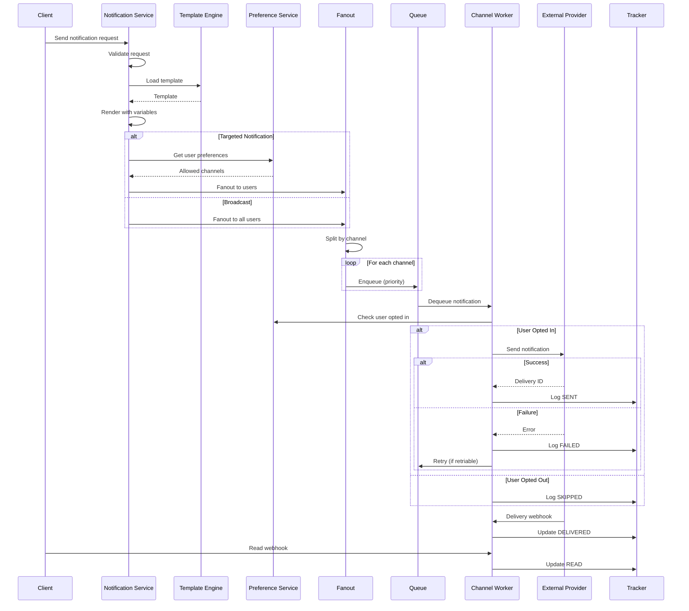

# Notification System that Works at Global Scale

[← Back to Topics](../topics.md#notification-system-that-works-at-global-scale-like-sns-fcm)

## Problem Statement

Design a multi-channel notification system like AWS SNS or Firebase Cloud Messaging (FCM) that delivers 1B notifications daily across push notifications, email, SMS, and in-app channels with personalization, scheduling, delivery tracking, and user preference management.

---

## Requirements

### Functional Requirements
1. **Multi-Channel**: Push, email, SMS, in-app
2. **Personalization**: Template engine with variables
3. **Scheduling**: Immediate, delayed, recurring
4. **Delivery Tracking**: Sent, delivered, read, clicked
5. **Preferences**: User channel preferences, opt-out
6. **Priority**: High, medium, low
7. **Batching**: Batch notifications for efficiency

### Non-Functional Requirements
1. **Scale**: 1B notifications/day (~11K/sec)
2. **Throughput**: 50K notifications/sec peak
3. **Latency**: <1s for high priority
4. **Availability**: 99.99% uptime
5. **Delivery Rate**: >98% for push, >95% for email

### Scale Estimates
- **Notifications/day**: 1B (~11K/sec)
- **Peak load**: 50K/sec
- **Users**: 100M
- **Channels**: 4 (push, email, SMS, in-app)
- **Templates**: 10K
- **Average notification size**: 1KB

---

## High-Level Architecture

```mermaid
graph TB
    subgraph "Client Layer"
        API[Notification API]
        SDK[Client SDK]
    end
    
    subgraph "Gateway"
        Gateway[API Gateway]
        RateLimiter[Rate Limiter]
    end
    
    subgraph "Notification Service"
        NotificationService[Notification<br/>Service]
        TemplateEngine[Template<br/>Engine]
        PreferenceService[User Preference<br/>Service]
    end
    
    subgraph "Fanout"
        FanoutService[Fanout<br/>Service]
        PriorityQueue[Priority Queue<br/>Kafka]
    end
    
    subgraph "Channel Workers"
        PushWorker[Push Worker<br/>FCM/APNs]
        EmailWorker[Email Worker<br/>SendGrid]
        SMSWorker[SMS Worker<br/>Twilio]
        InAppWorker[In-App Worker]
    end
    
    subgraph "Tracking"
        DeliveryTracker[Delivery<br/>Tracker]
        AnalyticsService[Analytics<br/>Service]
    end
    
    subgraph "Storage"
        NotificationDB[(PostgreSQL<br/>Notifications)]
        UserPrefsDB[(PostgreSQL<br/>Preferences)]
        TemplateCache[Redis<br/>Templates]
        DeliveryDB[(Cassandra<br/>Delivery Status)]
    end
    
    API --> Gateway
    SDK --> Gateway
    Gateway --> RateLimiter
    RateLimiter --> NotificationService
    
    NotificationService --> TemplateEngine
    NotificationService --> PreferenceService
    NotificationService --> FanoutService
    
    FanoutService --> PriorityQueue
    
    PriorityQueue --> PushWorker
    PriorityQueue --> EmailWorker
    PriorityQueue --> SMSWorker
    PriorityQueue --> InAppWorker
    
    PushWorker --> DeliveryTracker
    EmailWorker --> DeliveryTracker
    SMSWorker --> DeliveryTracker
    InAppWorker --> DeliveryTracker
    
    DeliveryTracker --> DeliveryDB
    DeliveryTracker --> AnalyticsService
    
    NotificationService --> NotificationDB
    PreferenceService --> UserPrefsDB
    TemplateEngine --> TemplateCache
```

---

## Detailed Design

### 1. Notification Flow



---

## Detailed Design

### 2. Notification Service

```java
import java.time.*;
import java.util.*;
import java.util.stream.*;

/**
 * Notification service
 * Orchestrates multi-channel notification delivery
 */
public class NotificationService {
    
    private final TemplateEngine templateEngine;
    private final UserPreferenceService preferenceService;
    private final FanoutService fanoutService;
    private final NotificationRepository notificationRepo;
    
    public NotificationService(
        TemplateEngine templateEngine,
        UserPreferenceService preferenceService,
        FanoutService fanoutService,
        NotificationRepository notificationRepo
    ) {
        this.templateEngine = templateEngine;
        this.preferenceService = preferenceService;
        this.fanoutService = fanoutService;
        this.notificationRepo = notificationRepo;
    }
    
    /**
     * Send notification to users
     */
    public NotificationResponse sendNotification(NotificationRequest request) {
        
        // Validate request
        validateRequest(request);
        
        // Create notification record
        Notification notification = new Notification();
        notification.setId(UUID.randomUUID().toString());
        notification.setTitle(request.getTitle());
        notification.setBody(request.getBody());
        notification.setTemplateId(request.getTemplateId());
        notification.setVariables(request.getVariables());
        notification.setChannels(request.getChannels());
        notification.setPriority(request.getPriority());
        notification.setScheduledAt(request.getScheduledAt());
        notification.setCreatedAt(Instant.now());
        notification.setStatus(NotificationStatus.PENDING);
        
        // Save notification
        notificationRepo.save(notification);
        
        // Render template if provided
        String renderedTitle = request.getTitle();
        String renderedBody = request.getBody();
        
        if (request.getTemplateId() != null) {
            
            Template template = templateEngine.getTemplate(request.getTemplateId());
            
            renderedTitle = templateEngine.render(template.getTitle(), request.getVariables());
            renderedBody = templateEngine.render(template.getBody(), request.getVariables());
        }
        
        // Get target users
        List<String> userIds = request.getUserIds();
        
        if (userIds == null || userIds.isEmpty()) {
            // Broadcast to all users (filtered by preferences)
            userIds = getUsersForBroadcast(request);
        }
        
        // Filter by user preferences
        Map<String, Set<NotificationChannel>> userChannelMap = 
            preferenceService.getUserChannelPreferences(userIds, request.getChannels());
        
        // Fanout to channels
        FanoutResult result = fanoutService.fanout(
            notification.getId(),
            userChannelMap,
            renderedTitle,
            renderedBody,
            request.getPriority(),
            request.getScheduledAt()
        );
        
        // Update notification status
        notification.setStatus(NotificationStatus.QUEUED);
        notification.setTargetCount(result.getTargetCount());
        notificationRepo.save(notification);
        
        return new NotificationResponse(
            notification.getId(),
            result.getTargetCount()
        );
    }
    
    /**
     * Validate notification request
     */
    private void validateRequest(NotificationRequest request) {
        
        if (request.getTitle() == null && request.getTemplateId() == null) {
            throw new IllegalArgumentException("Title or template required");
        }
        
        if (request.getChannels() == null || request.getChannels().isEmpty()) {
            throw new IllegalArgumentException("At least one channel required");
        }
    }
    
    /**
     * Get users for broadcast (respecting preferences)
     */
    private List<String> getUsersForBroadcast(NotificationRequest request) {
        
        // Query users based on criteria
        // For simplicity, return empty list (implement based on needs)
        return Collections.emptyList();
    }
}

/**
 * Fanout service
 * Distributes notifications to channel queues
 */
class FanoutService {
    
    private final NotificationQueue notificationQueue;
    
    public FanoutService(NotificationQueue notificationQueue) {
        this.notificationQueue = notificationQueue;
    }
    
    /**
     * Fanout notification to users and channels
     */
    public FanoutResult fanout(
        String notificationId,
        Map<String, Set<NotificationChannel>> userChannelMap,
        String title,
        String body,
        NotificationPriority priority,
        Instant scheduledAt
    ) {
        
        int targetCount = 0;
        
        // For each user and their allowed channels
        for (Map.Entry<String, Set<NotificationChannel>> entry : userChannelMap.entrySet()) {
            
            String userId = entry.getKey();
            Set<NotificationChannel> channels = entry.getValue();
            
            // Enqueue to each channel
            for (NotificationChannel channel : channels) {
                
                ChannelNotification channelNotif = new ChannelNotification();
                channelNotif.setId(UUID.randomUUID().toString());
                channelNotif.setNotificationId(notificationId);
                channelNotif.setUserId(userId);
                channelNotif.setChannel(channel);
                channelNotif.setTitle(title);
                channelNotif.setBody(body);
                channelNotif.setPriority(priority);
                channelNotif.setScheduledAt(scheduledAt);
                channelNotif.setCreatedAt(Instant.now());
                
                // Enqueue
                notificationQueue.enqueue(channelNotif);
                
                targetCount++;
            }
        }
        
        return new FanoutResult(targetCount);
    }
}

/**
 * Template engine
 * Renders notification templates with variables
 */
class TemplateEngine {
    
    private final TemplateRepository templateRepo;
    private final JedisPool jedisPool;
    
    private static final int TEMPLATE_CACHE_TTL_SECONDS = 3600;
    
    public TemplateEngine(TemplateRepository templateRepo, JedisPool jedisPool) {
        this.templateRepo = templateRepo;
        this.jedisPool = jedisPool;
    }
    
    /**
     * Get template (cached)
     */
    public Template getTemplate(String templateId) {
        
        // Try cache first
        try (Jedis jedis = jedisPool.getResource()) {
            
            String cacheKey = "template:" + templateId;
            String cached = jedis.get(cacheKey);
            
            if (cached != null) {
                return deserializeTemplate(cached);
            }
        }
        
        // Load from database
        Template template = templateRepo.findById(templateId)
            .orElseThrow(() -> new IllegalArgumentException("Template not found"));
        
        // Cache it
        try (Jedis jedis = jedisPool.getResource()) {
            
            String cacheKey = "template:" + templateId;
            jedis.setex(cacheKey, TEMPLATE_CACHE_TTL_SECONDS, serializeTemplate(template));
        }
        
        return template;
    }
    
    /**
     * Render template with variables
     */
    public String render(String template, Map<String, String> variables) {
        
        if (variables == null || variables.isEmpty()) {
            return template;
        }
        
        String rendered = template;
        
        // Replace variables (format: {{variable_name}})
        for (Map.Entry<String, String> entry : variables.entrySet()) {
            
            String placeholder = "{{" + entry.getKey() + "}}";
            String value = entry.getValue();
            
            rendered = rendered.replace(placeholder, value);
        }
        
        return rendered;
    }
    
    private String serializeTemplate(Template template) {
        // TODO: Implement JSON serialization
        return "";
    }
    
    private Template deserializeTemplate(String json) {
        // TODO: Implement JSON deserialization
        return new Template();
    }
}

/**
 * User preference service
 * Manages user notification preferences
 */
class UserPreferenceService {
    
    private final PreferenceRepository preferenceRepo;
    
    public UserPreferenceService(PreferenceRepository preferenceRepo) {
        this.preferenceRepo = preferenceRepo;
    }
    
    /**
     * Get user channel preferences
     * Returns map of userId -> allowed channels
     */
    public Map<String, Set<NotificationChannel>> getUserChannelPreferences(
        List<String> userIds,
        Set<NotificationChannel> requestedChannels
    ) {
        
        Map<String, Set<NotificationChannel>> result = new HashMap<>();
        
        // Load user preferences
        List<UserPreference> preferences = preferenceRepo.findByUserIds(userIds);
        Map<String, UserPreference> prefMap = preferences.stream()
            .collect(Collectors.toMap(UserPreference::getUserId, p -> p));
        
        for (String userId : userIds) {
            
            UserPreference pref = prefMap.get(userId);
            
            if (pref == null) {
                // Default: all channels enabled
                result.put(userId, new HashSet<>(requestedChannels));
                continue;
            }
            
            // Filter channels based on preferences
            Set<NotificationChannel> allowedChannels = requestedChannels.stream()
                .filter(channel -> isChannelAllowed(pref, channel))
                .collect(Collectors.toSet());
            
            if (!allowedChannels.isEmpty()) {
                result.put(userId, allowedChannels);
            }
        }
        
        return result;
    }
    
    /**
     * Check if channel is allowed for user
     */
    private boolean isChannelAllowed(UserPreference pref, NotificationChannel channel) {
        
        switch (channel) {
            case PUSH:
                return pref.isPushEnabled();
            case EMAIL:
                return pref.isEmailEnabled();
            case SMS:
                return pref.isSmsEnabled();
            case IN_APP:
                return pref.isInAppEnabled();
            default:
                return false;
        }
    }
}

/**
 * Channel worker
 * Processes notifications for a specific channel
 */
class ChannelWorker implements Runnable {
    
    private final NotificationChannel channel;
    private final NotificationQueue queue;
    private final ChannelProvider provider;
    private final DeliveryTracker tracker;
    
    private volatile boolean running = true;
    
    public ChannelWorker(
        NotificationChannel channel,
        NotificationQueue queue,
        ChannelProvider provider,
        DeliveryTracker tracker
    ) {
        this.channel = channel;
        this.queue = queue;
        this.provider = provider;
        this.tracker = tracker;
    }
    
    @Override
    public void run() {
        
        while (running) {
            
            try {
                
                // Dequeue notification
                ChannelNotification notification = queue.dequeue(channel);
                
                if (notification == null) {
                    Thread.sleep(100);
                    continue;
                }
                
                // Send notification
                sendNotification(notification);
                
            } catch (InterruptedException e) {
                Thread.currentThread().interrupt();
                break;
            } catch (Exception e) {
                // Log and continue
                System.err.println("Worker error: " + e.getMessage());
            }
        }
    }
    
    /**
     * Send notification via channel provider
     */
    private void sendNotification(ChannelNotification notification) {
        
        try {
            
            // Send via provider (FCM, SendGrid, Twilio, etc.)
            DeliveryResult result = provider.send(notification);
            
            if (result.isSuccess()) {
                
                // Track delivery
                tracker.trackDelivery(
                    notification.getId(),
                    notification.getUserId(),
                    notification.getChannel(),
                    DeliveryStatus.SENT,
                    result.getProviderId()
                );
                
            } else {
                
                // Track failure
                tracker.trackDelivery(
                    notification.getId(),
                    notification.getUserId(),
                    notification.getChannel(),
                    DeliveryStatus.FAILED,
                    null
                );
                
                // Retry if retriable
                if (result.isRetriable() && notification.getRetryCount() < 3) {
                    
                    notification.setRetryCount(notification.getRetryCount() + 1);
                    queue.enqueue(notification);
                }
            }
            
        } catch (Exception e) {
            
            // Track error
            tracker.trackDelivery(
                notification.getId(),
                notification.getUserId(),
                notification.getChannel(),
                DeliveryStatus.ERROR,
                null
            );
        }
    }
    
    public void stop() {
        running = false;
    }
}

/**
 * Delivery tracker
 * Tracks notification delivery status
 */
class DeliveryTracker {
    
    private final DeliveryRepository deliveryRepo;
    
    public DeliveryTracker(DeliveryRepository deliveryRepo) {
        this.deliveryRepo = deliveryRepo;
    }
    
    /**
     * Track delivery status
     */
    public void trackDelivery(
        String notificationId,
        String userId,
        NotificationChannel channel,
        DeliveryStatus status,
        String providerId
    ) {
        
        DeliveryRecord record = new DeliveryRecord();
        record.setNotificationId(notificationId);
        record.setUserId(userId);
        record.setChannel(channel);
        record.setStatus(status);
        record.setProviderId(providerId);
        record.setTimestamp(Instant.now());
        
        deliveryRepo.save(record);
    }
}

// Model classes
class Notification {
    private String id;
    private String title;
    private String body;
    private String templateId;
    private Map<String, String> variables;
    private Set<NotificationChannel> channels;
    private NotificationPriority priority;
    private Instant scheduledAt;
    private NotificationStatus status;
    private int targetCount;
    private Instant createdAt;
    
    // Getters and setters
    public String getId() { return id; }
    public void setId(String id) { this.id = id; }
    public String getTitle() { return title; }
    public void setTitle(String title) { this.title = title; }
    public String getBody() { return body; }
    public void setBody(String body) { this.body = body; }
    public String getTemplateId() { return templateId; }
    public void setTemplateId(String templateId) { this.templateId = templateId; }
    public Map<String, String> getVariables() { return variables; }
    public void setVariables(Map<String, String> variables) { 
        this.variables = variables; 
    }
    public Set<NotificationChannel> getChannels() { return channels; }
    public void setChannels(Set<NotificationChannel> channels) { 
        this.channels = channels; 
    }
    public NotificationPriority getPriority() { return priority; }
    public void setPriority(NotificationPriority priority) { 
        this.priority = priority; 
    }
    public Instant getScheduledAt() { return scheduledAt; }
    public void setScheduledAt(Instant scheduledAt) { 
        this.scheduledAt = scheduledAt; 
    }
    public NotificationStatus getStatus() { return status; }
    public void setStatus(NotificationStatus status) { this.status = status; }
    public int getTargetCount() { return targetCount; }
    public void setTargetCount(int targetCount) { this.targetCount = targetCount; }
    public Instant getCreatedAt() { return createdAt; }
    public void setCreatedAt(Instant createdAt) { this.createdAt = createdAt; }
}

class ChannelNotification {
    private String id;
    private String notificationId;
    private String userId;
    private NotificationChannel channel;
    private String title;
    private String body;
    private NotificationPriority priority;
    private Instant scheduledAt;
    private int retryCount = 0;
    private Instant createdAt;
    
    // Getters and setters
    public String getId() { return id; }
    public void setId(String id) { this.id = id; }
    public String getNotificationId() { return notificationId; }
    public void setNotificationId(String notificationId) { 
        this.notificationId = notificationId; 
    }
    public String getUserId() { return userId; }
    public void setUserId(String userId) { this.userId = userId; }
    public NotificationChannel getChannel() { return channel; }
    public void setChannel(NotificationChannel channel) { this.channel = channel; }
    public String getTitle() { return title; }
    public void setTitle(String title) { this.title = title; }
    public String getBody() { return body; }
    public void setBody(String body) { this.body = body; }
    public NotificationPriority getPriority() { return priority; }
    public void setPriority(NotificationPriority priority) { 
        this.priority = priority; 
    }
    public Instant getScheduledAt() { return scheduledAt; }
    public void setScheduledAt(Instant scheduledAt) { 
        this.scheduledAt = scheduledAt; 
    }
    public int getRetryCount() { return retryCount; }
    public void setRetryCount(int retryCount) { this.retryCount = retryCount; }
    public Instant getCreatedAt() { return createdAt; }
    public void setCreatedAt(Instant createdAt) { this.createdAt = createdAt; }
}

class Template {
    private String id;
    private String name;
    private String title;
    private String body;
    
    public String getId() { return id; }
    public String getName() { return name; }
    public String getTitle() { return title; }
    public String getBody() { return body; }
}

class UserPreference {
    private String userId;
    private boolean pushEnabled = true;
    private boolean emailEnabled = true;
    private boolean smsEnabled = true;
    private boolean inAppEnabled = true;
    
    public String getUserId() { return userId; }
    public boolean isPushEnabled() { return pushEnabled; }
    public boolean isEmailEnabled() { return emailEnabled; }
    public boolean isSmsEnabled() { return smsEnabled; }
    public boolean isInAppEnabled() { return inAppEnabled; }
}

class DeliveryRecord {
    private String notificationId;
    private String userId;
    private NotificationChannel channel;
    private DeliveryStatus status;
    private String providerId;
    private Instant timestamp;
    
    public void setNotificationId(String notificationId) { 
        this.notificationId = notificationId; 
    }
    public void setUserId(String userId) { this.userId = userId; }
    public void setChannel(NotificationChannel channel) { this.channel = channel; }
    public void setStatus(DeliveryStatus status) { this.status = status; }
    public void setProviderId(String providerId) { this.providerId = providerId; }
    public void setTimestamp(Instant timestamp) { this.timestamp = timestamp; }
}

class NotificationRequest {
    private String title;
    private String body;
    private String templateId;
    private Map<String, String> variables;
    private Set<NotificationChannel> channels;
    private List<String> userIds;
    private NotificationPriority priority = NotificationPriority.MEDIUM;
    private Instant scheduledAt;
    
    public String getTitle() { return title; }
    public String getBody() { return body; }
    public String getTemplateId() { return templateId; }
    public Map<String, String> getVariables() { return variables; }
    public Set<NotificationChannel> getChannels() { return channels; }
    public List<String> getUserIds() { return userIds; }
    public NotificationPriority getPriority() { return priority; }
    public Instant getScheduledAt() { return scheduledAt; }
}

class NotificationResponse {
    private String notificationId;
    private int targetCount;
    
    public NotificationResponse(String notificationId, int targetCount) {
        this.notificationId = notificationId;
        this.targetCount = targetCount;
    }
}

class FanoutResult {
    private int targetCount;
    
    public FanoutResult(int targetCount) {
        this.targetCount = targetCount;
    }
    
    public int getTargetCount() { return targetCount; }
}

class DeliveryResult {
    private boolean success;
    private boolean retriable;
    private String providerId;
    
    public boolean isSuccess() { return success; }
    public boolean isRetriable() { return retriable; }
    public String getProviderId() { return providerId; }
}

enum NotificationChannel {
    PUSH, EMAIL, SMS, IN_APP
}

enum NotificationPriority {
    HIGH, MEDIUM, LOW
}

enum NotificationStatus {
    PENDING, QUEUED, SENDING, SENT, FAILED
}

enum DeliveryStatus {
    SENT, DELIVERED, READ, CLICKED, FAILED, ERROR, SKIPPED
}

// Service interfaces
interface NotificationRepository {
    void save(Notification notification);
}

interface TemplateRepository {
    Optional<Template> findById(String templateId);
}

interface PreferenceRepository {
    List<UserPreference> findByUserIds(List<String> userIds);
}

interface NotificationQueue {
    void enqueue(ChannelNotification notification);
    ChannelNotification dequeue(NotificationChannel channel) throws InterruptedException;
}

interface ChannelProvider {
    DeliveryResult send(ChannelNotification notification);
}

interface DeliveryRepository {
    void save(DeliveryRecord record);
}
```

---

## Technology Stack

| Component | Technology | Justification |
|-----------|------------|---------------|
| **Queue** | Kafka | High throughput |
| **Cache** | Redis | Template caching |
| **Database** | PostgreSQL | Metadata |
| **Delivery Logs** | Cassandra | Time-series writes |
| **Push** | FCM/APNs | Mobile push |
| **Email** | SendGrid/SES | Email delivery |
| **SMS** | Twilio | SMS delivery |

---

## Performance Characteristics

### Delivery Performance
```
Push latency: <1s p95
Email latency: <5s p95
SMS latency: <10s p95
Throughput: 50K/sec peak
```

### Scale
```
Notifications/day: 1B (~11K/sec)
Peak load: 50K/sec
Users: 100M
Templates: 10K cached
```

---

## Trade-offs

### 1. Fanout Strategy
- **Write**: Immediate fanout, queue bloat
- **Read**: Lazy fanout, complex queries

### 2. Delivery Guarantee
- **At-least-once**: May duplicate, simple
- **Exactly-once**: No duplicates, complex

### 3. Channel Priority
- **Round-robin**: Fair, ignores priority
- **Priority queue**: Respects priority, starvation risk

---

## Summary

This design provides:
- ✅ **1B** notifications/day
- ✅ **50K**/sec peak throughput
- ✅ **4 channels** (push, email, SMS, in-app)
- ✅ **<1s** push latency
- ✅ **Template** personalization
- ✅ **User** preferences

**Key Features:**
1. Multi-channel fanout with priority queues
2. Template engine with variable substitution
3. User preference filtering (opt-out support)
4. Delivery tracking (sent → delivered → read)
5. Retry logic with 3 attempts
6. Provider abstraction (FCM, SendGrid, Twilio)
7. Redis template caching (1 hour TTL)

[← Back to Topics](../topics.md#notification-system-that-works-at-global-scale-like-sns-fcm)
