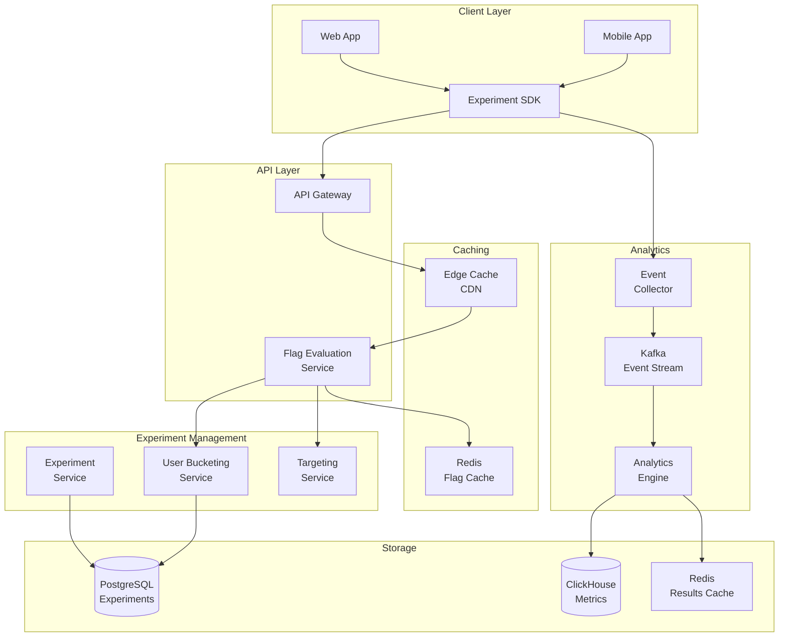
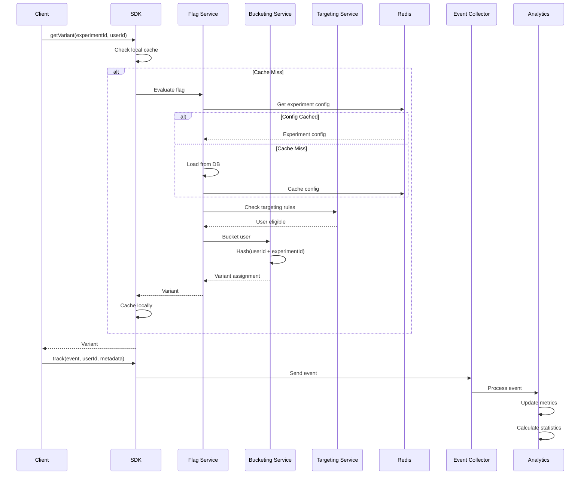

# A/B Testing Platform for Experiments

[← Back to Topics](../topics.md#ab-testing-platform-for-experiments)

## Problem Statement

Design an experimentation platform that supports feature flags, gradual rollouts, multivariate testing, and statistical analysis. Enable 1000s of concurrent experiments with minimal performance impact (<5ms overhead) and real-time results.

---

## Requirements

### Functional Requirements
1. **Experiment Management**: Create, update, delete experiments
2. **User Bucketing**: Consistent hash-based assignment
3. **Feature Flags**: Boolean flags, percentage rollouts
4. **Multivariate Testing**: Multiple variants per experiment
5. **Metrics Collection**: Track events, conversions
6. **Statistical Analysis**: P-values, confidence intervals
7. **Targeting**: User segments, attributes

### Non-Functional Requirements
1. **Scale**: 1000s of concurrent experiments
2. **Latency**: <5ms flag evaluation
3. **Throughput**: 100K evaluations/sec
4. **Availability**: 99.99% uptime
5. **Consistency**: Stable user assignments

### Scale Estimates
- **Concurrent experiments**: 5000
- **Active users**: 100M
- **Flag evaluations**: 100K/sec
- **Events tracked**: 1B/day
- **Average experiment duration**: 14 days

---

## High-Level Architecture



---

## Detailed Design

### 1. Experiment Flow



---

### 2. Experiment Service

```java
import java.time.*;
import java.util.*;
import java.security.MessageDigest;
import java.nio.charset.StandardCharsets;

/**
 * Experiment service
 * Manages experiments and feature flags
 */
public class ExperimentService {
    
    private final ExperimentRepository experimentRepo;
    private final FlagEvaluationService flagService;
    private final JedisPool jedisPool;
    
    private static final int CONFIG_CACHE_TTL_SECONDS = 300;  // 5 minutes
    
    public ExperimentService(
        ExperimentRepository experimentRepo,
        FlagEvaluationService flagService,
        JedisPool jedisPool
    ) {
        this.experimentRepo = experimentRepo;
        this.flagService = flagService;
        this.jedisPool = jedisPool;
    }
    
    /**
     * Create experiment
     */
    public Experiment createExperiment(ExperimentRequest request) {
        
        Experiment experiment = new Experiment();
        experiment.setId(UUID.randomUUID().toString());
        experiment.setName(request.getName());
        experiment.setDescription(request.getDescription());
        experiment.setStatus(ExperimentStatus.DRAFT);
        experiment.setVariants(request.getVariants());
        experiment.setTrafficAllocation(request.getTrafficAllocation());
        experiment.setTargetingRules(request.getTargetingRules());
        experiment.setMetrics(request.getMetrics());
        experiment.setCreatedAt(Instant.now());
        
        // Validate
        validateExperiment(experiment);
        
        // Save
        experimentRepo.save(experiment);
        
        return experiment;
    }
    
    /**
     * Start experiment
     */
    public void startExperiment(String experimentId) {
        
        Experiment experiment = experimentRepo.findById(experimentId)
            .orElseThrow(() -> new IllegalArgumentException("Experiment not found"));
        
        if (experiment.getStatus() != ExperimentStatus.DRAFT) {
            throw new IllegalStateException("Experiment already started");
        }
        
        experiment.setStatus(ExperimentStatus.RUNNING);
        experiment.setStartedAt(Instant.now());
        
        experimentRepo.save(experiment);
        
        // Invalidate cache
        invalidateCache(experimentId);
    }
    
    /**
     * Stop experiment
     */
    public void stopExperiment(String experimentId) {
        
        Experiment experiment = experimentRepo.findById(experimentId)
            .orElseThrow(() -> new IllegalArgumentException("Experiment not found"));
        
        experiment.setStatus(ExperimentStatus.STOPPED);
        experiment.setStoppedAt(Instant.now());
        
        experimentRepo.save(experiment);
        
        // Invalidate cache
        invalidateCache(experimentId);
    }
    
    /**
     * Validate experiment
     */
    private void validateExperiment(Experiment experiment) {
        
        // Check variants
        if (experiment.getVariants() == null || experiment.getVariants().isEmpty()) {
            throw new IllegalArgumentException("At least one variant required");
        }
        
        // Check traffic allocation sums to 100%
        double totalAllocation = experiment.getVariants().stream()
            .mapToDouble(Variant::getAllocation)
            .sum();
        
        if (Math.abs(totalAllocation - 100.0) > 0.01) {
            throw new IllegalArgumentException("Traffic allocation must sum to 100%");
        }
    }
    
    /**
     * Invalidate experiment cache
     */
    private void invalidateCache(String experimentId) {
        
        try (Jedis jedis = jedisPool.getResource()) {
            
            String cacheKey = "experiment:" + experimentId;
            jedis.del(cacheKey);
        }
    }
}

/**
 * Flag evaluation service
 * Evaluates feature flags and assigns users to variants
 */
class FlagEvaluationService {
    
    private final ExperimentRepository experimentRepo;
    private final BucketingService bucketingService;
    private final TargetingService targetingService;
    private final JedisPool jedisPool;
    
    private static final int CONFIG_CACHE_TTL_SECONDS = 300;
    
    public FlagEvaluationService(
        ExperimentRepository experimentRepo,
        BucketingService bucketingService,
        TargetingService targetingService,
        JedisPool jedisPool
    ) {
        this.experimentRepo = experimentRepo;
        this.bucketingService = bucketingService;
        this.targetingService = targetingService;
        this.jedisPool = jedisPool;
    }
    
    /**
     * Get variant for user
     */
    public VariantAssignment getVariant(String experimentId, String userId, UserContext context) {
        
        // Load experiment config (cached)
        Experiment experiment = getExperimentConfig(experimentId);
        
        if (experiment == null) {
            return VariantAssignment.notFound();
        }
        
        if (experiment.getStatus() != ExperimentStatus.RUNNING) {
            return VariantAssignment.notRunning();
        }
        
        // Check targeting rules
        if (!targetingService.isUserEligible(experiment, userId, context)) {
            return VariantAssignment.notEligible();
        }
        
        // Bucket user into variant
        Variant variant = bucketingService.assignVariant(experiment, userId);
        
        return VariantAssignment.success(variant);
    }
    
    /**
     * Get experiment config (cached)
     */
    private Experiment getExperimentConfig(String experimentId) {
        
        // Try cache first
        try (Jedis jedis = jedisPool.getResource()) {
            
            String cacheKey = "experiment:" + experimentId;
            String cached = jedis.get(cacheKey);
            
            if (cached != null) {
                return deserializeExperiment(cached);
            }
        }
        
        // Load from database
        Optional<Experiment> experimentOpt = experimentRepo.findById(experimentId);
        
        if (!experimentOpt.isPresent()) {
            return null;
        }
        
        Experiment experiment = experimentOpt.get();
        
        // Cache it
        try (Jedis jedis = jedisPool.getResource()) {
            
            String cacheKey = "experiment:" + experimentId;
            jedis.setex(
                cacheKey,
                CONFIG_CACHE_TTL_SECONDS,
                serializeExperiment(experiment)
            );
        }
        
        return experiment;
    }
    
    private String serializeExperiment(Experiment experiment) {
        // TODO: Implement JSON serialization
        return "";
    }
    
    private Experiment deserializeExperiment(String json) {
        // TODO: Implement JSON deserialization
        return new Experiment();
    }
}

/**
 * Bucketing service
 * Assigns users to experiment variants consistently
 */
class BucketingService {
    
    /**
     * Assign user to variant using consistent hashing
     */
    public Variant assignVariant(Experiment experiment, String userId) {
        
        // Compute hash bucket (0-9999)
        int bucket = computeBucket(userId, experiment.getId());
        
        // Map bucket to variant based on traffic allocation
        List<Variant> variants = experiment.getVariants();
        
        double cumulativeAllocation = 0.0;
        
        for (Variant variant : variants) {
            
            cumulativeAllocation += variant.getAllocation();
            
            // Convert allocation percentage to bucket range
            int threshold = (int) (cumulativeAllocation * 100);  // 0-10000
            
            if (bucket < threshold) {
                return variant;
            }
        }
        
        // Fallback to control (should not reach here if allocations sum to 100%)
        return variants.get(0);
    }
    
    /**
     * Compute hash bucket for user
     * Returns value in range [0, 9999]
     */
    private int computeBucket(String userId, String experimentId) {
        
        try {
            
            // Combine user ID and experiment ID for consistent hashing
            String input = userId + ":" + experimentId;
            
            // Compute MD5 hash
            MessageDigest md = MessageDigest.getInstance("MD5");
            byte[] hashBytes = md.digest(input.getBytes(StandardCharsets.UTF_8));
            
            // Convert first 4 bytes to int
            int hash = 0;
            for (int i = 0; i < 4; i++) {
                hash = (hash << 8) | (hashBytes[i] & 0xFF);
            }
            
            // Map to [0, 9999]
            return Math.abs(hash) % 10000;
            
        } catch (Exception e) {
            // Fallback to Java hashCode
            return Math.abs((userId + experimentId).hashCode()) % 10000;
        }
    }
}

/**
 * Targeting service
 * Evaluates targeting rules to determine user eligibility
 */
class TargetingService {
    
    /**
     * Check if user is eligible for experiment
     */
    public boolean isUserEligible(
        Experiment experiment,
        String userId,
        UserContext context
    ) {
        
        List<TargetingRule> rules = experiment.getTargetingRules();
        
        if (rules == null || rules.isEmpty()) {
            return true;  // No targeting rules = all users eligible
        }
        
        // Evaluate all rules (AND logic)
        for (TargetingRule rule : rules) {
            
            if (!evaluateRule(rule, userId, context)) {
                return false;
            }
        }
        
        return true;
    }
    
    /**
     * Evaluate single targeting rule
     */
    private boolean evaluateRule(TargetingRule rule, String userId, UserContext context) {
        
        String attribute = rule.getAttribute();
        String operator = rule.getOperator();
        Object value = rule.getValue();
        
        // Get attribute value from context
        Object contextValue = context.getAttribute(attribute);
        
        if (contextValue == null) {
            return false;
        }
        
        // Evaluate based on operator
        switch (operator) {
            
            case "equals":
                return contextValue.equals(value);
                
            case "not_equals":
                return !contextValue.equals(value);
                
            case "in":
                List<?> values = (List<?>) value;
                return values.contains(contextValue);
                
            case "not_in":
                List<?> notInValues = (List<?>) value;
                return !notInValues.contains(contextValue);
                
            case "greater_than":
                return compareNumbers(contextValue, value) > 0;
                
            case "less_than":
                return compareNumbers(contextValue, value) < 0;
                
            case "contains":
                return contextValue.toString().contains(value.toString());
                
            default:
                return false;
        }
    }
    
    /**
     * Compare numeric values
     */
    private int compareNumbers(Object a, Object b) {
        
        double aNum = Double.parseDouble(a.toString());
        double bNum = Double.parseDouble(b.toString());
        
        return Double.compare(aNum, bNum);
    }
}

/**
 * Event collector
 * Collects experiment events for analysis
 */
class EventCollector {
    
    private final EventStreamProducer eventProducer;
    
    public EventCollector(EventStreamProducer eventProducer) {
        this.eventProducer = eventProducer;
    }
    
    /**
     * Track event
     */
    public void trackEvent(ExperimentEvent event) {
        
        // Validate event
        if (event.getUserId() == null || event.getExperimentId() == null) {
            throw new IllegalArgumentException("User ID and experiment ID required");
        }
        
        // Add timestamp
        event.setTimestamp(Instant.now());
        
        // Send to event stream
        eventProducer.send(event);
    }
}

/**
 * Analytics engine
 * Calculates experiment statistics
 */
class AnalyticsEngine {
    
    private final MetricsRepository metricsRepo;
    
    public AnalyticsEngine(MetricsRepository metricsRepo) {
        this.metricsRepo = metricsRepo;
    }
    
    /**
     * Calculate experiment results
     */
    public ExperimentResults calculateResults(String experimentId) {
        
        // Get metrics for each variant
        List<Variant> variants = getVariants(experimentId);
        
        List<VariantMetrics> variantMetrics = new ArrayList<>();
        
        for (Variant variant : variants) {
            
            VariantMetrics metrics = metricsRepo.getMetrics(experimentId, variant.getId());
            variantMetrics.add(metrics);
        }
        
        // Calculate statistical significance
        if (variantMetrics.size() >= 2) {
            
            VariantMetrics control = variantMetrics.get(0);
            
            for (int i = 1; i < variantMetrics.size(); i++) {
                
                VariantMetrics treatment = variantMetrics.get(i);
                
                // Run t-test
                double pValue = calculatePValue(control, treatment);
                treatment.setPValue(pValue);
                treatment.setSignificant(pValue < 0.05);
            }
        }
        
        return new ExperimentResults(experimentId, variantMetrics);
    }
    
    /**
     * Calculate p-value using t-test
     */
    private double calculatePValue(VariantMetrics control, VariantMetrics treatment) {
        
        // Simplified t-test calculation
        // In production, use Apache Commons Math or similar library
        
        double controlMean = control.getConversionRate();
        double treatmentMean = treatment.getConversionRate();
        
        long controlN = control.getSampleSize();
        long treatmentN = treatment.getSampleSize();
        
        if (controlN == 0 || treatmentN == 0) {
            return 1.0;  // Not enough data
        }
        
        // Calculate pooled standard error
        double controlVar = controlMean * (1 - controlMean);
        double treatmentVar = treatmentMean * (1 - treatmentMean);
        
        double se = Math.sqrt((controlVar / controlN) + (treatmentVar / treatmentN));
        
        if (se == 0) {
            return 1.0;
        }
        
        // Calculate t-statistic
        double t = Math.abs(treatmentMean - controlMean) / se;
        
        // Simplified p-value approximation
        // For production, use proper t-distribution CDF
        double pValue = Math.exp(-0.717 * t - 0.416 * t * t);
        
        return Math.min(1.0, Math.max(0.0, pValue));
    }
    
    /**
     * Get variants for experiment
     */
    private List<Variant> getVariants(String experimentId) {
        // TODO: Load from experiment config
        return new ArrayList<>();
    }
}

// Model classes
class Experiment {
    private String id;
    private String name;
    private String description;
    private ExperimentStatus status;
    private List<Variant> variants;
    private double trafficAllocation;
    private List<TargetingRule> targetingRules;
    private List<String> metrics;
    private Instant createdAt;
    private Instant startedAt;
    private Instant stoppedAt;
    
    // Getters and setters
    public String getId() { return id; }
    public void setId(String id) { this.id = id; }
    public String getName() { return name; }
    public void setName(String name) { this.name = name; }
    public String getDescription() { return description; }
    public void setDescription(String description) { this.description = description; }
    public ExperimentStatus getStatus() { return status; }
    public void setStatus(ExperimentStatus status) { this.status = status; }
    public List<Variant> getVariants() { return variants; }
    public void setVariants(List<Variant> variants) { this.variants = variants; }
    public double getTrafficAllocation() { return trafficAllocation; }
    public void setTrafficAllocation(double allocation) { 
        this.trafficAllocation = allocation; 
    }
    public List<TargetingRule> getTargetingRules() { return targetingRules; }
    public void setTargetingRules(List<TargetingRule> rules) { 
        this.targetingRules = rules; 
    }
    public List<String> getMetrics() { return metrics; }
    public void setMetrics(List<String> metrics) { this.metrics = metrics; }
    public Instant getCreatedAt() { return createdAt; }
    public void setCreatedAt(Instant createdAt) { this.createdAt = createdAt; }
    public Instant getStartedAt() { return startedAt; }
    public void setStartedAt(Instant startedAt) { this.startedAt = startedAt; }
    public Instant getStoppedAt() { return stoppedAt; }
    public void setStoppedAt(Instant stoppedAt) { this.stoppedAt = stoppedAt; }
}

class Variant {
    private String id;
    private String name;
    private double allocation;  // Percentage (0-100)
    private Map<String, Object> config;
    
    public String getId() { return id; }
    public String getName() { return name; }
    public double getAllocation() { return allocation; }
    public Map<String, Object> getConfig() { return config; }
}

class TargetingRule {
    private String attribute;
    private String operator;
    private Object value;
    
    public String getAttribute() { return attribute; }
    public String getOperator() { return operator; }
    public Object getValue() { return value; }
}

class UserContext {
    private Map<String, Object> attributes = new HashMap<>();
    
    public Object getAttribute(String key) {
        return attributes.get(key);
    }
    
    public void setAttribute(String key, Object value) {
        attributes.put(key, value);
    }
}

class VariantAssignment {
    private boolean success;
    private Variant variant;
    private String reason;
    
    public static VariantAssignment success(Variant variant) {
        VariantAssignment assignment = new VariantAssignment();
        assignment.success = true;
        assignment.variant = variant;
        return assignment;
    }
    
    public static VariantAssignment notFound() {
        VariantAssignment assignment = new VariantAssignment();
        assignment.success = false;
        assignment.reason = "Experiment not found";
        return assignment;
    }
    
    public static VariantAssignment notRunning() {
        VariantAssignment assignment = new VariantAssignment();
        assignment.success = false;
        assignment.reason = "Experiment not running";
        return assignment;
    }
    
    public static VariantAssignment notEligible() {
        VariantAssignment assignment = new VariantAssignment();
        assignment.success = false;
        assignment.reason = "User not eligible";
        return assignment;
    }
    
    public boolean isSuccess() { return success; }
    public Variant getVariant() { return variant; }
}

class ExperimentEvent {
    private String userId;
    private String experimentId;
    private String variantId;
    private String eventType;
    private Map<String, Object> metadata;
    private Instant timestamp;
    
    public String getUserId() { return userId; }
    public void setUserId(String userId) { this.userId = userId; }
    public String getExperimentId() { return experimentId; }
    public void setExperimentId(String experimentId) { 
        this.experimentId = experimentId; 
    }
    public String getVariantId() { return variantId; }
    public String getEventType() { return eventType; }
    public Instant getTimestamp() { return timestamp; }
    public void setTimestamp(Instant timestamp) { this.timestamp = timestamp; }
}

class VariantMetrics {
    private String variantId;
    private long sampleSize;
    private long conversions;
    private double conversionRate;
    private double pValue;
    private boolean significant;
    
    public long getSampleSize() { return sampleSize; }
    public double getConversionRate() { return conversionRate; }
    public void setPValue(double pValue) { this.pValue = pValue; }
    public void setSignificant(boolean significant) { this.significant = significant; }
}

class ExperimentResults {
    private String experimentId;
    private List<VariantMetrics> variantMetrics;
    
    public ExperimentResults(String experimentId, List<VariantMetrics> metrics) {
        this.experimentId = experimentId;
        this.variantMetrics = metrics;
    }
}

class ExperimentRequest {
    private String name;
    private String description;
    private List<Variant> variants;
    private double trafficAllocation;
    private List<TargetingRule> targetingRules;
    private List<String> metrics;
    
    public String getName() { return name; }
    public String getDescription() { return description; }
    public List<Variant> getVariants() { return variants; }
    public double getTrafficAllocation() { return trafficAllocation; }
    public List<TargetingRule> getTargetingRules() { return targetingRules; }
    public List<String> getMetrics() { return metrics; }
}

enum ExperimentStatus {
    DRAFT, RUNNING, STOPPED, ARCHIVED
}

// Service interfaces
interface ExperimentRepository {
    void save(Experiment experiment);
    Optional<Experiment> findById(String id);
}

interface EventStreamProducer {
    void send(ExperimentEvent event);
}

interface MetricsRepository {
    VariantMetrics getMetrics(String experimentId, String variantId);
}
```

---

## Technology Stack

| Component | Technology | Justification |
|-----------|------------|---------------|
| **Cache** | Redis + CDN | <5ms evaluation |
| **Database** | PostgreSQL | Experiment config |
| **Analytics** | ClickHouse | Time-series queries |
| **Streaming** | Kafka | Event collection |
| **Hashing** | MD5 | Consistent bucketing |

---

## Performance Characteristics

### Evaluation Performance
```
Flag evaluation: <5ms p99
Cache hit rate: >95%
Throughput: 100K evaluations/sec
Bucketing: <1ms
```

### Scale
```
Concurrent experiments: 5000
Active users: 100M
Events/day: 1B
Analysis latency: <1min
```

---

## Trade-offs

### 1. Client vs Server-Side Evaluation
- **Client**: Lower latency, stale config
- **Server**: Fresh config, higher latency

### 2. Bucketing Algorithm
- **Hash-based**: Consistent, uniform
- **Random**: Simple, may drift

### 3. Statistical Test
- **T-test**: Simple, assumes normality
- **Chi-square**: Robust, slower

---

## Summary

This design provides:
- ✅ **5000** concurrent experiments
- ✅ **<5ms** flag evaluation
- ✅ **100K** evaluations/sec
- ✅ **Consistent** user bucketing
- ✅ **Statistical** significance testing
- ✅ **Real-time** analytics

**Key Features:**
1. MD5-based consistent hashing for bucketing
2. Redis caching with 5-minute TTL
3. Targeting rules with operators (equals, in, greater_than)
4. Traffic allocation with 0.01% precision
5. T-test for statistical significance (p < 0.05)
6. Edge CDN caching for global distribution
7. Event streaming with Kafka for 1B events/day

[← Back to Topics](../topics.md#ab-testing-platform-for-experiments)
