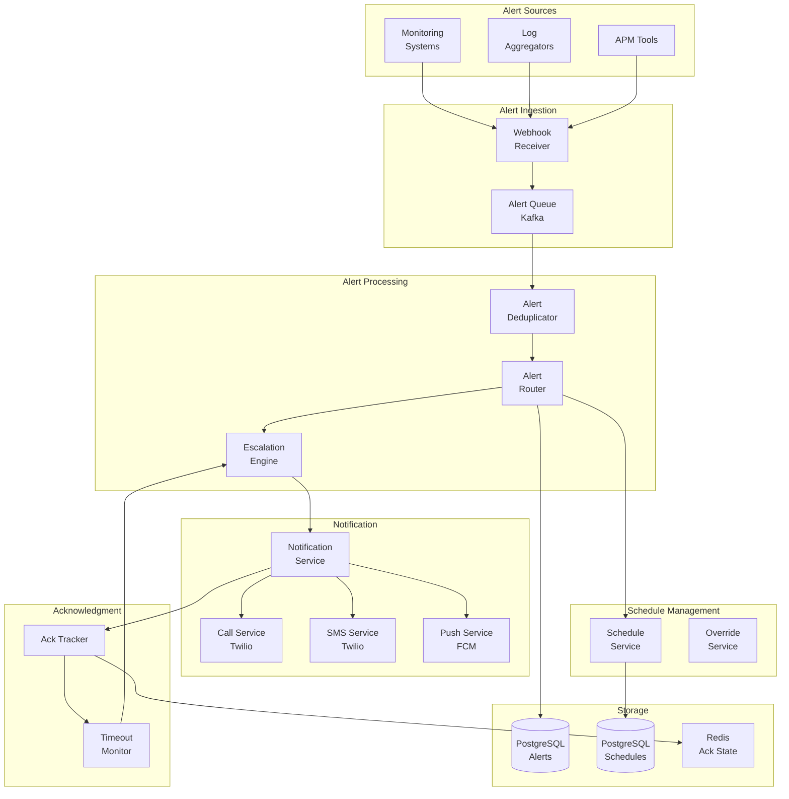
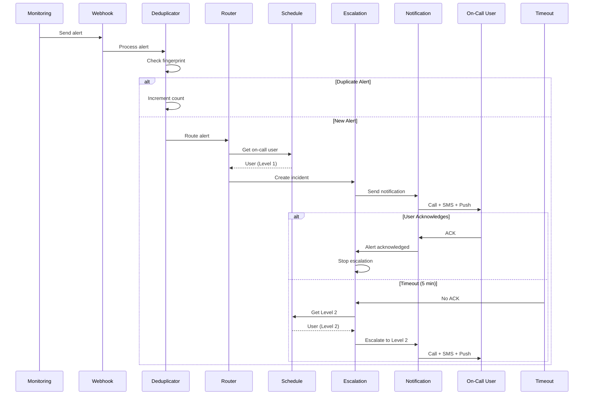

# On-Call Escalation System for Incidents

[← Back to Topics](../topics.md#on-call-escalation-system-for-incidents)

## Problem Statement

Design an incident management system with multi-level escalation, acknowledgment tracking, notification delivery across channels (call, SMS, push), schedule management, and integration with monitoring systems. Ensure 99.99% reliability with no single point of failure.

---

## Requirements

### Functional Requirements
1. **Alert Routing**: Route alerts to on-call engineers
2. **Escalation**: Multi-level escalation with timeouts
3. **Acknowledgment**: Track alert acknowledgment
4. **Schedules**: Rotation management, overrides
5. **Multi-Channel**: Call, SMS, push, email
6. **Deduplication**: Group similar alerts
7. **Maintenance Windows**: Suppress alerts

### Non-Functional Requirements
1. **Reliability**: 99.99% uptime
2. **Latency**: <5s alert delivery
3. **Scale**: 10K alerts/day
4. **No SPOF**: Redundancy across all components
5. **Audit**: Complete incident timeline

### Scale Estimates
- **Alerts per day**: 10K (~0.1/sec)
- **Peak alerts**: 100/sec (incidents)
- **On-call users**: 5K
- **Teams**: 500
- **Escalation levels**: 3-5
- **Acknowledgment timeout**: 5 minutes

---

## High-Level Architecture



---

## Detailed Design

### 1. Escalation Flow



---

### 2. Escalation Engine

```java
import java.time.*;
import java.util.*;
import java.util.concurrent.*;

/**
 * Escalation engine
 * Manages multi-level alert escalation
 */
public class EscalationEngine {
    
    private final ScheduleService scheduleService;
    private final NotificationService notificationService;
    private final AcknowledgmentTracker ackTracker;
    private final IncidentRepository incidentRepo;
    private final ScheduledExecutorService executor;
    
    private static final int DEFAULT_TIMEOUT_MINUTES = 5;
    
    public EscalationEngine(
        ScheduleService scheduleService,
        NotificationService notificationService,
        AcknowledgmentTracker ackTracker,
        IncidentRepository incidentRepo
    ) {
        this.scheduleService = scheduleService;
        this.notificationService = notificationService;
        this.ackTracker = ackTracker;
        this.incidentRepo = incidentRepo;
        this.executor = Executors.newScheduledThreadPool(10);
    }
    
    /**
     * Create incident and start escalation
     */
    public Incident createIncident(Alert alert) {
        
        // Create incident
        Incident incident = new Incident();
        incident.setId(UUID.randomUUID().toString());
        incident.setAlertId(alert.getId());
        incident.setTitle(alert.getTitle());
        incident.setDescription(alert.getDescription());
        incident.setSeverity(alert.getSeverity());
        incident.setTeamId(alert.getTeamId());
        incident.setStatus(IncidentStatus.TRIGGERED);
        incident.setCreatedAt(Instant.now());
        incident.setCurrentLevel(1);
        
        // Save incident
        incidentRepo.save(incident);
        
        // Start escalation
        escalate(incident, 1);
        
        return incident;
    }
    
    /**
     * Escalate to specific level
     */
    private void escalate(Incident incident, int level) {
        
        // Get escalation policy
        EscalationPolicy policy = scheduleService.getEscalationPolicy(incident.getTeamId());
        
        if (policy == null || level > policy.getLevels().size()) {
            // No more levels, mark as unacknowledged
            incident.setStatus(IncidentStatus.UNACKNOWLEDGED);
            incidentRepo.save(incident);
            return;
        }
        
        // Get on-call user for this level
        EscalationLevel escalationLevel = policy.getLevels().get(level - 1);
        OnCallUser onCallUser = scheduleService.getOnCallUser(
            escalationLevel.getScheduleId(),
            Instant.now()
        );
        
        if (onCallUser == null) {
            // No on-call user, escalate to next level
            escalate(incident, level + 1);
            return;
        }
        
        // Update incident
        incident.setCurrentLevel(level);
        incident.setAssignedUserId(onCallUser.getUserId());
        incidentRepo.save(incident);
        
        // Send notifications
        NotificationResult result = notificationService.sendIncidentNotification(
            incident,
            onCallUser,
            escalationLevel.getChannels()
        );
        
        // Track acknowledgment
        ackTracker.startTracking(incident.getId(), onCallUser.getUserId());
        
        // Schedule timeout for next escalation level
        int timeoutMinutes = escalationLevel.getTimeoutMinutes();
        
        executor.schedule(
            () -> checkEscalationTimeout(incident.getId(), level),
            timeoutMinutes,
            TimeUnit.MINUTES
        );
    }
    
    /**
     * Check if escalation timeout occurred
     */
    private void checkEscalationTimeout(String incidentId, int level) {
        
        // Check if incident was acknowledged
        if (ackTracker.isAcknowledged(incidentId)) {
            return;  // Already acknowledged, no escalation needed
        }
        
        // Load incident
        Incident incident = incidentRepo.findById(incidentId)
            .orElseThrow(() -> new IllegalArgumentException("Incident not found"));
        
        // Escalate to next level
        escalate(incident, level + 1);
    }
    
    /**
     * Acknowledge incident
     */
    public void acknowledgeIncident(String incidentId, String userId) {
        
        // Load incident
        Incident incident = incidentRepo.findById(incidentId)
            .orElseThrow(() -> new IllegalArgumentException("Incident not found"));
        
        // Mark as acknowledged
        incident.setStatus(IncidentStatus.ACKNOWLEDGED);
        incident.setAcknowledgedBy(userId);
        incident.setAcknowledgedAt(Instant.now());
        incidentRepo.save(incident);
        
        // Track acknowledgment
        ackTracker.markAcknowledged(incidentId, userId);
    }
    
    /**
     * Resolve incident
     */
    public void resolveIncident(String incidentId, String userId) {
        
        Incident incident = incidentRepo.findById(incidentId)
            .orElseThrow(() -> new IllegalArgumentException("Incident not found"));
        
        incident.setStatus(IncidentStatus.RESOLVED);
        incident.setResolvedBy(userId);
        incident.setResolvedAt(Instant.now());
        incidentRepo.save(incident);
    }
}

/**
 * Schedule service
 * Manages on-call schedules and rotations
 */
class ScheduleService {
    
    private final ScheduleRepository scheduleRepo;
    private final EscalationPolicyRepository policyRepo;
    
    public ScheduleService(
        ScheduleRepository scheduleRepo,
        EscalationPolicyRepository policyRepo
    ) {
        this.scheduleRepo = scheduleRepo;
        this.policyRepo = policyRepo;
    }
    
    /**
     * Get on-call user for schedule at specific time
     */
    public OnCallUser getOnCallUser(String scheduleId, Instant time) {
        
        // Load schedule
        Schedule schedule = scheduleRepo.findById(scheduleId)
            .orElse(null);
        
        if (schedule == null) {
            return null;
        }
        
        // Check for overrides first
        Override override = findOverride(schedule, time);
        
        if (override != null) {
            OnCallUser user = new OnCallUser();
            user.setUserId(override.getUserId());
            user.setScheduleId(scheduleId);
            return user;
        }
        
        // Get from rotation
        return getFromRotation(schedule, time);
    }
    
    /**
     * Find override for time
     */
    private Override findOverride(Schedule schedule, Instant time) {
        
        List<Override> overrides = schedule.getOverrides();
        
        if (overrides == null) {
            return null;
        }
        
        for (Override override : overrides) {
            
            if (time.isAfter(override.getStartTime()) && 
                time.isBefore(override.getEndTime())) {
                return override;
            }
        }
        
        return null;
    }
    
    /**
     * Get on-call user from rotation
     */
    private OnCallUser getFromRotation(Schedule schedule, Instant time) {
        
        Rotation rotation = schedule.getRotation();
        
        if (rotation == null) {
            return null;
        }
        
        List<String> userIds = rotation.getUserIds();
        
        if (userIds.isEmpty()) {
            return null;
        }
        
        // Calculate current position in rotation
        Instant rotationStart = rotation.getStartTime();
        long rotationDurationSeconds = rotation.getRotationDurationHours() * 3600;
        
        long secondsSinceStart = Duration.between(rotationStart, time).getSeconds();
        long rotationIndex = (secondsSinceStart / rotationDurationSeconds) % userIds.size();
        
        String userId = userIds.get((int) rotationIndex);
        
        OnCallUser user = new OnCallUser();
        user.setUserId(userId);
        user.setScheduleId(schedule.getId());
        
        return user;
    }
    
    /**
     * Get escalation policy for team
     */
    public EscalationPolicy getEscalationPolicy(String teamId) {
        
        return policyRepo.findByTeamId(teamId)
            .orElse(null);
    }
}

/**
 * Notification service
 * Sends notifications via multiple channels
 */
class NotificationService {
    
    private final CallProvider callProvider;
    private final SMSProvider smsProvider;
    private final PushProvider pushProvider;
    
    public NotificationService(
        CallProvider callProvider,
        SMSProvider smsProvider,
        PushProvider pushProvider
    ) {
        this.callProvider = callProvider;
        this.smsProvider = smsProvider;
        this.pushProvider = pushProvider;
    }
    
    /**
     * Send incident notification to user
     */
    public NotificationResult sendIncidentNotification(
        Incident incident,
        OnCallUser user,
        List<NotificationChannel> channels
    ) {
        
        NotificationResult result = new NotificationResult();
        
        // Send to each channel
        for (NotificationChannel channel : channels) {
            
            try {
                
                switch (channel) {
                    
                    case CALL:
                        callProvider.call(
                            user.getUserId(),
                            formatIncidentMessage(incident)
                        );
                        result.addSuccess(NotificationChannel.CALL);
                        break;
                        
                    case SMS:
                        smsProvider.sendSMS(
                            user.getUserId(),
                            formatIncidentMessage(incident)
                        );
                        result.addSuccess(NotificationChannel.SMS);
                        break;
                        
                    case PUSH:
                        pushProvider.sendPush(
                            user.getUserId(),
                            incident.getTitle(),
                            formatIncidentMessage(incident)
                        );
                        result.addSuccess(NotificationChannel.PUSH);
                        break;
                }
                
            } catch (Exception e) {
                result.addFailure(channel, e.getMessage());
            }
        }
        
        return result;
    }
    
    /**
     * Format incident message
     */
    private String formatIncidentMessage(Incident incident) {
        
        return String.format(
            "[%s] %s - %s",
            incident.getSeverity(),
            incident.getTitle(),
            incident.getDescription()
        );
    }
}

/**
 * Acknowledgment tracker
 * Tracks incident acknowledgment state
 */
class AcknowledgmentTracker {
    
    private final JedisPool jedisPool;
    
    private static final int ACK_TTL_HOURS = 24;
    
    public AcknowledgmentTracker(JedisPool jedisPool) {
        this.jedisPool = jedisPool;
    }
    
    /**
     * Start tracking acknowledgment
     */
    public void startTracking(String incidentId, String userId) {
        
        try (Jedis jedis = jedisPool.getResource()) {
            
            String key = "incident_ack:" + incidentId;
            
            jedis.setex(
                key,
                ACK_TTL_HOURS * 3600,
                "pending:" + userId
            );
        }
    }
    
    /**
     * Mark incident as acknowledged
     */
    public void markAcknowledged(String incidentId, String userId) {
        
        try (Jedis jedis = jedisPool.getResource()) {
            
            String key = "incident_ack:" + incidentId;
            
            jedis.setex(
                key,
                ACK_TTL_HOURS * 3600,
                "acked:" + userId
            );
        }
    }
    
    /**
     * Check if incident is acknowledged
     */
    public boolean isAcknowledged(String incidentId) {
        
        try (Jedis jedis = jedisPool.getResource()) {
            
            String key = "incident_ack:" + incidentId;
            String value = jedis.get(key);
            
            return value != null && value.startsWith("acked:");
        }
    }
}

/**
 * Alert deduplicator
 * Groups similar alerts
 */
class AlertDeduplicator {
    
    private final JedisPool jedisPool;
    
    private static final int DEDUP_WINDOW_MINUTES = 5;
    
    public AlertDeduplicator(JedisPool jedisPool) {
        this.jedisPool = jedisPool;
    }
    
    /**
     * Check if alert is duplicate
     */
    public boolean isDuplicate(Alert alert) {
        
        // Generate fingerprint
        String fingerprint = generateFingerprint(alert);
        
        try (Jedis jedis = jedisPool.getResource()) {
            
            String key = "alert_dedup:" + fingerprint;
            
            // Check if exists
            Long count = jedis.incr(key);
            
            // Set expiry on first occurrence
            if (count == 1) {
                jedis.expire(key, DEDUP_WINDOW_MINUTES * 60);
            }
            
            return count > 1;
        }
    }
    
    /**
     * Generate fingerprint for alert
     */
    private String generateFingerprint(Alert alert) {
        
        // Combine key fields
        String input = String.format(
            "%s|%s|%s",
            alert.getSource(),
            alert.getTitle(),
            alert.getSeverity()
        );
        
        return String.valueOf(input.hashCode());
    }
}

// Model classes
class Incident {
    private String id;
    private String alertId;
    private String title;
    private String description;
    private Severity severity;
    private String teamId;
    private IncidentStatus status;
    private int currentLevel;
    private String assignedUserId;
    private String acknowledgedBy;
    private Instant acknowledgedAt;
    private String resolvedBy;
    private Instant resolvedAt;
    private Instant createdAt;
    
    // Getters and setters
    public String getId() { return id; }
    public void setId(String id) { this.id = id; }
    public String getAlertId() { return alertId; }
    public void setAlertId(String alertId) { this.alertId = alertId; }
    public String getTitle() { return title; }
    public void setTitle(String title) { this.title = title; }
    public String getDescription() { return description; }
    public void setDescription(String description) { 
        this.description = description; 
    }
    public Severity getSeverity() { return severity; }
    public void setSeverity(Severity severity) { this.severity = severity; }
    public String getTeamId() { return teamId; }
    public void setTeamId(String teamId) { this.teamId = teamId; }
    public IncidentStatus getStatus() { return status; }
    public void setStatus(IncidentStatus status) { this.status = status; }
    public int getCurrentLevel() { return currentLevel; }
    public void setCurrentLevel(int level) { this.currentLevel = level; }
    public String getAssignedUserId() { return assignedUserId; }
    public void setAssignedUserId(String userId) { this.assignedUserId = userId; }
    public String getAcknowledgedBy() { return acknowledgedBy; }
    public void setAcknowledgedBy(String userId) { this.acknowledgedBy = userId; }
    public Instant getAcknowledgedAt() { return acknowledgedAt; }
    public void setAcknowledgedAt(Instant acknowledgedAt) { 
        this.acknowledgedAt = acknowledgedAt; 
    }
    public String getResolvedBy() { return resolvedBy; }
    public void setResolvedBy(String userId) { this.resolvedBy = userId; }
    public Instant getResolvedAt() { return resolvedAt; }
    public void setResolvedAt(Instant resolvedAt) { this.resolvedAt = resolvedAt; }
    public Instant getCreatedAt() { return createdAt; }
    public void setCreatedAt(Instant createdAt) { this.createdAt = createdAt; }
}

class Alert {
    private String id;
    private String source;
    private String title;
    private String description;
    private Severity severity;
    private String teamId;
    
    public String getId() { return id; }
    public String getSource() { return source; }
    public String getTitle() { return title; }
    public String getDescription() { return description; }
    public Severity getSeverity() { return severity; }
    public String getTeamId() { return teamId; }
}

class Schedule {
    private String id;
    private String name;
    private String teamId;
    private Rotation rotation;
    private List<Override> overrides;
    
    public String getId() { return id; }
    public Rotation getRotation() { return rotation; }
    public List<Override> getOverrides() { return overrides; }
}

class Rotation {
    private List<String> userIds;
    private Instant startTime;
    private int rotationDurationHours;
    
    public List<String> getUserIds() { return userIds; }
    public Instant getStartTime() { return startTime; }
    public int getRotationDurationHours() { return rotationDurationHours; }
}

class Override {
    private String userId;
    private Instant startTime;
    private Instant endTime;
    
    public String getUserId() { return userId; }
    public Instant getStartTime() { return startTime; }
    public Instant getEndTime() { return endTime; }
}

class EscalationPolicy {
    private String id;
    private String teamId;
    private List<EscalationLevel> levels;
    
    public List<EscalationLevel> getLevels() { return levels; }
}

class EscalationLevel {
    private int level;
    private String scheduleId;
    private List<NotificationChannel> channels;
    private int timeoutMinutes;
    
    public String getScheduleId() { return scheduleId; }
    public List<NotificationChannel> getChannels() { return channels; }
    public int getTimeoutMinutes() { return timeoutMinutes; }
}

class OnCallUser {
    private String userId;
    private String scheduleId;
    
    public String getUserId() { return userId; }
    public void setUserId(String userId) { this.userId = userId; }
    public String getScheduleId() { return scheduleId; }
    public void setScheduleId(String scheduleId) { this.scheduleId = scheduleId; }
}

class NotificationResult {
    private List<NotificationChannel> successChannels = new ArrayList<>();
    private Map<NotificationChannel, String> failures = new HashMap<>();
    
    public void addSuccess(NotificationChannel channel) {
        successChannels.add(channel);
    }
    
    public void addFailure(NotificationChannel channel, String error) {
        failures.put(channel, error);
    }
}

enum IncidentStatus {
    TRIGGERED, ACKNOWLEDGED, RESOLVED, UNACKNOWLEDGED
}

enum Severity {
    CRITICAL, HIGH, MEDIUM, LOW
}

enum NotificationChannel {
    CALL, SMS, PUSH, EMAIL
}

// Service interfaces
interface IncidentRepository {
    void save(Incident incident);
    Optional<Incident> findById(String id);
}

interface ScheduleRepository {
    Optional<Schedule> findById(String id);
}

interface EscalationPolicyRepository {
    Optional<EscalationPolicy> findByTeamId(String teamId);
}

interface CallProvider {
    void call(String userId, String message);
}

interface SMSProvider {
    void sendSMS(String userId, String message);
}

interface PushProvider {
    void sendPush(String userId, String title, String message);
}
```

---

## Technology Stack

| Component | Technology | Justification |
|-----------|------------|---------------|
| **Queue** | Kafka | Reliable ingestion |
| **Cache** | Redis | Ack state |
| **Database** | PostgreSQL | Schedules, incidents |
| **Calls** | Twilio | Voice calls |
| **SMS** | Twilio | Text messages |
| **Push** | FCM/APNs | Mobile notifications |

---

## Performance Characteristics

### Alert Processing
```
Alert ingestion: <1s
Notification delivery: <5s
Call connection: <10s
Deduplication: <100ms
```

### Scale
```
Alerts/day: 10K (~0.1/sec)
Peak alerts: 100/sec
On-call users: 5K
Teams: 500
```

---

## Trade-offs

### 1. Notification Channels
- **Phone call**: Reliable, expensive
- **Push**: Fast, may be missed

### 2. Escalation Timeout
- **Short (5 min)**: Fast response, false escalations
- **Long (15 min)**: Patient, slower resolution

### 3. Deduplication Window
- **Short (5 min)**: Fresh alerts, noise
- **Long (30 min)**: Quiet, delayed alerts

---

## Summary

This design provides:
- ✅ **99.99%** reliability
- ✅ **<5s** alert delivery
- ✅ **Multi-level** escalation
- ✅ **Multi-channel** notifications
- ✅ **Schedule** management
- ✅ **Deduplication** (5 min window)

**Key Features:**
1. 3-level escalation with 5-minute timeouts
2. Multi-channel notifications (call, SMS, push)
3. Rotation-based schedules with overrides
4. Alert deduplication using fingerprints
5. Redis for acknowledgment tracking (24hr TTL)
6. Scheduled timeout checks for auto-escalation
7. Complete incident timeline for audit

[← Back to Topics](../topics.md#on-call-escalation-system-for-incidents)
