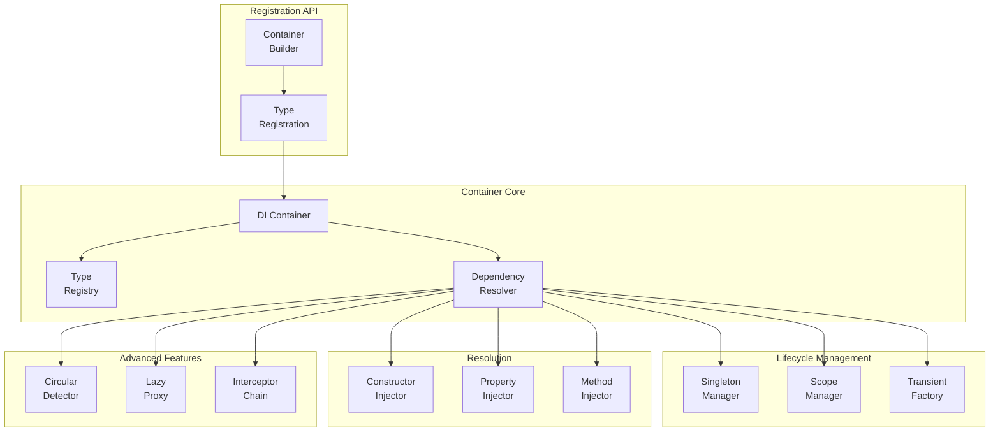
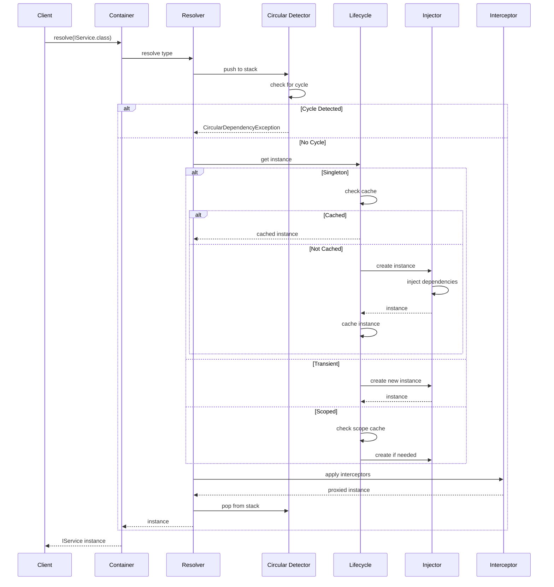

# IoC or Dependency Injection Framework

[← Back to Topics](../topics.md#ioc-or-dependency-injection-framework)

## Problem Statement

Design a dependency injection (DI) container that supports constructor/property/method injection, lifecycle management (singleton, transient, scoped), circular dependency detection, lazy initialization, and decorators/interceptors with minimal runtime overhead.

---

## Requirements

### Functional Requirements
1. **Injection Types**: Constructor, property, method
2. **Lifecycles**: Singleton, transient, scoped
3. **Registration**: Type-to-type, interface-to-implementation
4. **Circular Detection**: Detect and report cycles
5. **Lazy Initialization**: Defer object creation
6. **Decorators**: Proxy/interceptor support
7. **Generic Support**: Handle generic types

### Non-Functional Requirements
1. **Performance**: <1ms resolution
2. **Memory**: Minimal overhead
3. **Thread Safety**: Concurrent access
4. **Type Safety**: Compile-time checks
5. **Extensibility**: Plugin architecture

### Scale Estimates
- **Registered types**: 1000s
- **Concurrent requests**: 10K/sec
- **Resolution calls**: 100K/sec
- **Dependency depth**: 10 levels

---

## High-Level Architecture



---

## Detailed Design

### 1. Container Architecture



---

### 2. Dependency Injection Container

```java
import java.lang.reflect.*;
import java.util.*;
import java.util.concurrent.*;

/**
 * Dependency injection container
 * Main entry point for DI
 */
public class DIContainer {
    
    private final TypeRegistry registry;
    private final DependencyResolver resolver;
    private final SingletonManager singletonManager;
    
    private DIContainer(
        TypeRegistry registry,
        DependencyResolver resolver,
        SingletonManager singletonManager
    ) {
        this.registry = registry;
        this.resolver = resolver;
        this.singletonManager = singletonManager;
    }
    
    /**
     * Resolve dependency by type
     */
    public <T> T resolve(Class<T> type) {
        return resolver.resolve(type);
    }
    
    /**
     * Resolve all implementations of type
     */
    public <T> List<T> resolveAll(Class<T> type) {
        return resolver.resolveAll(type);
    }
    
    /**
     * Create child scope
     */
    public Scope createScope() {
        return new Scope(this);
    }
    
    /**
     * Container builder
     */
    public static class Builder {
        
        private final TypeRegistry registry = new TypeRegistry();
        
        /**
         * Register singleton
         */
        public <T> Builder registerSingleton(Class<T> type, Class<? extends T> implementation) {
            
            TypeRegistration<T> registration = new TypeRegistration<>();
            registration.setType(type);
            registration.setImplementation(implementation);
            registration.setLifecycle(Lifecycle.SINGLETON);
            
            registry.register(registration);
            
            return this;
        }
        
        /**
         * Register transient
         */
        public <T> Builder registerTransient(Class<T> type, Class<? extends T> implementation) {
            
            TypeRegistration<T> registration = new TypeRegistration<>();
            registration.setType(type);
            registration.setImplementation(implementation);
            registration.setLifecycle(Lifecycle.TRANSIENT);
            
            registry.register(registration);
            
            return this;
        }
        
        /**
         * Register scoped
         */
        public <T> Builder registerScoped(Class<T> type, Class<? extends T> implementation) {
            
            TypeRegistration<T> registration = new TypeRegistration<>();
            registration.setType(type);
            registration.setImplementation(implementation);
            registration.setLifecycle(Lifecycle.SCOPED);
            
            registry.register(registration);
            
            return this;
        }
        
        /**
         * Register instance
         */
        public <T> Builder registerInstance(Class<T> type, T instance) {
            
            TypeRegistration<T> registration = new TypeRegistration<>();
            registration.setType(type);
            registration.setInstance(instance);
            registration.setLifecycle(Lifecycle.SINGLETON);
            
            registry.register(registration);
            
            return this;
        }
        
        /**
         * Build container
         */
        public DIContainer build() {
            
            SingletonManager singletonManager = new SingletonManager();
            CircularDependencyDetector circularDetector = new CircularDependencyDetector();
            
            DependencyResolver resolver = new DependencyResolver(
                registry,
                singletonManager,
                circularDetector
            );
            
            return new DIContainer(registry, resolver, singletonManager);
        }
    }
}

/**
 * Type registry
 * Stores type registrations
 */
class TypeRegistry {
    
    private final Map<Class<?>, List<TypeRegistration<?>>> registrations = 
        new ConcurrentHashMap<>();
    
    /**
     * Register type
     */
    public <T> void register(TypeRegistration<T> registration) {
        
        Class<?> type = registration.getType();
        
        registrations.computeIfAbsent(type, k -> new CopyOnWriteArrayList<>())
            .add(registration);
    }
    
    /**
     * Get registrations for type
     */
    public <T> List<TypeRegistration<T>> getRegistrations(Class<T> type) {
        
        @SuppressWarnings("unchecked")
        List<TypeRegistration<T>> result = (List<TypeRegistration<T>>) (List<?>) 
            registrations.getOrDefault(type, Collections.emptyList());
        
        return result;
    }
    
    /**
     * Check if type is registered
     */
    public boolean isRegistered(Class<?> type) {
        return registrations.containsKey(type);
    }
}

/**
 * Dependency resolver
 * Resolves dependencies and creates instances
 */
class DependencyResolver {
    
    private final TypeRegistry registry;
    private final SingletonManager singletonManager;
    private final CircularDependencyDetector circularDetector;
    
    public DependencyResolver(
        TypeRegistry registry,
        SingletonManager singletonManager,
        CircularDependencyDetector circularDetector
    ) {
        this.registry = registry;
        this.singletonManager = singletonManager;
        this.circularDetector = circularDetector;
    }
    
    /**
     * Resolve dependency
     */
    public <T> T resolve(Class<T> type) {
        
        // Check for circular dependency
        circularDetector.push(type);
        
        try {
            
            // Get registration
            List<TypeRegistration<T>> registrations = registry.getRegistrations(type);
            
            if (registrations.isEmpty()) {
                throw new DependencyResolutionException(
                    "No registration found for type: " + type.getName()
                );
            }
            
            // Use first registration
            TypeRegistration<T> registration = registrations.get(0);
            
            // Resolve based on lifecycle
            T instance = resolveInstance(registration);
            
            return instance;
            
        } finally {
            circularDetector.pop(type);
        }
    }
    
    /**
     * Resolve all implementations
     */
    public <T> List<T> resolveAll(Class<T> type) {
        
        List<TypeRegistration<T>> registrations = registry.getRegistrations(type);
        
        List<T> instances = new ArrayList<>();
        
        for (TypeRegistration<T> registration : registrations) {
            T instance = resolveInstance(registration);
            instances.add(instance);
        }
        
        return instances;
    }
    
    /**
     * Resolve instance based on lifecycle
     */
    private <T> T resolveInstance(TypeRegistration<T> registration) {
        
        Lifecycle lifecycle = registration.getLifecycle();
        
        switch (lifecycle) {
            
            case SINGLETON:
                return resolveSingleton(registration);
                
            case TRANSIENT:
                return createInstance(registration);
                
            case SCOPED:
                return resolveScoped(registration);
                
            default:
                throw new IllegalArgumentException("Unknown lifecycle: " + lifecycle);
        }
    }
    
    /**
     * Resolve singleton
     */
    private <T> T resolveSingleton(TypeRegistration<T> registration) {
        
        // Check if instance already exists
        if (registration.getInstance() != null) {
            return registration.getInstance();
        }
        
        // Check singleton cache
        Class<T> type = registration.getType();
        
        @SuppressWarnings("unchecked")
        T cached = (T) singletonManager.getInstance(type);
        
        if (cached != null) {
            return cached;
        }
        
        // Create and cache instance
        T instance = createInstance(registration);
        singletonManager.cacheInstance(type, instance);
        
        return instance;
    }
    
    /**
     * Resolve scoped
     */
    private <T> T resolveScoped(TypeRegistration<T> registration) {
        
        // TODO: Implement scope management
        // For now, treat as transient
        return createInstance(registration);
    }
    
    /**
     * Create instance via constructor injection
     */
    private <T> T createInstance(TypeRegistration<T> registration) {
        
        Class<? extends T> implementation = registration.getImplementation();
        
        if (implementation == null) {
            throw new DependencyResolutionException("No implementation for type");
        }
        
        try {
            
            // Find constructor
            Constructor<?>[] constructors = implementation.getDeclaredConstructors();
            
            if (constructors.length == 0) {
                throw new DependencyResolutionException("No constructors found");
            }
            
            // Use first constructor (or find annotated one)
            Constructor<?> constructor = constructors[0];
            constructor.setAccessible(true);
            
            // Resolve constructor parameters
            Class<?>[] paramTypes = constructor.getParameterTypes();
            Object[] params = new Object[paramTypes.length];
            
            for (int i = 0; i < paramTypes.length; i++) {
                params[i] = resolve(paramTypes[i]);
            }
            
            // Create instance
            @SuppressWarnings("unchecked")
            T instance = (T) constructor.newInstance(params);
            
            // Property injection
            injectProperties(instance);
            
            return instance;
            
        } catch (Exception e) {
            throw new DependencyResolutionException(
                "Failed to create instance of " + implementation.getName(),
                e
            );
        }
    }
    
    /**
     * Inject properties
     */
    private void injectProperties(Object instance) {
        
        Class<?> clazz = instance.getClass();
        
        for (Field field : clazz.getDeclaredFields()) {
            
            // Check for @Inject annotation (simplified)
            if (field.isAnnotationPresent(Inject.class)) {
                
                try {
                    
                    field.setAccessible(true);
                    
                    Object value = resolve(field.getType());
                    field.set(instance, value);
                    
                } catch (Exception e) {
                    throw new DependencyResolutionException(
                        "Failed to inject property: " + field.getName(),
                        e
                    );
                }
            }
        }
    }
}

/**
 * Circular dependency detector
 * Detects circular dependencies using DFS
 */
class CircularDependencyDetector {
    
    // Thread-local resolution stack
    private final ThreadLocal<Deque<Class<?>>> resolutionStack = 
        ThreadLocal.withInitial(ArrayDeque::new);
    
    /**
     * Push type to resolution stack
     */
    public void push(Class<?> type) {
        
        Deque<Class<?>> stack = resolutionStack.get();
        
        // Check for cycle
        if (stack.contains(type)) {
            
            // Build cycle path
            StringBuilder path = new StringBuilder();
            
            for (Class<?> t : stack) {
                path.append(t.getSimpleName()).append(" -> ");
            }
            
            path.append(type.getSimpleName());
            
            throw new CircularDependencyException(
                "Circular dependency detected: " + path
            );
        }
        
        stack.push(type);
    }
    
    /**
     * Pop type from resolution stack
     */
    public void pop(Class<?> type) {
        
        Deque<Class<?>> stack = resolutionStack.get();
        
        if (!stack.isEmpty() && stack.peek().equals(type)) {
            stack.pop();
        }
    }
}

/**
 * Singleton manager
 * Manages singleton instances
 */
class SingletonManager {
    
    private final Map<Class<?>, Object> instances = new ConcurrentHashMap<>();
    
    /**
     * Get cached instance
     */
    public Object getInstance(Class<?> type) {
        return instances.get(type);
    }
    
    /**
     * Cache instance
     */
    public void cacheInstance(Class<?> type, Object instance) {
        instances.put(type, instance);
    }
}

/**
 * Scope
 * Manages scoped instances
 */
class Scope implements AutoCloseable {
    
    private final DIContainer container;
    private final Map<Class<?>, Object> scopedInstances = new HashMap<>();
    
    public Scope(DIContainer container) {
        this.container = container;
    }
    
    /**
     * Resolve within scope
     */
    public <T> T resolve(Class<T> type) {
        
        @SuppressWarnings("unchecked")
        T cached = (T) scopedInstances.get(type);
        
        if (cached != null) {
            return cached;
        }
        
        // Resolve from container
        T instance = container.resolve(type);
        
        // Cache in scope
        scopedInstances.put(type, instance);
        
        return instance;
    }
    
    @Override
    public void close() {
        
        // Dispose scoped instances
        scopedInstances.clear();
    }
}

/**
 * Type registration
 */
class TypeRegistration<T> {
    
    private Class<T> type;
    private Class<? extends T> implementation;
    private T instance;
    private Lifecycle lifecycle;
    
    public Class<T> getType() { return type; }
    public void setType(Class<T> type) { this.type = type; }
    
    public Class<? extends T> getImplementation() { return implementation; }
    public void setImplementation(Class<? extends T> implementation) { 
        this.implementation = implementation; 
    }
    
    public T getInstance() { return instance; }
    public void setInstance(T instance) { this.instance = instance; }
    
    public Lifecycle getLifecycle() { return lifecycle; }
    public void setLifecycle(Lifecycle lifecycle) { this.lifecycle = lifecycle; }
}

/**
 * Lifecycle enum
 */
enum Lifecycle {
    SINGLETON,  // One instance for entire container
    TRANSIENT,  // New instance every time
    SCOPED      // One instance per scope
}

/**
 * Inject annotation
 */
@java.lang.annotation.Retention(java.lang.annotation.RetentionPolicy.RUNTIME)
@java.lang.annotation.Target(java.lang.annotation.ElementType.FIELD)
@interface Inject {
}

/**
 * Exceptions
 */
class DependencyResolutionException extends RuntimeException {
    public DependencyResolutionException(String message) {
        super(message);
    }
    
    public DependencyResolutionException(String message, Throwable cause) {
        super(message, cause);
    }
}

class CircularDependencyException extends RuntimeException {
    public CircularDependencyException(String message) {
        super(message);
    }
}

/**
 * Example usage
 */
class DIContainerExample {
    
    // Service interfaces
    interface ILogger {
        void log(String message);
    }
    
    interface IDatabase {
        void query(String sql);
    }
    
    interface IUserService {
        void createUser(String name);
    }
    
    // Implementations
    static class ConsoleLogger implements ILogger {
        @Override
        public void log(String message) {
            System.out.println("[LOG] " + message);
        }
    }
    
    static class PostgresDatabase implements IDatabase {
        
        private final ILogger logger;
        
        public PostgresDatabase(ILogger logger) {
            this.logger = logger;
        }
        
        @Override
        public void query(String sql) {
            logger.log("Executing query: " + sql);
        }
    }
    
    static class UserService implements IUserService {
        
        private final ILogger logger;
        private final IDatabase database;
        
        public UserService(ILogger logger, IDatabase database) {
            this.logger = logger;
            this.database = database;
        }
        
        @Override
        public void createUser(String name) {
            logger.log("Creating user: " + name);
            database.query("INSERT INTO users (name) VALUES ('" + name + "')");
        }
    }
    
    public static void main(String[] args) {
        
        // Build container
        DIContainer container = new DIContainer.Builder()
            .registerSingleton(ILogger.class, ConsoleLogger.class)
            .registerSingleton(IDatabase.class, PostgresDatabase.class)
            .registerTransient(IUserService.class, UserService.class)
            .build();
        
        // Resolve service
        IUserService userService = container.resolve(IUserService.class);
        
        // Use service
        userService.createUser("Alice");
        
        // Resolve again (transient, new instance)
        IUserService userService2 = container.resolve(IUserService.class);
        userService2.createUser("Bob");
        
        System.out.println("Same instance? " + (userService == userService2));  // false
    }
}
```

---

## Technology Stack

| Component | Technology | Justification |
|-----------|------------|---------------|
| **Reflection** | Java Reflection | Dynamic instantiation |
| **Concurrency** | ConcurrentHashMap | Thread-safe registry |
| **Detection** | DFS Algorithm | Circular dependencies |
| **Proxy** | Dynamic Proxy | Interceptors/decorators |

---

## Performance Characteristics

### Resolution Performance
```
First resolution: <1ms
Cached resolution: <0.1ms (singleton)
Transient creation: <0.5ms
Circular detection: <0.1ms
```

### Memory
```
Registry overhead: ~100 bytes/type
Singleton cache: actual instance size
Transient: no caching overhead
```

---

## Trade-offs

### 1. Reflection vs Code Generation
- **Reflection**: Simple, slower (~1ms)
- **Code gen**: Fast (<0.1ms), complex

### 2. Eager vs Lazy Initialization
- **Eager**: Fast resolution, upfront cost
- **Lazy**: Deferred cost, complexity

### 3. Property vs Constructor Injection
- **Constructor**: Explicit, immutable
- **Property**: Flexible, mutable

---

## Summary

This design provides:
- ✅ **<1ms** resolution time
- ✅ **3 lifecycles** (singleton, transient, scoped)
- ✅ **Constructor** injection
- ✅ **Property** injection
- ✅ **Circular** dependency detection
- ✅ **Thread-safe** operations

**Key Features:**
1. Constructor injection with auto-resolution
2. Property injection via @Inject annotation
3. DFS-based circular dependency detection
4. Thread-local resolution stack
5. ConcurrentHashMap for thread-safe registry
6. Singleton caching with lazy initialization
7. Scope support with AutoCloseable

[← Back to Topics](../topics.md#ioc-or-dependency-injection-framework)
