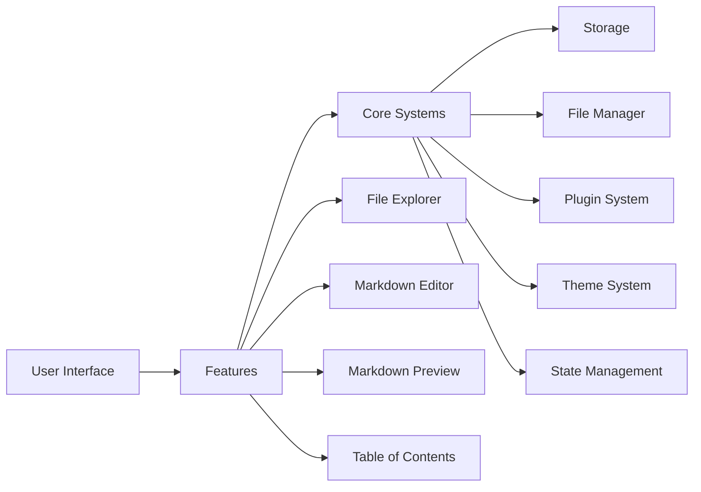
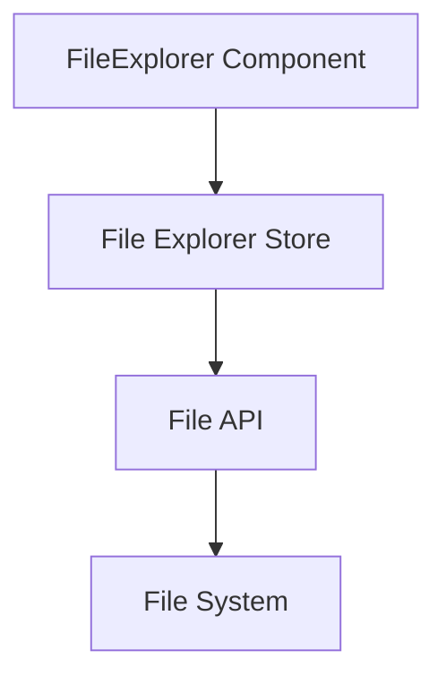
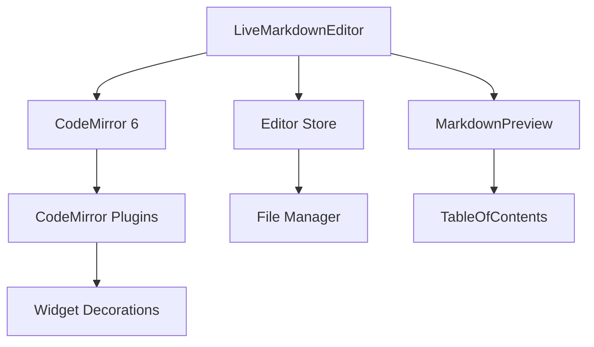
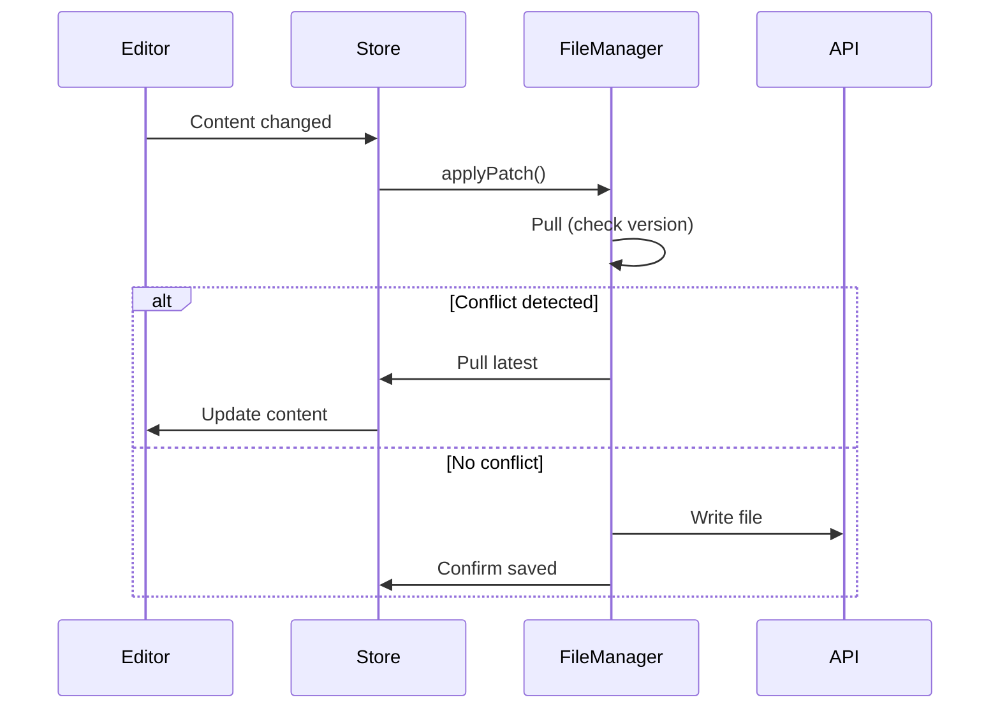
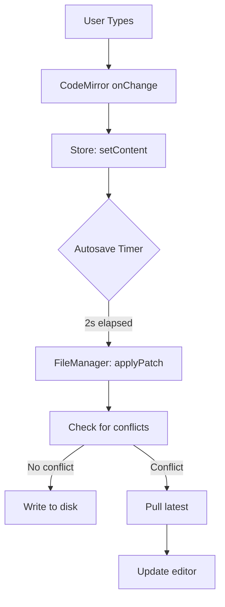
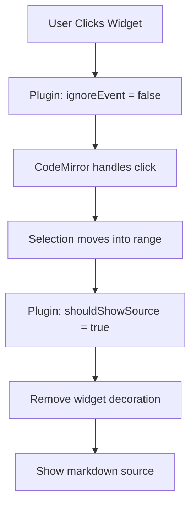
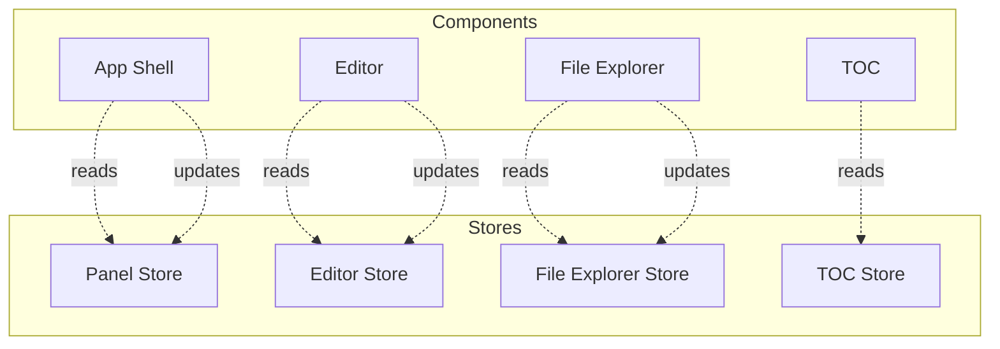
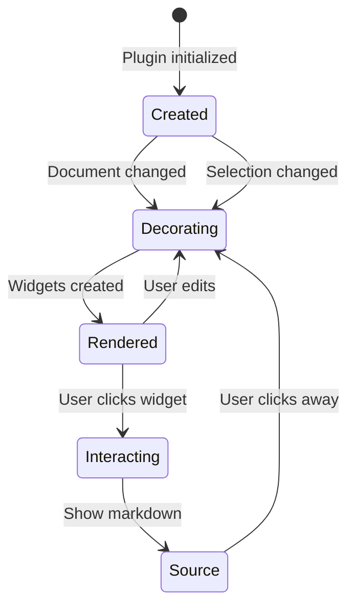
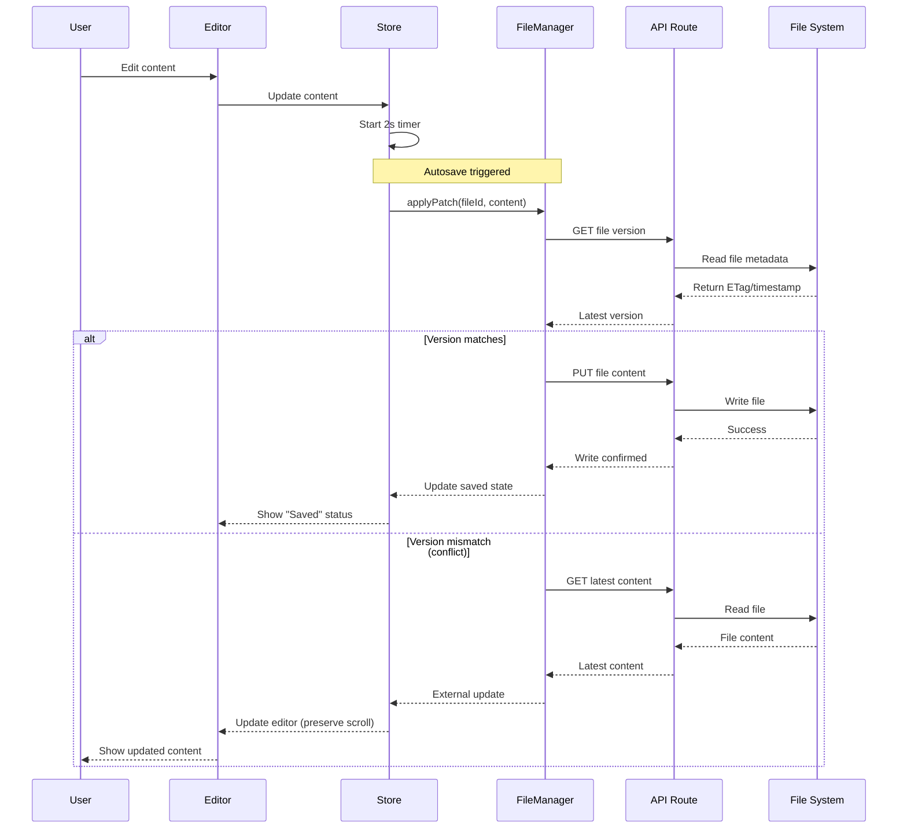

# MDNotes Viewer Architecture

This document provides a comprehensive overview of the MDNotes Viewer architecture for developers with beginner to intermediate experience in React and CodeMirror.

## Table of Contents

1. [System Overview](#system-overview)
2. [Application Layers](#application-layers)
3. [Data Flow](#data-flow)
4. [State Management](#state-management)
5. [Plugin System](#plugin-system)
6. [File Management](#file-management)

## System Overview

MDNotes Viewer is built with a modular, feature-based architecture that separates concerns and makes the codebase easy to understand and extend.



### Key Principles

1. **Feature-Based Structure**: Each feature is self-contained with its own components, hooks, and state
2. **Separation of Concerns**: UI, business logic, and data are clearly separated
3. **Composition Over Inheritance**: Components are composed from smaller, reusable pieces
4. **Unidirectional Data Flow**: Data flows from parent to child, updates flow through stores

## Application Layers

### Layer 1: UI Components (`app/` and `shared/components/`)

The outermost layer handles user interaction and presentation.

**Key Files:**
- `app/page.tsx` - Main application entry point
- `shared/components/app-shell.tsx` - Layout container with resizable panels
- `shared/components/app-toolbar.tsx` - Top toolbar with controls

**Responsibilities:**
- Render UI elements
- Handle user input
- Display data from stores
- Trigger actions via store methods

### Layer 2: Features (`features/`)

Feature modules encapsulate specific functionality.

#### File Explorer (`features/file-explorer/`)



**Components:**
- `FileExplorer.tsx` - Tree view with context menu

**Store:**
- Manages file tree state
- Handles CRUD operations
-Tracks selected/expanded nodes

**Key Concepts:**
- Uses `react-complex-tree` for tree UI
- Context menu for file operations
- Inline editing for renames

#### Markdown Editor (`features/editor/`)



**Components:**
- `LiveMarkdownEditor.tsx` - Main editor component
- `MarkdownPreview.tsx` - Live markdown preview
- `TableOfContents.tsx` - TOC sidebar

**Plugins:** (`features/editor/plugins/`)
- `custom-link-plugin.tsx` - Interactive links
- `code-block-plugin.tsx` - Syntax-highlighted code
- `mermaid-plugin.tsx` - Diagram rendering
- `html-plugin.tsx` - HTML block rendering
- `list-plugin.tsx` - Styled lists
- `horizontal-rule-plugin.tsx` - Visual separators
- `plugin-utils.ts` - Shared utilities

**How Plugins Work:**

```typescript
// 1. Define what to render
class MyWidget extends WidgetType {
  toDOM() {
    const el = document.createElement('div');
    //Render content
    return el;
  }
}

// 2. Find markdown to replace
function buildDecorations(state) {
  syntaxTree(state).iterate({
    enter: (node) => {
      if (node.name === 'TargetNode') {
        // Replace with widget
        decorations.push(
          Decoration.replace({ widget }).range(from, to)
        );
      }
    }
  });
}

// 3. Register as plugin
const myPlugin = StateField.define({
  create: buildDecorations,
  update: (deco, tr) => {
    if (tr.docChanged || tr.selection) {
      return buildDecorations(tr.state);
    }
    return deco;
  }
});
```

### Layer 3: Core Systems (`core/`)

Core systems provide Infrastructure and shared functionality.

#### File Manager (`core/file-manager/`)

Implements a git-like workflow for file operations:



**Key Features:**
- Automatic conflict detection
- Async file operations
- Scroll position preservation
- External change detection

#### State Management (`core/store/` and feature stores)

Uses Zustand for lightweight, performant state management:

```typescript
// Example store structure
const useEditorStore = create((set) => ({
  // State
  currentFile: null,
  viewMode: 'preview',
  
  // Actions
  setViewMode: (mode) => set({ viewMode: mode }),
  setFile: (file) => set({ currentFile: file }),
}));
```

## Data Flow

### User Types in Editor



### User Clicks on Rendered Widget



## State Management

### Store Architecture



**Store Responsibilities:**

- **Panel Store**: Panel visibility and sizes
- **Editor Store**: Current file, view mode, save status
- **File Explorer Store**: Tree data, selected items
- **TOC Store**: Headings, active section

### State Update Pattern

```typescript
// 1. Component reads state
function MyComponent() {
  const file = useEditorStore(state => state.currentFile);
  const setFile = useEditorStore(state => state.setFile);
  
  // 2. User action triggers update
  const handleFileChange = async (newFile) => {
    // 3. Update store
    setFile(newFile);
  };
}
```

## Plugin System

### Plugin Lifecycle



### Creating a Plugin

See [PLUGIN_DEVELOPMENT.md](./PLUGIN_DEVELOPMENT.md) for a detailed guide.

### Shared Utilities

All plugins use `plugin-utils.ts` for common operations:

```typescript
// Check if we should show source
shouldShowWidgetSourceState(state, from, to)

// Check selection overlap
hasSelectionOverlapState(state, from, to)

// Sanitize HTML
sanitizeHTML(htmlString)

// Detect markdown in HTML
containsMarkdown(content)
```

## File Management

### File Operation Workflow



### External Change Detection

The file manager watches for external changes:

```typescript
// Pseudocode
setInterval(async () => {
  const latestVersion = await getFileVersion(path);
  
  if (latestVersion !== cachedVersion) {
    // File changed externally
    const content = await readFile(path);
    
    // Update editor without scroll jump
    updateEditor(content, { preserveScroll: true });
  }
}, 5000); // Check every 5 seconds
```

## Performance Considerations

### Bundle Size Optimization

- Code splitting by feature
- Lazy loading for heavy components (Mermaid, CodeMirror plugins)
- Tree-shaking unused dependencies

### Render Optimization

- Memoization with `useMemo` for expensive computations
- `useCallback` for stable function references
- Zustand shallow equality for selective re-renders

### Editor Performance

- Viewport-based rendering (only visible decorations)
- Debounced autosave (2 seconds)
- Efficient decoration updates (only rebuild on change)

## For Beginners

If you're new to React or CodeMirror, here's where to start:

1. **Read the main README.md** - Understand what the app does
2. **Explore `/app/page.tsx`** - See how features are composed
3. **Look at a simple feature** - Start with File Explorer
4. **Understand a plugin** - Read `horizontal-rule-plugin.tsx` (simplest plugin)
5. **Read plugin-utils.ts** - Learn the common patterns
6. **Try modifying a plugin** - Change the styling of lists or links

### CodeMirror Concepts for Beginners

**State vs View:**
- `EditorState` - The document content and selection
- `EditorView` - The visual rendering of the state

**Extensions:**
- Plugins that extend CodeMirror functionality
- Can add decorations, handle events, modify behavior

**Decorations:**
- Visual modifications to the editor (widgets, marks, line decorations)
- Don't modify the actual document content

**Syntax Tree:**
- Parsed structure of the markdown
- Used to find specific nodes (headings, links, code blocks)

### React Concepts Used

- Functional components with hooks
- `useState` for local state
- `useEffect` for side effects
- `useRef` for DOM references
- Custom hooks for reusable logic
- Context for theme management
- Zustand for global state

---

For more details on specific topics:
- [Plugin Development Guide](./PLUGIN_DEVELOPMENT.md)
- [File Manager Architecture](../core/file-manager/README.md)
- [Contributing Guide](../CONTRIBUTING.md)
