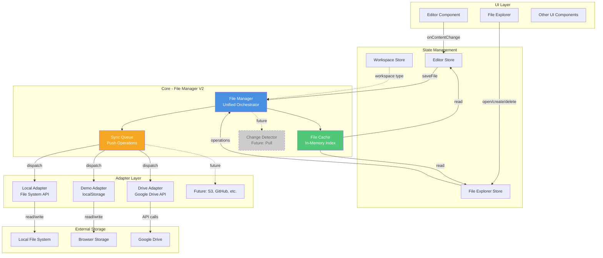
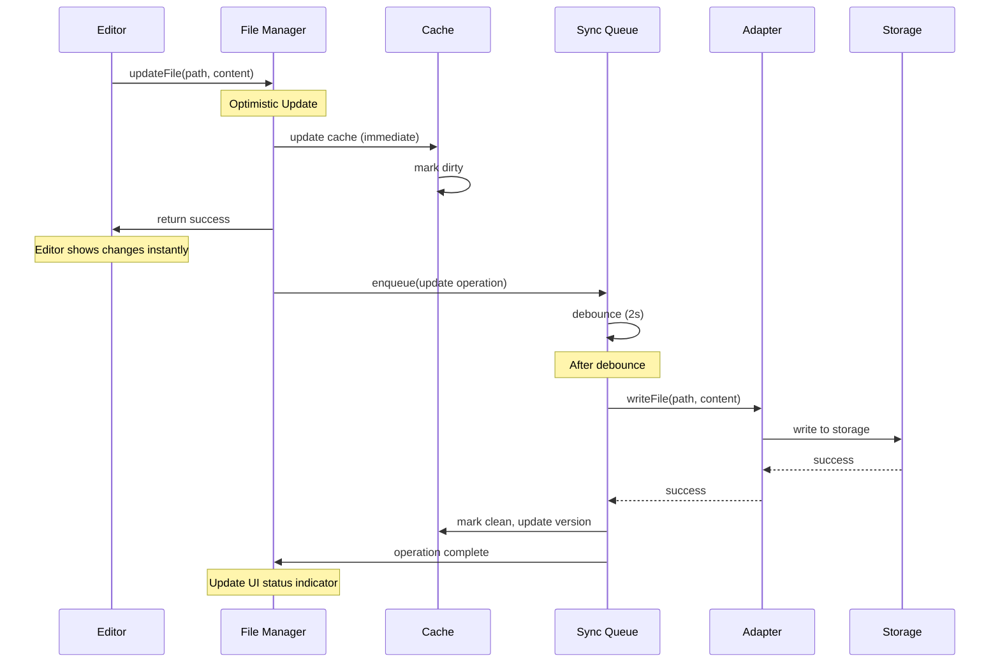
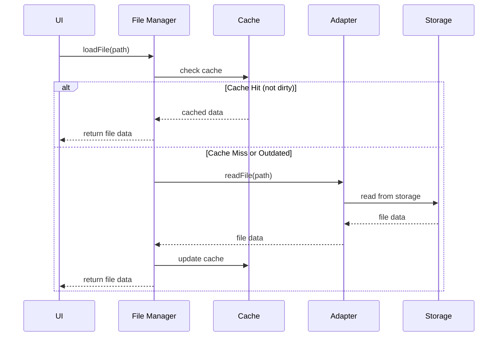
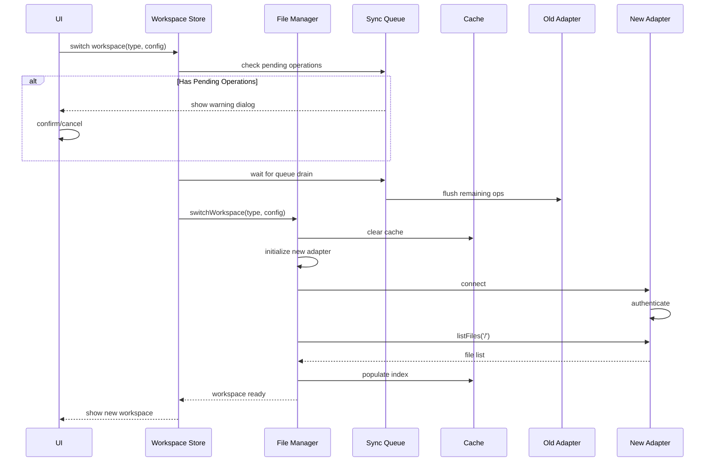

# File Manager V2 - Unified Architecture Design

## Overview

This document outlines the proposed architecture for a unified, adapter-based file management system that provides seamless editing experience across different workspace types (Local, Browser/Demo, Google Drive, etc.).

## Design Goals

1. **Unified Experience**: Single, consistent file handling flow regardless of workspace type
2. **Push-Based Sync**: Optimistic updates with background synchronization
3. **Adapter Pattern**: Pluggable storage backends with common interface
4. **Extensibility**: Easy to add new workspace types and pull-based sync in future
5. **Reliability**: Queue-based sync with retry logic and conflict detection
6. **Performance**: Immediate UI updates, non-blocking I/O operations

## High-Level Architecture



## Component Details

### 1. File Manager (Unified Orchestrator)

**Responsibilities:**
- Central coordinator for all file operations
- Maintains in-memory file index and metadata
- Routes operations to appropriate adapter based on workspace type
- Manages cache lifecycle and invalidation
- Coordinates between UI and Sync Queue

**Key APIs:**
```typescript
interface FileManager {
  // File Operations
  loadFile(path: string): Promise<FileData>
  updateFile(path: string, content: string): Promise<void>
  createFile(path: string, content: string): Promise<void>
  deleteFile(path: string): Promise<void>
  renameFile(oldPath: string, newPath: string): Promise<void>
  
  // Directory Operations
  listFiles(directory: string): Promise<FileMetadata[]>
  createFolder(path: string): Promise<void>
  
  // Cache Management
  getFromCache(path: string): FileData | null
  invalidateCache(path: string): void
  
  // Workspace Management
  switchWorkspace(type: WorkspaceType, config: WorkspaceConfig): Promise<void>
}
```

### 2. File Cache (In-Memory Index)

**Purpose:** Fast access to file content and metadata without repeated I/O

**Structure:**
```typescript
interface FileCache {
  files: Map<string, CachedFile>
  index: Map<string, string[]>  // directory -> file paths
  metadata: Map<string, FileMetadata>
}

interface CachedFile {
  id: string
  path: string
  content: string
  metadata: FileMetadata
  version: string          // for conflict detection
  lastSync: number         // timestamp
  isDirty: boolean         // has unsaved changes
  syncStatus: 'idle' | 'syncing' | 'error'
}
```

**Features:**
- Instant read access for editor
- Dirty state tracking
- LRU eviction for memory management
- Hierarchical indexing for file tree

### 3. Sync Queue (Push Operations)

**Purpose:** Reliable, ordered synchronization of changes to storage backends

**Architecture:**
```typescript
interface SyncQueue {
  enqueue(operation: SyncOperation): string
  process(): Promise<void>
  retry(operationId: string): Promise<void>
  cancel(operationId: string): void
  getStatus(): QueueStatus
}

interface SyncOperation {
  id: string
  type: 'create' | 'update' | 'delete' | 'rename' | 'create-folder'
  path: string
  newPath?: string         // for rename
  content?: string         // for create/update
  timestamp: number
  retries: number
  maxRetries: number
  status: 'pending' | 'processing' | 'completed' | 'failed'
  error?: Error
  metadata?: any
}
```

**Features:**
- Debounced writes (combine rapid changes)
- Automatic retry with exponential backoff
- Persistent queue (survives page refresh)
- Priority queue (user-initiated > auto-save)
- Batch operations support
- Offline queue accumulation

**Processing Flow:**
1. Operation added to queue
2. Debounce timer (configurable per operation type)
3. Acquire adapter lock
4. Execute operation via adapter
5. Update cache on success
6. Mark operation complete or retry on failure

### 4. Adapter Layer

**Common Interface:**
```typescript
interface WorkspaceAdapter {
  type: WorkspaceType
  
  // Required: Core Operations
  readFile(path: string): Promise<FileData>
  writeFile(path: string, content: string, version?: string): Promise<void>
  deleteFile(path: string): Promise<void>
  listFiles(directory: string): Promise<FileMetadata[]>
  
  // Optional: Advanced Operations
  renameFile?(oldPath: string, newPath: string): Promise<void>
  createFolder?(path: string): Promise<void>
  
  // Optional: Conflict Detection
  getFileVersion?(path: string): Promise<string>
  
  // Optional: Batch Operations
  batchWrite?(operations: BatchOperation[]): Promise<BatchResult>
  
  // Optional: Metadata Only
  getMetadata?(path: string): Promise<FileMetadata>
  
  // Capabilities
  capabilities: AdapterCapabilities
}

interface AdapterCapabilities {
  supportsWatch: boolean        // can detect external changes
  supportsBatch: boolean         // can batch multiple operations
  supportsVersioning: boolean    // has version/etag support
  supportsRename: boolean        // has native rename
  supportsDirectories: boolean   // has directory concept
  maxFileSize: number           // max file size in bytes
  rateLimit?: RateLimitConfig   // API rate limits
}
```

**Adapters:**

1. **Local Adapter** - File System Access API
   - Direct file handle access
   - Native file watching (future)
   - No rate limits
   - Supports rename natively

2. **Demo Adapter** - localStorage/IndexedDB
   - In-browser persistence
   - No real file sync
   - Fast operations
   - No size concerns for demo data

3. **Google Drive Adapter** - Drive API v3
   - OAuth authentication
   - Rate limited (10 req/sec/user)
   - Version support via modifiedTime
   - Background sync

4. **Future Adapters**:
   - S3 Adapter
   - GitHub Adapter (via GitHub API)
   - Dropbox Adapter
   - WebDAV Adapter

## Data Flow Diagrams

### File Update Flow (Push-Based)



### File Load Flow



### Workspace Switch Flow



## Configuration

### Debounce Timers
```typescript
const DEBOUNCE_CONFIG = {
  autoSave: 2000,        // 2s for auto-save edits
  userSave: 0,           // immediate for Cmd+S
  create: 100,           // 100ms for new files
  delete: 0,             // immediate for deletes
  rename: 0,             // immediate for renames
}
```

### Retry Policy
```typescript
const RETRY_CONFIG = {
  maxRetries: 3,
  baseDelay: 1000,       // 1s
  maxDelay: 30000,       // 30s
  backoffMultiplier: 2,
  retryableErrors: [
    'NETWORK_ERROR',
    'TIMEOUT',
    'RATE_LIMIT',
    'SERVER_ERROR',
  ]
}
```

### Cache Policy
```typescript
const CACHE_CONFIG = {
  maxSize: 100,          // max cached files
  maxMemory: 50 * 1024 * 1024,  // 50MB
  evictionPolicy: 'LRU',
  ttl: 5 * 60 * 1000,   // 5 min for metadata
}
```

## State Management Integration

### Workspace Store
```typescript
interface WorkspaceStore {
  // Current workspace
  currentWorkspace: Workspace | null
  workspaceType: WorkspaceType
  
  // Switch workspace
  switchWorkspace: (type: WorkspaceType, config: any) => Promise<void>
  
  // Sync status
  syncStatus: 'idle' | 'syncing' | 'error'
  pendingOperations: number
}
```

### Editor Store
```typescript
interface EditorStore {
  // Open files
  openTabs: Tab[]
  activeTabId: string | null
  
  // File operations
  openFile: (path: string) => Promise<void>
  updateContent: (path: string, content: string) => Promise<void>
  closeFile: (path: string) => void
  
  // Derived state
  currentFile: FileData | null
  isDirty: boolean
}
```

### File Explorer Store
```typescript
interface FileExplorerStore {
  // File tree
  files: FileMetadata[]
  expandedFolders: Set<string>
  
  // Operations
  createFile: (path: string) => Promise<void>
  deleteFile: (path: string) => Promise<void>
  renameFile: (oldPath: string, newPath: string) => Promise<void>
  createFolder: (path: string) => Promise<void>
  
  // Selection
  selectedPath: string | null
}
```

## Error Handling

### Error Types
```typescript
enum FileErrorType {
  NOT_FOUND = 'FILE_NOT_FOUND',
  PERMISSION_DENIED = 'PERMISSION_DENIED',
  CONFLICT = 'FILE_CONFLICT',
  QUOTA_EXCEEDED = 'QUOTA_EXCEEDED',
  NETWORK_ERROR = 'NETWORK_ERROR',
  ADAPTER_ERROR = 'ADAPTER_ERROR',
  INVALID_PATH = 'INVALID_PATH',
}

class FileSystemError extends Error {
  type: FileErrorType
  path: string
  retryable: boolean
  metadata?: any
}
```

### Error Strategies
- **Transient Errors** (network, timeout): Auto retry with backoff
- **Permission Errors**: Show auth dialog, retry after auth
- **Conflict Errors**: Queue for manual resolution (future)
- **Quota Errors**: Show user notification, pause sync
- **Not Found**: Remove from cache, update UI

## Future Enhancements (Extensibility Points)

### 1. Pull-Based Sync / Change Detection
```typescript
interface ChangeDetector {
  watch(path: string): void
  unwatch(path: string): void
  onExternalChange: (path: string, version: string) => void
}

// Implementation per adapter
class DriveChangeDetector implements ChangeDetector {
  // Uses Drive Push Notifications or polling
  async detectChanges(): Promise<Change[]>
}
```

**Flow:**
1. Detect external change via webhook/polling
2. Fetch latest version from storage
3. Compare with cache version
4. If dirty locally → Conflict resolution
5. If clean → Pull and update cache
6. Notify editor to reload

### 2. Conflict Resolution
```typescript
interface ConflictResolver {
  detect(path: string): Promise<Conflict | null>
  resolve(conflict: Conflict, resolution: Resolution): Promise<void>
}

type Resolution = 
  | { strategy: 'keep-local' }
  | { strategy: 'keep-remote' }
  | { strategy: 'manual', merged: string }
```

### 3. Offline Support
```typescript
interface OfflineManager {
  isOnline(): boolean
  onOnline(callback: () => void): void
  onOffline(callback: () => void): void
  getOfflineQueue(): SyncOperation[]
}
```

**Features:**
- Detect online/offline status
- Accumulate operations in queue while offline
- Flush queue when back online
- Show offline indicator in UI

### 4. Real-time Collaboration
```typescript
interface CollaborationEngine {
  connect(fileId: string): void
  disconnect(fileId: string): void
  sendChanges(changes: TextChange[]): void
  onRemoteChanges(callback: (changes: TextChange[]) => void): void
}
```

**Possible with:**
- WebSocket connection
- Operational Transform (OT) or CRDT
- Cursor/selection sharing
- Presence indicators

## Migration Strategy

Since this is a design document, implementation should be:

1. **Phase 1**: Implement new FileManager and Cache (no breaking changes)
2. **Phase 2**: Refactor adapters to new interface (backward compatible)
3. **Phase 3**: Implement new SyncQueue with migration path
4. **Phase 4**: Update stores to use new FileManager
5. **Phase 5**: Remove old code, cleanup

**Rollout:**
- Feature flag: `FILE_MANAGER_V2`
- A/B test with subset of users
- Monitor error rates and performance
- Gradual rollout to 100%

## Performance Considerations

### Memory Management
- Limit cache size (100 files default)
- LRU eviction for least accessed files
- Lazy load file content (metadata first)
- Cleanup closed tabs from cache

### Network Optimization
- Batch operations when possible
- Compress large files before upload
- Use ETags/If-None-Match for Drive API
- Implement request deduplication

### UI Responsiveness
- Optimistic updates (instant feedback)
- Virtual scrolling for large file lists
- Debounced search/filter
- Web Worker for heavy operations (parsing, diffing)

## Testing Strategy

### Unit Tests
- FileManager operations
- Cache eviction policies
- SyncQueue retry logic
- Adapter implementations

### Integration Tests
- End-to-end file operations
- Workspace switching
- Error handling and recovery
- Offline/online transitions

### Performance Tests
- Large file handling (>10MB)
- Many files (>1000 in tree)
- Rapid edits (stress sync queue)
- Memory leak detection

## Security Considerations

- **Authentication**: Secure token storage, refresh logic
- **Authorization**: Adapter-level permission checks
- **Data**: Encrypt sensitive data in localStorage
- **XSS**: Sanitize file names and content in UI
- **CORS**: Proper configuration for API calls
- **Rate Limiting**: Respect API limits, implement backoff

## Metrics & Monitoring

Key metrics to track:
- File operation latency (p50, p95, p99)
- Sync queue depth
- Cache hit rate
- Error rates by type
- Adapter-specific metrics (API calls, quota usage)
- User-facing: Time to first edit, save confirmation delay

---

## Summary

This architecture provides:
- ✅ Unified, adapter-based file handling
- ✅ Optimistic updates for instant UX
- ✅ Reliable background sync with retry logic
- ✅ Support for multiple workspace types
- ✅ Extensible for future enhancements (pull-sync, conflict resolution, collaboration)
- ✅ Clear separation of concerns
- ✅ Testable, maintainable code structure

The design maintains backward compatibility while providing a clear path forward for advanced features.
