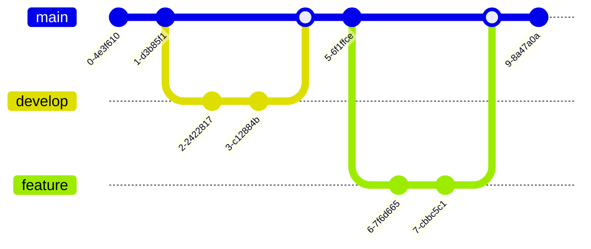

# Mermaid Diagrams

This document showcases various Mermaid diagram types for visualizing data, processes, and relationships.

## What is Mermaid?

Mermaid is a JavaScript-based diagramming and charting tool that renders Markdown-inspired text definitions to create diagrams dynamically.

---

## Flowcharts

Flowcharts visualize processes and decision flows:

### Complex Flowchart

---

## Sequence Diagrams

Show interactions between different actors over time:

### Authentication Flow

---

## Class Diagrams

Represent object-oriented class structures:

### Application Architecture

---

## Entity Relationship Diagrams

Model database relationships:

---

## State Diagrams

Visualize state machines and transitions:

### Order Processing States

---

## Git Graphs

Visualize git branching and merging:

### Release Workflow

---

## Pie Charts

Display proportional data:

### Budget Allocation

---

## Gantt Charts

Project timelines and task scheduling:

---

## Mindmaps

Organize ideas hierarchically:

---

## Journey Diagrams

Map user experiences:

---

## Quadrant Charts

Plot items across two dimensions:

---

## Timeline

Show events over time:

---

## Tips for Using Mermaid

- Click inside the diagram area to edit the source code
- Support for many diagram types
- Great for documentation and technical writing
- Renders dynamically in real-time
- Export diagrams as images
- Version control friendly (plain text)

**Try editing**: Click on any diagram to see and modify its source code!
