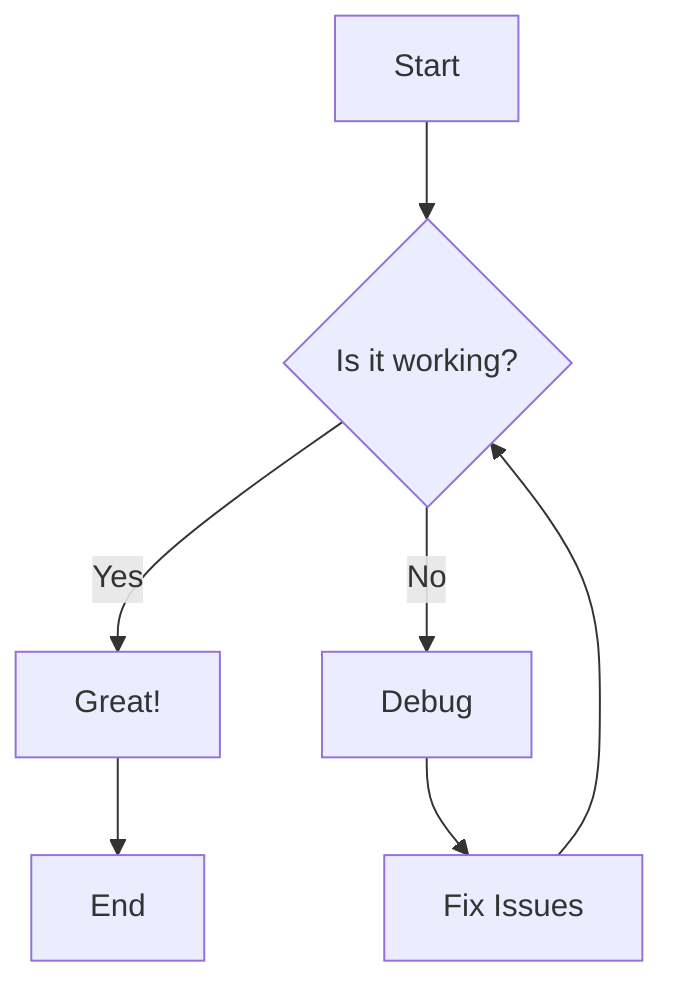
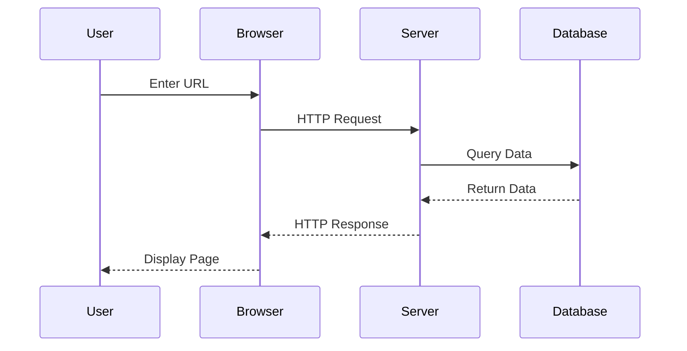
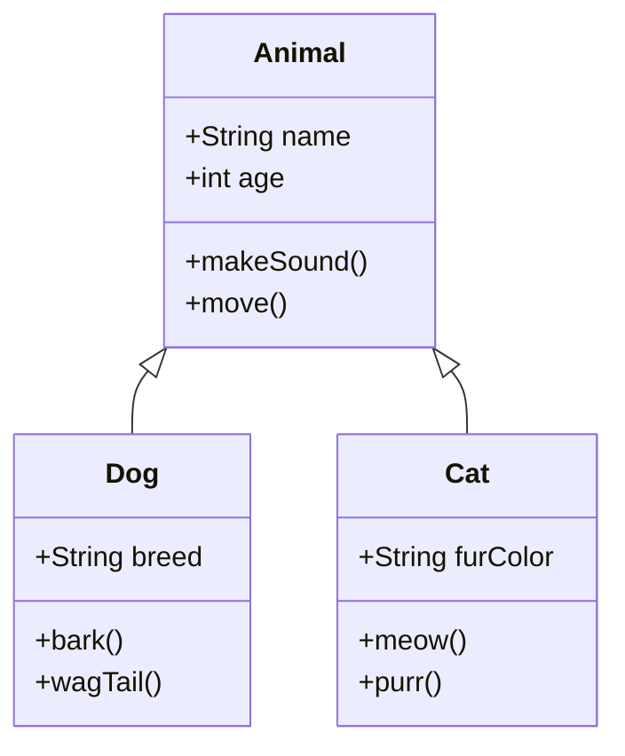
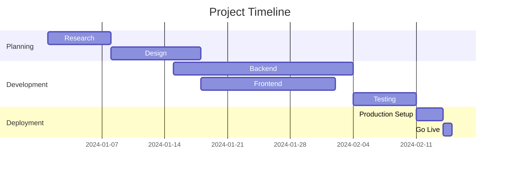
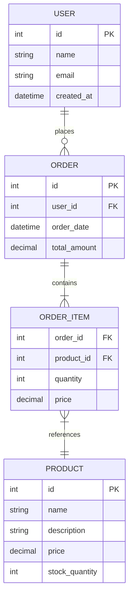
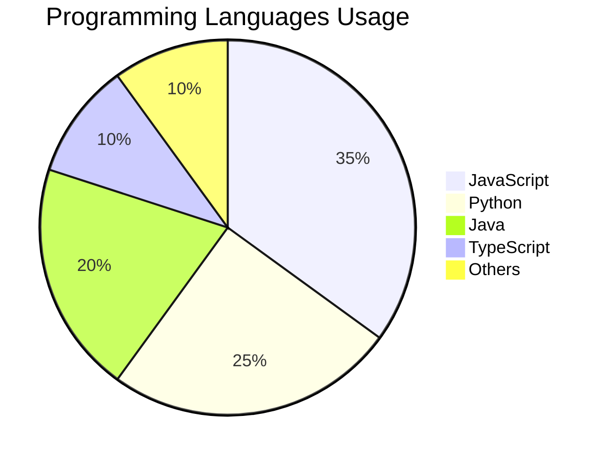

# Markdown Syntax Examples Saved

## Headers

We are using https://github.com/blueberrycongee/codemirror-live-markdown/ and its demo is 

## Header

### TODO List
[ ] first
[ ] second
[ ] third

defining todo / tasks with `- [ ]` or `[ ]` is not working
list with 


### Sample List 
- sdfsdfds
- dsfsddsf
- dsfdsfds
---
horizental `---` or `***` line are not working

> block quote sample
blockquotes with `>` are not working


# H1 - Main Title
## H2 - Section Title  
### H3 - Subsection Title
#### H4 - Sub-subsection Title
##### H5 - Minor Heading
###### H6 - Smallest Heading

## Text Formatting

**Bold text** or __bold text__

*Italic text* or _italic text_

***Bold and italic*** or ___bold and italic___

~~Strikethrough text~~

`Inline code`

## Lists

### Unordered Lists 
- Item 1
- Item 2
  - Nested item 2.1
  - Nested item 2.2
    - Double nested item
- Item 3

### Ordered Lists 
1. First item
2. Second item
   1. Nested numbered item
   2. Another nested item
3. Third item

### Task Lists 
- [x] Completed task
- [ ] Incomplete task
- [x] Another completed task

## Links and Images

### Links
[External link](https://github.com)
[Link with title](https://github.com "GitHub Homepage")
<https://www.example.com>

### Images


## Code Blocks

### Inline Code
Use `console.log()` to print output.

### Fenced Code Blocks

```javascript
function greetUser(name) {
    return `Hello, ${name}!`;
}

const message = greetUser("World");
console.log(message);
```

```python
def fibonacci(n):
    if n <= 1:
        return n
    return fibonacci(n-1) + fibonacci(n-2)

# Generate first 10 fibonacci numbers
for i in range(10):
    print(f"F({i}) = {fibonacci(i)}")
```

```sql
SELECT users.name, COUNT(orders.id) as order_count
FROM users
LEFT JOIN orders ON users.id = orders.user_id
WHERE users.created_at >= '2023-01-01'
GROUP BY users.id, users.name
ORDER BY order_count DESC;
```

## Tables

| Feature | Markdown | HTML | LaTeX |
|---------|----------|------|-------|
| Headers | ✅ | ✅ | ✅ |
| Tables | ✅ | ✅ | ✅ |
| Math | ❌ | ❌ | ✅ |
| Diagrams | ❌ | ❌ | ❌ |

### Table with Alignment

| Left Aligned | Center Aligned | Right Aligned |
|:-------------|:--------------:|--------------:|
| Left | Center | Right |
| Content | Content | Content |
| More | More | More |

## Blockquotes

> This is a simple blockquote.

> This is a blockquote
> that spans multiple lines
> and contains **formatted** text.

> ### Nested Blockquote
> 
> > This is a nested blockquote
> > with multiple levels
> 
> Back to the first level

## Horizontal Rules

---

***

___

## Mermaid Diagrams

### Flowchart


### Sequence Diagram


### Class Diagram


### Gantt Chart


### Git Graph
```mermaid
gitgraph
    commit id: "Initial commit"
    branch develop
    commit id: "Add feature A"
    commit id: "Add feature B"
    checkout main
    merge develop
    commit id: "Release v1.0"
    branch hotfix
    commit id: "Fix critical bug"
    checkout main
    merge hotfix
```

### Entity Relationship Diagram


### Pie Chart


## Math Expressions (if supported)

Inline math: $E = mc^2$

Block math:
$$
\frac{d}{dx}\int_{a}^{x} f(t) dt = f(x)
$$


## Footnotes

Here's a sentence with a footnote[^1].

Another sentence with a footnote[^note].

[^1]: This is the first footnote.
[^note]: This is a named footnote.

## Definition Lists

Term 1
: Definition 1

Term 2
: Definition 2a
: Definition 2b

## Abbreviations

*[HTML]: Hyper Text Markup Language
*[CSS]: Cascading Style Sheets

HTML and CSS are essential for web development.

## Emoji

:smile: :heart: :rocket: :computer: :coffee:

## Escape Characters

\*Not italic\* \\Backslash \`Not code\`

## HTML in Markdown

<div style="background-color: #f0f0f0; padding: 10px; border-radius: 5px;">
This is HTML content within Markdown.
</div>

<details>
<summary>Click to expand</summary>

This content is hidden by default and can be expanded.

```javascript
console.log("Hidden code block");
```

</details>

## Summary

This document demonstrates various Markdown syntax elements including:

- Headers and text formatting
- Lists and tables  
- Links and images
- Code blocks and syntax highlighting
- Mermaid diagrams (flowcharts, sequence diagrams, class diagrams, etc.)
- Blockquotes and horizontal rules
- Math expressions and footnotes
- HTML integration and special features

Perfect for testing Markdown renderers and learning syntax!